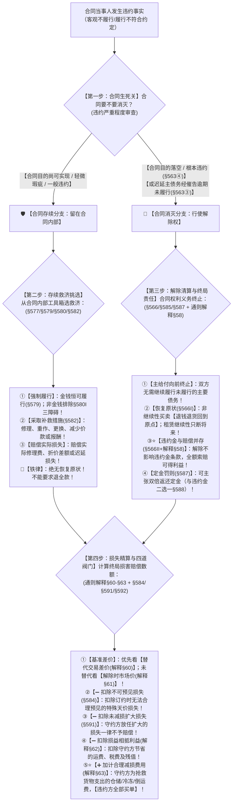

# 📐 违约责任承担方式与违约救济总调度 · 全流程答题模型（合同生死分流 · 根本违约解除恢复原状 · 一般违约修补减价 · 实际履行限制§580Ⅰ · 替代交易§60 · 四道阀门精算）

> **教练开场白**
> 同学们好！我是你们的民法法考教练。在整个合同法主客观题中，“违约救济”是综合度最高、逻辑链条最长、考查最频繁的绝对母题！
> 很多同学做违约题目经常一上来就乱选救济工具：一会儿要退货退款，一会儿又要违约金，一会儿又要求实际履行，完全理不清先后顺序。
> 请大家死死记住民法法考的**【违约救济第一大总原则】——“先判合同生死（留不留），再挑选救济手段”**！
> - **① 如果合同不消灭（一般违约 / 瑕疵履行 / 目的尚在）** $\rightarrow$ 合同继续活着！救济只能在合同内部工具箱里挑：**继续履行、采取补救措施（修理、重做、更换、减价）、赔偿实际瑕疵损失**。👉 **绝对没有恢复原状（不退全款、不退标的物）！**
> - **② 如果合同彻底消灭（根本违约 / 目的落空 / 催告逾期）** $\rightarrow$ 合同权利义务终止！救济走向终局清算：**恢复原状（买卖退钱退货回到原点，租赁只断将来） + 违约损害赔偿（可得利益损失 / 违约金条款继续有效，与解除全额并存） + 定金罚则**！
> - **③ 算最终赔偿损失时，再过“四道刚性阀门”**：基准找替代交易差价（解释§60）或市场差价（解释§61），然后**扣除不可预见（§584） − 扣除未减损扩大（§591） − 扣除损益相抵（解释§62） ＋ 加上减损合理费用（违约方全部买单 解释§63）**！

---

## 适用场景与解决问题

本模型专门解决违约救济全流程路径选择、根本违约 vs 一般违约救济分流、实际履行限制、违约损失精算的全部主客观题考点（对应 [[合同总则考点-深度报告]] 七·违约责任 row 2 · ★★★★★ 顶级必考）：重点破解：

1. **第一总逻辑：违约严重程度与合同生死分流关**：
   - **根本违约（导致合同目的落空，《民法典》§563④）**：守约方享有法定解除权，行使解除后发生**“恢复原状（返还财产/退钱退货）＋ 违约金/可得利益赔偿并存（§566/解释§58）”**；
   - **一般违约（轻微瑕疵/未致目的落空的一般迟延）**：守约方**绝无即时解除权**，只能留在合同内部请求**“继续履行（§577）、修理重作更换减价（§582）、赔偿实际损失”**；❌ 绝无退全款恢复原状。
2. **实际履行限制与排除关（《民法典》§579/§580Ⅰ）**：
   - **金钱债务强制履行（§579）**：金钱之债永远不存在履行不能，债权人可随时请求强制支付；
   - **非金钱债务实际履行三大法定排除（§580Ⅰ）**：①法律上或事实上不能履行；②标的不适于强制履行（演出/人身劳务）或**履行费用过高（经济不能）**；③债权人在合理期限内未请求履行。
3. **损失确定基准与四道阀门精算关（2026司法解释核心）**：
   - **差价确定双轨制**：替代交易差价（解释§60）优先于市场差价（解释§61）；
   - **赔偿精算四道阀门**：
     - ① 扣除订约时不可预见损失（§584）；
     - ② 扣除守约方未减损扩大的损失（§591）；
     - ③ 扣除损益相抵节省的成本及残值（解释§62）；
     - ④ ⭐ **加计守约方为防止损失扩大支出的合理费用（租冷库/倒运/请吊车），一律由违约方全部买单（解释§63）！**

> **核心一句**：**能救就不拆合同，不解除绝不退全款；彻底救不了才解除，解除才退钱退货；解除不影响违约金，差价优先看替代；可预见封顶，损益相抵要扣除，减损扩大不给赔，抢救费用违约方全买单！**
>
> 🔎 **核心法源（2026最新）**：《民法典》§563、§566、§577、§579、§580、§582、§584、§585、§587、§591、§592、§593；**《最高人民法院关于适用〈中华人民共和国民法典〉合同编通则若干问题的解释》（法释〔2023〕13号）第58条（解除后违约金与赔偿）、第60条（替代交易）、第61条（市场价格）、第62条（损益相抵）、第63条（减损费用）**。

---

## 💡 【前置认知】违约救济两大分支与损失计算极速对照表

### 1. 根本违约（合同消灭） vs 一般违约（合同存续）救济全景对照表

| 维度对比 | 🚨 根本违约（合同消灭分支） | ⚠️ 一般违约（合同存续分支） |
| :--- | :--- | :--- |
| **违约程度与典型事实** | **合同目的彻底落空**（发动机报废、中秋月饼过期、一房二卖已过户、拒绝履行） | **合同目的尚能实现**（机器轻微划痕、零件微偏、衣服开线、买方迟延付款1天） |
| **合同效力走向** | **合同消灭**（守约方行使法定解除权 §563） | **合同继续有效存续**（继续留在合同框架内） |
| **有没有恢复原状？<br>（退钱退货）** | ✅ **发生恢复原状（《民法典》§566Ⅰ）**<br>• 非继续性买卖：**全额退钱退货**回到原点；<br>• 继续性租赁：只断将来，结算已用部分。 | ❌ **绝无恢复原状！**<br>• **不能要求退全款、退标的物**（强行要求退全款属于违约！）。 |
| **核心救济工具箱** | ① **解除合同**（通知到达或诉状送达即解 §565）；<br>② **恢复原状**（退钱退货）；<br>③ **违约金 / 可得利益损失赔偿（并存）**；<br>④ **定金罚则**（双倍返还/没收定金 §587）。 | ① **继续履行**（金钱§579 / 非金钱过三关§580）；<br>② **采取补救措施**（修理、重作、更换、减价 §582）；<br>③ **赔偿实际损失**（仅限实际瑕疵损失或迟延损失）；<br>④ **催告程序**：迟延主债务经催告不改才升级解除。 |
| **赔偿范围口径** | **全部履行利益（所受损失 + 可得利益纯利润）** | **实际损失（修理费、折价差额、迟延违约金）** |

---

### 2. ⭐⭐⭐⭐⭐ 违约损害赔偿计算“四项调整法则”大一统公式

$$\text{最终赔偿数额} = (\text{实际损失} + \text{可得利益损失}) - \text{不可预见损失}(\text{§584}) - \text{扩大的损失}(\text{§591}) - \text{损益相抵利益}(\text{解释§62}) + \text{合理减损费用}(\text{解释§63})$$

---

## 一、 考点核心骨架与法理（四步连贯总决策树）



```
【违约救济与赔偿纠纷】终极做题总逻辑：先判生死留不留，再挑工具箱；解除才退货退款，赔偿四道阀门加减算清！
│
▼ 第一步 · 合同生死关 ── 根本违约 vs 一般违约（§563/§566/§577）
├─ 【合同存续分支】（一般违约 / 瑕疵履行 / 目的尚在）：
│    ├─ 救济工具箱：继续履行（§577）、修理/重作/更换/减价（§582）、赔偿瑕疵损失
│    └─ 🚨 铁律：【绝无恢复原状】，不得要求退全款、退标的物！
│
└─ 【合同消灭分支】（根本违约致目的落空 §563④ / 迟延催告逾期 §563③）：
     ├─ 救济工具箱：解除合同（通知到达即解 §565）
     ├─ ⭐ 恢复原状（§566Ⅰ）：买卖退全款退货回到原点；租赁只断将来
     └─ ⭐ 责任并存（§566Ⅱ + 解释§58）：违约金条款继续有效，索赔全部可得利益纯利润！
          │
          ▼ 第二步 · 实际履行限制筛子 ── 非金钱三排除（§579/§580Ⅰ）
          ├─ 金钱债务（欠款/货款/租金） ──────────────────────────────→ ✅【金钱恒强制履行】（§579）
          └─ 非金钱债务（交特定物/建房/劳务演出）：
               ├─ 审查三大排除门槛：①法律事实不能 ②不适于强制或费用过高 ③逾期未请求
               └─ 落入排除情形之一 ──────────────────────────────────→ 🚨【不得强制履行】（转为赔偿）
                    │
                    ▼ 第三步 · 损失基准确定 ── 替代交易优先（通则解释§60/§61）
                    ├─ ⭐ 进行了替代交易（解释§60）：赔偿【替代交易价格 − 合同约定价格】
                    └─ 未进行替代交易（解释§61）：赔偿【履行地解除时市场价格 − 合同价格】
                         │
                         ▼ 第四步 · 四道刚性阀门精算 ── 加加减减法则（§584/§591 + 解释§62/§63）
                         ├─ ➖ 扣除不可预见损失（§584）：订约时想不到的特殊高额损失不赔
                         ├─ ➖ 扣除扩大的损失（§591）：守约方躺平放任扩大的损失不赔
                         ├─ ➖ 扣除损益相抵利益（解释§62）：守约方节省的运费、税费及残值
                         └─ ➕ ⭐ 加计合理减损费用（解释§63）：守约方抢救货物支出的仓储冷冻费，由违约方买单！

  ━━━ 四步全通，稳准拿分 ━━━
```

---

## 二、 核心考情与 2026 司法解释精要

- **频次研判**：违约责任承担方式与损害赔偿命中**全部 6 类权威源族（最高法案例九/十 + 通则解释§58-§63 + 王利明/朱虎论文 + 法大清单）的顶级必考考点（★★★★★ 顶级必考）**。
- **命题核心**：
  1. **生死二分流**：轻微瑕疵/一般迟延不能解除，只能修补减价；根本违约才能解除退款（恢复原状）。
  2. **解除与违约金并存（§566Ⅱ + 解释§58）**：合同解除后，违约金条款依然有效，守约方可全额主张履行利益损失（可得利益）。
  3. **实际履行限制（§580Ⅰ）**：非金钱债务遇到“不能履行、不适于强制履行或费用过高、逾期未请求”，**法律排除强制实际履行**，但违约方仍须赔偿损失！
  4. **替代交易差价规则（解释§60）**：守约方合理另购/另售的，以**替代交易差价**作为损失计算依据。
  5. **损益相抵（解释§62）**：赔偿额必须扣除守约方因此节省的运费、税费及残值，禁止守约方因违约发横财。
  6. **减损规则与合理费用（§591 + 解释§63）**：扩大损失不赔，但**为减损支出的合理必要费用（保管费/仓储费/冷冻费）由违约方全额负担！**

---

## 三、 三大核心法理与命题陷阱拆解

### 1. 救济错位三大命题陷阱（根本违约 vs 一般违约）

| 案情事实 | 错误救济主张（命题陷阱） | 正确法律裁判规则 | 考场一秒判定 |
|---|---|---|---|
| 交付的 100 台电脑中 1 台键盘按键轻微卡顿 | 买方直接发函通知解除全部买卖合同并退全款 | ❌ **解除不生效！**<br>属于一般违约，买方只能要求**修理、更换键盘或减少部分价款（§582）**。 | 一般瑕疵不得退货解除！ |
| 定制新娘专属婚纱，商家完全做错款式且婚礼在即 | 商家主张“我给你修改，你不准退货解除” | ✅ **解除成立！**<br>属于根本违约致目的落空，买方有权**立即解除合同 + 退全款（恢复原状）+ 索赔损失（§563④/§566）**！ | 目的落空直接退款解除！ |
| 卖方迟延 1 天交货，买方未经催告直接发微信解除 | 买方主张合同已解除，拒收货物并索赔全额利润 | ❌ **解除不生效！**<br>迟延主要债务**必须先发催告函给予合理期限（§563③）**，未经催告直接发函自始不发生解除效力。 | 一般迟延未催告不得解！ |

### 2. 替代交易 vs 市场客观差价确定损失（《通则解释》§60 / §61）

| 计算基准 | 适用条件与计算公式 | 司法审查要点 | 命题陷阱 |
|---|---|---|---|
| **替代交易规则（解释§60）** | 守约方已实际进行替代交易：<br>$$\text{损失} = \text{替代交易价格} - \text{合同价格} - \text{节省费用}$$ | ① 必须在**合理时间内**进行；<br>② 价格须处于**合理市场区间**。 | ❌ 误以为守约方任意买天价高价货都能全额索赔（超出合理区间的差价不赔）。 |
| **市场差价规则（解释§61）** | 守约方未进行替代交易：<br>$$\text{损失} = \text{合同解除时履行地市场价} - \text{合同价格}$$ | 以**合同履行地**在**合同解除时**的市场价格为准。 | ❌ 误以为按“起诉时”或“订立合同时”的市场价格计算。 |

### 3. 减损规则与费用承担（《民法典》§591 + 《通则解释》§63）

| 规则维度 | 具体法律规则（2026最新） | 命题核心眼 |
|---|---|---|
| **减损义务性质** | 属于守约方的**不真正义务（间接义务）**，违反不承担赔偿责任，但**丧失对扩大损失的索赔权**。 | 扩大损失自己承担。 |
| **减损措施范围（解释§63）** | 及时行使解除权、中止履行合同、另行寻找替代买家、妥善仓储保管等。 | 守约方不能躺平坐视损失扩大。 |
| **⭐ 减损费用承担（§591Ⅱ）** | 守约方为防止损失扩大而支出的**一切合理必要费用（仓储费、冷藏费、吊装费、运费），一律由违约方负担！** | ❌ 误以为减损费用由守约方自己承担（违约方买单！单选-27）。 |

---

## 四、 万能解题四步

---

### 第一步：合同生死关 —— 判合同留不留？（根本违约解除 vs 一般违约存续）

> **教练提示**：拿到题目先看违约严重程度：
> 1. 如果合同目的还能实现（轻微掉漆、个别零件微偏、衣服开线），**合同必须活着**！走向第二步合同内部救济（修理/重做/减价），**绝对不得解除合同退全款**；
> 2. 如果合同目的彻底完蛋（标的物报废、过期月饼、拒绝履行），**合同必须消灭**！走向第三步终局清算（解除合同 + 恢复原状退钱退货 + 赔偿全部可得利益纯利润）。

---

### 第二步：存续救济关 —— 不解除怎么救？（实际履行限制 vs 修理重作减价）

> **教练提示**：在合同存续分支下：
> 1. **金钱债务一律强制履行（§579）**，欠钱必须还；
> 2. **非金钱债务过三大排除筛子（§580Ⅰ）**：法律事实不能、不适于强制履行或费用过高、合理期限内未请求；落入三排除的，不得强制履行，转为损害赔偿；
> 3. 标的物有质量瑕疵的，依据《民法典》§582 行使**修理、重作、更换、退货、减少价款或报酬**，并赔偿实际瑕疵损失。

---

### 第三步：解除清算关 —— 解除后怎么算？（恢复原状 + 违约金并存）

> **教练提示**：在合同消灭分支下：
> 1. **恢复原状（§566Ⅰ）**：买卖合同互相返还财产（退钱退货回到原点）；租赁/物业等继续性合同不溯及，只断将来；
> 2. **违约金与损失赔偿并存（§566Ⅱ + 解释§58）**：解除合同**绝不影响违约金条款效力**，守约方可全额主张预期可得利益净损失或违约金！
> 3. **定金罚则（§587）**：满足目的落空门槛，可主张双倍返还定金（与违约金二选一）。

---

### 第四步：损失精算关 —— 差价基准与四道阀门加减算清！（通则解释§60-§63）

> **教练提示**：最后算账必须执行**“加加减减四法则”**：
> 1. **基准差价**：另行买货的按**替代交易差价（解释§60）**；没买货的按**解除时市场差价（解释§61）**；
> 2. **➖ 扣除不可预见（§584）**：扣除违约方订约时无法预见的天价暴利损失；
> 3. **➖ 扣除未减损扩大（§591）**：守约方眼睁睁看着损失扩大的部分，扣除不赔；
> 4. **➖ 扣除损益相抵（解释§62）**：扣除守约方因此节省的运费、税费及残值；
> 5. **➕ ⭐ 加计减损费用（解释§63）**：守约方为了抢救货物花的**冷藏费、吊车费、运费，一律加进赔偿额，由违约方全部买单！**

#### 💰 完整数字案例：违约救济与损害赔偿精算攻防实战

> **【案情（最高法指导案例与金题精练）】**
> 甲公司与乙公司订立《苹果采购合同》，约定乙公司以 **5000元/吨** 的价格向甲公司供应 100 吨特级苹果，合同总价 50 万元，9月1日 交付。甲公司计划运至外地以 6000元/吨 出售，正常运费需支出 2 万元。
> 9月1日 乙公司因苹果暴涨恶意违约，明确表示拒绝交货（根本违约）。
> 甲公司于 9月2日 发函解除合同。随后甲公司于 9月5日 在合理市场区间以 **5500元/吨** 的价格从丙公司采购了 100 吨替代苹果，支出替代采购款 55 万元。丙公司直接将苹果运抵销售地，使得甲公司**节省了原合同约定的 2 万元运费**。
> 同时，甲公司因寻找替代货源紧急租用冷库临时存放并雇佣检测人员，支出**合理必要费用 5000 元**。
>
> 1. **第一步（生死判决）**：乙公司拒绝履行属于根本违约，甲公司享有法定解除权，合同于解除通知到达时解除（§563②/§565）；
> 2. **第二步（基准差价 解释§60）**：甲公司在合理时间以合理价格进行了替代交易，替代交易差价损失为：$(5500 - 5000) \times 100\text{吨} = 5\text{万元}$；
> 3. **第三步（损益相抵扣除 解释§62）**：甲公司因替代交易节省了原合同运费 2 万元，应当扣除：$5\text{万元} - 2\text{万元} = 3\text{万元}$；
> 4. **第四步（减损费用加计 解释§63）**：甲公司为减损支出的 5000 元冷库及检测费由违约方买单，应当加计：$3\text{万元} + 0.5\text{万元} = 3.5\text{万元}$；
> 5. **最终裁判结论**：乙公司应当向甲公司支付违约赔偿金 **3.5 万元**！

#### 一句话闭环记忆
> 🎯 **一眼判**：**能救不拆合同，不解除绝不退全款；彻底救不了才解除，解除才退钱退货；解除不影响违约金，差价优先看替代；可预见封顶，损益相抵扣收益，减损扩大不赔，抢救费用违约方全买单！**

---

## 五、 案例演练

### 1. 一般违约不解除与补救措施适用（法考经典考题）
- **案情**：买受人购买西装，收货后发现袖口有一颗纽扣松动，买受人要求解除合同全额退款。出卖人不同意。
- **模型分析**：第一步与第二步——纽扣松动属于轻微瑕疵，合同目的完全可以实现，不构成根本违约；买受人无权要求解除合同退全款，只能要求出卖人采取补救措施（免费缝好修理 §582）或减少微量价款。

### 2. 根本违约解除合同与恢复原状及违约金并存（[[合同通则-多选-16]]）
- **案情**：卖方交付的特种机械主板永久损毁无法修复，买方主张解除合同并要求退还已付货款，同时要求支付违约金 10 万元。卖方抗辩称合同解除后违约金条款作废。
- **模型分析**：第一步与第三步——主板损毁致目的落空构成根本违约，买方有权解除合同；依据《民法典》§566Ⅰ，买方有权要求退还已付货款（恢复原状）；依据《民法典》§566Ⅱ 及《通则解释》第 58 条，合同解除不影响违约金条款效力，买方有权并主张 10 万元违约金！

### 3. 减损规则与防止损失扩大合理费用承担（[[合同通则-单选-27]]）
- **案情**：卖方迟延交付海鲜，买方为防止海鲜腐烂变质，紧急租用冷库并雇佣冷链车转运，支出合理冷冻仓储费 1 万元。后海鲜按市价售出。买方要求卖方承担该 1 万元费用。
- **模型分析**：第四步——买方租用冷库属于履行《民法典》§591 的减损义务；依据《民法典》§591Ⅱ 及《通则解释》第 63 条，守约方为防止损失扩大支出的合理费用**由违约方负担**，卖方必须全额支付该 1 万元费用。

---

## 关联真题

- [[合同通则-单选-02]] · 特定物灭失与非金钱债务实际履行排除（§580Ⅰ）
- [[合同通则-单选-27]] · 减损规则与防止损失扩大合理费用由违约方负担（§591）
- [[合同通则-多选-14]] · 违约可得利益损失赔偿与损益相抵规则（§584 + 解释§62）
- [[合同通则-多选-16]] · 根本违约解除、恢复原状与违约金并存（§566）
- [[C1-单选-72]] · 违约金酌减幅度与可得利益损失标准

## 相关页面

- 概念实体页：[[违约责任]] · [[解除]] · [[实际履行限制]] · [[可预见规则]] · [[减损规则]]
- 姊妹模型：[[民法-合同-解除模型]]（守约方法定与约定解除总模型） · [[民法-合同-违约方申请终止模型]]（合同僵局司法终止） · [[民法-合同-违约金模型]]（违约金调整模型）
- 综合报告：[[合同总则考点-深度报告]]（七、违约责任 · 第 2 考点 / 顶级必考第 16 项 · ★★★★★ 顶级必考）
