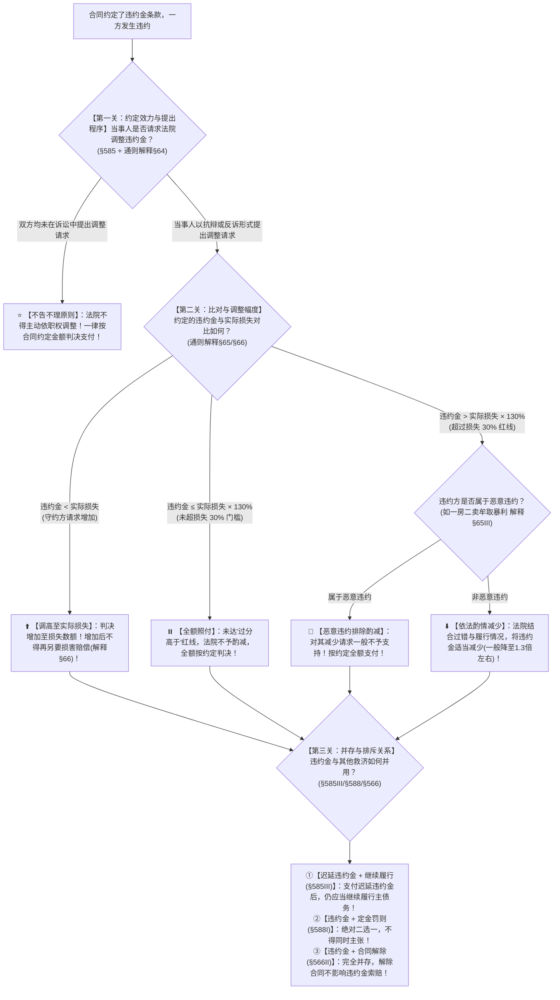

# 📐 违约金及其调整规则 · 全流程答题模型（30% 酌减红线 · 不告不理 · 调高填平 · 迟延违约金并存 · 恶意违约不予酌减 · 解释§64-§66）

> **教练开场白**
> 同学们好！我是你们的民法法考教练。在违约责任命题中，“违约金及其司法调整规则”是**主客观题每年必考、数字计算最容易踩坑的绝对核心考点**！
> 很多同学做违约金题目时经常掉进以下几个思维陷阱：约定的违约金高了法官会不会主动帮违约方砍掉？“超过损失 30%”到底怎么算（是乘以 30% 还是 130%）？恶意一房二卖的开发商赚了大钱能不能请求法官把违约金调低？违约方付了违约金是不是就不用再交房了？
> 《民法典》第 585 条与 2023 年《合同编通则司法解释》第 64–66 条，构建了**以“补偿性为主、不告不理（必须当事人请求）、30% 酌减红线、恶意违约排除酌减、迟延违约金与履行并存”为核心的现代化裁判规则体系**。今天我们用**“三关连贯流水线”**，把违约金的约定效力、调整计算门槛与并存排斥关系一次性彻底锁死：**第一关约定与提出（有效约定优先 + 法院不主动调） → 第二关比对与调整（低于损失调高填平 vs 高于损失过 30% 红线酌减 vs 恶意违约不减） → 第三关并存与排斥（迟延违约金与继续履行可并存 + 违约金与定金二选一）**。

---

## 适用场景与解决问题

本模型专门解决违约金约定效力、司法调整（调高/调低）裁判规则、违约金与其他救济方式并存关系的全部主客观题考点（对应 [[合同总则考点-深度报告]] 七·违约责任 row 4 · ★★★★★ 顶级必考）：重点破解：

1. **违约金性质与提出程序关**：
   - **违约金性质**：**以补偿性为主、惩罚性为辅**；合同有约定违约金的，优先依约定，无需守约方在前端证明精确损失；
	   - 约金主要用来填平守约方实际损失；允许少量适度高出损失（轻微惩罚，督促履约）；但不能漫天乱罚。 有合同约定违约金，守约方起诉时**不用先证明精确损失金额**，直接按合同约定要违约金即可。
		   - 例如:  买卖合同约定违约违约金 20 万，实际损失 14 万。20 万略高于损失，可支持；若实际损失仅 5 万，违约方可以申请调低。
	   -  **违约金必须事先合同约定；没写违约金条款，不能起诉要 “违约金”，但不免除违约责任**。守约方只能主张**赔偿实际损失（所受损失 + 可得利益）**，同时还可以行使继续履行、补救措施、解除合同这些救济；**守约方要自己举证损失大小**。
   - **不告不理原则（《通则解释》§64）**：法院**不得主动依职权调整违约金**！必须由当事人在一审、二审或重审中**以抗辩或反诉的形式明确提出请求**。
2. **违约金双向调整与 30% 红线关（《通则解释》§65/§66）**：
   - **违约金过低（调高）**：约定的违约金低于实际损失的，守约方可请求法院**增加至实际损失数额（完全填平）**；增加后不得再另行主张损害赔偿（§66）；
   - **违约金过高（调低 / 酌减）**：
     - ⭐ **30% 刚性红线（解释§65Ⅱ）**：约定的违约金**超过造成损失的 30%（即 $\text{违约金} > \text{实际损失} \times 130\%$）**，一般认定为“过分高于造成的损失”，违约方可请求酌减（通常酌减至 130% 左右）；
     - **线内全额照付**：违约金 $\le \text{实际损失} \times 130\%$ 的，**一律按约定全额支付，法院不予酌减**（单选-72）；
     - ⭐ **恶意违约者限制（解释§65Ⅲ）**：违约方恶意违约（如一房二卖牟取暴利）的，法院对其酌减违约金的请求**一般不予支持**！
3. **并存与排斥关系关**：
   - **迟延履行违约金（§585Ⅲ）**：针对迟延履行约定的违约金，违约方支付违约金后，**仍应当继续履行主债务**（与继续履行可并存！）；
   - **与定金罚则（§588Ⅰ）**：既约定违约金又约定定金的，守约方**只能二选一（择一适用）**；
   - **与解除合同（§566Ⅱ）**：主合同解除，**违约金条款继续有效**，二者完全并存！


>  **违约金本身就是预先约定好的损失赔偿**

> **核心一句**：**违约金补偿为主约定优先；法院不主动调，必须当事人提抗辩；过低调高至损失（不重复赔），过高看 30% 红线（超 1.3 倍才可酌减，没超全额付）；恶意违约不给减；迟延违约金付完还得接着干，定金违约金二选一！**
>
> 🔎 **核心法源（2026最新）**：《民法典》§585、§566、§588；**《最高人民法院关于适用〈中华人民共和国民法典〉合同编通则若干问题的解释》（法释〔2023〕13号）第64条（调整主张方式与不告不理）、第65条（30%酌减红线与恶意违约限制）、第66条（违约金增加与禁止重复主张）**。

---

## 💡 【前置认知】违约金双向调整机制与并存排斥规则极速对照表

### 1. 违约金双向调整规则对照表

| 调整方向 | 触发要件与法律标准 | 司法调整限度与裁判结果 | 申请主体与限制 |
| :--- | :--- | :--- | :--- |
| **⬆️ 违约金调高（增加）** | 约定的违约金 **< 造成的实际损失**（《民法典》§585Ⅱ） | 法院判决**增加至实际损失额**（完全填补损失） | 由**守约方**提出；增加后**不得再请求损害赔偿**（解释§66） |
| **⏸️ 违约金不予调整（照付）** | 实际损失 $\le$ 违约金 $\le$ **实际损失 $\times 130\%$** | **全额按合同约定支付**，不予扣减！ | 违约方无权请求酌减（单选-72） |
| **⬇️ 违约金调低（酌减）** | 约定的违约金 **> 实际损失 $\times 130\%$**（“过分高于”） | 法院根据过错及履行情况**酌情减少（一般调至 1.3 倍左右）** | 由**违约方**提出（抗辩或反诉）；**恶意违约者一般不予支持**（解释§65Ⅲ） |

---

### 2. 违约金与其他救济工具并存关系对照表

| 并存组合 | 是否允许并存？ | 核心法律依据 | 考场秒杀眼 |
| :--- | :--- | :--- | :--- |
| **迟延违约金 ＋ 继续履行** | ✅ **完全允许并存！** | 《民法典》§585 第 3 款 | 违约方支付迟延违约金后，仍须交房/交货 |
| **违约金 ＋ 合同解除** | ✅ **完全允许并存！** | 《民法典》§566 第 2 款<br>《通则解释》第 58 条 | 合同解除不影响违约金条款，全额主张 |
| **违约金 ＋ 定金罚则** | ❌ **绝对禁止双收（二选一）** | 《民法典》§588 第 1 款 | 守约方择一行使；定金不足补损失 |
| **违约金 ＋ 损害赔偿** | ❌ **就同一损失不得重复填补** | 《民法典》§585 / 解释§66 | 违约金已填补损失的，不得再另要赔偿 |

---

## 一、 考点核心骨架与法理（三关连贯决策树）



```
【违约金纠纷全景】一句话开场：法官能主动砍吗？超多少算过高？恶意毁约能减吗？付了钱还要不要干？
│
▼ 第一关 · 约定效力与提出程序 ── 不告不理原则（通则解释§64）
├─ 当事人未在诉讼中明确提出调整 ────────────────────────────────────→ ⭐【法院绝不主动调整】，直接按合同全额判！
└─ 当事人提出调整请求（一审答辩、二审、反诉或抗辩形式）：
     │
     ▼ 第二关 · 比对与调整幅度 ── 30% 红线与恶意排除（通则解释§65/§66）
     ├─ 违约金 < 实际损失（守约方请求调高） ─────────────────────────→ ⬆️ 调高至【实际损失额】（完全填平，不可再要赔偿）
     ├─ 实际损失 ≤ 违约金 ≤ 实际损失 × 130% ────────────────────────→ ⏸️【全额按约支付】（未超 30% 红线，一律不减！）
     └─ 违约金 > 实际损失 × 130%（超过 30% 红线）：
          ├─ 违约方系【恶意违约】（一房二卖牟利毁约）───────────────→ 🚨【排除酌减】（法院对其请求不予支持，照约全付！）
          └─ 违约方系一般过失违约 ──────────────────────────────────→ ⬇️【适当酌减】（结合过错，一般调至 1.3 倍左右）
               │
               ▼ 第三关 · 并存与排斥法则 ── 迟延履行与定金二选一（§585Ⅲ/§588/§566）
               ├─ 迟延履行违约金（§585Ⅲ）：支付违约金后，【仍应当继续履行债务】（可并存）
               ├─ 定金与违约金（§588Ⅰ）：【二选一】（定金不足弥补损失可另补差额）
               └─ 合同解除（§566Ⅱ）：【完全并存】（解除不影响违约金条款效力）

  ━━━ 三关全通 ━━━
```

---

## 二、 核心考情与 2026 司法解释精要

- **频次研判**：违约金调整规则是民法典合同编**★★★★★ 顶级必考高频点**；《合同编通则司法解释》第 64–66 条对其进行了系统重构与全面定调。
- **命题核心**：
  1. **不告不理原则（解释§64）**：违约金高低属于当事人私权处分，**法院绝不依职权主动干预**；必须由当事人提出抗辩或反诉。
  2. **30% 酌减门槛的精确算法（解释§65Ⅱ）**：
     - 红线公式：$$\text{过高红线} = \text{实际损失} \times 130\%$$
     - 违约金未达到 1.3 倍实际损失的，**法院一律不予酌减**（单选-72）！
  3. **恶意违约排除酌减（解释§65Ⅲ）**：一房二卖、恶意毁约转售牟利的违约方，其主张酌减违约金的，**法院不予支持**（多选-43）。
  4. **调高完全填平（解释§66）**：违约金过低的，增加至**实际损失为限**；增加后不得再另行请求损害赔偿。
  5. **迟延履行违约金的独立性（§585Ⅲ）**：罚的是“迟延”行为，**不免除实际履行责任**。

---

## 三、 三大核心法理与命题陷阱拆解

### 1. 30% 酌减红线的精确计算法（《通则解释》§65Ⅱ）

| 案情设定数据 | 对比关系计算 | 裁判结果 | 命题陷阱 |
|---|---|---|---|
| 实际损失 10 万，约定违约金 12 万 | $12\text{万} \div 10\text{万} = 120\% < 130\%$ | ✅ **全额支付 12 万元**（不予酌减） | ❌ 误以为只要超过损失法院就必须调减到 10 万。 |
| 实际损失 15 万，约定违约金 18 万 | $18\text{万} \div 15\text{万} = 120\% < 130\%$（红线为 19.5 万） | ✅ **全额支付 18 万元**（不予酌减 · 单选-72） | ❌ 误以为超过了损失的 20% 就能减。 |
| 实际损失 10 万，约定违约金 35 万 | $35\text{万} \div 10\text{万} = 350\% > 130\%$（红线为 13 万） | ⬇️ **属于过分高于，可酌减至约 13 万元** | ❌ 误以为直接全额免除违约金（只酌减过分部分）。 |

### 2. 恶意违约排除酌减制度（《通则解释》§65Ⅲ）

| 违约行为属性 | 典型生活场景 | 酌减违约金请求能否得到支持 | 深度法理 |
|---|---|---|---|
| **一般过失违约** | 生产线偶发故障导致交货延期 | ✅ **可以依法酌减**至合理区间 | 违约金以补偿性为主，避免守约方发横财。 |
| **恶意违约（故意违约）** | 房价暴涨，开发商将房屋加价 50 万转卖第三人（一房二卖） | 🚨 **法院对其酌减请求一般不予支持！** | **任何人不得从其不法行为中获利！** 违约方恶意毁约牟利，丧失酌减抗辩权（多选-43）。 |

### 3. 救济方式的“并存”与“排斥”矩阵

| 救济组合 | 法律定性 | 考场一眼判定 |
|---|---|---|
| **定金罚则 ＋ 违约金** | ❌ **绝对二选一（§588Ⅰ）** | 题干同时主张没收定金又主张违约金的，判决“只能择其一行使”。 |
| **迟延违约金 ＋ 交付房屋** | ✅ **完全并存（§585Ⅲ）** | 违约方付完每天 500 元的迟延违约金，房子依然要照常交付！ |
| **合同解除 ＋ 违约金** | ✅ **完全并存（§566Ⅱ/解释§58）** | 违约方声称“合同解除了违约金作废”系荒谬抗辩，违约金照单全赔！ |

---

## 四、 万能解题三步

---

### 第一步：约定与程序关 —— 有无约定？谁来申请？（《民法典》§585 + 解释§64）

> **教练提示**：
> 1. 先看合同有没有约定违约金：有约定的**优先适用约定**，不用一上来就去算具体的实际损失；
> 2. 审查诉讼程序：**法院绝不主动依职权砍违约金（不告不理）**！违约方必须明确以抗辩或反诉形式提出调整；违约方在庭审中装聋作哑不提的，法院直接按合同约定金额全额判决！

- **先懂几个词**：
  - **不告不理**＝民事诉讼私权自治，法官不能主动多管闲事帮违约方省钱；违约方自己嫌贵自己提，不提就全额判；
  - **抗辩形式提出**＝在法庭上说“原告要求的违约金太高了，请求法官依法调减”，这样就算有效提出。

---

### 第二步：审查与调整关 —— 调高还是调低？过 30% 没？（《通则解释》§65/§66）

> **教练提示**：把“约定的违约金”与“造成的实际损失”拿来做数学比对：
> 1. 如果**违约金 < 实际损失**：守约方申请调高，法院**增加至实际损失数额（完全填平）**；
> 2. 如果**违约金 > 实际损失**：立刻算 1.3 倍红线（$\text{实际损失} \times 1.3$）：
>    - **$\le 1.3$ 倍** $\rightarrow$ **不予酌减，全额照付！**
>    - **$> 1.3$ 倍** $\rightarrow$ 属于过分高于，违约方可请求**酌减至 1.3 倍左右**；
>    - ⚠️ **特别审查**：如果违约方是**一房二卖、恶意毁约牟利的“恶意违约者”**，法院对其酌减请求**一律不予支持（全额照付）！**

#### 🔍 对号入座表：违约金调整裁判标准全景表

| 案件事实设定 | 计算对比 | 最终裁判金额与处理路径 |
| :--- | :--- | :--- |
| 损失 20 万元，约定违约金 5 万元，守约方请求调高 | 违约金 < 损失 | ⬆️ **增加至 20 万元**（填平实际损失） |
| 损失 15 万元，约定违约金 18 万元，违约方请求调低 | $18\text{万} \le 15\text{万} \times 1.3 = 19.5\text{万}$ | ⏸️ **全额支付 18 万元**（未超 30% 红线，不予酌减 · 单选-72） |
| 损失 10 万元，约定违约金 30 万元，一般违约方请求调低 | $30\text{万} > 10\text{万} \times 1.3 = 13\text{万}$ | ⬇️ **酌情减少至约 13 万元**（酌减过分部分） |
| 损失 10 万元，约定违约金 30 万元，开发商一房二卖牟利 50 万 | 属于**恶意违约**（解释§65Ⅲ） | 🚨 **全额支付 30 万元**（恶意违约排除酌减 · 多选-43） |

---

### 第三步：并存与排斥关 —— 能不能兼得？（《民法典》§585Ⅲ/§588/§566）

> **教练提示**：最后审查救济方式的搭配：
> 1. **迟延违约金**：交了迟延违约金，**主债务还得继续履行（并存）**；
> 2. **定金罚则**：合同同时约定定金和违约金的，守约方**必须二选一（排斥）**；
> 3. **合同解除**：主合同解除，**违约金依然有效索赔（并存）**。

#### 💰 完整数字案例：违约金 30% 酌减与一房二卖攻防实战

> **【案情（C1-单选-72 与 C1-多选-43 精准还原）】**
> - **场景 A（30% 红线守门）**：甲向乙订购设备，约定违约金 **18 万元**。后甲违约，乙为寻找替代设备多支出了 **15 万元**（实际损失 15 万元）。乙起诉要求甲支付违约金 18 万元，甲答辩称违约金高于实际损失，请求法院酌减。
>   - 裁判涵摄：过高红线为 $15\text{万元} \times 130\% = 19.5\text{万元}$。约定的违约金 18 万元低于 19.5 万元，未超过损失的 30%，不构成“过分高于”；法院判决**甲全额支付 18 万元违约金，不予酌减（C1-单选-72 选 A）**！
> - **场景 B（一房二卖恶意毁约）**：丙向开发商丁购买商品房，总价 100 万元，约定违约金 **35 万元**。后因房价大涨，丁将该房以 150 万元高价转卖给戊并办理了过户（一房二卖牟利 50 万元）。丙遭受可得利益损失 10 万元，起诉要求丁支付违约金 35 万元。丁答辩称违约金 35 万元远超 10 万元损失的 1.3 倍（13 万元），请求法院酌减至 13 万元。
>   - 裁判涵摄：依据《合同编通则解释》第 65 条第 3 款，开发商丁一房二卖牟取暴利属于典型的**恶意违约**；法院对其酌减违约金的请求**不予支持，判决丁全额支付 35 万元违约金（C1-多选-43 考点）**！

#### 一句话闭环记忆
> 🎯 **一眼判**：**违约金补偿为主约定优先；法院不主动调，必须当事人提抗辩；过低调高至损失（不重复赔），过高看 30% 红线（超 1.3 倍才可酌减，没超全额付）；恶意违约不给减；迟延违约金付完还得接着干，定金违约金二选一！**

---

## 五、 案例演练

### 1. 违约金未超损失 30% 照约支付（[[C1-单选-72]] 经典真题）
- **案情**：买受人违约造成出卖人实际损失 15 万元，合同约定违约金为 18 万元。出卖人起诉请求支付 18 万元，买受人请求法院酌减。问法院应如何判决？
- **模型分析**：第二步——实际损失 15 万元，30% 红线为 $15 \times 1.3 = 19.5\text{万元}$；约定的违约金 18 万元未超过 19.5 万元红线，不属于“过分高于造成的损失”；法院应当**判决全额按约定支付 18 万元，不予酌减（选 A）**。

### 2. 一房二卖恶意违约排除酌减（[[C1-多选-43]] 经典真题）
- **案情**：开发商签约售房后因房价暴涨将房屋另卖他人（一房二卖）。买家主张 35% 的违约金，开发商抗辩称违约金过分高于实际损失请求法院予以酌减。
- **模型分析**：第二步——开发商一房二卖属于故意违约牟利（恶意违约）；依据《合同编通则解释》第 65 条第 3 款，违约方恶意违约的，人民法院对其减少违约金的请求**一般不予支持**，开发商仍须全额承担违约金责任。

### 3. 迟延履行违约金与实际履行并存（法考经典考题）
- **案情**：建筑工程合同约定施工方每逾期一天支付违约金 1000 元。施工方逾期 10 天完工，支付了 1 万元迟延违约金后声称“工程我不建了，违约金我已经付了”。
- **模型分析**：第三步——依据《民法典》§585Ⅲ，当事人就迟延履行约定违约金的，违约方支付违约金后，**还应当继续履行债务**；施工方的抗辩不成立，必须继续施工交付合格工程。

---

## 关联真题

- [[C1-单选-72]] · 违约金未超实际损失 30% 刚性红线全额照约付
- [[C1-多选-43]] · 一房二卖恶意违约与违约金酌减排除规则
- [[C1-不定项-01]] · 定金上限（20%）与违约金择一适用规则（§588）
- [[民诉-一审程序-单选-08]] · 违约金酌减主张的抗辩性质与审理范围
- [[合同通则-多选-16]] · 违约金与合同解除并存规则

## 相关页面

- 概念实体页：[[违约责任]] · [[解除]] · [[定金]]
- 姊妹模型：[[民法-合同-违约责任模型]]（违约救济总调度与四道阀门） · [[民法-合同-解除模型]]（法定解除总模型） · [[民法-合同-定金模型]]（定金罚则模型）
- 综合报告：[[合同总则考点-深度报告]]（七、违约责任 · 第 4 考点 / 顶级必考第 17 项 · ★★★★★ 顶级必考）
