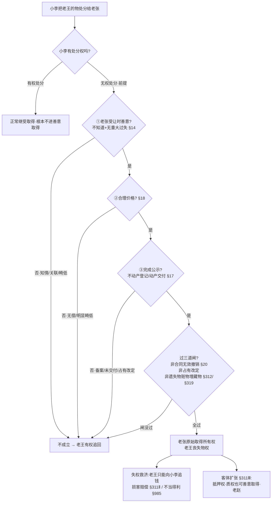

# 📐 善意取得 · 答题模型（四要件 → 三道闸 → 失权救济）

> **别人把"不是他的东西"卖给你，你能不能取得所有权**？本模型管 [[物权编]] **善意取得 §311**（物权编绝对头号 ★★★★★）的客观题判断——先验**四要件**（无权处分前提＋善意＋合理价格＋完成公示），再过**三道排除闸**（合同无效撤销／占有改定／遗失物赃物埋藏物），最后算**失权救济**（成立→原主丧失物权，只能回头向无权处分人追钱；客体还能扩张到抵押权质权）。完整学理见实体页 [[善意取得]]；本页是"**做题怎么下刀**"的步骤版。
> **姊妹 / 概念** → [[善意取得]]（§311 三款全解 + 解释一 §14-20）· [[无权处分]]（合同层 §597 ↔ 物权层 §311 二分主轴）· [[民法-合同-无权处分模型]]（负担/处分二分，跨编合考另一半）· [[民法-物权-动产交付模型]]（"简可指可占不可"——占有改定为何不满足交付）· [[区分原则]]（合同效力≠物权变动，解释 §20 的法理）· [[不动产登记]]（§209 备案≠登记）。
> **适用真题**：[[物权编-单选-05|单选-05·备案≠登记·卡公示要件]] · [[物权编-单选-06|单选-06·寄存物转卖·失权追不当得利§985]] · [[物权编-单选-07|单选-07·告知共有→知情·缺善意]] · [[物权编-单选-08|单选-08·埋藏物§319参照遗失物·丁不确定取得]] · [[物权编-多选-03|多选-03·先租后买·丙未受领交付不成立]] · [[物权编-多选-04|多选-04·客体扩张·黄某善意取得抵押权§311Ⅲ]] · [[物权编-多选-05|多选-05·假结婚卖共有房·撤销权主体陷阱]]。
>
> 🔎 **法条已联网核实（2026-06-15 · 三路独立 + 对抗式）**：**§311** 三款逐字（[最高检 spp.gov.cn 民法典物权编全文](https://www.spp.gov.cn/spp/ssmfdyflvdtpgz/202008/t20200831_478410.shtml)）；**《物权编司法解释一》法释〔2020〕24 号** 善意取得配套 = **§14-20 共 7 条**（全文 21 条，[最高法 court.gov.cn 发布全文](https://www.court.gov.cn/fabu/xiangqing/282101.html) 三次抓取一致）；周边条号 §985 不当得利 · §148/§149 欺诈撤销 · **§319** 埋藏物参照遗失物（≠§316 妥善保管）· §1062 夫妻共有 · §226/§228 交付方式，均经最高检/最高法/国家法律法规库交叉确认，全 CONFIRMED·HIGH。
> ⚠️ **易记错**：①解释一善意取得是 **§14-20**（不是 §14-19，§20"合同无效/撤销不适用"最常被漏）；②埋藏物/隐藏物条号是 **§319**（参照遗失物 §312），**§316 是拾得人妥善保管义务**，别混；③成立后原主向无权处分人主张的是 **§311Ⅱ 损害赔偿 / §985 不当得利**，**不是**向善意受让人追物；④"占有改定不适用善意取得"是**学理通说**（非明文），间接依据是解释一 §17 只给简易/指示交付设时点、独缺占有改定。

## 一、核心考情

- **频率（2026-06-15 联网核验·可溯源·不杜撰）**：善意取得 §311 在 [[物权编考点-深度报告]] 通则/所有权板块均定 **★★★★★ 物权编绝对头号高频**——三重强信号叠加：解释一 §14-20 七条系统配套 + 法大法考《物权黄金考点》点名 + 最高法新闻局《学法典读案例·善意取得》官方专题。客观题最爱、主观题大案例的核心骨架。
- **真题层（据本库 7 题观察、非机构频次）**：本库已入 **7 题成套**（单选 4 + 多选 3），恰好把四要件逐个击破 + 成立后效果 + 客体扩张 + 排除情形考全——是教科书级训练集（详见四·真题演练）。
- **命题核心**：①**四要件缺一即不成立**（缺一就回到"所有权人有权追回"的原则）；②成立后**原主丧失物权 → 只能向无权处分人追钱**（损害赔偿 or 不当得利），**不能向善意受让人追物**；③客体可**扩张**到抵押权/质权；④三类**排除情形**（合同无效撤销 / 占有改定 / 遗失物赃物埋藏物）。
- **必抓五点**：①善意＝受让**"时"**不知道 + 无重大过失（解释一 §14）；②完成公示＝不动产**登记**/动产**交付**——**备案≠登记、占有改定≠交付**；③解释一 **§20**：合同无效/被撤销 → 不适用善意取得（与 [[区分原则]] 呼应）；④**遗失物/赃物/埋藏物**受限（§312/§319，原主 2 年回赎 or 向无权处分人索赔）；⑤无权处分的**债权合同有效**（§597）与善意取得（物权层 §311）**分层并行**——别一见"无权处分"就答合同无效。

## 二、万能模型（四要件 → 三道闸 → 失权救济）

> 角色：**老王**＝真权利人（被无权处分的受害人）｜**小李**＝无权处分人（占有人/登记名义人，擅自处分）｜**老张**＝善意受让人（买家）｜**老赵**＝后手善意抵押权人

### 第一步：前提——小李是不是"无权处分"？

> **铁则**：善意取得是"**无权处分**"情形下买受人取得所有权的路径。小李**有权处分**（所有权人/有授权）就是正常**继受取得**（→ [[物权取得]]·原始 vs 继受），**根本不进善意取得**的讨论。无权处分典型：占有他人物擅自卖（保管/借用/租赁占有人）、登记名义人非真权利人、共有人擅自处分共有物。

- 🚗 **例子**：老王把车借给小李，小李把车卖给老张 → 小李无权处分，**才可能**触发老张善意取得。若老王本就授权小李卖，则是有权处分，老张正常取得，无须善意取得。
- ⚠️ **分层并行**：小李无权处分，**债权合同（买卖）仍有效**（§597，"出卖人未取得处分权致标的物所有权不能转移"是违约问题，不影响合同效力）。善意取得（§311）只解决**物权归不归老张**这一层。别因"无权处分"就答合同无效。

### 第二步：要件①——老张"受让时"善意吗？

> **铁则**：善意＝老张**受让该物时**"不知道转让人无处分权，**且无重大过失**"（解释一 §14）；**真实权利人（老王）负举证**证明老张非善意。判断时点是"**完成登记/交付之时**"（解释一 §17）。

| 非善意典型 | 依据 |
|---|---|
| 卖方/他人**明确告知**是他人之物、共有物 → 知情 | §311Ⅰ(1) |
| 不动产：登记簿有**异议登记 / 预告登记 / 查封**，或知道登记权属错误、知道他人已享有物权 | 解释一 §15（5 种情形，"应当知道"＝重大过失） |
| 动产：交易的**对象、场所、时机**不符合交易习惯（如夜市低价收名画） | 解释一 §16（重大过失） |
| **关联关系**（交易双方同一控制人）、价格畸低 | 通说 + §18 |

- 🚗 **例子**（单选-07）：小李（财产代管人乙）卖共有房给老张（丙），却**主动出示失踪判决书 + 告知"房屋夫妻共有"** → 老张已知情 → **缺善意，善意取得失败**，老王（甲）可请求返还。

### 第三步：要件②——合理价格？

> **铁则**：须**以合理价格转让**（§311Ⅰ(2)）；按标的性质、数量、付款方式，参考交易地市场价 + 交易习惯综合认定（解释一 §18）。**无偿（赠与）、明显畸低**都不满足。

- 🚗 **例子**：老王的家具被小李**无偿赠与**老张 → 即便老张善意，也因**非合理价格**不能善意取得（白捡的便宜不保护）。注意与单选-06 区分：那题"张某赠李某"是无偿，但**李某再以 30 万卖给甲公司是有偿**，善意取得发生在**李某→甲公司**这一手。

### 第四步：要件③——完成法定公示了吗？

> **铁则**：**应登记的已登记、不需登记的已交付给受让人**（§311Ⅰ(3)）。**不动产看登记完成、动产看交付完成**；特殊动产（船舶/航空器/机动车）以**交付**为准、登记仅对抗（解释一 §19 + §225）- **交付即取得所有权（内部生效），登记才具备对外对抗力**；不是 “登记才给所有权”。。

| 易错情形 | 结论 |
|---|---|
| 商品房**网签备案** + 交钥匙，未过户登记 | **不满足**（备案≠登记，§209 物权未变动）——单选-05 |
| 受让人**未实际受领交付**（卖方/占有人拒交付） | **不满足**——多选-03 |
| **占有改定 §228**（出让人继续占有，受让人未现实占有） | **不满足**（"简可指可占不可"，见 [[民法-物权-动产交付模型]]） |
| **简易交付 §226**（受让人已先占有，合同生效即交付） | **满足** |
| 特殊动产已**交付**未登记 | **满足**善意取得（登记仅对抗第三人，解释一 §19） |

- 🚗 **例子**（单选-05）：关某只完成"备案 + 交钥匙"，未办过户登记 → 不动产物权未变动（§209），既非有权取得、也不满足善意取得公示要件 → 关某未取得所有权。

### 第五步：三道排除闸——四要件齐了也可能被挡

> **铁则**：四要件看似齐备，仍要过三道闸，**任一过不了即不成立**：

1. **闸①·合同无效/被撤销不适用**（解释一 §20）：转让合同被认定无效、或被撤销的，受让人主张善意取得**不予支持**。与 [[区分原则]] 呼应——善意取得保护的是"**有效交易**中的信赖"，合同自始无效就没有值得保护的交易基础。
2. **闸②·占有改定不算交付**（通说）：受让人始终未取得现实占有，标的物仍由让与人占有，**不发生善意取得**（间接依据：解释一 §17 只为简易/指示交付设善意取得时点，独缺占有改定）。
3. **闸③·遗失物/赃物/埋藏物受限**（§312 / §319）：**占有脱离 - 脱离占有非基于原主意思**的物，原主受特别保护——原权利人可**自知道/应知受让人之日起 2 年内向受让人请求返还原物**，**或**向无权处分人请求损害赔偿。**埋藏物/隐藏物参照适用遗失物规则**（§319→§312）。
	- 这三类物统称**占有脱离物**：物脱离原权利人的占有，**并非出于原权利人的自愿意思**（区别于出租、出借的 “占有委托物”）。因此法律对善意取得作出限制：善意第三人不能直接取得所有权，原权利人享有**2 年的原物回复请求权**信丰县人民政府

- 🚗 **例子**（单选-08）：老王（甲）祖父埋藏的瓷瓶，甲继承所有（§230）；小李（丙）挖出后市价卖给善意的老张（丁）。**埋藏物经 §319 参照遗失物 §312** → 老张并非确定地善意取得，老王保留 2 年回赎权 + **向无权处分人小李请求损害赔偿**的选择权 → 故"甲向丙索赔"成立，而"丁善意取得所有权"**不确定/不成立**。

	- 普通动产（委托物，如借出去的东西）无权处分：善意第三人直接取得所有权，原主只能找处分人赔钱；
	
	- 遗失物 / 赃物 / 埋藏物（脱离物）无权处分：原主有 2 年 “追回期”，可以把东西要回来，善意取得在此不直接生效。

### 第六步：失权救济 + 客体扩张

> **铁则**：
> - **成立后**：老张**原始取得**所有权（不带原瑕疵），老王**丧失物权** → 老王**只能向无权处分人小李追钱**，二选一定位：
>   - 看**小李获利** → **不当得利 §985**（小李卖得的价款无法律依据）；
>   - 看**老王损失** → **损害赔偿 §311Ⅱ**（原所有权人向无处分权人请求）。
>   （二者常竞合，能追回的钱大体一致；考点是"**追钱不追物 、且对象是小李不是老张**"。）
> 		
> - **客体扩张 §311Ⅲ**：善意取得**其他物权参照适用**——抵押权、质权也能善意取得（老赵信赖登记/占有，从无权处分人处取得担保物权）。

- 🚗 **例子**：
  - （单选-06）甲公司善意取得家具 → 周某（老王）**只能向获利的李某（小李）追不当得利 30 万 §985**，不能向甲公司追物。
  - （多选-04）洪某（老张）善意取得车辆所有权；白某（小李，登记名义人）又抵押给黄某（老赵）并登记 → 黄某**善意取得抵押权 §311Ⅲ**（且未登记的洪某所有权不得对抗已登记的黄某 §225）。

## 三、命题人最爱的 8 个陷阱

1. **占有改定也算"交付"** —— 错！受让人未取得现实占有 → **不能**善意取得（"简可指可占不可"，闸②）。
2. **备案/交钥匙/公证＝物权变动** —— 错！不动产物权变动**只认过户登记**（§209）；备案≠登记（单选-05）。
3. **"合同无效/被撤销，受让人还能善意取得"** —— 错！解释一 **§20** 明文不予支持；善意取得须有**有效交易**基础（与区分原则呼应）。
4. **"善意取得后原主可向受让人追回物 / 追价款"** —— 错！原主**丧失物权**，只能**向无权处分人追钱**（损害赔偿 §311Ⅱ / 不当得利 §985），方向别指错人（单选-06、08）。
5. **遗失物/赃物/埋藏物＝普通动产，善意即取得** —— 错！受 §312/§319 限制，原主 **2 年内可回赎** or 向无权处分人索赔（埋藏物经 §319 参照遗失物，单选-08 的 D 是陷阱）。
6. **"善意取得只针对所有权"** —— 错！**抵押权/质权也可**善意取得（§311Ⅲ 参照，多选-04 黄某取得抵押权）。
7. **"被侵害的共有人/真权利人可撤销买卖合同"** —— 错！撤销权归**受欺诈的合同当事人**（§148）；被侵害的共有人**不是合同当事人**，**无撤销权**，只能走侵权损害赔偿（§1165，多选-05 的 B 错 D 对）。
8. **"无权处分 → 合同无效"** —— 错！无权处分的**债权合同有效**（§597），善意取得（§311）只管物权归属层，**两层并行**（单选-06 的 A 错：赠与/买卖合同有效）。

## 四、真题演练（7 题逐一套模型）

### 范例①：[[物权编-单选-05]]（2025 金题 2-1-8 · 答 **A**）——备案≠登记·卡公示要件

> 关某受让房屋，房产公司将房屋**备案**至关某名下 + 交钥匙，未过户登记；后房产公司要求交回。

- **要件③公示**：备案（住建部门网签）≠ 过户登记（不动产登记机构），§209 不动产物权**未变动** → 关某**未取得所有权**（A ✓）。
- **C 错**：善意取得也须完成法定公示（不动产须**登记**完成），备案不满足要件③ → 不能善意取得兜底。
- **D 错**：抵扣的债务消灭不影响买卖合同效力（分层并行）。
- **答案 A**。

### 范例②：[[物权编-单选-06]]（2024 金题 2-1-5 · 答 **D**）——寄存物转卖·失权追不当得利

> 周某寄放在张父家的红木家具 → 张某继承（不含寄放物）→ 张某无偿赠李某 → 李某 30 万卖给善意的甲公司并交付。

- **前提 + 四要件**：李某（小李）无权处分；甲公司（老张）善意 + 30 万合理价 + 已交付 → **甲公司善意取得所有权**（不动产？否，动产交付即可）。
- **失权救济**：周某（老王）丧失物权，**不能向甲公司追物**（B 错）；向张某追？张某未获 30 万（赠与出去了，C 错）；**向获利的李某追不当得利 §985 → 30 万**（D ✓）。
- **A 错**：赠与合同有效（张某名义所有人，无权处分≠合同无效）。
- **答案 D**。（对照范例④：此题追**不当得利**[看获利]，④题追**损害赔偿**[看损失]，都是"向无权处分人追钱"。）

### 范例③：[[物权编-单选-07]]（2016-3-6 · 答 **B**）——告知共有→知情·缺善意

> 失踪宣告财产代管人乙，将登记在自己名下的**夫妻共有房**卖给丙，过户；**乙向丙出示失踪判决书并告知房屋夫妻共有**。后甲撤销失踪宣告，要求丙返还。

- **前提**：乙单独处分甲乙共有房 → **无权处分**（超出代管权，非家事代理）。
- **要件①善意**：乙**主动告知**丙是共有房 → **丙知情** → **缺善意**（解释一 §14/§15）→ 善意取得失败。
- **效果**：丙不能善意取得 → 甲**有权请求返还**（B ✓）；C/D 错（代管人无权处分、非家事代理、非有权处分）。
- **答案 B**。

### 范例④：[[物权编-单选-08]]（2015-3-6 · 答 **A**）——埋藏物§319参照遗失物·丁不确定取得

> 甲祖父埋藏的瓷瓶，甲继承所有；房屋几经转让，丙翻建时挖出瓷瓶，市价卖给不知情的丁并交割。甲、乙向丙、丁主张权利。

- **物权流向**：瓷瓶非房屋组成部分，所有权**仍归甲**（§230 继承）；丙挖出后卖丁＝**无权处分**。
- **闸③·遗失物/埋藏物限制**：**埋藏物经 §319 参照遗失物 §312** → 丁**并非确定地善意取得**（甲保留 2 年回赎权 + 向无权处分人索赔权）→ **D 错**（"丁善意取得所有权"不成立/不确定）。
- **失权救济**：甲可**向无权处分人丙请求损害赔偿**（A ✓，正是 §312"向无处分权人请求损害赔偿"一支）；乙从未拥有瓷瓶（B 错）；丁取得受限但甲/乙无权直接主张丙丁买卖合同无效（C 错）。
- **答案 A**。（⚠️ 本题是埋藏物经 §319 落入遗失物特别保护的典型——**别套普通善意取得直接选 D**。）

### 范例⑤：[[物权编-多选-03]]（2023 金题 2-1-2 · 答 **AD**）——先租后买·丙未受领交付

> 甲乙有车辆租赁（乙占有车），到期甲依约把车卖给乙（20 万分期）；丙得知后出 25 万，甲同意并让丙**直接找乙提车**，乙拒绝。

- **乙取得**：乙先占有车，甲乙买卖生效即**简易交付 §226** → **乙立即取得所有权**（A ✓）。
- **甲二卖＝无权处分**：甲已非所有权人，再卖给丙 → **无权处分**（D ✓）。
- **丙卡要件③**：丙去提车被乙拒，**未受领交付** → 不满足完成公示 → **不能善意取得**（C 错）；乙是真权利人，丙无权要乙返还（B 错）。
- **答案 AD**。

### 范例⑥：[[物权编-多选-04]]（2020 金题 2-1-10 · 答 **BCD**）——客体扩张·善意取得抵押权

> 白某将登记在自己名下的公司车（机动车）市价卖给不知情的洪某并交付；后白某又抵押给不知情的黄某并办抵押登记。黄某债权到期，白某非法集资被判没收全部财产。

- **洪某善意取得所有权**（B ✓）：白某登记名义人 + 洪某不知情 + 市价 + 已交付，特殊动产交付即满足（解释一 §19）。
- **黄某客体扩张善意取得抵押权**（C ✓，§311Ⅲ）：白某仍是登记名义人 → 黄某信赖登记办抵押登记 → 善意取得抵押权；且洪某未登记所有权**不得对抗**已登记的黄某（§225）→ 黄某有优先受偿权。
- **D ✓**：车已是洪某的（善意取得）、负黄某抵押权，均非白某财产 → **不能没收**。
- **A 错**：刑事没收≠免除民事债务，黄某债权仍存。
- **答案 BCD**。

### 范例⑦：[[物权编-多选-05]]（2019 金题 2-9 · 答 **ACD**）——假结婚卖共有房·撤销权主体陷阱

> 陈某肖某夫妻，婚后共购房登记在陈某名下；陈某伙同蔡某用**假结婚证**把房过户给不知情的秦某。肖某要求撤销。

- **A ✓ 共同共有**：婚后共同购买＝**夫妻共同共有 §1062**（登记在陈某一人名下不改变；§308 共有推定为辅）。
- **C ✓ 秦某善意取得**：秦某不知情 + 正常价格 + 已过户登记 → §311 成立。
- **B 错 撤销权主体**：撤销权归**受欺诈的合同当事人**（§148），受欺诈方是秦某（且秦某善意取得对己有利、不会撤）；**肖某不是买卖合同当事人 → 无撤销权**。
- **D ✓ 损害赔偿**：蔡某协助用假证骗售共有房、侵害肖某共有权 → **共同侵权**，肖某可向蔡某索赔（§1165）。
- **答案 ACD**。

## 📐 口诀

> **善意取得四要件，缺一即回"可追回"：**
> **一前提——小李无权处分（有权处分根本不论）；债权合同照样有效（§597），别答合同无效；**
> **二善意——老张受让"时"不知情、无重大过失（§14）；卖方告知/异议登记/关联畸低都不算善意（单选-07）；**
> **三对价——合理价格，无偿畸低不保护；**
> **四公示——不动产登记、动产交付；备案不算（单选-05）、占有改定不算（"简可指可占不可"）、特殊动产交付即可（§19）；**
> **再过三道闸——合同无效撤销不适用（§20）、占有改定挡、遗失物赃物埋藏物受限（§312/§319，单选-08 埋藏物参照遗失物，丁不确定取得）；**
> **闸全过——老张原始取得、老王失权，老王只能回头找小李追钱：有获利追不当得利（§985，单选-06）、有损失追损害赔偿（§311Ⅱ，单选-08）；抵押权质权也能善意取得（§311Ⅲ，多选-04）；**
> **最后防坑——被侵害的共有人不是合同当事人，无撤销权（§148，多选-05 的 B 错），只能走侵权（§1165）。**

## 相关页面

- 上层 / 概念：[[善意取得]]（§311 三款 + 解释一 §14-20 全解）· [[物权编]] · [[无权处分]]（合同层 §597）· [[区分原则]]（合同效力≠物权变动·解释 §20 法理）· [[不动产登记]]（§209 备案≠登记）
- 姊妹模型：[[民法-合同-无权处分模型]]（负担 §597 / 处分 §311 二分，跨编合考另一半）· [[民法-物权-动产交付模型]]（占有改定为何不算交付）· [[民法-物权-物权请求权模型]]（原主失权后的救济一侧对照）
- 衔接：不当得利 §985（[[民法-合同-不当得利模型]]）· 欺诈撤销 §148/§149 · 遗失物善意取得排除 §312-314（[[物权编-单选-09]]）· 共同共有 §1062
- 适用真题：[[物权编-单选-05]]（备案≠登记）· [[物权编-单选-06]]（失权追不当得利）· [[物权编-单选-07]]（告知共有缺善意）· [[物权编-单选-08]]（埋藏物§319）· [[物权编-多选-03]]（未受领交付）· [[物权编-多选-04]]（善意取得抵押权）· [[物权编-多选-05]]（撤销权主体）
- 综合报告：[[物权编考点-深度报告]]（一·通则 Row 11 + 二·所有权 Row 1 善意取得 §311）
