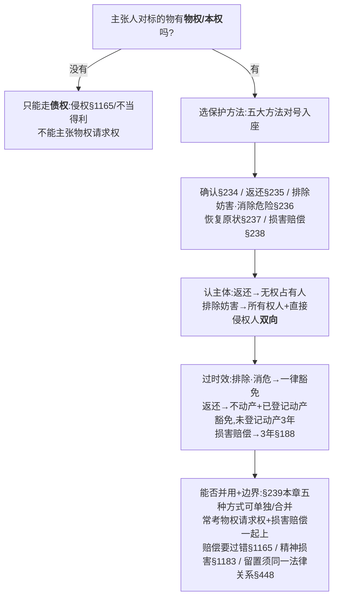

# 📐 物权请求权 · 答题模型（定权利 → 选方法 → 认主体 → 过时效 → 并用边界）

> 物权挨了妨害怎么救济？本模型管 [[物权编]] 通则·第三章 **物权的保护 §233-239** 的客观题判断——把"**物权请求权**（恢复圆满·面向将来）"和"**侵权损害赔偿请求权**（填补损失·面向过去）"两条轨道彻底分清，再套五步定性。完整学理与争议见实体页 [[物权的保护]]；本页是"**做题怎么下刀**"的步骤版。
> **姊妹 / 概念** → [[物权的保护]]（§233-239 全解 + §237 性质争议）· [[诉讼时效]]（§196 哪些请求权不罹时效）· [[请求权基础]]（物权请求权 vs 债权请求权体系定位）· [[民法-侵权-侵权责任模型]]（§238→§1165 损害赔偿一侧）· [[区分原则]]（同属物权编通则）。
> **适用真题**：[[物权编-多选-01|多选-01·装修扰邻·排除妨害双向+时效+精神损害]] · [[物权编-多选-02|多选-02·足球落井·物权请求权vs债权请求权+留置牵连]]。
>
> 🔎 **法条已联网核实**：§233-§239 + §196 经 [[物权的保护]] 实体页三路逐字核对（最高法 court.gov.cn + 最高检 spp.gov.cn + 政府门户，2026-06-14，全 CONFIRMED）；本模型新引三条 2026-06-15 复核：**§1183**（精神损害＝侵害自然人**人身权益**+**严重**精神损害，七一网/最高院法官解读）· **§448**（留置物须与债权**同一法律关系**，企业间除外，法大法考/天同）· **§196**（不适用时效＝①停止侵害·排除妨碍·消除危险 ②不动产+**已登记**动产返还 ③扶养费 ④兜底，法信/天同评注），全 CONFIRMED·HIGH。
> ⚠️ **易记错**：①时效豁免**不是**"物权请求权一律不适用"——**未登记动产返还仍受 3 年时效**（§196 反对解释）；②"双救济并用"的法源是 **§239**（非 §238）；③精神损害条号是 **§1183**（侵权编），不是物权保护章。

## 一、核心考情

- **频率（2026-06-15 联网核验·可溯源·不杜撰数字）**：
  - 物权请求权 §233-238 在 [[物权编考点-深度报告]] 通则板块定 **★★★★ 高频**（法大法考《物权黄金考点》逐项点名"物权请求权"；物权保护是物权主观题的**救济落脚点**）。
  - 真题层（据本库真题观察、非机构频次）：物权保护章**爱出多选**，且总和侵权/留置/诉讼时效**串考**——单独考"返还/排除"少，套"哪些请求权成立 + 受不受时效 + 能不能留置/精神赔偿"组合多。本库已入两道经典多选（2013-3-55、2010-3-54）。
- **命题核心**：①**定性二分**——这条主张是"真·物权请求权"还是"债权请求权"？②**主体**——向谁主张、谁有资格主张？③**诉讼时效**——豁免还是 3 年？④**并用与边界**——§239 本章五种保护方式能否合并（最常考"物权请求权 + 损害赔偿"），及精神损害/留置的门槛。
- **必抓四点**：①**真·物权请求权三兄弟＝返还原物 §235 + 排除妨害 §236 + 消除危险 §236**（§234 确认、§237 恢复原状、§238 损害赔偿都**不是**）；②排除妨害可**双向**（所有权人 + 直接侵权人）；③**时效铁则**（排除/消危一律豁免；返还仅不动产 + 已登记动产豁免、未登记动产 3 年）；④边界三道闸——损害赔偿要过错 §1165、精神损害要 §1183、留置要 §448 同一法律关系。

## 二、万能五步模型

### 第一步：定权利——主张人对标的物有没有"物权/本权"？

> **铁则**：物权请求权是**物权效力的体现**，只有**对标的物享有物权（或本权）的人**才能主张；**对物没有物权的人，只能走债权**（侵权 §1165 / 不当得利 / 合同）。

- 反过来：**侵权损害赔偿请求权（债权）不要求请求人对物有物权**——你被砸坏花瓶，赔不赔和你对那只足球有没有物权无关。
- 🚗 **例子**：小贝把球踢进老马的井，球**仍是小贝的**（所有权未失）→ 小贝可主张返还（物权请求权）；老马对**球本身**没有物权 → 老马**不能**对球主张物权请求权，他只能就花瓶被砸走**债权（侵权赔偿）**这条路。

### 第二步：选方法——五大保护方法对号入座，认出"真·物权请求权"

| 法条       | 保护方法                           | 性质                | 是不是"真物权请求权"          |
| -------- | ------------------------------ | ----------------- | -------------------- |
| §234     | **确认**物权（归属/内容争议）              | 确认之诉              | ✗（一般也不适用时效，但非给付型请求权） |
| **§235** | **返还**原物（针对**无权占有**）           | 物权请求权             | ✅ 三兄弟之一              |
| **§236** | **排除妨害 / 消除危险**（妨害或"**可能妨害**"） | 物权请求权             | ✅ 三兄弟之二、之三           |
| §237     | 修理/重作/更换/**恢复原状**（毁损）          | ⚠️ 性质有争议          | ✗（法考主流按债权请求权·见陷阱⑤）   |
| §238     | **损害赔偿** + 其他民事责任              | 债权请求权（引致侵权 §1165） | ✗                    |

> 🔑 **真·物权请求权三兄弟 = 返还原物 §235 + 排除妨害 §236 + 消除危险 §236**。§233 只是纠纷解决"**途径**"（和解/调解/仲裁/诉讼），**不是**一种请求权，别当方法填。

- 🚗 **例子·一辆车的四种遭遇**（看"动作不同→方法不同"）：老陈有一辆车。
  - ① 邻居老吴把车**偷偷开走、停在自己院里占着不还**——车还是老陈的，只是被人无权占着 → 老陈要回车＝**返还原物（§235）**。
  - ② 老吴**没动车，却把一堆建材常年堆在车头前**，老陈天天挪不出车——物权没被夺走、但被"妨害"了 → 要求清走建材＝**排除妨害（§236）**。
  - ③ 老吴院里一面**危墙正朝老陈的车倾斜，眼看要砸、还没砸下来**——损害**尚未发生**、但有现实危险 → 要求加固/拆墙＝**消除危险（§236，不必等真砸了才主张）**。
  - ④ 危墙**真砸下来、把车顶砸瘪了**——已经造成损失 → 要赔修车钱＝**损害赔偿（§238→§1165，债权请求权，不是物权请求权）**。
  - 🔑 一句话串起来：**没夺走但挡着＝排除妨害；要砸没砸＝消除危险；夺走占着＝返还原物；砸坏了＝损害赔偿。** 前三个是真·物权请求权，最后一个是债权。

### 第三步：认主体——向谁主张？谁有资格主张？

> **铁则**：
> - **返还原物**：向"**无权占有人**"主张（谁占着向谁要）。
> - **排除妨害 / 消除危险**：向"**妨害状态的制造者或控制者**"主张——既可以是**直接实施妨害的行为人**，也可以是**对妨害物/不动产有支配力的所有权人**（所有权人有义务控制对其物的使用）→ **可双向、可一并主张**。

- 🚗 **例子**（多选-01 模型）：沈某（买受人，尚未过户）擅自撬门装修扰邻 → 邻居赵某既可找**直接施工的沈某**排除妨害（B），也可找**仍是登记所有权人的叶某**排除妨害（A，他有义务控制其房屋的使用）。**两个都对**。

### 第四步：过时效——豁免还是 3 年？（§196 铁则） - 动产+未登记+返还原物 / 损害赔偿

> **铁则（§196 + 反对解释）**：
> - **排除妨害 / 消除危险 / 停止侵害**——**一律不适用诉讼时效**（§196①），不分动产不动产、不分是否登记。
> - **返还原物**——**只有"不动产物权 + 已登记的动产物权"**不适用时效（§196②）；**未登记动产**的返还原物请求权**仍受 3 年时效**约束（反对解释·头号陷阱）。
> - **损害赔偿（§238/§1165）**——债权请求权，**适用 3 年**（§188）。

| 请求权                | 适用时效？                 |
| ------------------ | --------------------- |
| 排除妨害 / 消除危险 / 停止侵害 | **一律不适用**（§196①）      |
| 返还原物·不动产 + 已登记动产   | 不适用（§196②）            |
| 返还原物·**未登记动产**     | **适用 3 年**（§196 反对解释） |
| 损害赔偿（§238→§1165）   | 适用 3 年（§188）          |

- 🚗 **例子·"拖了十年还能不能要"**：
  - 老陈的**房子**（已过户登记）被老吴长期无权占用——哪怕老陈**拖了十年**才起诉，返还原物**照样支持**（不动产，§196② 不受时效）。
  - 但老陈那辆**没上牌的摩托**（未登记动产）被老吴占着，老陈**拖了 3 年多**才告——老吴一抬"诉讼时效已过"的抗辩，法院**可能就不支持返还**了（§196 反对解释·**最容易错的点**：动产、尤其未登记动产，别拖）。
  - 而"让老吴清走堵门的建材"这种**排除妨害**——**拖多久都能主张**（§196① 一律不受时效）。
  - 落到真题：多选-01 赵某主张**排除妨害**，**不受诉讼时效限制**（C 对，§196①）。

### 第五步：能否并用 + 三道边界闸

> **铁则**：
> - **并用——明确"谁和谁能并用"（§239）**：能合并的是**本章全部五种物权保护方式**，不是只有"物权请求权 + 赔偿"这一对。**§239 原文**："本章规定的物权保护方式，可以单独适用，也可以根据权利被侵害的情形合并适用。"五种＝**①确认 §234 · ②返还原物 §235 · ③排除妨害/消除危险 §236 · ④修理重作更换恢复原状 §237 · ⑤损害赔偿 §238**，可单独用、也可任意合并。
>   - **最常考组合**＝物权请求权（返还 §235 / 排除·消除 §236）**＋** 损害赔偿 §238（例：搬走杂物 §236 ＋ 赔被砸坏的花坛 §238）。
>   - **但不限于这一对**：如"确认权属 §234 ＋ 返还原物 §235""返还 §235 ＋ 恢复原状 §237 ＋ 赔偿 §238"同样能并用。
>   - **位阶（通说）**：**物权请求权优先、损害赔偿补充**——物没贬值、靠返还/排除能回复圆满的先回复；已贬值或有损失无法回复的，再叠加损害赔偿。
>   - ⚠️ **法源是 §239（不是 §238）**：§238 只是"损害赔偿"这一种方式本身的依据；"可单独/可合并"这条规则出自 §239。
> 	- **闸① 损害赔偿要过错**：§238 引致侵权 §1165，**要过错 + 要损害**（物权请求权三兄弟则**不问过错、不证损害**）。
> 	- **闸② 精神损害要 §1183**：须"侵害自然人**人身权益** + **严重**精神损害"；一般财产损失/轻微不适**不给**精神损害赔偿。
> 	- **闸③ 留置要同一法律关系**：§448 留置物须与债权**属同一法律关系**（企业间留置除外）；**因拾得/侵夺而占有**的物，与另一笔债权不是同一法律关系 → **不能留置**。<- **留置＝扣你的物抵你的债，但物和债得是同一码事；只有公司对公司才能"不是同一码事也能扣**

- 🚗 **例子·过错与损害（闸①）**——同一件事，"搬走"和"赔钱"两条路的门槛完全不同：
  - **场景**：一场暴雨（**不可抗力，谁都没错**）把老吴院里堆的建材冲到老陈菜地，**压住菜地**、还**砸坏一畦菜**。
  - **搬走＝排除妨害（§236，物权请求权）**：老陈要老吴清走建材。**不问老吴有没有错**——哪怕是暴雨冲来的、老吴零过错，建材压在老陈地上就是"妨害"，**照样得搬**（或容忍老陈清走）；老陈也**不用证明自己有什么损失**，地被占着本身就能要求排除。→ **不问过错、不证损害**。
  - **赔钱＝损害赔偿（§238→§1165，债权）**：老陈要老吴赔被砸的菜。这就得看**老吴有没有过错**——既然是不可抗力、老吴堆建材合规无过失 → **老吴不赔**（§1165 过错责任，无过错不担责）；而且老陈还得**证明菜确实被砸、损失多少**。→ **要过错 + 要损害**。
  - **对照**：若建材是老吴**自己乱堆滚下来的（有过错）**，则两条都成立——**搬走（§236）＋ 赔菜钱（§238）一起上**（§239 并用）。
  - 🔑 一句话：**"搬走/还回来"不管你有没有错、我有没有损失都得做；"赔钱"得你有错、我有损失才赔。**
- 🚗 **例子·精神损害（闸②）**：
  - （多选-01 模型）赵某仅"经常失眠"、无侵害人身权益的严重后果 → **不满足 §1183，精神损害赔偿不选**（D 错）。
- 🚗 **例子·留置怎么用（闸③）**——留置＝"**扣住你的物 + 拍卖优先受偿**"，但**扣的物和欠的债得是同一码事**（§448 同一法律关系；§447 两层效力＝拒绝返还＋优先受偿）：
  - **✅ 能留置（同一法律关系）·最典型"扣车抵修理费"**：老陈把车送老吴修理厂修，修理费 3000 不付 → 老吴**占着这辆车是因为"修车"、欠的 3000 也是因为"修车"，同一承揽关系** → 老吴可**先扣车不还**，给老陈合理期限催付（动产 **≥60 日**，§453；鲜活易腐除外），到期仍不付就**拍卖这辆车、卖得款优先抵 3000**（§447）。同理：**保管费不付→扣保管物、运费不付→扣货**——保管/运输/加工承揽/仓储/行纪是五类典型留置场景。
  - **❌ 不能留置（非同一法律关系）**：① 足球案（多选-02 D）老马占球是因"拾得"、债权却是"赔花瓶"，**两码事** → 不能扣球抵花瓶钱（§448）。② 老陈半年前借老吴 5000 没还，这次把手机落在老吴家 → 老吴**不能**因那笔借款扣手机（占有手机 ≠ 借款关系）。**不能"逮着什么扣什么"。**
  - **⚠️ 例外·企业之间（商事留置）**：双方都是公司时，A 欠 B 货款、B 恰好因**另一份**运输合同合法占有 A 的一批货 → **即便货款与占有的货不是同一法律关系，企业之间也能留置**（§448 但书；商人往来频繁，放宽牵连要求）。
  - 🏛️ **真实判例参考（转述·待核原文）**：浙江高院某船舶买卖纠纷支持债权人对**船舶**的留置主张（[澎湃·山东高院留置权科普](https://m.thepaper.cn/newsDetail_forward_15897594) 转引；本轮未取得裁判文书原文，标待核）。

## 三、命题人最爱的 8 个陷阱

1. **"物权请求权一律不适用诉讼时效"** —— 错！**未登记动产的返还原物**仍受 3 年时效（§196 反对解释）。豁免的只有"排除/消危一律 + 返还的不动产、已登记动产"。
2. **"主张返还/排除妨害需对方有过错"或"损害赔偿无须过错"** —— 全错！**物权请求权不问过错**；**§238 损害赔偿要过错**（§1165）。方向别反。
3. **"排除妨害只能找直接侵权人"** —— 错！**所有权人**对其物的使用有控制义务，也可被请求排除 → **可双向**（多选-01 的 A、B 都对）。
4. **"占有人/对物没有物权的人也能主张物权请求权"** —— 错！须有**物权/本权**（多选-02 老马对球无物权，B 错）。
5. **"恢复原状（§237）是物权请求权、不适用时效"** —— ⚠️ **争议但法考按错处理**：§237 特意加"依法"二字，法考/教培主流当**引致性规范 → 债权请求权 → 适用 3 年时效**；即便学理上认其为独立物权请求权，**同一学说也承认它适用时效** → "§237 不受时效"无论哪说都是错的。
6. **"占有了对方的物就能留置"** —— 错！§448 要**同一法律关系**（企业间除外）；**拾得物/侵夺物**与另一笔债权非同一法律关系 → 不能留置（多选-02 的 D 错）。
7. **"一有损害/不适就能要精神损害赔偿"** —— 错！§1183 须**人身权益 + 严重**精神损害；纯财产损害、轻微不适不给（多选-01 的 D 错）。
8. **"§233 是一种请求权 / §234 确认是给付请求权"** —— 错！**§233 只是纠纷解决途径**；**§234 确认是确认之诉**（解决"归谁"），§235 返还才是给付之诉（解决"该不该还"）。

## 四、真题演练

### 范例①：[[物权编-多选-01]]（2013-3-55 · 答 **ABC**）——装修扰邻·排除妨害双向 + 时效 + 精神损害

> 叶某将房屋卖给沈某，交房过户前沈某擅自撬门装修，施工致邻居赵某经常失眠。

- **第一步 定权利**：赵某是相邻不动产权利人，对自己房屋有物权 → 可主张物权请求权（针对妨害）。
- **第二步 选方法**：施工噪声/震动构成对赵某用益的**妨害** → **排除妨害 §236**。
- **第三步 认主体**：**叶某**仍是登记所有权人、有义务控制其房屋使用（**A 对**）；**沈某**是直接实施妨害的行为人（**B 对**）→ **双向均可**。
- **第四步 过时效**：排除妨害**不适用诉讼时效**（§196①）→ **C 对**。
- **第五步 边界**：仅"经常失眠"、无侵害人身权益的严重后果 → 不满足 §1183 → 精神损害赔偿 **D 不选**。
- **答案 ABC**。

### 范例②：[[物权编-多选-02]]（2010-3-54 · 答 **AC**）——足球落井·物权请求权 vs 债权请求权 + 留置牵连

> 小贝踢球落入邻居老马门前水井，老马受惊摔碎花瓶；老马捞球后，小贝求还球、老马要赔花瓶。

- **第一步 定权利**：足球**仍属小贝**（所有权未失）；老马对足球**无物权**。
  - 小贝对老马（占有人）享有**返还原物物权请求权 §235** → **A 对**。
  - 老马对足球无物权 → **不能**对小贝主张物权请求权 → **B 错**。
- **第二、五步 选方法 + 债权一侧**：小贝踢球砸碎老马花瓶构成侵权 → 老马对小贝有**损害赔偿债权请求权 §1165** → **C 对**。
- **第五步 留置闸**：老马因**拾得足球**而占有，该占有与"花瓶赔偿债权"**非同一法律关系** → 不满足 §448 → **不能留置足球** → **D 错**。
- **答案 AC**。（同时体现"物权请求权与债权请求权可并存"：球的返还走物权请求权、花瓶的赔偿走债权请求权，互不影响。）

## 五、一个生活故事·手把手走完五步

> 🔧 **教学案例**（非真实判例，专为打通五步）。**人物**：老陈——去年花 120 万买下、**已过户登记**在自己名下的一套房，外加一辆**没上牌**的二手越野摩托（动产·未登记）。**老吴**——刚搬来的邻居。

**剧情**：老吴装修，把成堆的建材垃圾常年堆在两家中间的过道上，正好**堵死老陈的车库门**；后来老吴干脆把老陈那辆摩托**推进自己院子占着不还**；再后来，垃圾渗水**泡烂了老陈花 8000 元铺的木地板**。老陈该怎么主张？

| 步 | 在这个故事里怎么走 | 结论 |
|---|---|---|
| **① 定权利** | 房子登记在老陈名下、摩托是老陈花钱买来并交付的 → 两样都是老陈的**物权**，被侵害就能动用物权请求权。（若老陈只是**借住**朋友的房子，他对房子无物权，就得让真正产权人出面或走债权。） | 老陈有资格 |
| **② 选方法** | 建材**没夺走车、只是挡着**＝**排除妨害§236**；摩托**被占着不还**＝**返还原物§235**；地板**已泡坏**＝**损害赔偿§238**（债权）。 | 排除§236 + 返还§235 + 赔偿§238 |
| **③ 认主体** | 清建材：**直接堆的老吴**要清；若这房是房东老赵租给老吴的，**能控制房屋的所有权人老赵也可被一并要求排除**（双向）。要回摩托：向**正占着车的老吴**主张返还。 | 排除妨害可双向 |
| **④ 过时效** | 老陈**拖十年**告，房子（不动产）**返还照样支持**（§196②）；但那辆**没上牌的摩托**若**拖过 3 年**才告，老吴一抬时效抗辩**可能就要不回了**（§196 反对解释·头号坑）；"清建材"这种排除妨害**拖多久都行**（§196①）。 | 不动产免时效·未登记动产 3 年·排除妨害永远能告 |
| **⑤ 并用 + 边界** | 老陈可**同时**主张：清走建材（§236）**＋**赔 8000 元地板（§238→§1165），两条一起走（**§239**）；但赔偿要老吴**有过错+老陈证损失**，排除妨害则不问过错。老陈喊"被恶心得睡不好要精神损害赔偿"→ 只是**财产损失+轻微不适**、未侵害人身权益的严重精神损害 → **不支持**（§1183）。又：老吴曾**修过这辆摩托、修车费没结**能否扣车不还？修车与占有摩托是**同一承揽关系**→ **可留置**；但若老吴拿的是**捡来/抢来**老陈的别的东西想抵修车费 → **非同一法律关系→不能留置**（§448）。 | §239 并用·精神损害卡§1183·留置卡§448 |

## 六、真实裁判规则参考（联网查证 · 二手源·待核原文）

> ⚠️ **诚实标注**：以下是 2026-06-15 联网检索到的**裁判规则/裁判要旨**层面共识，来自法律媒体二手汇编（[澎湃·排除妨碍请求权裁判规则](https://m.thepaper.cn/newsDetail_forward_22739122) / [中豪律师·未登记动产返还原物请求权适用时效研究](https://www.zhhlaw.com/article/detail/497)）；**两处法院官网原文本轮打不开（TLS/拒连），故标"待核原文"、不引具体案号**。

1. **空调外机噪声·超出相邻容忍义务 → 判拆除（排除妨害）**：某案空调外机虽符合国家标准，但对邻居生活的妨碍**超出相邻关系容忍义务范围**，法院支持**拆除/排除妨害**。→ 印证第二步"排除妨害"在生活中的样子，也呼应陷阱：**负有容忍义务的妨碍不得请求排除**（噪声达标但超容忍→仍可排除是其反面）。
2. **§235 返还原物只能打"无权占有人"**：最高法裁判要旨——权利人请求**无权占有人**返还原物的支持；但请求**有权占有人**（如租赁、保管等占有权源仍在的人）返还的，**不予支持**。→ 深化第一/三步"向谁要"：返还原物的被告必须是**无权占有人**。
3. **未登记动产返还原物请求权·适用诉讼时效**：实务/学理研究确认——不动产及已登记动产返还不适用时效，**未登记动产返还原物请求权应适用诉讼时效**。→ 第四步头号坑的权威佐证。

## 📐 口诀

> **物权挨妨害，五步定救济：**
> **一定权利——有物权才走物权请求权，没物权只能走债权（多选-02 老马对球无物权，B 错）；**
> **二选方法——真·物权请求权三兄弟＝返还§235 + 排除妨害§236 + 消除危险§236；§234 确权、§237 恢复原状、§238 赔偿都不算；§233 只是路；**
> **三认主体——返还找占有人，排除妨害可向所有权人 + 直接侵权人双向要（多选-01 的 A、B 都对）；**
> **四过时效——排除消危一律免，返还只免不动产 + 已登记动产，未登记动产三年照样跑；损害赔偿三年（§196/§188）；**
> **五并用边界——§239 本章五种保护方式可单独/合并（常考"物权请求权+损害赔偿"一起上，如搬走杂物§236+赔花坛§238）；赔偿要过错§1165、精神损害要§1183、留置要§448 同一法律关系（拾得物不能留置，多选-02 的 D 错）。**

## 相关页面

- 上层 / 概念：[[物权的保护]]（§233-239 全解 + §237 争议）· [[物权编]] · [[诉讼时效]]（§196）· [[请求权基础]]（物权 vs 债权请求权）· [[区分原则]]（同属通则）
- 衔接：[[民法-侵权-侵权责任模型]]（§238→§1165 损害赔偿一侧 + 精神损害 §1183）
- 适用真题：[[物权编-多选-01]]（装修扰邻·排除妨害双向）· [[物权编-多选-02]]（足球落井·物权 vs 债权请求权 + 留置）
- 综合报告：[[物权编考点-深度报告]]（一·通则·物权请求权 §233-238 行）
