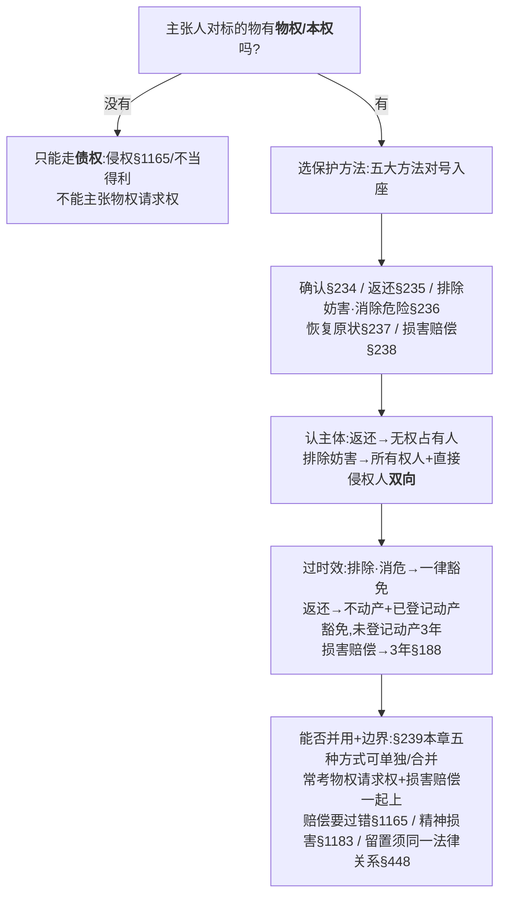

# 📐 物权请求权 · 答题模型（定权利 → 选方法 → 认主体 → 过时效 → 并用边界）

> **核心一句**：物权请求权旨在消除妨害、回复物权的圆满支配状态。做题核心在于区分“物权请求权（面向将来，不问过错与实际损害）”与“债权损害赔偿（面向过去，须以过错与损害为要件）”；最毒陷阱是**混淆未登记动产返还的3年时效**，以及**无视留置权的同一法律关系牵连性要求**。
>
> 🔎 **最高法与民法典核心条文速查**：
> - **第二百三十五条【返还原物请求权】**：无权占有不动产或者动产的，权利人可以请求返还原物。
> - **第二百三十六条【排除妨害、消除危险请求权】**：妨害物权或者可能妨害物权的，权利人可以请求排除妨害或者消除危险。
> - **第二百三十九条【双救济并用原则】**：物权保护方式，可以单独适用，也可以合并适用。
> - **第一百九十六条【诉讼时效之豁免】**：①停止侵害、排除妨碍、消除危险；②不动产物权和已登记的动产物权返还原物，不适用诉讼时效。

---

## 一、 核心考情（含考频说明）

> ⚠️ **考频免责声明**：司法部自 2018 年法考改革起，官方**仅公布大纲、合格分数线、成绩，从不公开历年真题原题及任何"考点频次"统计**。下列 ★ 星级均系厚大 / 瑞达 / 众合等机构依**学员回忆卷**研判，**非官方一手数据**；严禁出现“出现 N 次”等伪频次。可溯源硬事实仅：① 司法部大纲民法物权保护部分始终处于核心高频板块，且常作主观题案例救济的分析落脚点；② 物权请求权在历届客观题中均以综合性、多维度形式命题，极易与时效、留置权及侵权相挂钩。

| 知识点 | 机构研判星级 | 考查要义 |
|---|---|---|
| 物权请求权与债权请求权区分（§235-§238）| ★★★★★ | 区分物权请求权（返还/排除/消除）与侵权损害赔偿债权请求权。 |
| 物上请求权排除妨害的主体（§236）| ★★★★ | 认定权利人可以向直接行为人及对房/物有控制力的所有人双向主张。 |
| 诉讼时效的除外规则（§196）| ★★★★★ | **头号陷阱**：排除消危一律免时效，返还仅限“不动产及已登记动产”免。 |
| 救济手段的并用与限制（§239）| ★★★★ | 判定物权保护的并用边界，卡死精神损害（§1183）与留置权（§448）门槛。 |

- **2026时间锚**：客观题9/12-13，主观题10/18。物权的保护是民法通则分编中最核心的实务考点。
- **命题常见场景**：制造“邻居装修噪音震动扰邻且无过错”、“楼上漏水泡坏地板”、“拾得他人足球后因对方砸碎花瓶而主张扣留”等场景，考查当事人享有什么请求权、是否适用诉讼时效，以及可否合并适用或进行留置。

---

## 二、 万能五步模型

### 第一步：定权利——主张人对标的物有没有“物权/本权”？

> **有权方能索物，无权只能索赔。**

- **有权方能索物（主张物权请求权）**：要行使“返还原物”、“排除妨害”、“消除危险”这些高大上的物权请求权，大前提是：**主张人必须对这件东西拥有物权（如所有权、抵押权）或本权（如承租人、借用人的合法占有权）**。只有你是这件东西的“真主人”或“合法支配人”，你才有资格去维护它的圆满状态。

- **无权只能索赔（主张债权请求权）**：如果你对这个东西什么权利都没有（比如只是路过，或者只是别人借用你东西的人），你就绝不能主张物权请求权。但如果你的合法利益因此受损，你可以主张**债权请求权（如侵权损害赔偿）**。

*   **铁则**：物权请求权是物权支配力的延伸。只有**对标的物享有物权（所有权、用益物权、担保物权）或本权（如承租人的占有）的人**，才能作为物权请求权的权利人。
*   **对比**：侵权损害赔偿（债权）不要求请求人必须享有所有权，只要其受保护的合法利益受损即可。
    *   *案例对照*：小贝踢球落入老马门前水井，老马对**球本身**不具有物权，仅有占有，因此老马**不能**主张物权请求权。但小贝将老马的花瓶砸碎，老马对其享有**侵权损害赔偿请求权（债权）**。
#### 大白话讲解

- **设定人物**：**老王**（房东/所有人）、**小李**（租客/合法承租人）、**老张**（楼上邻居/漏水制造者）。

	老张家水管爆裂漏水，把小李租的房子地板给泡了，还泡坏了小李放在地板上的名贵吉他。

- **第一幕：关于房子（谁有资格主张物权请求权）**
    - **房东老王**：他是房子的所有权人，在物权世界享有“所有权”（物权）。他可以说：“老张，你家漏水妨害了我对房子的所有权，我行使**排除妨害请求权**，你必须立刻修好水管！”
    - **租客小李**：虽然小李不是房主，但他签了租房合同，享有**本权（合法占有权）**。在这个房子里，小李是支配者。因此，小李也有权找老张行使**排除妨害请求权**（要求修好水管）。
- **第二幕：关于泡坏的吉他（谁能主张什么权利）**
    - 吉他是小李自己的。老王（房东）看到了很心疼，老王能不能行使物权请求权要求老张赔偿吉他？
    - **不能！** 老王对这把吉他既没有所有权，也没有占有权，老王在物权世界和这把吉他毫无关系。只有**小李**作为吉他所有权人才能要求赔偿。
    - 而且，小李要求老张“赔偿吉他损失”的请求，本质上不再是物权请求权，而是**债权请求权（侵权损害赔偿请求权）**。因为吉他已经被泡坏了，物权原状无法恢复，只能靠“赔钱（债）”来解决。
### 第二步：选方法——五大保护方法对号入座，认出“真·物权请求权”

> **返排消是真物权，确认恢复赔偿是债权。**

- **真·物权请求权（返还原物、排除妨害、消除危险）**： 只有这三兄弟是纯正的物权请求权。它们只解决一个问题——**“消除干扰，恢复物权的支配状态”**。它们只看客观状态，**不需要证明对方有过错，也不需要证明自己有实际金钱损失**。
- **冒牌/债权请求权（确认物权、恢复原状、损害赔偿）**：
    - **确认物权**：只要求个名分（确认所有权），不具有给付请求内容。
    - **恢复原状、损害赔偿**：在法考中被定性为引致到侵权责任编的**债权请求权**。它们面向的是“弥补损失”，做题时**必须以“有过错”和“实际损失”为要件，且受 3 年诉讼时效限制**。

*   **真·物权请求权三兄弟**：
    1.  **返还原物（§235）**：针对**无权占有**，请求给付。
    2.  **排除妨害（§236）**：针对**已经发生的、非占有形式**的妨害（如堵路、堆垃圾、漏水）。
    3.  **消除危险（§236）**：针对**尚未发生但有现实危险**的妨害（如邻居危墙倾斜欲坠）。
*   *非物权请求权*：
    *   **确认物权（§234）**：属于确认之诉，非给付请求。
    *   **修理/重作/更换/恢复原状（§237）**：法考教培主流将其定性为引致至侵权责任编的**债权请求权**。
    *   **损害赔偿（§238）**：妥妥的**债权请求权**，需依据侵权责任编（§1165）确定要件。

####  大白话讲解

- **设定人物**：**老王**（真车主/房主）、**老张**（霸道的邻居）。

老张做了一系列侵害老王权利的事，老王分别可以用什么招数：

- **第一招：老张直接把老王的车开走锁在自己车库里不还**
    - **对应方法**：**返还原物**（§235，真物权）。
    - **老王大喊**：“车是我的，你这是无权占有，立刻把车还我！”
- **第二招：老张把自家的大卡车停在老王的车库门口，导致老王的车开不出来**
    - **对应方法**：**排除妨害**（§236，真物权）。
    - **老王大喊**：“你没占有我的车，但你妨碍我开车了，立刻把卡车挪开！”
- **第三招：老张在自家院里建了个违章钢架，已经严重倾斜，随时要砸塌老王的房顶**
    - **对应方法**：**消除危险**（§236，真物权）。
    - **老王大喊**：“别等砸下来！现在立刻把这个危架给我拆了或加固！”
- **第四招：老张跟别人吹牛说老王的车其实是老张的**
    - **对应方法**：**确认物权**（§234，确认之诉）。
    - **老王起诉**：“法官，请判决确认这辆车的所有权归我！”（要名分，不属于给付请求权）。
- **第五招：老张把老王的车门撞瘪了，或者把车灯砸碎了**
    - **对应方法**：**恢复原状**（§237）/ **损害赔偿**（§238）（债权请求权）。
    - **老王起诉**：“你把车给我修好（恢复原状），或者直接赔我5000块钱（损害赔偿）！”这两个要求是向老张要“修车行为”或“钱”，属于债权请求权。
### 第三步：认主体——向谁主张？
> **返还找现占有，排除要双向锁。**

- **返还找现占有（返还原物）**： 只能找**现在实际占有着这件东西的人**（无论是直接拿在手里的“直接占有人”，还是借给别人/租给别人的“间接占有人”）。如果东西已经丢了或者毁损了，任何人都没占有，就不能主张返还原物，只能主张赔钱（债权）。

- **排除要双向锁（排除妨害/消除危险）**： **既可以找“直接干坏事的人（直接行为人）”，也可以找“妨害源头那个物的主人（所有人）”**。因为在法律上，所有人对自己的财产负有妥善管理、控制的法定义务，不能当甩手掌柜。

*   **返还原物（§235）**：必须向**现时的无权占有人**（包括直接与间接无权占有人）主张。
*   **排除妨害/消除危险（§236）**：既可以向**直接实施妨害的行为人**主张，也可以向**作为妨害源头的物/房屋之所有权人（因所有人对物负有控制义务）**主张。
    *   *做题要领*：施工噪声/震动扰邻时，受妨害的邻居可以向**承租人/装修人（直接行为人）**起诉排除妨害，亦可同时或单独要求**出租人/产权所有人**排除妨害。

> **要回东西，谁手里有东西就找谁（现时占有人）；排除漏水或噪音，既可以告捣乱的租客，也可以告无过错的房东！**

### 第四步：过时效——豁免还是 3 年？

> **排除消险无时效，返还看登记，赔偿算三年。**

- **排除消险无时效（一律豁免）**： 只要是主张“排除妨害（如挪走垃圾）”和“消除危险（如加固危墙）”，**一律不适用诉讼时效限制**！只要侵害状态存在，拖多久都能告。
- **返还看登记（返还区分制）**： 主张“返还原物”（§235），要看标的物的物理和登记属性：
    - 如果是**不动产**（房子、土地）或**已登记的动产**（汽车、船舶、航空器），**不适用诉讼时效**（永远可以要回）。
    - 如果是**未登记的动产**（自行车、手机、金项链），**依然适用 3 年诉讼时效**。
- **赔偿算三年（损害赔偿）**： 主张“损害赔偿”（要钱/修车等），属于债权请求权，**严格适用 3 年诉讼时效**（§188）。

依据《民法典》第一百九十六条：
1.  **排除妨害、消除危险、停止侵害**：**一律不适用**诉讼时效（§196①），无论动产或不动产、登记或未登记。
2.  **返还原物**：只有“不动产物权”与“已登记的动产物权”**不适用**诉讼时效；**未登记的动产**返还原物请求权**仍受 3 年诉讼时效约束**（§196② 反对解释）。
3.  **损害赔偿**：属于债权请求权，**适用 3 年**诉讼时效（§188）。

### 第五步：看边界——能否并用与三道边界阀

> **两轨并用无妨，三阀严防死守。**

- **两轨并用无妨（合并适用 §239）**： 物权请求权和债权请求权**可以合并适用**。你家被楼上漏水泡了，你可以同时要求对方“把漏水修好（物权防卫）”＋“赔偿地板泡坏的损失（债权索赔）”。

- **三阀严防死守（跨界检查）**： 但当你想从物权防卫跨步到债权要钱（或强扣财物）时，必须老老实实通过三道“安检阀门”：
    1. **过错责任阀**：要钱赔偿，必须对方“有过错”且你有“实际损失”。

    2. **精神损害阀**：普通房子被泡、车子被撞是不赔精神损失费的，除非侵害人身权益或故意砸毁了“人身意义特定物”（如母亲唯一遗物）。

    3. **留置牵连阀**：一码归一码，不能以对方不赔漏水钱为由，强行扣留对方落在你家的手机（必须符合“同一法律关系”）。
#### 大白话讲解

- **设定人物**：**老王**（一楼房主/受害者）、**老张**（二楼房东/恶邻）。

	老张家水管漏水，把老王家的天花板泡塌了，老王名贵的手工皮沙发也泡废了。

- **第一步：并用大门（全都要）**
    - 老王起诉：“第一，老张你必须立刻把漏水修好，别再滴水了（排除妨害）；第二，你必须赔我沙发和吊顶的损失 1 万元（损害赔偿）。”
    - **法官说**：可以！根据《民法典》第239条，**物权请求权和债权赔偿可以一起用**。

- **第二步：第一道阀门——过错责任阀（要钱必问错）**
    - 老王想要那 1 万元赔偿。老张辩解：“是自来水公司水压突变震碎了管子，我才装好内管一天，我没过错。”
    - **法官说**：只要漏水在发生，老张没过错也得修管子（物权请求权不问过错）。但如果老张确实没过错，那 1 万元索赔老王拿不到，因为索赔（债权）要求老张必须**主观有过错**。

- **第三步：第二道阀门——精神损害阀（财产坏了不赔精神）**
    - 老王说：“这沙发被泡让我痛心疾首，失眠一周，要求老张赔我精神损失费 5000 元！”
    - **法官说**：不行！沙发只是普通财物。根据《民法典》第1183条，除非老张是故意把你母亲唯一的遗像，或者你的结婚纪念册给泡毁了（具有人身意义的特定物），否则普通财产受损绝无可能要到精神损害赔偿！（对应多选-01 的 D 选项）。、

- **第四步：第三道阀门——留置牵连阀（不给钱不能强扣）**
    - 老张来一楼查看灾情，把随身带的 iPhone 手机忘在老王家。老王捡到了，对老张说：“你不赔我那 1 万元地板钱，这手机我就没收（行使留置权）了！”
    - **法官说**：违法！老张丢手机属于拾得物/侵权纠纷，你要求赔地板是漏水纠纷。这两个纠纷**不是同一个法律关系**。根据《民法典》第448条，老王你必须把手机还给老张，不能强行扣留！（对应多选-02 的 D 选项）。
    -
*   **合并适用原则（§239）**：物权的保护方式可以合并适用。最常见为：**物权请求权（返还/排除）＋ 损害赔偿（债权）**，但赔偿需要依据过错原则和实际损失。
*   **第一道阀（过错责任）**：排除妨害、消除危险**不问主观过错**；但主张**损害赔偿（§238）必须证明被告有过错**（§1165）且证明实际损失金额。
*   **第二道阀（精神损害）**：纯粹物权侵害通常不支持精神损害赔偿，除非满足第一千一百八十三条的严格限制（“侵害自然人**人身权益**并造成**严重**精神损害”或“故意/重大过失侵害人身意义特定物”）。
*   **第三道阀（留置牵连性）**：因侵权纠纷或拾得物产生的返还义务，义务人**不能以对方未赔偿损失为由主张留置**（《民法典》§448：债权与留置物须属于**同一法律关系**，企业间除外）。

---

## 三、 命题人最爱的 8 个陷阱

1.  **“物权请求权一律不适用诉讼时效”** —— 错！未登记动产的返还原物请求权（如拖了十年的自行车）依然适用3年诉讼时效。
2.  **“主张返还原物或排除妨害，要求对方必须有过错”** —— 错！绝对权请求权只要求客观上存在无权占有或妨害状态，不问过错。
3.  **“恢复原状是物权请求权，因此不适用诉讼时效”** —— 错！恢复原状（§237）在法考中被视为债权性质请求权，适用3年诉讼时效。
4.  **“排除妨害只能向直接实施妨害行为的装修人主张”** —— 错！产权所有人对自己的物具有控制义务，赵某亦可找未过户的房屋所有人叶某主张。
5.  **“只要占有对方的物品，就能因对方欠自己钱而主张留置”** —— 错！拾得物、侵夺物与赔偿债权并非同一法律关系（§448），不能留置。
6.  **“相邻关系受到噪音或环境严重干扰，就可以要求精神损害赔偿”** —— 错！若无侵害人身权益的严重后果，一般财产权侵害不给精神损害赔偿。
7.  **“消除危险必须在损害实际发生后才能主张”** —— 错！“可能妨害”即可动用消除危险（§236）。
8.  **“物权确认（§234）属于物权给付请求权”** —— 错！确权之诉属于确认之诉，解决权属争议，不具有给付请求内容。

---

## 四、 真题演练

### 范例①：[[物权编-多选-01]]（2013-3-55 · 答 **ABC**）——相邻妨害与双向排除
*   **基本事实**：叶某交房过户给沈某前，沈某擅自撬门装修，施工导致邻居赵某经常失眠。
*   **选项解析**：
    *   赵某有权向**叶某**请求排除妨害（**A对**：叶某是登记所有人，对房屋使用有控制与容忍义务）；
    *   赵某有权向**沈某**请求排除妨害（**B对**：沈某是直接行为人）；
    *   排除妨碍不适用诉讼时效（**C对**：依据 §196①）；
    *   赵某仅经常失眠，人身权益未受严重损害，精神损害赔偿不予支持（**D错**）。

### 范例②：[[物权编-多选-02]]（2010-3-54 · 答 **AC**）——物权债权二分与留置限制
*   **基本事实**：小贝踢球落入老马门前水井，老马受惊摔碎花瓶；老马捞球后要求小贝赔花瓶，小贝要求老马还球。
*   **选项解析**：
    *   球仍归小贝，小贝有权主张返还原物（**A对**：§235物权请求权）；
    *   老马对球没有所有权，不得主张返还原物（**B错**）；
    *   小贝踢球损坏花瓶构成侵权，老马有权主张花瓶损失（**C对**：§1165债权请求权）；
    *   捞得的足球与花瓶被砸的侵权债权不是同一法律关系，老马不能行使留置权（**D错**：不满足 §448）。

---

## 相关页面

- 上层 / 概念：[[物权的保护]]（§233-239 全解）· [[物权编]] · [[诉讼时效]]（§196）· [[请求权基础]]（物权 vs 债权请求权）
- 衔接模型：📐 [[民法-侵权-侵权责任模型]]（损害赔偿 §238 → §1165 侵权过错一侧）
- 适用真题：[[物权编-多选-01]]（相邻排除双向）· [[物权编-多选-02]]（足球落井）
- 综合报告：[[物权编考点 深度报告]]
