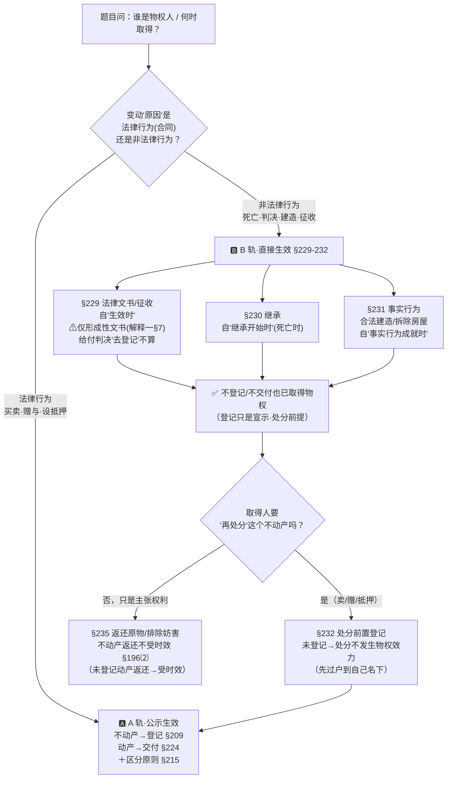

# 📐 物权变动 · 非基于法律行为变动 答题模型（定轨 → 直接生效 → §232 处分关 → 回 A 轨）

> **物权变动**分两条道：**A 轨 基于法律行为**（买卖/赠与/设抵押 → 不动产**登记** §209、动产**交付** §224，受 [[区分原则]] §215 统辖）；**B 轨 非基于法律行为**（[[民法典]] §229-232 → **不以公示为生效要件**，依法律事实**直接取得**）。本模型管 **B 轨**——继承、判决、征收、合法建造**瞬间得物权，不用登记/交付**；但 §232 把"再处分"那一棒**踢回 A 轨**（处分不动产须先过户到自己名下）。**A 轨细节** → [[不动产登记]] / [[区分原则]] / [[善意取得]]。
> **姊妹 / 概念** → [[非基于法律行为的物权变动]]（概念页）· [[区分原则]]（§215 总开关）· [[不动产登记]]（§209/§214）· [[物权的保护]]（§235 返还原物）· [[善意取得]]（§311，A 轨第三人保护）。
> **适用真题**：[[物权编-单选-02|单选-02·继承得房后出卖"交付即转移"无效]] · [[物权编-单选-03|单选-03·继承未登记仍享物权请求权·不受时效]] · [[物权编-单选-04|单选-04·散伙协议+判决+继承+公证 四轨道辨析]]。
>
> 🔎 **法条已联网核实（2026-06-15，[最高检官网民法典物权编全文](https://www.spp.gov.cn/spp/ssmfdyflvdtpgz/202008/t20200831_478410.shtml) + [物权编解释一·法释〔2020〕24 号](https://www.court.gov.cn/fabu/xiangqing/282101.html) + 多源三角验证）**：**§229** 法院/仲裁**法律文书**或政府**征收决定**致变动，自其**生效时** · **§230** 继承，自**继承开始时** · **§231** 合法建造/拆除房屋等**事实行为**，自**事实行为成就时** · **§232** 处分本节取得的不动产物权，**未经登记不发生物权效力** · **§209** 不动产登记生效（"**法律另有规定除外**"即指 B 轨）· **§215** 区分原则 · **§224** 动产交付生效 · **§196⑵** 不动产物权和"**登记的**"动产物权返还财产**不适用时效**。
> ⚠️ **高频易错（必记）**：① §229 的"法律文书"**仅限形成性（变更原物权关系）文书**——分割共有物的判决/裁决/调解书、执行中的**拍卖成交裁定书/以物抵债裁定书**（[物权编解释一 §7]）；**"命令某人去办过户"的给付判决不算**，仍要实际登记才变动。② §232 是"**取得不用登记、卖出去得先登记**"的处分前置——别漏。③ §196⑵ 只保护"**登记的**"动产，**未登记动产**的返还原物请求权**仍受诉讼时效**。
> ⭐ **考频 ★★★★**（报告 Row 8：法大《黄金考点》"无须公示要件的物权变动"，难度 ★★★ · 客观题高频，主观题作"物权变动"案例首步）。

## 🗺️ 判断流程图

## 一、核心考情

- **考点定位**：物权编通则"物权变动"四组之一（报告 Row 8）。**A 轨基于法律行为**靠公示（登记/交付）生效，是常态；**B 轨非基于法律行为**（§229-232）是**例外**——法律事实一成就，物权**自动**变动，**不等登记/交付**。命题人几乎永远在考"**A、B 两轨混在一道题里，你能不能切准**"。
- **命题核心（四个动作）**：① **定轨道**（原因是合同还是死亡/判决/建造/征收）；② **定时点**（B 轨：死亡时/文书生效时/建成时 直接取得）；③ **§232 处分关**（B 轨取得后再卖，须先登记）；④ **物权请求权 × 时效**（未登记也是真权利人，不动产返还不受时效）。
- **为什么高频**：B 轨是"**未经公示也享有物权**"的反直觉点，最适合设"未过户=没所有权"的坑；且能与 [[区分原则]]（§215）、[[善意取得]]（§311）、诉讼时效（§196）串成主观题大链条。
- **三道真题切面**：[[物权编-单选-02]] 考"继承得房 + 不动产不能约定'交付即转移'"；[[物权编-单选-03]] 考"继承未登记仍享物权请求权 + 不受时效"；[[物权编-单选-04]] 考"散伙协议/判决/继承/公证 四轨道同台辨析"——**三题合起来正好是本模型的完整地图**。

## 二、万能四步模型

### 第一步：先定轨道——原因是"法律行为"还是"非法律行为"？

| 变动原因                     | 轨道      | 生效要件                                                 |
| ------------------------ | ------- | ---------------------------------------------------- |
| 买卖/赠与/互易/设定抵押质押等**合同**   | **A 轨** | 不动产**登记**生效（§209）、动产**交付**生效（§224）；受 **§215 区分原则**统辖 |
| **继承**（被继承人死亡）           | **B 轨** | **自继承开始时**（§230）——不用登记                               |
| 法院/仲裁**法律文书**、政府**征收决定** | **B 轨** | **自文书/决定生效时**（§229）——不用登记                            |
| **合法建造、拆除房屋**等**事实行为**   | **B 轨** | **自事实行为成就时**（§231）——不用登记                             |

> 🔑 **铁则**：**A 轨"公示才变动"，B 轨"事实成就即变动"**。看到"死亡/判决/建房/征收"四个词，立刻切 B 轨——**登记与否不影响取得**。

> 🏛️ **实际案例·一道题四轨同台（[[物权编-单选-04]] · 2013 卷三·6 官方真题）**：甲乙散伙——① 散伙协议约定房归甲＝**A 轨·合同**，§215 此时还没变动；② 法院"判令丙协助过户"＝**给付判决、不是 §229 形成文书**，丙仍是房主；③ 丙死亡、丁继承＝**B 轨·§230**，死亡瞬间得房；④ 丁经公证把房赠戊但未登记＝**A 轨·赠与**，§209 戊未取得。**一道题把 A、B 两轨各种原因全考一遍**——这正是"先定轨道"的实战意义。

### 第二步：B 轨直接生效——对准时点，登记只是"宣示"

- **§230 继承**：被继承人**死亡瞬间**，继承人即取得物权（无须过户）。→ 单选-02/03/04 的共同地基。
- **§229 法律文书 / 征收**：自文书 / 决定**生效时**取得。**但"法律文书"限形成性**：分割共有物的**判决/裁决/调解书**、执行程序中的**拍卖成交裁定书 / 以物抵债裁定书**（[物权编解释一 §7]）——这些直接**改变原物权关系**。**"判决丙去办过户"的给付判决不算**，物权仍需实际登记才变动（单选-04 命门）。
- **§231 事实行为**：合法建造（自建房）自**建成时**取得、拆除自**灭失时**消灭——靠的是事实，不是登记。

> 🔑 **铁则**：B 轨"登记 = 宣示 / 对抗 / 处分前提"，**不是取得要件**。"未登记"≠"没取得"。
> ⚠️ **§229 形成 vs 给付**：能**直接确认/形成**物权归属的（确权、分割、拍卖成交）→ 直接变动；只是**命令对方履行登记义务**的（给付之诉）→ 仍要去登记。

**🏛️ 三个分源各配一例**

- **§230 继承·官方真题（[[物权编-单选-03]] · 2016 卷三·5）**：蔡永父母立共同遗嘱把共有房留给蔡永；2012 年父母先后去世、蔡永一直没过户；2015 年他要赶走一直借住的姐姐蔡花。结论：**蔡永从父母去世那一刻起就是房主**（§230，没过户也是真权利人），可凭物权请求权赶人。
- **§231 事实行为·真实判决（(2019)最高法民申5205号 · 宅基地自建房）**：孙某之父 1990 年在宅基地上**自建房屋**、次年分家析产归孙某；后债权人申请强制执行该房，孙某配偶提执行异议之诉。**最高法裁判要旨**："宅基地上因合法建造……设立物权的，**自该事实行为成就时（建造完成之日）**发生效力，**不以登记为生效要件**。"→ 合法自建房**建成即取得**，没房本也是房主。（最高检官方释法《自己盖的房子，什么时候开始取得产权？》同口径。）
  - ⚠️ **如实标注**：该案系《物权法》时期裁判（据《物权法》§9/§30/§153 等，§30＝现 §231，要旨逐字对应）；案号、当事人、要旨经财新/网易两个独立来源逐字印证，**裁定书完整原文尚待裁判文书网复核**。
- **§229 法律文书·教学例 🔧**（无可核实个案，标注为拟制例）：甲乙两兄弟共有一套房分不拢，法院判"**东半套归甲、西半套归乙**"——这是**改变物权归属的形成判决**，**判决生效之日**两人各自取得分得部分、无须登记（§229＋[物权编解释一 §7]，拍卖成交裁定书同理）。⚠️ 对照：若只判"**丙协助办过户**"（给付判决），不算 §229，物权仍须实际登记才变动。

### 第三步：过 §232 处分关——B 轨取得后"再处分"，先登记到自己名下

- B 轨取得人**自己用 / 主张权利**：不用登记（第二步已是真权利人）。
- B 轨取得人**要再处分**（卖、赠、设抵押）该**不动产**：**§232——未经登记，处分不发生物权效力**。即"**取得不用登记，但卖出去之前必须先过户到自己名下**"（继承房要先办继承登记，才能有效卖给买家）。

> 🔑 **铁则**：**§232 = "宣示登记"前置**。B 轨拿到的不动产想流转给第三人，登记从"可有可无"变成"处分必备"。

> 🏛️ **实际案例（[[物权编-单选-02]] · 2020 金题🔧，非官方原题）**：甲继承得房、**没办继承登记**，就和乙签买卖合同、约定"交房即转移所有权"。**乙取不到所有权**——§232：继承得来的不动产想再卖，**必须先办继承登记过到自己名下**才能有效处分；且"交付即转移"对不动产无效（§209）。乙只能凭合同（债权有效）请甲**先办继承登记、再过户**。
> - 🏛️ **镜像真案佐证（(2016)沪0117民初5769号 · 上海松江法院）**：出卖人在卖房履约中死亡，继承人**自继承开始即得房**（§230 印证），法院判其**应承继向买受人过户的义务**。⚠️ 标注：旧法案（合同法/继承法）、出卖人死亡的"镜像方向"，非直接援引 §232，仅佐证"继承得房→仍须登记才完成向买受人的移转"链条。

### 第四步：回 A 轨判处分 + 物权请求权 × 时效

- **处分这一棒回 A 轨**：买家何时取得，仍按 §209（不动产登记）/§224（动产交付）+ §215（合同效力≠物权变动）判断。**公证 / 合同 / 交付都不等于不动产登记**（单选-04 丁→戊：公证赠与未登记 = 戊未取得）。
- **不动产"交付即转移"约定无效**：§209 不动产登记生效是**强制规则**，当事人**不能用约定排除**（动产才可依 §224"另有规定/约定"灵活，不动产不行）——单选-02 命门。
- **物权请求权 × 时效**：B 轨取得人未登记**仍是真权利人** → 享 §235 返还原物 / §236 排除妨害。**不动产物权和"登记的"动产物权**的返还原物请求权**不适用诉讼时效**（§196⑵）；**未登记动产**的返还原物请求权**仍受时效**（精确区分）——单选-03 命门。

> 🏛️ **实际案例（[[物权编-单选-03]] · 2016 卷三·5 官方真题）**：续蔡永案——他继承得房虽**未登记仍是真房主**，2015 年（距 2012 取得约 3 年）要赶走借住到期的姐姐蔡花。法院支持：① 凭 §235 返还原物请求权赶人；② **不动产返还原物不受诉讼时效**（§196⑵），3 年间隔不构成障碍 → 答 **D**。
> - ⚠️ **"未登记动产返还受时效"——法考按反对解释作答，但实务有分歧**：§196⑵正面只列"不动产+已登记动产"，**反对解释**得"未登记动产返还受 3 年时效"——这是**法考应试通说**；但学理与裁判并不统一（杨巍《§196 评注》梳理的几则判决口径不一、作者本人持否定说）。**应试以"未登记动产返还受时效"为准**，知道有争议即可。

---

**🚗 老王小李一条龙例子（贯穿四步）**

> 老王父亲去世，留下一套**未过户**的房子，老王是唯一继承人。

1. **定轨道**（第一步）：原因是"父亲死亡" → **B 轨·继承**。
2. **直接生效**（第二步）：**父亲死亡瞬间**，老王已是房主（§230），**没过户也是真房主**。
3. **§232 处分关**（第三步）：老王想把房卖给小李 → 必须**先办继承登记把房过到自己名下**，否则处分不发生物权效力。
4. **回 A 轨**（第四步）：老王和小李约定"**交钥匙就过户**"——**无效**！不动产只认登记（§209），交房 ≠ 转移所有权；得去不动产中心办过户，小李才取得（§214）。
   - **附**：过户前有人借住老王的房赖着不走 → 老王虽没登记，仍可凭物权请求权赶人（§235），且不动产返还**不受 3 年时效**限制（§196⑵）。

## 三、命题人最爱的 10 个陷阱

1. **继承"未过户 = 没取得所有权"** —— 错！§230 **继承开始（死亡）即取得**，登记只是处分前提。
2. **给付判决"命令去办过户" = §229 法律文书直接变动** —— 错！只有**形成性**文书（分割共有物判决 / 拍卖成交裁定 / 以物抵债裁定）才直接变动；给付判决仍需实际登记（解释一 §7）。
3. **不动产"约定交付即转移所有权"有效** —— 错！§209 登记生效是**强制规则**，不能用约定排除（动产才可 §224 约定）。
4. **公证 / 网签 / 合同 / 交付 替代不动产登记** —— 错！不动产物权转移**只认登记**（§209/§214）。
5. **继承人未登记 → 无物权请求权 / 受诉讼时效限制** —— 错！是真权利人，享 §235；不动产返还**不受时效**（§196⑵）。
6. **B 轨取得后直接卖给第三人就能转移** —— 错！漏了 §232，**处分前须先登记到自己名下**。
7. **自建房（事实行为）要登记才取得** —— 错！§231 **合法建造自建成时取得**，登记是后续处分要件。
8. **征收 / 法院形成判决要等登记才生效** —— 错！§229 **自征收决定 / 文书生效时**即变动。
9. **"未登记动产返还原物也不受时效"** —— 错！§196⑵ 只保护"不动产物权和**登记的**动产物权"；**未登记动产**返还请求权**适用**时效。
10. **散伙协议 / 转让合同一签，物权就归对方** —— 错！合同是 A 轨原因行为，§215 区分原则：**合同有效 ≠ 物权变动**，不动产仍待登记。

## 四、真题演练

| 真题 | 答案 | 定位（用第几步） | 一句话解析 |
|---|---|---|---|
| [[物权编-单选-02]]（2020 金题 2-1-9） | **C** | 第一→二→四步 | 继承得房（§230 已取得，A 不最精确）；卖房约定"交付即转移"**对不动产无效**（§209 强制），交付 ≠ 登记 → **所有权没转移**。 |
| [[物权编-单选-03]]（2016 卷三·5） | **D** | 第二→四步 | 遗嘱继承得房（§230，未登记**仍是权利人**）；借用期满，蔡永享**物权请求权**（§235），且不动产返还**不受时效**（§196⑵）→ D。 |
| [[物权编-单选-04]]（2013 卷三·6） | **C** | 四步全用 | 散伙协议≠变动（§215）；"判丙去过户"是**给付判决≠§229 形成文书**（解释一§7）→ 9 月前仍归丙；丙死，丁**继承瞬得**（§230）；丁公证赠戊**未登记**（§209）→ 戊未取得。唯 **C（9 月丁为所有人）**对。 |

> 📌 **如实标注来源**：单选-03 / 04 为**官方真题**（2016 / 2013 卷三）；单选-02 为**教培金题**（2020 金题，非司考官方原题），三题均已逐题核对答案与法条映射。

## 📐 口诀

> **变动先分两条道：合同走 A 轨（不动产登记 §209 / 动产交付 §224 + 区分原则 §215）；死亡·判决·建房·征收走 B 轨（§229-232）。**
> **B 轨四源：继承死亡时得（§230）、文书征收生效时得（§229，仅形成判决，"命令去登记"不算）、事实行为成就时得（§231）——都不用登记/交付。**
> **取得不用登记，卖出去得先登记（§232 处分前置）；处分这一棒回 A 轨，公证 / 交付 ≠ 不动产登记。**
> **未登记也是真主人：能赶人能要房（§235），不动产返还不受时效（§196⑵，但未登记动产返还受时效）。**

## 相关页面

- 上层 / 概念：[[非基于法律行为的物权变动]]（概念页）· [[物权编]] · [[区分原则]]（§215 A↔B 总开关）· [[不动产登记]]（§209/§214 A 轨）
- 横向衔接：[[善意取得]]（§311，A 轨处分中第三人保护）· [[物权的保护]]（§235 返还原物 / §236 排除妨害）· [[继承编]]（§230 继承取得的实体依据）
- 适用真题：[[物权编-单选-02]] · [[物权编-单选-03]] · [[物权编-单选-04]]
- 综合报告：[[物权编考点-深度报告]]（一、通则 Row 8）
