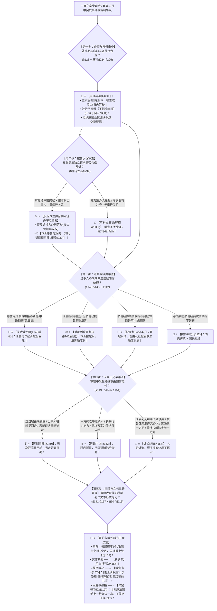

# 📐 一审审理进程与裁判形式 · 全流程答题模型（备庭 · 反诉 · 撤诉与缺席 · 延期中止终结 · 流程审限 · 判决裁定决定五步定位链 · §128-§157）

> **教练开场白**
> 同学们好！我是你们的民诉法考教练。在民事诉讼一审普通程序中，“审理进程与裁判形式”是**民诉全卷考查规则最密、考题最多、民诉考官最爱出‘选项混搭送命题’的超级枢纽（T1-2 / T1-3 / T1-7 高频考区，覆盖 16+ 张真题卡）**！
> 很多同学做一审进程题目时经常掉入以下几大“经典命题暗坑”：
> 1. **把“原告不到庭”错答成缺席判决**：看到原告经传票传唤无正当理由拒不到庭，选项写“法院应当缺席判决”（大错特错！原告不到庭**原则上按撤诉处理**；只有在**被告提出了反诉**的情况下，法院才可以对反诉缺席判决！被告不到庭才是直接缺席判决！）；
> 2. **反诉时间窗口记错**：以为反诉必须在“答辩期内”提出（《民诉解释》§232 明确：反诉提出的时间窗口是**【案件受理后、法庭辩论结束前】**！答辩期届满前是管辖权异议的窗口！）；
> 3. **以为本诉撤诉后反诉就不审了**：《民诉解释》§239 铁律：**反诉具有完全独立性！准许本诉原告撤诉的，人民法院【应当对反诉继续审理】**！
> 4. **混淆延期审理、诉讼中止与诉讼终结的事由**：
>    - 延期审理（§149）：是**“当次开庭开不成，另定开庭日期”**（如当事人临时提回避、需要新证据）；
>    - 诉讼中止（§153）：是**“程序整体暂停，等待障碍消除后恢复”**（如一方死亡需要**等待继承人表明是否参加**）；
>    - 诉讼终结（§154）：是**“人死诉消，程序彻底终结不再审”**（如继承人**明确放弃**、**离婚案件一方死亡**！）；
> 5. **可上诉裁定范围随意扩大**：以为裁定中止诉讼、准许撤诉也能上诉（《民事诉讼法》§157 铁律：**全法可以上诉的裁定只有三种：不予受理、管辖权异议、驳回起诉**！其余裁定均不可上诉！）。
>
> 今天我们用**“五步连贯流水线”**，把一审审理进程与裁判形式的全部法定规则一次性彻底锁死：**第一步备庭与答辩（立案5日送副本、被告15日答辩且不答辩照审、庭前会议归纳争点 §128/解释§224） → 第二步被告反诉三门槛（时间：辩论结束前；人：限本诉当事人；事：同一关系/因果/相同事实；本诉撤诉反诉照审 §54/解释§232-§239） → 第三步退场与缺席判决（原告不来按撤诉、被告反诉缺席判；被告不来缺席判；必须到庭两传拘传 §146-§148/§112） → 第四步程序卡壳三兄弟（延期：当次开不成另定；中止：暂停待恢复；终结：人死诉消彻底终结 §149/§153/§154） → 第五步审限与文书三分法（法庭调查辩论最后陈述；普通6个月+两级延长；判决管实体、裁定管程序可上诉仅三种、决定管回避与强措各复议一次 §141-§157）**！

---

## 适用场景与解决问题

本模型专门解决审理前准备（答辩期15日与不答辩效力、庭前会议）、反诉三大构成要件（时间/当事人/牵连关系）与独立性处理（本诉撤诉反诉照审）、原告撤诉与按撤诉处理清单、原告/被告拒不到庭与缺席判决适用、延期审理 vs 诉讼中止 vs 诉讼终结事由甄别、开庭调查辩论流程、审限计算与延长审批权限、判决/裁定/决定三大司法文书范围与救济途径（可上诉三裁定、决定复议不停止）的全部主客观题考点（对应 [[民诉-客观题考点全景-深度报告]] 板块C 第6章 6-4~6-10 核心考点）：重点破解：

1. **第一步 · 审理前准备与庭前会议审查（《民事诉讼法》§128-§131 ＋ 《民诉解释》§224-§225）**：
   - ⭐ **送达与答辩时限（§128）**：
     - 立案之日起 **5 日内**送达起诉状副本给被告；
     - 被告收到之日起 **15 日内**提出答辩状；法院收到答辩状之日起 **5 日内**将副本送达原告；
     - 🚨 **不答辩法律效力**：**被告不提出答辩状的，不影响人民法院审理**（不答辩不等于自认，也不等于缺席）；
   - ⭐ **庭前会议功能（解释§225）**：答辩期届满后，明确诉辩、审查处理增加变更诉请与反诉、组织证据交换、归纳争点、进行调解。
2. **第二步 · 被告反击：反诉三门槛与独立性审查（《民事诉讼法》§54/§143 ＋ 《民诉解释》§232-§239 核心考点）**：
   - ⭐ **反诉三大实质门槛（解释§232-§233 必须秒杀）**：
     - ① **时间门槛**：必须在**案件受理后、法庭辩论结束前**提出；
     - ② **主体门槛**：反诉当事人**必须限于本诉当事人范围**（矛头指向案外人的一律不构成反诉，应另行起诉 单选-09）；
     - ③ **客体牵连门槛**：反诉与本诉必须具备牵连性——基于**相同法律关系**、存在**因果关系**、或者基于**相同事实**；
   - 🚫 **排他与冲突**：属于其他法院专属管辖或与本诉无关联的，**裁定不予受理，告知另行起诉（解释§233Ⅲ）**；
   - 🚨 **反诉独立性原则（解释§239 必考做题眼）**：
     - 准许本诉原告撤诉的，**人民法院【应当对反诉继续审理】**；被告申请撤回反诉的应予准许（单选-10 / 多选-236）；
     - 被告提起反诉视为承认受诉法院管辖权，**丧失提出管辖权异议的权利（单选-50）**。
3. **第三步 · 有人退场：撤诉与缺席判决审查（《民事诉讼法》§146-§148 ＋ 《民诉解释》§214/§238-§241）**：
   - ⭐ **原告撤诉（§148 ＋ 解释§238）**：宣判前申请，法院裁定；有违法行为需处理的，或法庭辩论终结后撤诉被告不同意的，**可不准许撤诉**；
   - ⚖️ **按撤诉处理 vs 缺席判决适用主体精准对照表（经典送命题 单选-343）**：
     - 👤 **原告不到庭（§146）**：原告经传票传唤无正当理由拒不到庭或中途退庭 $\rightarrow$ **【按撤诉处理】**；
       - 🚨 **被告反诉但书**：**被告提出反诉的，可以【缺席判决】**；
     - 👥 **被告不到庭（§147）**：被告经传票传唤无正当理由拒不到庭或中途退庭 $\rightarrow$ **【直接缺席判决】**；
     - 🚨 **拘传衔接（§112 ＋ 解释§174）**：必须到庭的被告（赡养抚育扶养/查明案情）经**两次传票传唤**拒不到庭的，可以**拘传**；必须到庭查清事实的**原告也可拘传**。
4. **第四步 · 程序卡壳三兄弟：延期审理 vs 诉讼中止 vs 诉讼终结（《民事诉讼法》§149/§153/§154 核心考点）**：
   - ⭐ **① 延期审理（§149，当次开庭开不成，另定开庭日）**：
     - 情形：必须到庭当事人有正当理由未到 / 当事人**临时申请回避** / 需要新证人新证据重新鉴定勘验 / 其他；
   - ⭐ **② 诉讼中止（§153，程序暂时停顿，待障碍消除后恢复）**：
     - 情形：一方死亡**等待继承人表明是否参加** / 丧失行为能力未定法代 / 法人终止未定权利义务承受人 / 不可抗力 / **本案须以另案审理结果为依据而另案尚未审结（单选-344）**；
   - ⭐ **③ 诉讼终结（§154，人死诉消，程序彻底终结不再审）**：
     - 情形：原告死亡**无继承人或继承人放弃权利** / 被告死亡**无遗产且无应当承担义务的人** / **离婚案件一方当事人死亡** / 追索赡养费扶养费抚养费以及解除收养关系案件**一方当事人死亡（单选-345）**。
5. **第五步 · 收官：流程审限与判决裁定决定三分法（《民事诉讼法》§141-§157）**：
   - ⭐ **开庭审理流程（§141-§145）**：法庭调查 $\rightarrow$ 法庭辩论 $\rightarrow$ 征询最后意见（按**原告、被告、第三人**顺序） $\rightarrow$ 依法判决（先行判决§156）；
   - ⭐ **审限规则（§152）**：立案之日起 **6 个月**审结；经本院院长批准延长 **6 个月**；还需延长的**报上级人民法院批准**；
   - 🚨 **判决 · 裁定 · 决定三分法体系（压轴必考）**：
     - 📜 **判决书（实体问题）**：解决案件实体争议（包含先行判决）；上诉期 15 日；
     - 📄 **裁定书（程序问题，§157 十一项）**：
       - 🚨 **可上诉裁定全法仅三种**：**①不予受理；②管辖权异议；③驳回起诉**；
       - 其余裁定（保全、先予执行、中止诉讼、终结诉讼等）**均不可上诉**；保全/先予执行向原法院**申请复议一次不停止执行（§111）**；
     - 📋 **决定书（特定程序事项）**：
       - 决定适用于**回避（§50）**与**罚款、拘留强制措施（§119）**；
       - 救济：均可**申请复议一次**；回避复议期间**不停止参与本案工作**，罚款拘留复议期间**不停止执行**！

> **核心一句**：**五日送达十五答、不答照审；反诉辩终前、人限本诉、事要牵连，本诉撤了反诉照审；原告不来按撤诉、被告不来缺席判、有反诉原告也缺席判、必须到庭两传拘；当次开不成叫延期、暂停等恢复叫中止、人死诉亡叫终结；调查辩论最后意见、六月审限两级批；实体判决、程序裁定（可上诉只有不予受理·管辖异议·驳回起诉三种）、回避强措用决定！**
>
> 🔎 **核心法源（2026最新）**：《民事诉讼法》§50、§54、§111、§112、§118、§119、§128-§131、§141-§157；《民诉解释》§174、§214、§224、§225、§230、§232、§233、§236-§241。

---

## 💡 【前置认知】审理进程与裁判形式核心规则极速对照表

| 制度模块 | 核心法律条文 | 刚性法定规则与标准 | 考场一秒判定秘诀 |
| :--- | :--- | :--- | :--- |
| **① 反诉三门槛** | 《民诉解释》**§232-§233** | • 时间 $\rightarrow$ **法庭辩论结束前**；<br>• 主体 $\rightarrow$ **限本诉当事人**；<br>• 事由 $\rightarrow$ **同一关系/因果/相同事实**。 | 辩论前随时提；**告外人不叫反诉**；本诉撤了反诉照审！ |
| **② 缺席判决主体** | 《民事诉讼法》**§146/§147** | • 被告不到庭 $\rightarrow$ **缺席判决**；<br>• 原告不到庭 $\rightarrow$ **按撤诉处理**（有反诉缺席判）。 | 被告不来直接判；**原告不来算撤诉**，除非被告反诉！ |
| **③ 卡壳三兄弟** | 《民事诉讼法》**§149/§153/§154** | • 延期 $\rightarrow$ **当次开不成另约时间**；<br>• 中止 $\rightarrow$ **暂停等障碍消除**；<br>• 终结 $\rightarrow$ **原告死无继承/离婚一方死**。 | 临时提回避叫延期；等继承人叫中止；**离婚死人直接终结**！ |
| **④ 审限与延长** | 《民事诉讼法》**§152** | 普通程序 6 个月；<br>• **院长批延 6 个月 $\rightarrow$ 再延报上级法院批**。 | 本院院长延半年；**还想再延必须报上级法院批准**！ |
| **⑤ 文书三分法** | 《民事诉讼法》**§155-§157** | • 实体 $\rightarrow$ **判决**；<br>• 程序 $\rightarrow$ **裁定（能上诉只有前三项）**；<br>• 回避与罚拘 $\rightarrow$ **决定（复议一次）**。 | 判决定输赢；**裁定能上诉只有三项**；回避罚款全用决定！ |

---

## 一、 考点核心骨架与法理（五步连贯决策树）



```
【审理进程与裁判形式全景】一句话开场：五日送达十五答、不答照审；反诉辩终前、人限本诉、事要牵连，本诉撤了反诉照审；原告不来按撤诉、被告不来缺席判、有反诉原告也缺席判、必须到庭两传拘；当次开不成叫延期、暂停等恢复叫中止、人死诉亡叫终结；调查辩论最后意见、六月审限两级批；实体判决、程序裁定（可上诉只有不予受理·管辖异议·驳回起诉三种）、回避强措用决定！
│
▼ 第一步 · 备庭与答辩 ── 准备与庭前会议（§128-§131/解释§224-§225）
├─ 答辩期 15 日：立案 5 日送副本，被告 15 日答辩；【不答辩不影响审理】
└─ 庭前会议：答辩期满组织证据交换、归纳争点、处理反诉与调解
     │
     ▼ 第二步 · 被告反诉 ── 三门槛与独立性（§54/解释§232-§239）
     ├─ 三门槛：①时间：【法庭辩论结束前】；②主体：【限本诉当事人】；③客体：【具牵连关系】
     ├─ 冲突处理：专属管辖冲突或无牵连 ──→ 裁定不予受理，告知另诉
     └─ 🚨 反诉独立性：【准许本诉撤诉的，对反诉继续审理】（解释§239）
          │
          ▼ 第三步 · 退场与缺席 ── 撤诉、按撤诉与缺席判决（§146-§148/§112）
          ├─ 原告撤诉：宣判前申请，法院裁定；撤诉后再诉应受理
          ├─ 原告不到庭：【按撤诉处理】；🚨【被告反诉的，可以缺席判决】（§146）
          ├─ 被告不到庭：【直接缺席判决】（§147）
          └─ 必须到庭被告：两次传票拒不到庭 ──→ 【拘传】（须院长批准）
               │
               ▼ 第四步 · 卡壳三兄弟 ── 延期、中止与终结辨析（§149/§153/§154）
               ├─ 延期审理（§149）：当次开不成另约时间（正当理由/临时提回避/需新证据鉴定）
               ├─ 诉讼中止（§153）：程序暂停待恢复（等继承人/未定法代/另案未结）
               └─ 诉讼终结（§154）：程序彻底结束（原告死无继承放弃/被告死无遗产/【离婚一方死】/赡扶抚解除收养一方死）
                    │
                    ▼ 第五步 · 审限与文书三分 ── 流程、审限与裁判救济（§141-§157）
                    ├─ 审限（§152）：立案起 6 个月；院长批延 6 个月；再延报【上级法院批准】
                    ├─ 判决（实体）：解决实体争议，可先行判决（§156）
                    ├─ 裁定（程序）：🚨【可上诉全法仅三种：不予受理、管辖权异议、驳回起诉】（§157末款）
                    └─ 决定（特殊）：管回避（§50）与罚款拘留（§119），复议一次（不停工作/不停执行）

  ━━━ 五步全通 ━━━
```

---

## 二、 核心考情与 2026 民诉法新规精要

- **频次研判**：一审审理进程与裁判形式是民诉板块**★★★★ T1-2/T1-3/T1-7 核心极高频考区**；客观题每年必考 3–4 题，覆盖反诉构成与撤诉后继续审理、原告不到庭按撤诉 vs 被告反诉缺席判决、延期审理/诉讼中止/诉讼终结法定事由甄别、审限延长两级审批、判决/裁定/决定文书定性与可上诉三裁定。
- **2026 命题核心与法理精要**：
  1. **反诉独立性（解释§239）**：本诉原告撤诉，法院必须对反诉继续审理。
  2. **缺席判决主体规则（§146/§147）**：原告不到庭原则按撤诉，被告反诉才缺席判；被告不到庭直接缺席判。
  3. **一方死亡分流（§153/§154）**：等继承人表态中止；无继承人、放弃或离婚案件一方死亡终结。
  4. **审限延长两级审批（§152）**：院长批 6 个月，再延报上级法院批准。
  5. **可上诉裁定仅三种（§157）**：不予受理、管辖权异议、驳回起诉。

---

## 三、 三大核心法理与命题陷阱拆解

### 1. 审理进程四大命题暗坑与裁判标准表

| 案件事实设定 | 争议焦点 | 裁判结论 | 命题陷阱与法理深剖 |
|---|---|---|---|
| 原告甲起诉被告乙索要借款 50 万元。开庭前乙提出反诉要求甲交付已买卖的汽车。法庭审理中，甲提出撤诉申请。法院裁定准许甲撤诉，并同时以“本诉已撤销反诉无所附丽”为由裁定驳回乙的反诉。 | 法院裁定驳回乙的反诉是否合法？本诉撤诉后反诉应当如何处理？ | 🚫 **法院裁定驳回反诉违法！法院应当对乙的反诉继续审理！** | 《民诉解释》§239：反诉具有独立的诉权属性。**准许本诉原告撤诉的，人民法院应当对反诉继续审理**。法院不能因本诉撤诉而驳回反诉（单选-10 / 多选-236）。 |
| 原告甲起诉被告乙返还租赁房屋，乙未提出反诉。开庭当日，经传票传唤的甲无正当理由拒不到庭。承办法官李某认为案件事实清楚，遂依法缺席审理并作出判决支持了甲的诉讼请求。 | 法院对原告甲拒不到庭作出缺席判决是否合法？ | 🚫 **缺席判决违法！法院应当依法按撤诉处理！** | 《民事诉讼法》§146：原告经传票传唤，无正当理由拒不到庭的，**可以按撤诉处理；只有在被告提出反诉的情况下，才可以缺席判决**。没有反诉时原告不到庭绝不能缺席判决（单选-343）。 |
| 原告甲起诉丈夫乙离婚。一审开庭审理后，乙因突发心肌梗死死亡。承办法官李某裁定中止诉讼，等待乙的法定继承人表明是否参加诉讼。 | 法院裁定中止诉讼是否合法？离婚案件当事人死亡应当如何处理？ | 🚫 **裁定中止诉讼违法！离婚案件一方当事人死亡应当裁定终结诉讼！** | 《民事诉讼法》§154(三)：**离婚案件一方当事人死亡的，人民法院应当裁定终结诉讼**。离婚诉讼具有极强的人身专属性，婚姻关系因死亡而自然消灭，不存在继承问题，必须裁定终结诉讼（单选-345）。 |
| 甲与乙买卖合同纠纷，法院在审理中裁定对乙的财产采取保全措施。乙对保全裁定不服，向上一级法院提起上诉。二审法院立案受理并进行审理。 | 二审法院受理乙对保全裁定的上诉是否合法？ | 🚫 **二审法院受理上诉违法！保全裁定不得上诉，只能向原法院申请复议一次！** | 《民事诉讼法》§157 ＋ §111：可以提起上诉的裁定**仅限不予受理、管辖权异议、驳回起诉三种**。当事人对保全裁定不服的，**只能向作出裁定的人民法院申请复议一次，复议期间不停止执行**（单选-348）。 |

---

## 四、 万能解题五步

---

### 第一步：备庭与答辩 —— 答辩期过了吗？不答辩能审吗？（《民事诉讼法》§128）

> **教练提示**：
> 1. 立案 5 日送副本，被告 15 日答辩；
> 2. 🚨 **被告不答辩不影响审理（不等于自认，也不等于缺席）**！

---

### 第二步：被告反诉 —— 辩论前反诉了吗？告外人了吗？本诉撤了反诉怎么审？（《民诉解释》§232-§239）

> **教练提示**：
> 1. 时间：**法庭辩论结束前**；主体：**限本诉当事人（矛头指向案外人非反诉）**；
> 2. 🚨 **本诉撤诉，反诉必须继续审理（解释§239）**！

---

### 第三步：退场与缺席 —— 是谁没来？原告还是被告？有反诉吗？（《民事诉讼法》§146/§147）

> **教练提示**：
> 1. 原告没来 $\rightarrow$ **【按撤诉处理】；被告已反诉的 $\rightarrow$ 【缺席判决】**；
> 2. 被告没来 $\rightarrow$ **【直接缺席判决】**；
> 3. 必须到庭被告：**两次传票拒不到庭 $\rightarrow$ 拘传（院长批）**！

---

### 第四步：卡壳三兄弟 —— 是延期、中止还是终结？死人能恢复吗？（《民事诉讼法》§149/§153/§154）

> **教练提示**：
> 1. 延期：**当次开不成另定日期（临时提回避、需新证据鉴定）**；
> 2. 中止：**暂停待恢复（等继承人表态、另案审理未结）**；
> 3. 终结：**人死诉亡（原告死无继承放弃、被告死无遗产、【离婚一方死】、赡抚扶死）**！

---

### 第五步：审限与文书三分 —— 谁批准延期？是判决、裁定还是决定？（《民事诉讼法》§152-§157）

> **教练提示**：
> 1. 审限：普通 6 个月 $\rightarrow$ 院长批延 6 个月 $\rightarrow$ **再延报上级法院批**；
> 2. 实体判决；**裁定可上诉只有前三项（不予受理、管辖权异议、驳回起诉）**；
> 3. 回避与强措用**决定（复议一次不停止）**！

#### 💰 完整数字案例：一审进程与裁判形式全景攻防实战

> **【案情（[[民诉-二审程序-单选-10]]、[[民诉-一审-单选-343]] 与 [[民诉-一审-单选-345]] 综合演练）】**
> 原告甲公司起诉被告乙公司支付货款 **100 万元**。
> 1. **第一幕（反诉提起与本诉撤诉）**：乙公司在法庭辩论结束前提出反诉，请求判令甲公司赔偿因货物质量不合格造成的设备维修损失 **30 万元**。开庭审理中，甲公司发现自己证据不足，当庭向法官申请撤诉。法院裁定准许甲公司撤诉。
> 2. **第二幕（原告不到庭与缺席审理）**：准许撤诉后，法院定于次周继续审理乙公司的 30 万元反诉案并依法传票传唤甲公司。开庭当日，甲公司无正当理由拒不到庭。
> 3. **第三幕（诉讼终结与裁判救济）**：反诉审理中，乙公司主要负责人张某（涉案独资公司唯一股东）因车祸意外身亡，经查该独资公司无任何遗产、无其他股东且无权利义务继承人。法院依法作出民事裁判。
>
> - **裁判涵摄**：
>   1. **第一幕裁判**：依据《民诉解释》§232 及 §239，乙公司在辩论结束前就质量赔偿提起反诉合法有效；甲公司本诉撤诉后，**法院应当对乙公司的 30 万元反诉继续审理，不得驳回反诉（单选-10）**；
>   2. **第二幕裁判**：依据《民事诉讼法》§146后段，反诉审理中，本诉原告（反诉被告）甲公司经传票传唤拒不到庭的，**人民法院可以对乙公司的反诉依法作出缺席判决（单选-343）**；
>   3. **第三幕裁判**：依据《民事诉讼法》§154(二)，当事人死亡且无遗产、无应当承担义务的人，**人民法院应当依法【裁定终结诉讼】（单选-345）**！对终结诉讼裁定，当事人不得提起上诉（单选-348）！

#### 一句话闭环记忆
> 🎯 **一眼判**：**五日送达十五答、不答照审；反诉辩终前、人限本诉、事要牵连，本诉撤了反诉照审；原告不来按撤诉、被告不来缺席判、有反诉原告也缺席判、必须到庭两传拘；当次开不成叫延期、暂停等恢复叫中止、人死诉亡叫终结；调查辩论最后意见、六月审限两级批；实体判决、程序裁定（可上诉只有不予受理·管辖异议·驳回起诉三种）、回避强措用决定！**

---

## 五、 案例演练

### 1. 本诉撤诉后反诉的处理（[[民诉-二审程序-单选-10]] 经典真题）
- **案情**：本诉原告撤诉，法院如何处理被告已提起的有效反诉。
- **模型分析**：第二步——依据《民诉解释》§239，准许本诉撤诉的，应当对反诉继续审理（选 B）。

### 2. 缺席判决适用情形（[[民诉-一审-单选-343]] 经典真题）
- **案情**：原告不到庭、被告不到庭、被告反诉原告不到庭分别如何处理。
- **模型分析**：第三步——被告不到庭缺席判；原告不到庭但被告反诉的可以缺席判决（选 D）。

### 3. 应当终结诉讼的情形（[[民诉-一审-单选-345]] 经典真题）
- **案情**：离婚案件一方当事人死亡，法院适用的程序处理。
- **模型分析**：第四步——依据《民事诉讼法》§154(三)，离婚案件一方死亡应当裁定终结诉讼（选 C）。

---

## 关联真题

- [[民诉-一审程序-单选-07 · 反诉与抗辩的区分]]
- [[民诉-一审程序-单选-09 · 反诉的当事人范围限制]]
- [[民诉-二审程序-单选-10 · 本诉撤诉后反诉的处理]]
- [[民诉-一审-多选-291 · 反诉的构成要件]]
- [[民诉-一审-单选-342 · 撤诉规则四项辨析]]
- [[民诉-一审-单选-343 · 可以缺席判决的情形]]
- [[民诉-一审-单选-344 · 应当中止诉讼的情形]]
- [[民诉-一审-单选-345 · 应当终结诉讼的情形]]
- [[民诉-二审-单选-348 · 管辖异议裁定上诉的二审审查范围]]

## 相关页面

- 概念实体页：[[审理前准备]] · [[反诉]] · [[撤诉]] · [[按撤诉处理]] · [[缺席判决]] · [[延期审理]] · [[诉讼中止]] · [[诉讼终结]] · [[可上诉裁定]]
- 姊妹模型：[[民诉-一审-起诉与受理模型]] · [[民诉-一审-简易小额与独任模型]]
- 综合报告：[[民诉-客观题考点全景-深度报告]]（板块C 第6章 6-4~6-10 · ★★★★ 一审进程核心区）
