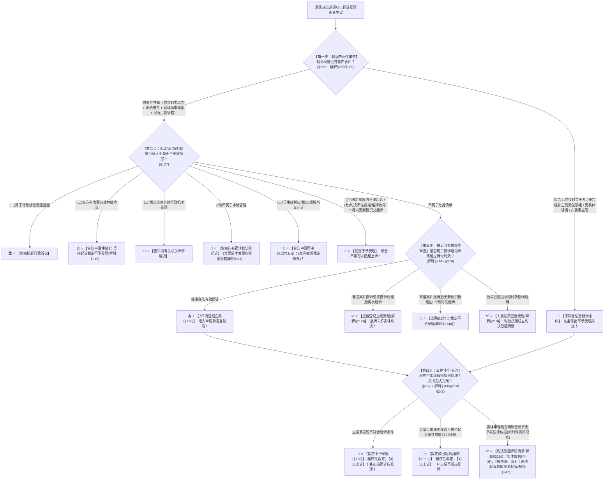

# 📐 起诉与受理 · 全流程答题模型（起诉四条件 · 登记立案 · 不予受理七类清单 · 三分法四步定位链 · §122-§127/§157）

> **教练开场白**
> 同学们好！我是你们的民诉法考教练。在民事诉讼法的审判程序中，“起诉与受理”是**民事诉讼进入法院大门的第一道关口，也是客观题命题人考查程序裁定、文书性质与立案分流的绝对核心高频考点（T1-7 核心考区，覆盖 5+ 张真题卡）**！
> 很多同学做起诉与受理题目时经常在以下几大“经典送命陷阱”上失分：
> 1. **混淆“驳回起诉”与“驳回诉讼请求”**：看到原告起诉已过诉讼时效，选项写“法院应当裁定驳回起诉”（大错特错！诉讼时效抗辩成立是**实体法问题**，法院必须下**判决驳回诉讼请求**！裁定驳回起诉只用于立案后发现**不符合程序起诉条件**！）；
> 2. **立案前后的裁定分水岭搞错**：立案后法官发现原告不是直接利害关系人，选项写“法院裁定不予受理”（《民诉解释》§208 铁律：**立案前不符合条件裁定不予受理；立案后发现不符合条件一律裁定驳回起诉**！分水岭是“立案”动作！）；
> 3. **生效判决/调解书后又起诉告知“另行起诉”**：当事人对已经生效的判决或调解书不服重新起诉（《民事诉讼法》§127(五) 规定：法院应当**告知其申请再审**，绝对不是另行起诉，也不是直接驳回！）；
> 4. **把超过诉讼时效当成不予受理**：以为诉讼时效过了法院就不能立案（《民诉解释》§219 明确：超过诉讼时效起诉的，**人民法院应当受理**；时效是抗辩权，法院不得主动审查，被告提抗辩且成立的才判决驳回诉讼请求！）；
> 5. **把撤诉后再诉当成禁止重复起诉**：以为撤诉后就不能再告了（《民诉解释》§214 规定：**撤诉或按撤诉处理后以同一诉求再次起诉的，法院应当受理**！只有判决不准离婚/撤诉离婚无新情况 **6 个月内再诉才不予受理**！）；
> 6. **可上诉的裁定范围任意扩大**：以为所有裁定都能上诉（《民事诉讼法》§157 铁律：**可以上诉的裁定全法只有三种：不予受理、管辖权异议、驳回起诉**！保全、先予执行只能复议！）。
>
> 今天我们用**“四步连贯流水线”**，把起诉与受理的全部法定规则一次性彻底锁死：**第一步查起诉四要件（直接利害原告、明确被告补正、具体诉请事实、主管与管辖 §122/解释§208-§209） → 第二步查登记立案与七类不予受理清单（7日内立案或裁定不予受理；行政诉讼/仲裁/其他机关/无管辖去别家/生效裁判找再审/法定期限/离婚收养6个月 §126-§127） → 第三步查撤诉与特殊再诉通道（撤诉后再诉应受理，离婚6个月比照除外 解释§214；超诉讼时效应当受理 解释§219） → 第四步定三分法与文书救济（立案前裁定不予受理、立案后裁定驳回起诉——均可上诉补正可再诉；审完判决驳回诉请——按判决上诉再诉为重复起诉 §157/解释§212/§247）**！

---

## 适用场景与解决问题

本模型专门解决起诉法定四要件认定、立案登记制审查时限（7日）、明确被告认定与补正、民诉法§127七类告知处理清单（仲裁/行政/再审/离婚6个月限制）、撤诉后再诉受理规则、诉讼时效届满案件处理、三大处理形式（不予受理 vs 驳回起诉 vs 驳回诉讼请求）的阶段/性质/文书形式/救济途径与重复起诉排除的全部主客观题考点（对应 [[民诉-客观题考点全景-深度报告]] 板块C 第6章 6-1/6-2/6-3 核心考点）：重点破解：

1. **第一步 · 查起诉四条件与形式（《民事诉讼法》§122-§124 ＋ 《民诉解释》§208/§209）**：
   - ⭐ **起诉四要件（§122 核心考点）**：
     - ① 原告是与本案有**直接利害关系**的公民、法人和其他组织；
     - ② 有**明确的被告**（解释§209：被告信息具体明确、足以与他人相区别即可；列写不足的**先告知补正，补正后仍不能确定的才裁定不予受理**）；
     - ③ 有**具体的诉讼请求**和事实、理由；
     - ④ 属于人民法院**受理民事诉讼的范围（主管）和受诉人民法院管辖**；
   - ⭐ **起诉形式（§123）**：递交起诉状＋按被告人数提副本；书写确有困难的可**口头起诉**（记入笔录告知对方）。
2. **第二步 · 查登记立案与 §127 不予受理七类告知清单（《民事诉讼法》§126-§127）**：
   - ⭐ **登记立案与审查时限（§126 ＋ 解释§208）**：
     - 符合 §122 且不属 §127 的，**应当登记立案，7 日内立案并通知当事人**；
     - 不符合的，**7 日内作出裁定书不予受理，原告不服可以上诉（§126）**；
     - 当场不能判定的，接收材料并出具**注明收到日期的书面凭证**；
   - 🚨 **§127 不予受理七类告知处理清单（必须秒杀做题眼）**：
     - (一) 属于行政诉讼受案范围 $\rightarrow$ **告知提起行政诉讼**；
     - (二) 双方有书面有效仲裁协议 $\rightarrow$ **告知申请仲裁**（坚持起诉裁定不予受理 解释§215）；
     - (三) 依法应由其他机关处理 $\rightarrow$ **告知向有关机关申请解决**；
     - (四) 不属本院管辖 $\rightarrow$ **告知向有管辖权的法院起诉**（立案后发现无管辖权应**移送管辖**，不能驳回起诉！解释§211）；
     - (五) **对生效判决、裁定、调解书又起诉 $\rightarrow$ 告知申请【再审】**（准许撤诉的裁定除外 单选-170）；
     - (六) 法律规定在法定期限内不得起诉的案件在期限内起诉 $\rightarrow$ **裁定不予受理**；
     - (七) **判决不准离婚和调解和好的离婚案件、判决/调解维持收养关系的案件**，原告无新情况、新理由在 **6 个月内又起诉的 $\rightarrow$ 裁定不予受理**。
3. **第三步 · 查撤诉后再诉与时效处理（《民诉解释》§214/§219）**：
   - ⭐ **撤诉后再诉（解释§214）**：
     - 原告撤诉或者按撤诉处理后，以同一诉讼请求再次起诉的，**人民法院【应当受理】**；
     - 🚨 **离婚撤诉例外**：准予撤诉或者按撤诉处理的离婚案件，原告无新情况新理由 **6 个月内又起诉的，比照 §127(七) 裁定不予受理**；
   - ⭐ **超过诉讼时效处理（解释§219 必考陷阱）**：
     - 当事人超过诉讼时效期间起诉的，**人民法院【应当受理】**；
     - 受理后，对方当事人提出诉讼时效抗辩且成立的，**人民法院应当【判决驳回原告的诉讼请求】（判决而非裁定！）**。
4. **第四步 · 定“三种不行”三分法与文书救济（《民事诉讼法》§157 ＋ 解释§208/§212/§247）**：
   - ⭐ **三种“不行”的终极区分（经典送命题 单选-341）**：
     - ① **裁定不予受理**：发生在**立案前**；属于**程序性裁定**；**可以提起上诉（§157）**；原因消除后再次起诉**应当受理（解释§212）**；
     - ② **裁定驳回起诉**：发生在**立案后（审判过程中）**；属于**程序性裁定**；**可以提起上诉（§157）**；原因消除后再次起诉**应当受理（解释§212）**；
     - ③ **判决驳回诉讼请求**：发生在**实体审理后**；属于**实体裁判（判决）**；**按判决提起上诉**；再次起诉**构成重复起诉，应当裁定不予受理或裁定驳回起诉（解释§247）**；
   - 🚨 **可上诉三裁定铁律（§157末款）**：
     - 全法只有 **①不予受理；②管辖权异议；③驳回起诉** 三种裁定可以上诉，其余裁定（如保全、先予执行、中止诉讼）均不可上诉！

> **核心一句**：**递状子看四件（原告被告请求主管管辖，登记立案七日出结果）；挡门看七类（行政仲裁他机关、无管辖去别家、生效裁判找再审、期限未满和离婚收养六个月不收）；三个'不行'分阶段（门口不予受理、进门驳回起诉——都是裁定可上诉；审完驳回诉请是判决——再诉就是重复起诉）；超过时效应当受理，时效成立判决驳回诉请！**
>
> 🔎 **核心法源（2026最新）**：《民事诉讼法》§122、§123、§124、§126、§127、§157；《民诉解释》§208、§209、§211、§212、§213、§214、§215、§219、§247、§328、§330、§406。

---

## 💡 【前置认知】起诉与受理核心规则极速对照表

| 制度模块 | 核心法律条文 | 刚性法定规则与标准 | 考场一秒判定秘诀 |
| :--- | :--- | :--- | :--- |
| **① 不予受理七类** | 《民事诉讼法》**§127** | • 行政/仲裁/其他机关 $\rightarrow$ **告知走对应通道**；<br>• 生效裁判 $\rightarrow$ **告知申请再审**；<br>• 离婚判不离/收养维持 $\rightarrow$ **6 个月内不收**。 | 判决调解生效了**只能去再审**；刚判不准离婚 **6 个月内别来**！ |
| **② 撤诉后再诉** | 《民诉解释》**§214** | • 普通案件撤诉后再诉 $\rightarrow$ **应当受理**；<br>• 离婚案件撤诉 $\rightarrow$ **6 个月内不予受理**。 | 撤诉等于没审过，**随时再告**；唯独离婚撤诉也要等半年！ |
| **③ 诉讼时效届满** | 《民诉解释》**§219** | • 超过时效起诉 $\rightarrow$ **应当受理**；<br>• 时效抗辩成立 $\rightarrow$ **判决驳回诉讼请求**。 | 超期也给立案；开庭查明超期**用判决驳回诉请**！ |
| **④ 三分法阶段** | 《民诉解释》**§208**<br>《民事诉讼法》**§157** | • 立案前不合条件 $\rightarrow$ **裁定不予受理**；<br>• 立案后不合条件 $\rightarrow$ **裁定驳回起诉**；<br>• 实体无理由 $\rightarrow$ **判决驳回诉讼请求**。 | 门外拒收＝不予受理；进门请出＝驳回起诉；审完输了＝驳回诉请！ |
| **⑤ 可上诉裁定** | 《民事诉讼法》**§157** | 仅限三项：**不予受理、管辖权异议、驳回起诉**。 | 全法能上诉的裁定**只有老哥仨**，保全中止统统不能上诉！ |

---

## 一、 考点核心骨架与法理（四步连贯决策树）



```
【起诉与受理全景】一句话开场：递状子看四件（原告被告请求主管管辖，登记立案七日出结果）；挡门看七类（行政仲裁他机关、无管辖去别家、生效裁判找再审、期限未满和离婚收养六个月不收）；三个'不行'分阶段（门口不予受理、进门驳回起诉——都是裁定可上诉；审完驳回诉请是判决——再诉就是重复起诉）；超过时效应当受理，时效成立判决驳回诉请！
│
▼ 第一步 · 查起诉四条件 ── 形式与要件审查（§122-§124/解释§208-§209）
├─ 四要件：①直接利害原告 ②明确被告（不足告知补正） ③具体诉请事实 ④民诉主管管辖
└─ 形式：起诉状＋副本；书写困难可【口头起诉】记入笔录
     │
     ▼ 第二步 · 滤不予受理清单 ── §127 七类告知处理
     ├─ (一)行政诉讼 ──→ 告知提行政诉讼
     ├─ (二)有书面仲裁协议 ──→ 告知申请仲裁（坚持起诉裁定不予受理）
     ├─ (三)其他机关 ──→ 告知向有关机关解决
     ├─ (四)无管辖权 ──→ 告知去有管辖法院（立案后发现【移送管辖】）
     ├─ (五)生效裁判调解书 ──→ 告知申请【再审】（准许撤诉除外）
     ├─ (六)法定期限内禁起诉 ──→ 裁定不予受理
     └─ (七)判不准离婚/维持收养 ──→ 无新情况 6 个月内【裁定不予受理】
          │
          ▼ 第三步 · 查撤诉与时效 ── 撤诉后再诉与时效处理（解释§214/§219）
          ├─ 普通案件撤诉后再诉 ──→ 【应当受理】（未作实体裁判）
          ├─ 离婚撤诉 6 个月内再诉 ──→ 【比照不予受理】
          └─ 超过诉讼时效起诉 ──→ 【应当受理】；时效抗辩成立【判决驳回诉讼请求】
               │
               ▼ 第四步 · 定三种“不行” ── 阶段与文书救济（§157/解释§208/§212/§247）
               ├─ 立案前不合条件 ──→ 裁定【不予受理】（程序性，可上诉，补正后再诉应受理）
               ├─ 立案后不合条件 ──→ 裁定【驳回起诉】（程序性，可上诉，补正后再诉应受理）
               ├─ 实体请求不成立 ──→ 判决【驳回诉讼请求】（实体判决，按判决上诉，再诉构成重复起诉）
               └─ 🚨 可上诉裁定全法只有三种：【不予受理、管辖权异议、驳回起诉】（§157末款）

  ━━━ 四步全通 ━━━
```

---

## 二、 核心考情与 2026 民诉法新规精要

- **频次研判**：起诉与受理是民诉审判程序板块**★★★ T1-7 经典高频考点**；客观题每年必考 1–2 题，涉及不予受理七类告知清单辨析、生效调解书再起诉告知再审、离婚案 6 个月起诉限制、超过时效受理与判决驳回诉请、不予受理/驳回起诉/驳回诉讼请求文书与上诉救济区分。
- **2026 命题核心与法理精要**：
  1. **生效裁判调解书再起诉（§127(五)）**：告知申请再审，不能另诉。
  2. **判决不准离婚与撤诉离婚 6 个月限制（§127(七)/解释§214）**：无新情况新理由 6 个月内再诉不予受理。
  3. **诉讼时效届满处理（解释§219）**：立案阶段必须受理，开庭查明抗辩成立判决驳回诉讼请求。
  4. **三分法精确定性（解释§208/§219）**：立案前裁定不予受理，立案后裁定驳回起诉，实体不成立判决驳回诉讼请求。
  5. **可上诉裁定仅三种（§157）**：不予受理、管辖权异议、驳回起诉。

---

## 三、 三大核心法理与命题陷阱拆解

### 1. 起诉与受理四大命题暗坑与裁判标准表

| 案件事实设定 | 争议焦点 | 裁判结论 | 命题陷阱与法理深剖 |
|---|---|---|---|
| 原告甲起诉被告乙偿还借款 10 万元，甲递交的起诉状上所附借条显示借款已逾期 5 年，诉讼时效已届满。立案法官李某经审查认为该债权已过诉讼时效，遂当场作出裁定不予受理。 | 立案法官以超过诉讼时效为由裁定不予受理是否合法？ | 🚫 **法官裁定不予受理违法！超过诉讼时效起诉的人民法院应当受理！** | 《民诉解释》§219：当事人超过诉讼时效期间起诉的，**人民法院应当受理**。诉讼时效属于当事人的抗辩权，法院在立案审查阶段不得主动审查时效，立案后被告提时效抗辩且成立的，**人民法院应当判决驳回诉讼请求**（单选-341）。 |
| 原告甲与被告乙房屋买卖纠纷，法院组织调解达成协议并送达调解书。调解生效 3 个月后，甲以“调解协议显失公平”为由再次向法院起诉要求撤销房屋买卖合同。 | 法院对甲的起诉应当如何处理？能否直接裁定驳回起诉？ | 📜 **法院应当告知甲依法申请再审！原告坚持起诉的裁定不予受理！** | 《民事诉讼法》§127(五)：对判决、裁定、调解书已经发生法律效力的案件，当事人又起诉的，**告知原告申请再审**，准许撤诉的裁定除外。原告坚持起诉的，裁定不予受理；立案后发现的裁定驳回起诉（单选-170）。 |
| 妻子甲起诉丈夫乙离婚，法院判决不准离婚。判决生效 4 个月后，丈夫乙以夫妻感情破裂为由向法院提起离婚诉讼。 | 法院对丈夫乙在 6 个月内提起的离婚诉讼是否应当受理？ | ✅ **法院应当受理！6 个月起诉限制仅约束原审原告甲！** | 《民事诉讼法》§127(七)：判决不准离婚的案件，没有新情况、新理由，**原告在 6 个月内又起诉的，不予受理**。该限制只限制原审原告，原审被告乙在 6 个月内提起离婚诉讼不受此限，法院应当受理（单选-340）。 |
| 甲起诉乙侵权赔偿，法院立案审理中发现甲受让的债权存在瑕疵，甲并非与本案有直接利害关系的当事人。法院经审判委员会讨论，当庭作出民事判决，判决驳回原告甲的起诉。 | 法院以判决形式驳回甲的起诉是否合法？该文书形式有何错误？ | 🚫 **文书形式违法！立案后发现不符合起诉条件的应当裁定驳回起诉！** | 《民诉解释》§208Ⅲ：人民法院立案后，发现不符合起诉条件或者属于民诉法§127规定情形的，**应当裁定驳回起诉**。驳回起诉属于程序性处理，必须使用“裁定书”，不能使用“判决书”（单选-341）。 |

---

## 四、 万能解题四步

---

### 第一步：查起诉四条件 —— 适格原告吗？被告明确吗？民事主管吗？（《民事诉讼法》§122）

> **教练提示**：
> 1. 直接利害原告、具体诉请事实、民诉主管管辖；
> 2. 被告明确：信息足以区别即可，列写不足**先告知补正，补正仍不能确定才裁定不予受理**！

---

### 第二步：滤不予受理清单 —— 落入七类了吗？该告知去哪？（《民事诉讼法》§127）

> **教练提示**：
> 1. 行政/仲裁/其他机关 $\rightarrow$ **告知走对应途径**；
> 2. 生效裁判调解书 $\rightarrow$ **告知申请再审（§127(五)）**；
> 3. 判决不准离婚/维持收养 $\rightarrow$ **原告无新情况 6 个月内不予受理（被告不受限）**！

---

### 第三步：查撤诉与时效 —— 撤诉后再告行吗？超期了收不收？（《民诉解释》§214/§219）

> **教练提示**：
> 1. 普通案件撤诉后再诉 $\rightarrow$ **应当受理**；离婚撤诉无新情况 6 个月内比照不予受理；
> 2. 超过诉讼时效 $\rightarrow$ **应当受理**；时效抗辩成立**判决驳回诉讼请求**！

---

### 第四步：定三分法与文书 —— 是门外、进门还是审完？可上诉吗？（《民事诉讼法》§157）

> **教练提示**：
> 1. 立案前不合条件 $\rightarrow$ **裁定不予受理（可上诉）**；
> 2. 立案后不合条件 $\rightarrow$ **裁定驳回起诉（可上诉）**；
> 3. 实体无理由 $\rightarrow$ **判决驳回诉讼请求（按判决上诉，再诉重复起诉）**；
> 4. 🚨 可上诉裁定只有三种：**不予受理、管辖权异议、驳回起诉**！

#### 💰 完整数字案例：起诉与受理全景攻防实战

> **【案情（[[民诉-总论-单选-01]]、[[民诉-一审-单选-340]] 与 [[民诉-一审-单选-341]] 综合演练）】**
> 1. **第一幕（离婚起诉与 6 个月限制）**：2026 年 1 月 10 日，妻子张某起诉丈夫李某离婚，法院于 2 月 1 日判决不准离婚并生效。2026 年 5 月 1 日（判决生效 3 个月后），李某以感情破裂为由起诉张某要求离婚；同日，张某亦以同一理由向法院起诉李某离婚。
> 2. **第二幕（生效调解书再诉与时效处理）**：张某向法院起诉王某要求偿还 **50 万元**借款，立案法官发现：① 其中 **20 万元**此前双方曾达成法院调解书并已生效；② 剩余 **30 万元**借款已逾期 4 年且无时效中断事由。
> 3. **第三幕（主体不适格与三分法裁判）**：法院立案受理了张某起诉王某的 30 万元借款案。庭审审理中，王某提出时效抗辩；同时法院查明张某已将该 30 万元债权全额转让给了案外人赵某，张某已非涉案债权所有人。
>
> - **裁判涵摄**：
>   1. **第一幕裁判**：依据《民事诉讼法》§127(七)，原审原告张某在 6 个月内无新情况又起诉离婚，**法院应当裁定不予受理**；而原审被告李某不受 6 个月起诉限制，**法院对李某的离婚起诉应当登记立案受理（单选-340）**；
>   2. **第二幕裁判**：
>      - 针对 20 万元已生效调解书，依据《民事诉讼法》§127(五)，法院应当**告知张某依法申请再审**，张某坚持起诉的裁定不予受理；
>      - 针对 30 万元借款，依据《民诉解释》§219，立案阶段**人民法院应当受理**，不得以超过时效为由不予受理；
>   3. **第三幕裁判**：
>      - 依据《民诉解释》§208Ⅲ，立案后发现张某并非直接利害关系人（不符合 §122 起诉条件），**人民法院应当依法【裁定驳回张某的起诉】（程序裁定，张某可以提起上诉）**；
>      - 此时因诉讼在程序上被驳回，无需进入时效实体判断下达判决驳回诉讼请求（单选-341）！

#### 一句话闭环记忆
> 🎯 **一眼判**：**递状子看四件（原告被告请求主管管辖，登记立案七日出结果）；挡门看七类（行政仲裁他机关、无管辖去别家、生效裁判找再审、期限未满和离婚收养六个月不收）；三个'不行'分阶段（门口不予受理、进门驳回起诉——都是裁定可上诉；审完驳回诉请是判决——再诉就是重复起诉）；超过时效应当受理，时效成立判决驳回诉请！**

---

## 五、 案例演练

### 1. 离婚案件 6 个月起诉限制对象（[[民诉-一审-单选-340]] 经典真题）
- **案情**：判决不准离婚后 6 个月内，原审被告向法院提起离婚诉讼。
- **模型分析**：第二步——依据《民事诉讼法》§127(七)，6 个月起诉限制仅约束原审原告，原审被告在 6 个月内起诉的法院应当受理（选 A）。

### 2. 驳回起诉与驳回诉讼请求的适用（[[民诉-一审-单选-341]] 经典真题）
- **案情**：立案后发现原告不适格，以及诉讼时效抗辩成立分别适用的裁判文书。
- **模型分析**：第四步——立案后原告不适格裁定驳回起诉；时效抗辩成立判决驳回诉讼请求（选 B）。

### 3. 生效调解书又起诉的处理（[[民诉-调解-单选-170]] 经典真题）
- **案情**：当事人就生效调解书确认的事项再次起诉。
- **模型分析**：第二步——依据《民事诉讼法》§127(五)，告知当事人申请再审（选 C）。

---

## 关联真题

- [[民诉-总论-单选-01 · 起诉四条件与直接利害关系原告]]
- [[民诉-一审-单选-340 · 不予受理的法定情形辨析]]
- [[民诉-一审-单选-341 · 驳回起诉与驳回诉讼请求的适用界限]]
- [[民诉-管辖-单选-48 · 立案后发现无管辖权应移送而非驳回起诉]]
- [[民诉-调解-单选-170 · 生效调解书又起诉告知申请再审]]

## 相关页面

- 概念实体页：[[起诉条件]] · [[立案登记制]] · [[不予受理]] · [[驳回起诉]] · [[驳回诉讼请求]] · [[可上诉裁定]]
- 姊妹模型：[[民诉-一审-审理进程与裁判形式模型]] · [[民诉-一审-简易小额与独任模型]]
- 综合报告：[[民诉-客观题考点全景-深度报告]]（板块C 第6章 6-1~6-3 · ★★★ 起诉与受理核心区）
