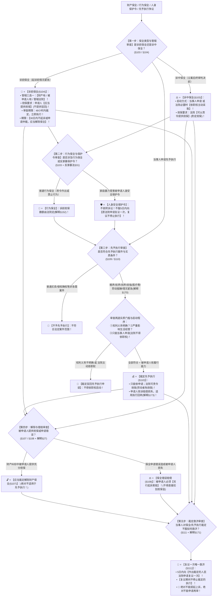

# 📐 保全与先予执行 · 全流程答题模型（财产保全诉前诉中 · 行为保全与保护令 · 先予执行 · 错赔与复议五步定位链 · §103-§111）

> **教练开场白**
> 同学们好！我是你们的民诉法考教练。在民事诉讼法中，“保全与先予执行”是**法考客观题考查频率极高、民诉与实体法交叉、分值巨大的绝对高频考区（T0-12 核心热区，覆盖 15+ 张真题卡）**！
> 很多同学做保全与先予执行题目时经常在以下几个“命题高频易错点”上失分：
> 1. **混淆诉前保全与诉中保全的担保要求**：以为诉前和诉中都必须提供担保（《民事诉讼法》§104 规定：诉前保全申请人**【应当提供担保（必须担保）】**，不提供裁定驳回；而 §103 规定：诉中保全人民法院**【可以责令提供担保（酌定担保）】**！）；
> 2. **诉前保全管辖选错**：以为诉前保全可以去申请人住所地申请（《民事诉讼法》§104 规定：诉前保全由**被保全财产所在地、被申请人住所地或者对案件有管辖权的人民法院**管辖，三选一，**绝对没有“申请人住所地”**！）；
> 3. **把“被申请人担保解除保全”偷换到先予执行上**：以为先予执行中被申请人提供担保也可以解除先予执行（《民事诉讼法》§107 规定：被申请人提供担保应当裁定解除的**仅限于财产保全**！先予执行是给付急救钱款，被申请人提供担保不能解除先予执行！）；
> 4. **把先予执行的主动权搞错**：以为法官看当事人可怜就可以依职权裁定先予执行（《民事诉讼法》§109 铁律：**先予执行【只能依当事人申请，法院绝对不得依职权】**；而诉中保全法院必要时**可以依职权采取**！）；
> 5. **对裁定不服选“上诉”或“再审”**：当事人对保全、先予执行、人身安全保护令裁定不服，以为可以提起上诉（《民事诉讼法》§111 铁律：**一律向作出裁定的人民法院申请复议一次，复议期间不停止裁定的执行！绝对不能上诉、不能申请再审**！）；
> 6. **保全错误赔偿主张直接执行担保金**：保全申请人败诉后，被申请人要求法院直接从保全担保金中划扣赔偿款（《民事诉讼法》§108 ＋ 《民诉解释》§27：**保全错误赔偿必须由被申请人【另行起诉】**，不能在原案中直接扣划！）。
>
> 今天我们用**“五步连贯流水线”**，把保全与先予执行的全部法定规则一次性彻底锁死：**第一步判保全类型与条件（诉前必担保＋三地管辖＋30日内起诉仲裁否则解除 §104；诉中可职权＋可责令担保 §103） → 第二步查行为保全与保护令（责令作出或禁止行为；人身安全保护令5日内向原法院申请复议一次且不停止执行 §103/反家暴法§31） → 第三步判先予执行（三类案件：赡扶抚恤医＋工资＋情况紧急；两道门槛：权利明确＋影响生活生产；只能申请不得职权 §109/§110） → 第四步查解除与错赔（被申请人担保解除保全限财产保全 §107；错赔另行起诉 §108） → 第五步查复议救济（对保全/先予执行裁定不服向原法院申请复议一次，复议期间不停止执行 §111/解释§171）**！

---

## 适用场景与解决问题

本模型专门解决财产保全（诉前保全 vs 诉中保全）、行为保全、人身安全保护令、先予执行案件范围与实质条件、担保提供要求（应当 vs 可以）、诉前保全管辖三选一与手续移送、解除保全事由（被申请人提供担保）、保全错误赔偿诉讼管辖与途径、裁定复议程序（向原法院复议一次且不停止执行）的全部主客观题考点（对应 [[民诉-客观题考点全景-深度报告]] 板块B 第5章 5-3/5-4/5-5 核心考点）：重点破解：

1. **第一步 · 判保全类型与管辖担保（《民事诉讼法》§103-§105 ＋ 《民诉解释》§152/§160 核心考点）**：
   - ⭐ **诉前保全（§104 核心考点）**：
     - 前提条件：利害关系人因**情况紧急**；
     - 📍 **管辖法院三选一**：**【被保全财产所在地、被申请人住所地或者对案件有管辖权的人民法院】**（绝对没有申请人住所地！多选-126）；
     - 🛡️ **担保要求**：申请人**【应当提供担保（必须担保）】**，不提供的裁定驳回申请；
     - ⏱️ **审查时限与起诉期限**：**48 小时内**作出裁定，立即执行；采取保全后 **30 日内**不依法起诉或者申请仲裁的，法院**应当解除保全**；
     - 🔄 **手续移送（解释§160）**：在其他有管辖权法院起诉的，保全法院将保全手续移送受理案件的法院，保全裁定视为受移送法院作出；
   - ⭐ **诉中保全（§103）**：
     - 启动方式：根据当事人申请，必要时法院**【也可以依职权裁定采取】**；
     - 🛡️ **担保要求**：人民法院**【可以责令】**申请人提供担保（酌定担保）；
   - ⭐ **保全范围与方法（§105/§106）**：限于请求的范围或者与本案有关的财物；查封、扣押、冻结；**不得重复查封冻结**。
2. **第二步 · 查行为保全与人身安全保护令（《民事诉讼法》§103 ＋ 《反家庭暴力法》§31/§37）**：
   - ⭐ **行为保全（§103）**：责令被申请人作出一定行为或者禁止其作出一定行为；诉前行为保全担保数额由法院酌定（解释§152）；
   - ⭐ **人身安全保护令（反家暴法独立案件 单选-130 / 单选-131）**：
     - 适用主体：家庭成员及家庭成员以外共同生活的人（反家暴法§37）；
     - 🚨 **救济程序**：当事人对人身安全保护令不服的，自收到裁定之日起 **5 日内向【作出裁定的人民法院申请复议一次】**；**【复议期间不停止裁定的执行】**（不能上诉！）。
3. **第三步 · 判先予执行：案件范围与两道门槛（《民事诉讼法》§109-§110 ＋ 《民诉解释》§169-§170）**：
   - ⭐ **三类案件范围（§109）**：
     - ① 追索**赡养费、扶养费、抚养费、抚恤金、医疗费用**的（多选-132）；
     - ② 追索**劳动报酬**的（单选-133 / 单选-134）；
     - ③ 因**情况紧急**需要先予执行的（解释§170：追索恢复生产经营急需保险理赔款/生活必需款物/紧急防涝防洪款物等）；
   - 🚨 **两道实质门槛（§110 必背）**：
     - 门槛一：当事人之间**权利义务关系明确**；
     - 门槛二：不先予执行将**严重影响申请人的生活或者生产经营**；
     - 辅助要件：**被申请人有履行能力**；
   - 🚫 **启动与担保限制**：
     - **只能根据当事人申请，法院【绝对不得依职权】采取**；
     - 法院可以责令申请人提供担保；🚨 **劳动仲裁中劳动者申请先予执行可以不提供担保（劳动争议调解仲裁法§44 单选-134）**；
   - 🔄 **申请人败诉后果（§110Ⅱ ＋ 解释§173）**：申请人败诉的，应当赔偿被申请人因先予执行遭受的财产损失，应返还财产适用《民事诉讼法》§240 **执行回转**。
4. **第四步 · 查解除保全与保全错误赔偿（《民事诉讼法》§107/§108 ＋ 《民诉解释》§27/§166）**：
   - ⭐ **被申请人提供担保解除保全（§107 核心陷阱）**：
     - 财产纠纷案件中，被申请人提供充分担保的，人民法院**【应当裁定解除财产保全】**；
     - 🚨 **绝对不适用先予执行**：被申请人提供担保不能解除先予执行！
   - ⭐ **保全错误赔偿（§108 ＋ 解释§27 必考套路）**：
     - 申请有错误造成被申请人损失的，申请人应当赔偿；
     - 🚨 **救济途径**：被申请人**必须【另行提起损害赔偿诉讼】**（由采取保全的法院或受理案件的法院管辖 解释§27），**绝对不能在原案中直接申请执行保全担保金（单选-129）**！
5. **第五步 · 查复议救济程序（《民事诉讼法》§111 ＋ 《民诉解释》§171 压轴铁律）**：
   - ⭐ **复议唯一救济路径（§111）**：
     - 当事人对保全或者先予执行的裁定不服的，可以**【申请复议一次】**；
     - 🚨 **两大刚性原则**：
       - ① **【向作出裁定的人民法院申请复议】**（5日内提出，法院10日内审查 解释§171）；
       - ② **【复议期间不停止裁定的执行】**；
     - 🚫 **上诉与再审排除**：对保全、先予执行裁定**不得提起上诉，不得申请再审**！

> **核心一句**：**冻财产先分诉前诉中：诉前必担保、三地可管、30日内起诉否则解除；诉中可责令、法院还能依职权。管行为靠§103，保护令不服回原法院复议一次。救急靠先予执行：赡扶抚恤医＋工资＋十万火急三张门票，权利明确＋不给就活不下去两道门槛，只能申请不能依职权。错了另诉索赔、败诉照价赔偿；一切裁定不服都只有向原法院复议一次、复议不停止执行！**
>
> 🔎 **核心法源（2026最新）**：《民事诉讼法》§103-§111；《民诉解释》§27、§152、§160、§163、§166、§168、§169、§170、§171、§173；《反家庭暴力法》§31、§37；《劳动争议调解仲裁法》§44。

---

## 💡 【前置认知】保全与先予执行核心规则极速对照表

| 制度模块 | 核心法律条文 | 刚性法定规则与标准 | 考场一秒判定秘诀 |
| :--- | :--- | :--- | :--- |
| **① 诉前 vs 诉中保全** | 《民事诉讼法》**§103/§104** | • 诉前 $\rightarrow$ **应当担保（必须）**＋三地管辖＋30日起诉；<br>• 诉中 $\rightarrow$ **可以责令担保（酌定）**＋法院可依职权。 | 诉前没立案必须押担保；诉中立了案法官还能主动保！ |
| **② 诉前保全管辖** | 《民事诉讼法》**§104** | **财产所在地 / 被申请人住所地 / 管辖法院**三选一。 | 绝对**没有申请人住所地**！ |
| **③ 被申请人担保解除** | 《民事诉讼法》**§107** | 被申请人提供担保 $\rightarrow$ **应当解除财产保全**；<br>• **绝对不适用于先予执行**！ | 房子被封拿钱换解封；先予执行救命钱**担保解不了**！ |
| **④ 先予执行启动** | 《民事诉讼法》**§109** | 限于三类案件；**只能依当事人申请，绝对不得依职权**！ | 法官再同情，**当事人不申请也绝对不能先予执行**！ |
| **⑤ 裁定救济路径** | 《民事诉讼法》**§111**<br>《民诉解释》**§171** | 不服保全/先予执行/保护令 $\rightarrow$ **向原法院复议一次，不停止执行**。 | 绝不能上诉再审，**只能找作出裁定的法院复议一次**！ |
| **⑥ 保全错误赔偿** | 《民诉解释》**§27**<br>《民事诉讼法》**§108** | 保全错误致损 $\rightarrow$ **被申请人必须另行起诉索赔**。 | 不能直接划扣担保金，**必须另打一场官司告申请人**！ |

---

## 一、 考点核心骨架与法理（五步连贯决策树）



```
【保全与先予执行全景】一句话开场：冻财产先分诉前诉中：诉前必担保、三地可管、30日内起诉否则解除；诉中可责令、法院还能依职权。管行为靠§103，保护令不服回原法院复议一次。救急靠先予执行：赡扶抚恤医＋工资＋十万火急三张门票，权利明确＋不给就活不下去两道门槛，只能申请不能依职权。错了另诉索赔、败诉照价赔偿；一切裁定不服都只有向原法院复议一次、复议不停止执行！
│
▼ 第一步 · 判保全类型与管辖 ── 诉前必担保与诉中可职权（§103/§104）
├─ 诉前保全（§104）：管辖三选一【财产地 / 被申请人地 / 管辖法院】（无申请人地）
│    ├─ 担保：申请人【应当提供担保】（必须提供，不提供驳回）
│    └─ 期限：【30日内不起诉或申请仲裁应当解除】；起诉后手续移送（解释§160）
└─ 诉中保全（§103）：当事人申请，必要时法院【可以依职权主动采取】；担保【可以责令】（酌定）
     │
     ▼ 第二步 · 查行为保全与保护令 ── 责令行为与反家暴保护令（§103/反家暴法§31）
     ├─ 行为保全：责令作出或禁止作出一定行为（诉前担保数额由法院定 解释§152）
     └─ 人身安全保护令：反家暴法独立救济；不服 5 日内向【原法院申请复议一次，不停止执行】
          │
          ▼ 第三步 · 判先予执行 ── 三类案件与两道门槛（§109/§110）
          ├─ 三类范围：①赡扶抚恤医疗费；②劳动报酬；③情况紧急（解释§170）
          ├─ 两道门槛：权利义务关系明确 ＋ 不先予执行严重影响生活生产经营（被申请人有履行能力）
          ├─ 🚨 铁律：【只能依当事人申请，法院绝对不得依职权】；劳动者申请可免担保（单选-134）
          └─ 败诉后果：申请人败诉赔偿被申请人损失，财产返还走【执行回转】（解释§173）
               │
               ▼ 第四步 · 查解除与错赔 ── 担保解除与另诉索赔（§107/§108/解释§27）
               ├─ 解除保全（§107）：被申请人提供担保【应当解除财产保全】（🚨先予执行不适用！）
               └─ 保全错赔（§108）：申请有错误赔偿损失；被申请人必须【另行起诉】，禁直接执行担保金
                    │
                    ▼ 第五步 · 查复议救济 ── 原法院复议一次不停止（§111/解释§171）
                    ├─ 路径：自收到裁定 5 日内向【作出裁定的人民法院申请复议一次】
                    ├─ 效力：【复议期间不停止裁定的执行】
                    └─ 排除：🚨【绝对不能上诉，绝对不能申请再审】

  ━━━ 五步全通 ━━━
```

---

## 二、 核心考情与 2026 民诉法新规精要

- **频次研判**：保全与先予执行是民诉板块**★★★★★ T0-12 顶级必考高频区**；客观题每年必考 2–3 题，涉及诉前保全三地管辖与必须担保、诉前保全 30 日内起诉仲裁、被申请人担保解除保全（先予执行不适用）、先予执行案件范围与禁止依职权、裁定复议向原法院且不停止执行、保全错误另行起诉索赔。
- **2026 命题核心与法理精要**：
  1. **诉前保全管辖与担保（§104）**：被保全财产所在地、被申请人住所地、管辖法院三选一；申请人必须提供担保。
  2. **诉前保全 30 日内起诉仲裁**：超期未起诉仲裁的，法院应当裁定解除保全。
  3. **先予执行只能依申请（§109）**：法院绝对不得依职权裁定先予执行。
  4. **被申请人担保解除限于保全（§107）**：先予执行不适用被申请人担保解除。
  5. **复议唯一性与不停止执行（§111）**：向作出裁定的法院申请复议一次，复议期间不停止执行，不能上诉再审。
  6. **保全错误赔偿另行起诉（解释§27）**：不能在原案中直接执行担保金，必须另行起诉。

---

## 三、 三大核心法理与命题陷阱拆解

### 1. 保全与先予执行四大命题暗坑与裁判标准表

| 案件事实设定 | 争议焦点 | 裁判结论 | 命题陷阱与法理深剖 |
|---|---|---|---|
| 原告甲公司与被告乙公司买卖合同纠纷。立案后甲向法院申请冻结乙公司银行存款 100 万元。法院裁定保全后，乙公司向法院提供了价值 150 万元的厂房作为反担保，请求法院解除对其银行存款的冻结。 | 乙公司提供充分反担保后，法院是否应当解除对其银行存款的保全措施？ | 🔓 **法院应当裁定解除对银行存款的保全措施！** | 《民事诉讼法》§107：财产纠纷案件，**被申请人提供担保的，人民法院应当裁定解除保全**。反担保能够保障判决执行，法院应当及时解除对被保全财产的限制（单选-332）。 |
| 原告老张起诉儿子小张追索赡养费每月 2000 元。老张年老体弱无经济来源急需医疗费，但老张未提出先予执行申请。承办法官李某认为案情紧急，遂依职权主动裁定小张每月先予给付老张 2000 元。 | 李法官依职权主动裁定先予执行是否合法？ | 🚫 **李法官依职权裁定先予执行违法！先予执行只能依当事人申请启动！** | 《民事诉讼法》§109：人民法院对先予执行的裁定，**必须“根据当事人的申请”作出，法院绝对不得依职权主动采取**。诉中保全法院可以依职权，但先予执行绝不行（单选-333 / 多选-132）。 |
| 乙因遭受同居男友甲的家庭暴力，向法院申请人身安全保护令。法院经审查裁定禁止甲殴打、骚扰乙。甲不服该裁定，遂向上一级法院提起上诉，并主张在上诉审理期间该保护令裁定不生效。 | 甲能否提起上诉？人身安全保护令裁定不服应当如何救济？ | 🚫 **甲无权上诉！甲只能自收到裁定之日起 5 日内向原法院申请复议一次，复议期间不停止执行！** | 《反家庭暴力法》§31 ＋ 《民事诉讼法》§111：当事人对人身安全保护令裁定不服的，**只能向作出裁定的人民法院申请复议一次，复议期间不停止裁定的执行**。该裁定不得提起上诉（单选-130 / 单选-131）。 |
| 甲公司起诉乙公司并申请财产保全冻结乙公司账户 200 万元，甲提供了保全担保函。后法院终审判决驳回甲公司的全部诉讼请求。乙公司因账户冻结造成停工停产损失 30 万元，乙直接向执行局申请从甲公司的担保金中强制划扣 30 万元赔偿款。 | 乙公司能否直接申请执行划扣保全担保金？ | 🚫 **不能直接划扣！乙公司必须另行提起损害赔偿诉讼！** | 《民事诉讼法》§108 ＋ 《民诉解释》§27：保全错误赔偿属于独立的侵权之债，**被申请人必须【另行起诉】请求赔偿损失**，经法院判决生效后方能执行担保财产，不能在原案中直接申请划扣（单选-129）。 |

---

## 四、 万能解题五步

---

### 第一步：判保全类型 —— 诉前还是诉中？三地管辖去对了吗？必须担保吗？（《民事诉讼法》§103/§104）

> **教练提示**：
> 1. 诉前保全：**财产地、被申请人地、管辖法院三选一（无申请人地）**；申请人**【应当提供担保（必须）】**；采取保全后 **30 日内必须起诉或申请仲裁**！
> 2. 诉中保全：当事人申请，法院**必要时【可以依职权】**；担保**【可以责令提供（酌定）】**！

---

### 第二步：查行为保全与保护令 —— 是管行为吗？保护令找谁复议？（《民事诉讼法》§103/反家暴法§31）

> **教练提示**：
> 1. 行为保全：责令作出或禁止行为；
> 2. 人身安全保护令：不依附诉讼；不服 **5 日内向【作出裁定的法院申请复议一次，复议期间不停止执行】（不能上诉！）**！

---

### 第三步：判先予执行 —— 是三类案件吗？权利明确吗？法官依职权了吗？（《民事诉讼法》§109/§110）

> **教练提示**：
> 1. 三类案件：**赡扶抚恤医疗费、劳动报酬、情况紧急**；
> 2. 两道门槛：**权利义务明确 ＋ 严重影响生活生产**；
> 3. 🚨 **只能依当事人申请，法院【绝对不得依职权】**！劳动者申请免担保！

---

### 第四步：查解除与错赔 —— 担保能解保全吗？错赔能直接扣钱吗？（《民事诉讼法》§107/§108）

> **教练提示**：
> 1. 被申请人提供担保 $\rightarrow$ **【应当解除财产保全】（🚨先予执行不适用！）**；
> 2. 保全申请错误致损 $\rightarrow$ **被申请人必须【另行起诉索赔】（绝对不能直接执行担保金）**！

---

### 第五步：查复议救济 —— 能上诉再审吗？向哪个法院复议？（《民事诉讼法》§111）

> **教练提示**：
> 1. 对保全、先予执行、保护令裁定不服 $\rightarrow$ **【一律向作出裁定的人民法院申请复议一次】**；
> 2. **【复议期间不停止裁定的执行】**；
> 3. 🚨 **绝对不能上诉，绝对不能申请再审**！

#### 💰 完整数字案例：保全与先予执行全景攻防实战

> **【案情（[[民诉-保全-多选-125]]、[[民诉-保全-单选-129]] 与 [[民诉-保全-多选-132]] 综合演练）】**
> 甲公司（住所地 A 市）与乙公司（住所地 B 市）在 C 市签订购销合同，货物存放于 D 市。
> 1. **第一幕（诉前财产保全与管辖）**：纠纷发生后，甲公司发现乙公司正准备转移存放在 D 市价值 **200 万元**的钢材。起诉前情况紧急，甲公司拟向法院申请诉前财产保全。
> 2. **第二幕（诉中先予执行与依职权判定）**：甲公司随后向 B 市法院起诉。运输途中司机张某因交通事故重伤住院急需手术费 **10 万元**，张某以道路交通事故人身损害赔偿为由起诉乙公司。张某生活极度困难且责任认定书载明乙公司全责，张某向法院申请先予执行 10 万元医疗费。乙公司提供担保请求解除先予执行。
> 3. **第三幕（保全错误与复议救济）**：甲公司起诉乙公司的买卖纠纷经法院终审审理，认定甲公司违约并判决驳回甲公司的全部诉讼请求。乙公司因钢材被保全查封产生仓储及贬值损失 **20 万元**。乙公司向法院申请直接从甲公司提供的诉前保全担保函财产中划扣 20 万元。乙公司同时对驳回其保全异议裁定提出上诉。
>
> - **裁判涵摄**：
>   1. **第一幕裁判**：依据《民事诉讼法》§104，甲公司可向**B 市（被申请人住所地）、D 市（被保全财产所在地）或者 C 市/B 市（合同管辖法院）申请诉前保全**，甲公司**【应当提供相当于 200 万元的担保】**；且须在采取保全后 **30 日内起诉或申请仲裁**，否则法院应当解除保全（多选-125）；
>   2. **第二幕裁判**：
>      - 依据《民事诉讼法》§109 及 §110，张某追索医疗费属于法定先予执行范围，权利义务明确且急需救命，法院**裁定先予执行 10 万元医疗费合法**；
>      - 依据 §107，被申请人提供担保解除保全**仅适用于财产保全，不适用于先予执行**，乙公司提供担保不能解除先予执行（多选-132）；
>   3. **第三幕裁判**：
>      - 依据《民事诉讼法》§108 及《民诉解释》§27，乙公司主张保全错误赔偿 20 万元，**必须【另行提起损害赔偿诉讼】，法院不得在原案中直接划扣担保财产（单选-129）**；
>      - 依据《民事诉讼法》§111，对保全裁定不服**只能向原法院申请复议一次，复议期间不停止执行，乙公司提出上诉违法（单选-130）**！

#### 一句话闭环记忆
> 🎯 **一眼判**：**冻财产先分诉前诉中：诉前必担保、三地可管、30日内起诉否则解除；诉中可责令、法院还能依职权。管行为靠§103，保护令不服回原法院复议一次。救急靠先予执行：赡扶抚恤医＋工资＋十万火急三张门票，权利明确＋不给就活不下去两道门槛，只能申请不能依职权。错了另诉索赔、败诉照价赔偿；一切裁定不服都只有向原法院复议一次、复议不停止执行！**

---

## 五、 案例演练

### 1. 诉前保全管辖与担保要求（[[民诉-保全-多选-125]] 经典真题）
- **案情**：起诉前申请财产保全，审查管辖法院、担保要求及起诉期限。
- **模型分析**：第一步——依据《民事诉讼法》§104，向财产地、被申请人地、管辖法院申请，应当提供担保，30日内起诉或申请仲裁（选 ACD）。

### 2. 人身安全保护令的复议救济（[[民诉-保全-单选-130]] 经典真题）
- **案情**：同居暴力受害人申请保护令，被申请人不服保护令裁定提出救济。
- **模型分析**：第二步与第五步——依据《反家庭暴力法》§31与§37，不服保护令裁定，5日内向作出裁定的人民法院申请复议一次，复议期间不停止执行（选 C）。

### 3. 保全错误赔偿的诉讼途径（[[民诉-保全-单选-129]] 经典真题）
- **案情**：保全申请人终审败诉，被申请人索赔保全造成的损失。
- **模型分析**：第四步——依据《民诉解释》§27，保全错误赔偿必须另行起诉，不能在原案中直接执行担保财产（选 D）。

---

## 关联真题

- [[民诉-保全-多选-125 · 诉前保全的担保保全方法与手续移送]]
- [[民诉-保全-单选-129 · 保全错误致损的救济方式]]
- [[民诉-保全-单选-130 · 人身安全保护令的复议救济（共同生活的人）]]
- [[民诉-保全-单选-131 · 人身安全保护令的复议救济（夫妻家暴）]]
- [[民诉-保全-多选-132 · 交通事故受害人的先予执行与财产保全]]
- [[民诉-保全-单选-134 · 劳动仲裁先予执行劳动者免担保]]
- [[民诉-保全-单选-332 · 财产保全规则四项辨析]]
- [[民诉-保全-单选-333 · 先予执行规则错误项辨析]]

## 相关页面

- 概念实体页：[[保全]] · [[财产保全]] · [[行为保全]] · [[诉前保全]] · [[诉中保全]] · [[先予执行]] · [[人身安全保护令]] · [[保全错误赔偿]]
- 姊妹模型：[[民诉-保全-期间送达与强制措施模型]]
- 综合报告：[[民诉-客观题考点全景-深度报告]]（板块B 第5章 5-3/5-4/5-5 · ★★★★★ T0-12 顶级必考区）
