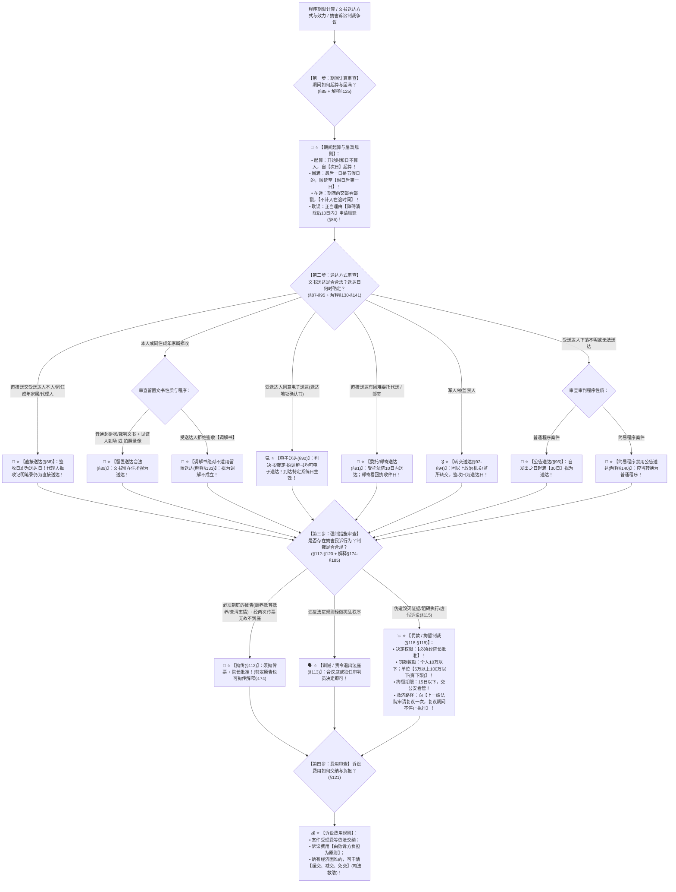

# 📐 期间、送达与强制措施 · 全流程答题模型（期间计算 · 七种送达 · 妨害诉讼强制措施 · 诉讼费用四步定位链 · §85-§95/§112-§121）

> **教练开场白**
> 同学们好！我是你们的民诉法考教练。在民事诉讼法的程序保障体系中，“期间、送达与强制措施”是**客观题命题人考查程序细节、数字节点、新旧法修法点与司法制裁的常考母题（T1-5 / T1-15 核心热点，覆盖 10+ 张真题卡）**！
> 很多同学在做这部分题目时经常在以下几大“经典暗坑”上踩雷：
> 1. **节假日顺延落点搞错**：把“顺延至假日后第一日”当成了“节假日次日”（连续放假 3 天时，只有放完假后的上班第 1 天才是届满日，中间的假日照常计算！）；
> 2. **把代理人拒收当成留置送达**：法院直接送交诉讼代理人，代理人当面拒收注明并记入笔录（定性仍是**直接送达**！留置送达的拒收对象仅限受送达人本人或其同住成年家属！）；
> 3. **不知道调解书绝不适用留置送达**：《民诉解释》§133 铁律：**调解书必须直接送交当事人本人签收，绝对不适用留置送达**；当事人拒绝签收调解书的，调解不成立！
> 4. **电子送达适用范围停留在旧法**：以为判决书、调解书不能电子送达（《民事诉讼法》2021修正与2023现行法 §90 明确：**经受送达人同意，判决书、裁定书、调解书均可以电子送达**！受送达人提出需要纸质的应当提供！）；
> 5. **公告送达期限记错成旧法 60 日**：《民事诉讼法》§95 明文：自发出公告之日起，**经过三十日（30日）即视为送达**！且《民诉解释》§140 规定：**简易程序绝对不适用公告送达**！
> 6. **罚款拘留决定权限与复议搞混**：以为罚款拘留法官当庭就能定（**拘传、罚款、拘留必须经院长批准**！训诫、责令退出法庭才由合议庭或独任审判员决定）；不服罚款拘留向**上一级人民法院申请复议一次，复议期间不停止执行**！
>
> 今天我们用**“四步连贯流水线”**，把期间、送达与强制措施的全部法定规则一次性彻底锁死：**第一步算日子（期间：始日不算入、末日休假顺延假日后第一日、交邮看邮戳、障碍消除后10日内申顺延 §85/§86） → 第二步送文书（七种送达：直接为先、拒收留置见证或录像、电子须同意且裁判调解均可送、公告30日兜底且简易禁用 §87-§95） → 第三步治捣乱（强制措施：拘传两传票且特定原告也可；合议定训诫退庭；院长批拘传罚拘；个人10万下单位5万至100万；拘留15日下；上一级复议一次不停止执行 §112-§120） → 第四步谁掏钱（诉讼费：败诉方负担；司法救助缓减免 §121）**！

---

## 适用场景与解决问题

本模型专门解决期间性质与计算（法定/指定期间、始日不算、节假日顺延、在途交邮、耽误顺延申请）、七大送达方式认定与生效时点判定（直接送达/留置送达/电子送达/委托送达/邮寄送达/转交送达/公告送达）、妨害民事诉讼强制措施种类与适用条件（拘传/训诫/责令退出法庭/罚款/拘留/虚假诉讼制裁）、决定权限（合议庭独任 vs 院长批准）及救济程序（上一级复议一次不停止执行）、诉讼费用负担与缓减免的全部主客观题考点（对应 [[民诉-客观题考点全景-深度报告]] 板块B 第5章 5-1/5-2/5-6/5-7 核心考点）：重点破解：

1. **第一步 · 算日子：期间计算与顺延规则（《民事诉讼法》§85-§86 ＋ 《民诉解释》§125）**：
   - ⭐ **起算规则**：期间以时、日、月、年计算；**开始的时和日不计算在期间内**，自**次时、次日**起算；
   - ⭐ **届满规则**：期间届满的**最后一日是法定休假日的，以假日后的第一日为期间届满的日期**（期间中间包含的休假日正常计算，不予扣除）；
   - ⭐ **在途时间保护**：期间**不包括在途时间**；诉讼文书在期满前交邮的，**以邮戳日期为准，不算过期**；
   - 🔄 **耽误顺延申请（§86）**：因不可抗拒的事由或者其他正当理由耽误期限的，在**障碍消除后的十日内**可以申请顺延期限，是否准许由人民法院决定。
2. **第二步 · 送文书：七种法定送达方式与生效判定（《民事诉讼法》§87-§95 ＋ 《民诉解释》§130-§141）**：
   - ⭐ **① 直接送达（§88，首选方式）**：送交本人 $\rightarrow$ 本人不在送同住成年家属 $\rightarrow$ 法人送法定代表人/主要负责人/负责收件人 $\rightarrow$ 可送交委托代理人/指定代收人；
   - ⭐ **② 留置送达（§89）**：受送达人或其同住成年家属拒收的，两条合规路径：
     - 路径 A：邀请基层组织或单位代表到场见证 ＋ 记明拒收事由和日期 ＋ 留在住所；
     - 路径 B：把文书留在住所 ＋ **采用拍照、录像等方式记录送达过程**（即视为送达）；
     - 🚨 **调解书不适用留置送达（解释§133 必考铁律）**：调解书必须直接送交本人签收，拒绝签收调解书视为调解不成立；
   - ⭐ **③ 电子送达（§90 2021新规必考做题眼）**：
     - **经受送达人同意**（在送达地址确认书中确认 解释§136）；
     - 🚨 **判决书、裁定书、调解书均可以电子送达**！受送达人提出需要纸质文书的，法院**应当提供**；
     - 送达生效时点：以**送达信息到达受送达人特定系统的日期**为送达日期；
   - ⭐ **④ 委托送达 ＋ ⑤ 邮寄送达（§91）**：受托法院在收到委托函后 **10 日内**代为送达（解释§134）；邮寄送达以**回执上注明的收件日期**为送达日期；
   - ⭐ **⑥ 转交送达（§92-§94）**：军人经**团以上单位政治机关**转交；被监禁/被采取强制性教育措施的经监所/机构转交；
   - ⭐ **⑦ 公告送达（§95 兜底最后手段）**：
     - 适用条件：受送达人**下落不明**，或者用其他方式**无法送达**；
     - 🚨 **送达期限**：自发出公告之日起，**经过三十日（30日）即视为送达**（已由60日修改为30日！）；
     - 🚫 **程序限制**：**简易程序案件绝对不适用公告送达**（解释§140 单选-175）。
3. **第三步 · 治捣乱：妨害民事诉讼强制措施与司法制裁（《民事诉讼法》§112-§120）**：
   - ⭐ **① 拘传（§112 ＋ 解释§174）**：
     - 适用对象：**必须到庭的被告**（负有赡养、抚育、扶养义务和不到庭无法查清案情的被告）＋ **经两次传票传唤** ＋ 无正当理由拒不到庭；
     - 🚨 **原告拘传例外**：对**必须到庭才能查清案件基本事实的原告**，同样可以适用拘传（解释§174Ⅱ）；
   - ⭐ **② 训诫与责令退出法庭（§113 ＋ 解释§177）**：违反法庭规则，由**合议庭或独任审判员决定**；
   - ⭐ **③ 罚款与拘留（§113-§118）**：
     - 适用情形：伪造毁灭证据、妨碍作证、隐藏转移变卖查封财产、侮辱殴打司法人员、暴力阻碍执行、拒不履行生效裁判、**虚假诉讼（恶意串通/单方捏造事实 驳回请求＋罚款拘留追刑责 §115）**；
     - 🚨 **罚款数额刚性标准（§118）**：
       - **个人：人民币 10 万元以下**；
       - **单位：人民币 5 万元以上 100 万元以下（单位有 5 万元法定下限！）**；
     - 🚨 **拘留期限**：**15 日以下**，由法院交公安机关看管，认错悔改可提前解除；
   - ⭐ **④ 批准权限与复议救济（§119 ＋ 解释§185 必考套路）**：
     - **决定权限**：**拘传、罚款、拘留必须经院长批准**！
     - 🚨 **救济程序**：当事人不服罚款、拘留决定的，向**【上一级人民法院申请复议一次】**；**【复议期间不停止执行】**（收到决定书 3 日内提出，上级法院 5 日内决定）；
     - 对同一行为**不得连续适用罚款、拘留**（解释§184）。
4. **第四步 · 谁掏钱：诉讼费用交纳与司法救助（《民事诉讼法》§121）**：
   - ⭐ **交纳与负担原则**：当事人交纳案件受理费，财产案件交纳申请费等；**诉讼费用由败诉方负担为原则**，胜诉方自愿承担除外；
   - ⭐ **司法救助制度**：当事人交纳确有困难的，可以申请**缓交、减交或者免交**诉讼费用。

> **核心一句**：**算日子：始日不算入、假日后第一日、交邮看邮戳、耽误十日申顺延；送文书：直接为先、拒收留置（本人家属才留置、调解书不留置）、电子须同意（裁判调解均可送）、公告三十日兜底（简易程序禁用）；治捣乱：拘传两传票（特定原告也可拘）、训诫退庭合议定、罚拘院长批、复议一次不停止，个人十万单位五到百万、拘留十五日；谁掏钱：受理费照交、败诉方买单、困难缓减免！**
>
> 🔎 **核心法源（2026最新）**：《民事诉讼法》§85-§95、§112-§121；《民诉解释》§125、§130-§141、§174-§187。

---

## 💡 【前置认知】期间送达与强制措施核心规则极速对照表

| 制度模块 | 核心法律条文 | 刚性法定规则与标准 | 考场一秒判定秘诀 |
| :--- | :--- | :--- | :--- |
| **① 节假日顺延** | 《民事诉讼法》**§85**<br>《民诉解释》**§125** | 届满最后一日为节假日的，**顺延至假日后第一日**。 | 中间休假不管，**最后一天放假就顺延到上班第 1 天**！ |
| **② 留置送达** | 《民事诉讼法》**§89**<br>《民诉解释》**§133** | 本人/同住成年家属拒收可拍照录像留置；<br>• **调解书绝对不适用留置送达**。 | 代理人拒收不算留置；**调解书拒签视为调解不成立**！ |
| **③ 电子送达** | 《民事诉讼法》**§90** | • **须经受送达人同意**；<br>• **判决书/裁定书/调解书均可电子送达**。 | 只要当事人同意，**所有裁判和调解书都能电子送**！ |
| **④ 公告送达** | 《民事诉讼法》**§95**<br>《民诉解释》**§140** | • **发出之日起满 30 日视为送达**；<br>• **简易程序绝对不适用公告送达**。 | 公告期是 **30 天**（不是60天）；**小案子绝不能公告**！ |
| **⑤ 强制措施权限** | 《民事诉讼法》**§118/§119** | • 训诫/退庭 $\rightarrow$ **合议庭/独任决定**；<br>• 拘传/罚款/拘留 $\rightarrow$ **院长批准**；<br>• **向上一级法院复议一次，不停止执行**。 | 抓人罚款关人**必须院长签字**；不服找**上一级法院复议**！ |
| **⑥ 罚款数额** | 《民事诉讼法》**§118** | • 个人 $\rightarrow$ **10 万元以下**；<br>• 单位 $\rightarrow$ **5 万元以上 100 万元以下（有下限）**。 | 罚个人最多 10 万；**罚公司起步 5 万、封顶 100 万**！ |

---

## 一、 考点核心骨架与法理（四步连贯决策树）



```
【期间送达与强制措施全景】一句话开场：算日子：始日不算入、假日后第一日、交邮看邮戳、耽误十日申顺延；送文书：直接为先、拒收留置（本人家属才留置、调解书不留置）、电子须同意（裁判调解均可送）、公告三十日兜底（简易程序禁用）；治捣乱：拘传两传票（特定原告也可拘）、训诫退庭合议定、罚拘院长批、复议一次不停止，个人十万单位五到百万、拘留十五日；谁掏钱：受理费照交、败诉方买单、困难缓减免！
│
▼ 第一步 · 算日子 ── 期间计算与顺延（§85/§86/解释§125）
├─ 起算：开始时和日不算入，自【次时/次日】起算
├─ 届满：最后一日是节假日的，顺延至【假日后第一日】（中间假期照常算）
├─ 在途：期满前交邮【看邮戳】，不计入在途时间
└─ 耽误顺延：不可抗力正当理由，【障碍消除后 10 日内】申请顺延
     │
     ▼ 第二步 · 送文书 ── 七种送达与生效时点（§87-§95/解释§130-§141）
     ├─ 直接送达（§88）：首选方式，送本人/同住成年家属/法人收件人/代理人
     ├─ 留置送达（§89）：拒收见证留置或拍照录像留置；🚨【调解书绝对不适用留置送达】（解释§133）
     ├─ 电子送达（§90）：须受送达人同意；【判决/裁定/调解书均可电子送】；到达系统日生效
     ├─ 委托/邮寄（§91）：受托法院 10 日内代送；邮寄看回执收件日
     ├─ 转交送达（§92-§94）：军人团以上政治机关/监所转交，签收日生效
     └─ 公告送达（§95）：下落不明或无法送达；【发出满 30 日视为送达】；🚨【简易程序禁用】（解释§140）
          │
          ▼ 第三步 · 治捣乱 ── 强制措施数额权限与救济（§112-§120/解释§174-§185）
          ├─ 拘传（§112）：必须到庭被告 ＋ 两次传票传唤；查明案情【原告也可拘传】（解释§174）
          ├─ 训诫/责令退出法庭（§113）：合议庭或独任审判员决定
          ├─ 罚款/拘留（§118/§119）：【必须经院长批准】
          │    ├─ 罚款：个人 10 万以下；单位【5 万以上 100 万以下】（有下限）
          │    ├─ 拘留：15 日以下，交公安看管，认错可提前解除
          │    ├─ 虚假诉讼（§115）：驳回诉讼请求 ＋ 罚款拘留 ＋ 追究刑责
          │    └─ 救济：向【上一级法院申请复议一次】，【复议期间不停止执行】！
          │
          ▼ 第四步 · 谁掏钱 ── 诉讼费用交纳与救助（§121）
          ├─ 交纳与负担：案件受理费由【败诉方负担为原则】
          └─ 司法救助：交纳确有困难的可申请【缓交、减交、免交】

  ━━━ 四步全通 ━━━
```

---

## 二、 核心考情与 2026 民诉法新规精要

- **频次研判**：期间送达与强制措施是民诉板块**★★★ T1-5/T1-15 细节高频考点**；客观题每年必考 2 题，涉及上诉期间节假日顺延计算、电子送达适用裁判调解文书、调解书禁止留置送达、公告送达 30 日及简易程序禁用、妨害诉讼罚款数额（单位有下限）与院长批准复议不停止执行。
- **2026 命题核心与法理精要**：
  1. **电子送达全覆盖（§90）**：经同意，判决书、裁定书、调解书均可电子送达。
  2. **公告送达 30 日与简易程序禁用（§95/解释§140）**：发出之日起经过 30 日视为送达，简易程序绝对不适用公告送达。
  3. **调解书禁止留置送达（解释§133）**：当事人拒绝签收调解书视为调解不成立。
  4. **罚款数额与决定权限（§118/§119）**：个人 10 万元以下，单位 5 万元以上 100 万元以下；拘传罚款拘留须院长批准。
  5. **复议向上一级且不停止执行（§119）**：不服罚款拘留向上一级法院申请复议一次，复议期间不停止执行。

---

## 三、 三大核心法理与命题陷阱拆解

### 1. 期间送达与强制措施四大命题暗坑与裁判标准表

| 案件事实设定 | 争议焦点 | 裁判结论 | 命题陷阱与法理深剖 |
|---|---|---|---|
| 原告甲与被告乙离婚纠纷，法院主持达成调解协议并制作调解书。法官前往乙住所送达调解书，乙反悔拒绝在送达回证上签字。法官遂邀请社区干部到场见证将调解书留置在乙住所。 | 法官留置送达调解书是否合法？调解协议是否生效？ | 🚫 **法官留置送达违法！调解书未生效，调解不成立！** | 《民诉解释》§133：**调解书应当直接送达当事人本人，不适用留置送达**。当事人拒绝签收调解书的，调解不成立，人民法院应当及时判决（单选-137）。 |
| 原告甲起诉被告乙买卖合同纠纷。乙在送达地址确认书中签署同意电子送达。一审判决后，法院通过短信链接及电子邮件向乙送达了一审民事判决书。乙以“判决书不能电子送达”为由主张送达无效。 | 判决书能否通过电子方式送达？该送达是否合法有效？ | 💻 **送达合法有效！判决书可以适用电子送达！** | 《民事诉讼法》§90：经受送达人同意，**判决书、裁定书、调解书均可以采用电子方式送达**（2021新规）。受送达人提出需要纸质判决书的法院应当提供，但不影响电子送达效力（单选-138）。 |
| 甲起诉乙民间借贷纠纷，基层法院适用简易程序审理。立案后法院发现乙下落不明，承办法官遂在法院公告栏张贴公告送达起诉状及开庭传票，并定于公告 30 日后开庭。 | 简易程序中能否对下落不明的被告适用公告送达？ | 🚫 **不能适用公告送达！应当转换为普通程序！** | 《民诉解释》§140：**适用简易程序的案件，不适用公告送达**。发现被告下落不明需要公告送达的，应当裁定将简易程序转换为普通程序审理（单选-175）。 |
| 乙公司在民事诉讼中伪造重要证据妨碍审理。独任审判员李法官当庭对乙公司作出罚款 3 万元的决定。乙公司不服，向该基层法院申请复议，并主张复议期间暂停缴纳罚款。 | 李法官作出的罚款决定在程序与数额上是否合法？乙公司的复议主张是否成立？ | 🚫 **罚款决定在权限与数额上均违法！复议应当向上一级法院提出且不停止执行！** | ① 依据《民事诉讼法》§118，对单位罚款为**5 万元以上 100 万元以下**，罚款 3 万元低于法定下限；② 依据 §119，罚款**必须经院长批准**，法官不能当庭擅自决定；③ 不服罚款决定的，应当向**上一级人民法院申请复议一次，复议期间不停止执行**（单选-136 / 多选-298）。 |

---

## 四、 万能解题四步

---

### 第一步：算日子 —— 次日起算了吗？节假日顺延到假日后第一天了吗？（《民事诉讼法》§85/§86）

> **教练提示**：
> 1. 始日不算入，**自次日起算**；
> 2. 最后一日遇节假日，**顺延至假日后第一日（中间假期不顺延）**；
> 3. 交邮看邮戳，在途不扣除；**耽误在障碍消除后 10 日内申顺延**！

---

### 第二步：送文书 —— 留置调解书了吗？电子同意了吗？公告满30天了吗？（《民事诉讼法》§87-§95）

> **教练提示**：
> 1. 直接送达可送同住成年家属、代理人（**代理人拒收不算留置送达**）；
> 2. 留置送达拒收可拍照录像；🚨 **调解书绝对不适用留置送达（解释§133）**；
> 3. 电子送达须经同意，**裁判文书调解书均可电子送达（§90）**；
> 4. 公告送达：**满 30 日视为送达；简易程序绝对禁用公告送达（解释§140）**！

---

### 第三步：治捣乱 —— 谁决定的？院长批了吗？数额越界了吗？（《民事诉讼法》§112-§120）

> **教练提示**：
> 1. 拘传：必须到庭被告 ＋ 两次传票；**特定原告也可拘传（解释§174）**；
> 2. 训诫、责令退庭 $\rightarrow$ **合议庭/独任审判员决定**；
> 3. 拘传、罚款、拘留 $\rightarrow$ **必须院长批准**；
> 4. 罚款：**个人 10 万以下，单位 5 万至 100 万（有下限！）**；拘留 **15 日以下**；
> 5. 救济：**向上一级法院申请复议一次，复议期间不停止执行**！

---

### 第四步：谁掏钱 —— 诉讼费谁负担？困难能缓减免吗？（《民事诉讼法》§121）

> **教练提示**：
> 1. 诉讼费用以**败诉方负担为原则**；
> 2. 确有经济困难可申请**缓交、减交、免交（司法救助）**！

#### 💰 完整数字案例：期间送达与强制措施全景攻防实战

> **【案情（[[民诉-送达-单选-137]]、[[民诉-送达-单选-138]] 与 [[民诉-执行-单选-136]] 综合演练）】**
> 原告甲公司起诉被告乙公司买卖合同纠纷，要求支付货款 **100 万元**。
> 1. **第一幕（电子送达与上诉期间计算）**：乙公司在《送达地址确认书》中确认同意电子送达。2026 年 4 月 10 日（周五），一审法院将民事判决书通过专属系统电子送达给乙公司。乙公司法定代表人于 4 月 11 日收到。判决上诉期 15 日，第 15 日为 4 月 25 日（周六），4 月 26 日（周日）休息，4 月 27 日（周一）正常上班。
> 2. **第二幕（调解书留置送达与公告限制）**：二审审理中双方达成调解协议。法官制作调解书前往乙公司住所送达，乙公司负责人反悔拒签。法官遂邀请物业人员见证将调解书留置于前台。
> 3. **第三幕（妨害诉讼制裁与救济）**：乙公司在执行阶段恶意串通第三人转移已被法院冻结的银行存款 50 万元。执行法官李某当场对乙公司作出罚款 **3 万元**的决定，并对主要负责人张某决定拘留 **20 日**。
>
> - **裁判涵摄**：
>   1. **第一幕裁判**：
>      - 依据《民事诉讼法》§90，判决书可以电子送达，送达日期为 4 月 10 日（到达系统之日）；
>      - 依据《民事诉讼法》§85，15 日上诉期自次日（4 月 11 日）起算，算至 4 月 25 日届满；因 4 月 25 日及 26 日为法定双休日，**上诉期届满日顺延至法定休假日后第一日即 4 月 27 日（周一）**；
>   2. **第二幕裁判**：依据《民诉解释》§133，**调解书绝对不适用留置送达**，法官留置送达违法，乙公司拒签视为调解不成立，二审法院应当依法判决（单选-137）；
>   3. **第三幕裁判**：
>      - 依据《民事诉讼法》§118 及 §119，对乙公司罚款 3 万元**低于法定 5 万元下限**，对张某拘留 20 日**超过 15 日法定上限**，且均**必须经院长批准**，执行员李某当场擅自决定违法；
>      - 依据 §119，乙公司不服强制措施的，应当向**上一级人民法院申请复议一次，复议期间不停止执行（单选-136）**！

#### 一句话闭环记忆
> 🎯 **一眼判**：**算日子：始日不算入、假日后第一日、交邮看邮戳、耽误十日申顺延；送文书：直接为先、拒收留置（本人家属才留置、调解书不留置）、电子须同意（裁判调解均可送）、公告三十日兜底（简易程序禁用）；治捣乱：拘传两传票（特定原告也可拘）、训诫退庭合议定、罚拘院长批、复议一次不停止，个人十万单位五到百万、拘留十五日；谁掏钱：受理费照交、败诉方买单、困难缓减免！**

---

## 五、 案例演练

### 1. 调解书不适用留置送达（[[民诉-送达-单选-137]] 经典真题）
- **案情**：当事人拒绝签收调解书，法官见证留置送达。
- **模型分析**：第二步——依据《民诉解释》§133，调解书不适用留置送达，拒收视为调解不成立（选 C）。

### 2. 电子送达适用范围（[[民诉-送达-单选-138]] 经典真题）
- **案情**：审查判决书、裁定书、调解书能否通过电子方式送达。
- **模型分析**：第二步——依据《民事诉讼法》§90，经同意，判决书、裁定书、调解书均可电子送达（选 D）。

### 3. 妨害诉讼罚款数额与决定权限（[[民诉-执行-单选-136]] 经典真题）
- **案情**：审查对单位罚款数额下限及罚款拘留的批准权限。
- **模型分析**：第三步——依据《民事诉讼法》§118与§119，单位罚款为5万至100万元，拘留15日以下，必须经院长批准，向上一级法院复议一次不停止执行（选 B）。

---

## 关联真题

- [[民诉-送达-单选-137 · 留置送达与受送达人拒签]]
- [[民诉-送达-单选-138 · 电子送达适用范围与生效时间]]
- [[民诉-简易程序-单选-175 · 简易程序不得适用公告送达]]
- [[民诉-执行-单选-136 · 妨害执行强制措施与数额权限]]
- [[民诉-执行-多选-298 · 妨害诉讼强制措施的决定与复议]]

## 相关页面

- 概念实体页：[[期间]] · [[送达]] · [[留置送达]] · [[电子送达]] · [[公告送达]] · [[妨害民事诉讼强制措施]] · [[拘传]] · [[虚假诉讼制裁]]
- 姊妹模型：[[民诉-保全-保全与先予执行模型]]
- 综合报告：[[民诉-客观题考点全景-深度报告]]（板块B 第5章 5-1/5-2/5-6/5-7 · ★★★ 程序保障高频区）
