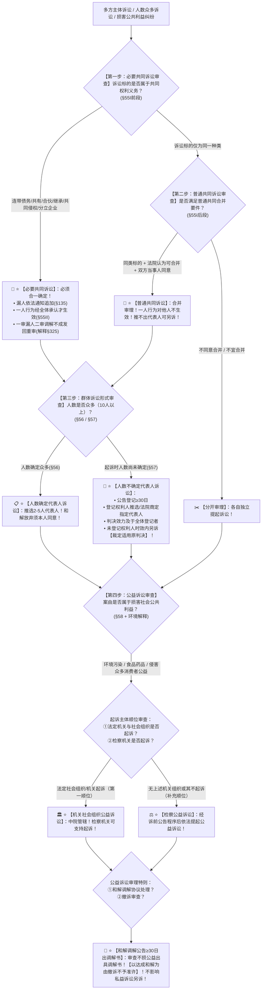

# 📐 共同诉讼与群体诉讼 · 全流程答题模型（必要共同必合 · 普通共同可分 · 代表人诉讼 · 公益诉讼四步定位链 · §55-§58）

> **教练开场白**
> 同学们好！我是你们的民诉法考教练。在民事诉讼中，当当事人一方或双方变成“一群人”时，就进入了**共同诉讼与群体诉讼（T0-6 顶级必考 ＋ T1-16 高频考点，覆盖 34+ 张真题卡）的黄金命题区**！
> 很多同学做共同诉讼和公益诉讼题目时经常在以下关键概念上“翻车”：
> 1. **把实体担责的人列为“无独立请求权第三人”**：看到连带侵权人、监护人、补充责任人，选项写“列为无独三”（大错特错！凡是实体法上要承担民事责任的主体，**一律列为共同被告/共同诉讼人**，绝对不是无独三！）；
> 2. **把必要共同诉讼遗漏当事人推去“另行起诉”**：一审漏了合伙人或共有人，以为让他们另行起诉就行（《民事诉讼法》§135 规定：**必须共同诉讼的当事人遗漏的，法院必须通知其参加追加为当事人**；一审漏人二审调解不成直接发回重审！）；
> 3. **以为代表人可以擅自代表所有人调解和解**：以为选出了代表人，代表人签了调解协议就对全体被代表人发生效力（《民事诉讼法》§56/§57 铁律：**变更、放弃诉请、和解必须经被代表当事人本人同意**，不同意的当事人不受拘束！）；
> 4. **让代表人诉讼未登记权利人去提“第三人撤销之诉”**：以为没登记的权利人事后只能提三撤（《民事诉讼法》§57Ⅲ 与《民诉解释》§80 设置了专门救济通道：**在诉讼时效内另行起诉，请求成立的裁定直接适用原判决**，排斥第三人撤销之诉！）；
> 5. **检察机关在公益诉讼中“抢跑”**：以为检察院随时可以直接起诉民事公益诉讼（《民事诉讼法》§58Ⅱ 规定：**检察机关处于补充顺位**，只有在没有法定机关组织或其明确不起诉时才能提起！）；
> 6. **公益诉讼和解后“裁定准予撤诉”**：以为双方私下和解了就可以撤诉（《环境公益诉讼解释》§25 严禁：**以达成和解协议为由申请撤诉的不予准许**，必须公告≥30日审查不违公益后出具调解书！）。
>
> 《民事诉讼法》（2023修正）与相关司法解释，构建了**以“标的共同必须绑、同类同意方可合、十人以上推代表、公共利益机关先检察补”为核心的群体诉讼裁判闭环**。
> 今天我们用**“四步连贯流水线”**，把共同诉讼与群体诉讼的全部法定规则一次性彻底锁死：**第一步判必要共同诉讼（诉讼标的共同；必须合一确定；漏人依职权通知追加；二审调解不成发回重审 §55Ⅰ/解释§73/§325） → 第二步判普通共同诉讼（标的同一种类；法院可并＋当事人同意；可分可合各管各的 §55Ⅰ） → 第三步判代表人诉讼（十人以上；人数确定推选 vs 人数不确定公告登记≥30日；和解放弃须本人同意；未登记另诉裁定适用原判 §56/§57） → 第四步判公益诉讼（损害社会公共利益；机关组织第一顺位 vs 检察补充顺位；中院管辖；和解协议公告≥30日出调解书禁撤诉 §58/解释§282-§289）**！

---

## 适用场景与解决问题

本模型专门解决必要共同诉讼典型类型识别与遗漏当事人追加、普通共同诉讼合并要件与独立行为效力、人数确定与不确定代表人诉讼推选/登记/权限/判决效力扩张、民事环境与消费公益诉讼适格原告/检察补充顺位/管辖/和解公告/公益与私益诉讼并行关系的全部主客观题考点（对应 [[民诉-客观题考点全景-深度报告]] 板块A 第3章 3-4/3-5/3-6/3-7 核心考点）：重点破解：

1. **第一步 · 判必要共同诉讼（《民事诉讼法》§55Ⅰ前段 ＋ 《民诉解释》§73/§325）**：
   - ⭐ **诉讼标的共同典型类型清单**：
     - 连带债务人/连带保证人、共有财产纠纷、合伙纠纷、共同继承人、共同侵权人（单选-73）、分立后企业（单选-71）、监护人与被监护人（单选-58）、劳务派遣用工单位与派遣单位（单选-60）；
   - ⭐ **遗漏当事人追加规则（《民诉解释》§73/§74）**：
     - 法院**应当通知其参加诉讼**（依职权或依申请）；
     - 🚨 **应追加原告的处理**：明确放弃实体权利的**可不追加**；既不参加又不放弃权利的**仍追加为共同原告，其不参加不影响案件审理与判决**；
 - 必要共同诉讼 VS 普通共同诉讼：
	 - 必要共同诉讼: **诉讼标的同一个，强制合并，不能分开起诉**。
	- 普通共同诉讼：诉讼标的属于**同一种类**，是好几个独立案子，法院可以选择合并，也可以分开审理。
   - 🔄 **二审遗漏处理（解释§325）**：一审遗漏必须参加诉讼的当事人，二审进行自愿调解；**调解不成的，裁定撤销原判，发回重审**；
   - ⭐ **诉讼行为效力（§55Ⅱ）**：一人的诉讼行为，**经其他共同诉讼人承认，对全体发生效力**。
2. **第二步 · 判普通共同诉讼（《民事诉讼法》§55Ⅰ后段）**：
   - ⭐ **合并审理“三要件”**：
     - ① 诉讼标的是**同一种类**（如同一批买受人分别与同一开发商签订的购房合同）；
     - ② 人民法院**认为可以合并审理**；
     - ③ **经当事人同意**（双重意定门槛）；
   - ⚖️ **独立性原则**：可分可合；一人的诉讼行为对其他共同诉讼人**不发生效力**（各管各的）；推选不出代表人的当事人**可另行起诉（解释§76）**。
3. **第三步 · 判代表人诉讼（《民事诉讼法》§56/§57 ＋ 《民诉解释》§75-§80）**：
   - ⭐ **通用基本门槛**：当事人一方人数众多（**一般指 10 人以上 解释§75**）；代表人 **2 至 5 人**（解释§78）；
   - ⭐ **人数确定 vs 人数不确定两轨对比**：
     - **人数确定（§56）** $\rightarrow$ 起诉时人数已定，由当事人推选代表人；推选不出代表人自己参加或另诉；
     - **人数不确定（§57）** $\rightarrow$ **法院发出公告（公告期不得少于 30 日 解释§79）通知权利人向法院登记**；推选不出代表人的由法院协商或指定（解释§77）；
   - 🚨 **代表人权限法定限制（§56/§57 压轴考点）**：
     - 代表人代为：**①变更诉讼请求；②放弃诉讼请求；③承认对方诉讼请求；④进行和解**，**必须经被代表的当事人同意**！未经同意的调解协议对不同意当事人不生效（单选-75）；
   - 🛡️ **判决效力扩张与未登记权利人救济（§57Ⅲ ＋ 解释§80）**：
     - 判决对参加登记的全体权利人发生效力，在登记范围内执行；
     - **未参加登记的权利人在诉讼时效期间提起诉讼的，人民法院认定其请求成立的，【裁定适用该判决、裁定】**（专用救济通道，排除第三人撤销之诉 单选-194）！
4. **第四步 · 判公益诉讼（《民事诉讼法》§58 ＋ 《环境公益诉讼解释》§1-§30）**：
   - ⭐ **适格原告与顺位规则（§58）**：
     - **第一顺位**：**法律规定的机关和有关组织**（环境：设区的市级以上民政登记＋专事环保且前 5 年无违法记录的社会组织）；
     - **第二顺位（补充顺位）**：**人民检察院**（在没有法定机关组织或其不提起诉讼的情况下才起诉；机关组织起诉的，**检察机关可以支持起诉**）；
   - ⭐ **管辖与审理特则（解释§282-§289）**：
     - **管辖法院**：侵权行为地或被告住所地**中级人民法院管辖**（经批准可下放基层）；同一行为多院起诉由**最先立案法院管辖**；
     - 📢 **和解与调解特则（解释§287 / 环境解释§25）**：达成和解或调解协议的，法院应当将协议内容**公告不少于 30 日**；经审查不损害社会公共利益的，**出具调解书**；🚨 **以达成和解协议为由申请撤诉的，不予准许**；法庭辩论终结后撤诉不予准许；
     - 🔄 **公益与私益诉讼关系（解释§286）**：公益诉讼**不影响因同一侵权行为受损的私益受害人另行提起私益诉讼（单选-323）**。

> **核心一句**：**标的共同必须绑（漏人追加不另诉），同类同意才可合（可分可合各自判）；十人以上推代表（确定推选、不定公告登记，和解处分须本人点头，判决罩住登记者、漏网者另诉套原判）；公共利益机关组织先出头、检察补位不抢跑（中院管、公告卅日才能调、和解不许偷撤诉，私益刑责各走各）！**
>
> 🔎 **核心法源（2026最新）**：《民事诉讼法》§55、§56、§57、§58、§135；《民诉解释》§58、§63、§66、§70-§80、§282-§289、§325；《环境公益诉讼解释》§1-§30。

---

## 💡 【前置认知】共同诉讼与群体诉讼核心规则极速对照表

| 制度模块 | 核心法律条文 | 刚性法定规则与标准 | 考场一秒判定秘诀 |
| :--- | :--- | :--- | :--- |
| **① 必要共同诉讼** | 《民事诉讼法》**§55Ⅰ/§135**<br>《民诉解释》**§73/§325** | • 诉讼标的**共同**，必须合一确定；<br>• 漏人**依职权通知追加**；一审漏人二审发回。 | 连带责任/共同共有，**少一个人法官就得追回来**！ |
| **② 普通共同诉讼** | 《民事诉讼法》**§55Ⅰ后段** | • 标的**同一种类** ＋ 法院认为可合并 ＋ **当事人同意**；<br>• 诉讼行为独立（各管各的）。 | 同一楼盘业主维权，**法院同意+业主同意才能并案**！ |
| **③ 代表人诉讼** | 《民事诉讼法》**§56/§57**<br>《民诉解释》**§77-§80** | • 10人以上推选2-5人；人数不确定**公告登记≥30天**；<br>• 和解撤诉**须本人同意**；未登记者**另诉套用原判**。 | 代表人签调解**必须业主同意**；没登记者直接套原判！ |
| **④ 公益诉讼** | 《民事诉讼法》**§58**<br>《环境解释》**§6/§25** | • 损害公共利益；**机关组织第一顺位、检察院补充**；<br>• **中院管辖**；和解协议**公告≥30天出调解书禁撤诉**。 | 检察院**不能抢跑**；私下和解**绝不准撤诉**必须公告！ |

---

## 一、 考点核心骨架与法理（四步连贯决策树）



```
【共同与群体诉讼全景】一句话开场：标的共同必须绑（漏人追加不另诉），同类同意才可合（可分可合各自判）；十人以上推代表（确定推选、不定公告登记，和解处分须本人点头，判决罩住登记者、漏网者另诉套原判）；公共利益机关组织先出头、检察补位不抢跑（中院管、公告卅日才能调、和解不许偷撤诉，私益刑责各走各）！
│
▼ 第一步 · 判必要共同诉讼 ── 标的共同必须绑（§55Ⅰ/§135/解释§73/§325）
├─ 诉讼标的共同：连带/共有/合伙/继承/共同侵权/企业分立 ──→ 必须合一确定
├─ 漏人追加：法院应当通知追加；应追加原告弃权可不加，不弃权不参加仍追加缺席判
├─ 行为效力：一人诉讼行为经全体承认才生效（§55Ⅱ）
└─ 一审漏人：二审调解不成 ──→ 【裁定撤销原判，发回重审】（解释§325）
     │
     ▼ 第二步 · 判普通共同诉讼 ── 同类同意方可合（§55Ⅰ后段）
     ├─ 合并三要件：标的同类 ＋ 法院认为可合并 ＋ 【当事人同意】
     └─ 独立审理：一人行为对他人不生效；推不出代表人的可另行起诉（解释§76）
          │
          ▼ 第三步 · 判代表人诉讼 ── 十人以上推代表（§56/§57/解释§75-§80）
          ├─ 人数确定（§56）：推选2-5人；推不出必要共同自己参加/普通共同另诉
          ├─ 人数不确定（§57）：【公告登记≥30日】；判决对登记者生效并在登记范围执行
          ├─ 处分受限：变更/放弃诉请、进行和解【必须经被代表当事人同意】
          └─ 🚨 未登记权利人救济：诉讼时效内另诉 ──→ 【裁定适用原判决】（不走三撤）
               │
               ▼ 第四步 · 判公益诉讼 ── 机关首选检察补（§58/环境解释）
               ├─ 原告顺位：法定机关社会组织第一顺位；【检察机关具有补充顺位】
               ├─ 管辖审理：侵权地或被告住所地【中级法院管辖】；最先立案法院管辖
               ├─ 和解特则：和解调解协议【公告不少于30日】出调解书；【以和解为由撤诉不准】
               └─ 并行关系：【不影响私益受害人另行起诉】；公益判决生效不挡私益诉讼

  ━━━ 四步全通 ━━━
```

---

## 二、 核心考情与 2026 民诉法新规精要

- **频次研判**：共同诉讼与群体诉讼是民诉板块**★★★★★ T0-6 顶级必考大户**；客观题每年必考 3–4 题，覆盖必要共同诉讼漏人追加、代表人诉讼和解权限与未登记救济、民事公益诉讼和解公告与撤诉限制。
- **2026 命题核心与法理精要**：
  1. **实体担责主体绝非无独三**：连带保证人、共同侵权人一律为共同被告（单选-73）。
  2. **一审遗漏必要共同诉讼人救济**：二审调解不成直接发回重审，不直接改判。
  3. **代表人处分权受限**：和解、放弃诉请必须经当事人本人同意，不同意的不受拘束（单选-75）。
  4. **未登记权利人专属救济通道**：另行起诉认定成立裁定适用原判决，排斥第三人撤销之诉（单选-194）。
  5. **公益诉讼和解撤诉严禁**：私下和解不得撤诉，必须公告≥30日由法院出具调解书（单选-325）。

---

## 三、 三大核心法理与命题陷阱拆解

### 1. 共同诉讼与群体诉讼四大命题暗坑与裁判标准表

| 案件事实设定 | 争议焦点 | 裁判结论 | 命题陷阱与法理深剖 |
|---|---|---|---|
| 甲与乙共同侵权致丙受重伤。丙向法院单独起诉甲索赔 50 万元。法院审查发现乙为共同侵权人且承担连带赔偿责任。 | 法院应当如何处理？能否将乙列为无独立请求权第三人？ | 👥 **必须通知乙作为共同被告参加诉讼！绝不能列为无独三！** | 《民事诉讼法》§55Ⅰ ＋ §135：共同侵权人对受害人承担连带赔偿责任，属于**必要共同诉讼**；法院应当通知乙作为共同被告参加诉讼。实体担责主体绝非第三人（单选-73）。 |
| 某小区 50 名业主起诉物业公司违约。起诉时推选了 3 名诉讼代表人。庭审中，诉讼代表人未经全体业主同意，当庭与物业公司达成调解协议，约定免收半年物业费并放弃其他违约金请求。部分业主提出异议。 | 诉讼代表人签署的调解协议对提出异议的业主是否发生效力？ | 🚫 **对提出异议的业主不发生法律效力！** | 《民事诉讼法》§56：诉讼代表人**进行和解、放弃诉讼请求，必须经被代表的当事人同意**。未经异议业主同意达成的调解协议对其不发生拘束力（单选-75）。 |
| 某化工厂排污损害周边 200 户农户果树。法院发出人数不确定代表人诉讼公告（公告期 30 日）。农户王某因外出打工未在公告期内登记。诉讼判决化工厂向登记农户赔付。王某回乡后欲主张权利。 | 王某应当通过何种途径维权？能否提起第三人撤销之诉？ | 📜 **王某应当在诉讼时效期间内另行起诉，法院裁定适用原判决！不得提三撤！** | 《民事诉讼法》§57Ⅲ ＋ 《民诉解释》§80/§295：未参加登记的权利人在时效内起诉，审查成立的**裁定适用原判决**；司法解释明文排除第三人撤销之诉的适用（单选-194）。 |
| 某市环保联合会（符合法定条件的社会组织）对某排污企业提起环境民事公益诉讼。诉讼中，双方私下达成和解协议，环保联合会遂向法院申请撤诉。 | 法院是否应当裁定准予环保联合会撤诉？公益诉讼和解应当如何处理？ | 🚫 **法院绝对不得准予撤诉！必须将和解协议公告不少于 30 日并出具调解书！** | 《环境公益诉讼解释》§25：环境民事公益诉讼当事人达成和解协议，**以达成和解为由申请撤诉的不予准许**；法院应当将协议内容**公告不少于 30 日**，审查不损害公益的出具调解书（单选-325）。 |

---

## 四、 万能解题四步

---

### 第一步：判必要共同诉讼 —— 标的共同吗？漏人追加了吗？（《民事诉讼法》§55Ⅰ/§135）

> **教练提示**：
> 1. 连带债务、共有财产、合伙、继承、共同侵权、分立企业 $\rightarrow$ **必要共同诉讼（必须绑在一起）**；
> 2. 漏人 $\rightarrow$ **法院必须通知追加为共同诉讼人（绝非第三人）**；
> 3. 一审漏人 $\rightarrow$ **二审调解不成直接撤销原判发回重审（解释§325）**！

---

### 第二步：判普通共同诉讼 —— 标的同类吗？法院同意且当事人同意吗？（《民事诉讼法》§55Ⅰ后段）

> **教练提示**：
> 1. 合并三要件：**标的同类 ＋ 法院认为可并 ＋ 当事人同意**；
> 2. 独立性：一人行为对他人不发生效力，各管各的！

---

### 第三步：判代表人诉讼 —— 10人以上吗？公告登记了吗？和解本人同意了吗？（《民事诉讼法》§56/§57）

> **教练提示**：
> 1. 10人以上推选2-5人；人数不确定**公告登记不少于30日**；
> 2. 代表人和解、放弃诉请**必须经被代表当事人同意**；
> 3. 🚨 **未登记权利人救济：时效内另行起诉 $\rightarrow$ 裁定适用原判决（不走三撤！）**！

---

### 第四步：判公益诉讼 —— 损害公共利益吗？机关先还是检察补？和解能撤诉吗？（《民事诉讼法》§58）

> **教练提示**：
> 1. 适格原告：**法定机关社会组织第一顺位；检察院补充顺位（不能抢跑）**；
> 2. 中级法院管辖；
> 3. 🚨 **私下和解绝不准撤诉，必须公告不少于30日出具调解书**；
> 4. 公益诉讼不影响私益诉讼另行提起！

#### 💰 完整数字案例：共同诉讼与群体诉讼全景攻防实战

> **【案情（[[民诉-当事人-单选-73]]、[[民诉-代表人诉讼-单选-75]] 与 [[民诉-公益诉讼-单选-186]] 综合演练）】**
> 某工业园区内甲化工厂（位于 A 区）与乙运输公司（位于 B 区）在危险化学品转移中共同发生泄漏事故，导致下游流域严重污染，同时造成沿岸 120 户养殖户养殖的鱼虾绝收，损失共计 **600 万元**。
> 1. **第一幕（必要共同侵权诉讼）**：养殖户张某单独向法院起诉甲化工厂索赔 **10 万元**。法院查明乙公司与甲公司构成共同侵权且承担连带赔偿责任。
> 2. **第二幕（人数不确定代表人诉讼）**：其余 119 户养殖户拟共同维权，向中级人民法院提起人数不确定代表人诉讼。法院发出登记公告（公告期 **30 日**），共有 100 户登记并推选了 3 名代表人。诉讼中，3 名代表人未经登记养殖户同意，擅自与甲乙两被告达成调解协议：两被告按损失 **50%（300万元）** 一次性赔付并结案。未登记的养殖户李某事后要求赔偿。
> 3. **第三幕（环境民事公益诉讼并行）**：某符合法定资质的省环保联合会针对甲乙两公司的排污行为向中级法院提起环境民事公益诉讼，要求消除危险并修复生态环境，赔偿生态环境修复费用 **500 万元**。养殖户刘某申请以原告身份参加该公益诉讼要求赔偿个人财产损失。
>
> - **裁判涵摄**：
>   1. **第一幕裁判**：依据《民事诉讼法》§55Ⅰ 及 §135，甲化工厂与乙运输公司对泄漏侵权承担连带责任，属于必要共同诉讼，**法院应当依职权通知乙运输公司作为共同被告参加诉讼（单选-73）**；
>   2. **第二幕裁判**：
>      - 依据《民事诉讼法》§57，代表人和解必须经被代表当事人同意，**该 50% 调解协议对持异议的养殖户不发生效力（单选-75）**；
>      - 未参加登记的养殖户李某依据《民诉解释》§80，**可以在诉讼时效内另行起诉，法院经审理认定其请求成立的，直接裁定适用该生效判决（单选-194）**；
>   3. **第三幕裁判**：依据《民事诉讼法》§58 及《环境公益诉讼解释》§10/§29，环保联合会提起的是维护公共利益的公益诉讼；养殖户刘某主张的是个人私益损失，**法院应当告知刘某另行提起私益侵权诉讼，刘某不得作为共同原告加入公益诉讼（单选-186）**！

#### 一句话闭环记忆
> 🎯 **一眼判**：**标的共同必须绑（漏人追加不另诉），同类同意才可合（可分可合各自判）；十人以上推代表（确定推选、不定公告登记，和解处分须本人点头，判决罩住登记者、漏网者另诉套原判）；公共利益机关组织先出头、检察补位不抢跑（中院管、公告卅日才能调、和解不许偷撤诉，私益刑责各走各）！**

---

## 五、 案例演练

### 1. 共同侵权连带责任的必要共同诉讼（[[民诉-当事人-单选-73]] 经典真题）
- **案情**：原告起诉共同侵权人之一，法院审查是否应当追加另一共同侵权人。
- **模型分析**：第一步——依据《民事诉讼法》§55与§135，共同侵权承担连带责任属于必要共同诉讼，法院应当通知另一侵权人作为共同被告参加诉讼（选 C）。

### 2. 代表人和解对异议当事人不生效（[[民诉-代表人诉讼-单选-75]] 经典真题）
- **案情**：代表人诉讼中诉讼代表人未经全体当事人同意与对方达成调解协议。
- **模型分析**：第三步——依据《民事诉讼法》§56，和解必须经被代表当事人同意，未经同意对异议人不生效（选 B）。

### 3. 未登记权利人另诉裁定适用原判（[[民诉-第三人撤销之诉-单选-194]] 经典真题）
- **案情**：人数不确定代表人诉讼判决生效后，未参加登记的权利人提起第三人撤销之诉。
- **模型分析**：第三步——依据《民事诉讼法》§57Ⅲ与《民诉解释》§295，未登记权利人应当在时效内另行起诉裁定适用原判决，不得提起第三人撤销之诉（选 D）。

---

## 关联真题

- [[民诉-当事人-单选-73 · 共同侵权连带责任的必要共同诉讼追加]]
- [[民诉-代表人诉讼-单选-75 · 代表人调解对不同意当事人的效力]]
- [[民诉-第三人撤销之诉-单选-194 · 代表人诉讼未登记权利人的救济不是第三人撤销之诉]]
- [[民诉-公益诉讼-单选-186 · 私益受害人参加环境公益诉讼的处理]]
- [[民诉-公益诉讼-单选-188 · 环境公益诉讼的中院管辖与释明增加诉请]]
- [[民诉-当事人-单选-325 · 公益诉讼和解后的处理方式]]

## 相关页面

- 概念实体页：[[共同诉讼]] · [[必要共同诉讼]] · [[普通共同诉讼]] · [[代表人诉讼]] · [[公益诉讼]]
- 姊妹模型：[[民诉-当事人-当事人适格与代理模型]] · [[民诉-当事人-第三人模型]]
- 综合报告：[[民诉-客观题考点全景-深度报告]]（板块A 第3章 3-4~3-7 · ★★★★★ T0-6 顶级必考）
