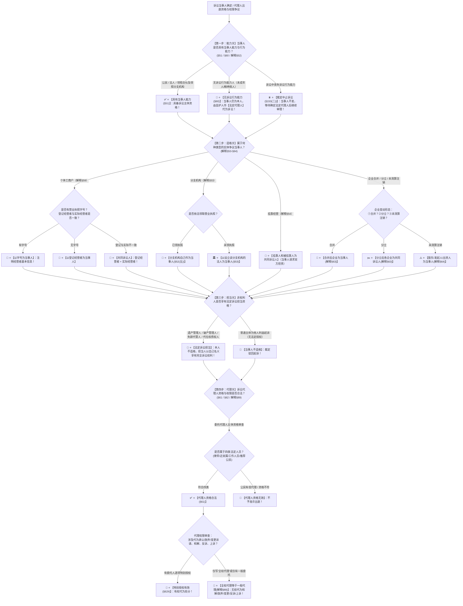

# 📐 当事人适格与代理 · 全流程答题模型（能力资格 · 适格类型化 · 诉讼担当 · 代理授权四步定位链 · §51-§62/解释§52-§89）

> **教练开场白**
> 同学们好！我是你们的民诉法考教练。在民事诉讼法当事人制度中，“当事人适格与诉讼代理”是**案例分析型设问（T1-15 / 3-2 核心考点）每年必考、覆盖 25+ 张真题卡的基石母题**！
> 很多同学做当事人题目时经常掉入命题人精心布置的“概念偷换”陷阱：
> 1. **混淆当事人能力与诉讼行为能力**：看到 8 岁的小孩被撞伤，以为“未成年人没有当事人资格”（未成年人天生具有当事人能力，可以作原告，只是没有诉讼行为能力，由法定代理人监护人代为诉讼！）；
> 2. **个体工商户三档规则记混**：看到有字号的个体户，直接选经营者张三当被告（《民诉解释》§59 明确规定：**有字号的以营业执照登记的字号为当事人**，注明经营者信息；只有无字号的才以登记经营者为当事人！）；
> 3. **把未领营业执照的分支机构当被告**：以为分公司、分店都可以直接当被告（《民诉解释》§53 规定：**没有领取营业执照的分支机构不具备当事人资格，必须以设立它的法人为当事人**！）；
> 4. **把“全权代理”当成万能特别授权**：以为授权委托书写了“全权代理”就可以代为签字和解、放弃诉请（《民事诉讼法》§62 与《民诉解释》§89 铁律：**特别授权必须逐项列明；仅写“全权代理”属于一般代理，五项重大处分权一项都没有**！）；
> 5. **混淆当事人死亡与丧失行为能力的中止处理**：当事人死亡中止诉讼是**等继承人承担诉讼（换当事人）**；当事人诉讼中变成精神病人中止诉讼是**等确定法定代理人（当事人不变，补代理人）**！
>
> 《民事诉讼法》（2023修正）与《民诉解释》（2022修正），构建了**以“能力审查进门、适格清单落位、诉讼担当移转、代理授权定界”为核心的当事人闭环**。
> 今天我们用**“四步连贯流水线”**，把当事人适格与代理的全部法定规则一次性彻底锁死：**第一步查能力关（当事人能力 §51 vs 诉讼行为能力 §60/§153） → 第二步查适格类型化关（个体户三档 §59、分支机构两分 §53、挂靠共同 §54、合并分立注销承继 §55/§63/§64） → 第三步查诉讼担当关（遗产管理人、破产管理人、失踪代管人、代位权债权人正当当事人地位） → 第四步查代理授权关（四类法定代理人范围 §61 ＋ 特别授权五事项严防全权代理落空 §62/解释§89）**！

---

## 适用场景与解决问题

本模型专门解决各类民事案件原告/被告适格性审查、个体工商户/合伙/分支机构/挂靠/企业合并分立/企业注销当事人确定、诉讼进行中当事人死亡与行为能力丧失的承继与法定代理、诉讼担当类型化认定、委托诉讼代理人资格与特别授权范围的全部主客观题考点（对应 [[民诉-客观题考点全景-深度报告]] 板块A 第3章 3-1/3-2/3-3/3-11 核心考点）：重点破解：

1. **第一步 · 能力关：当事人能力与诉讼行为能力审查（《民事诉讼法》§51/§60 ＋ 《民诉解释》§52）**：
   - ⭐ **当事人能力（原告/被告主体资格 §51）**：
     - 公民、法人和其他组织（依法领照的独资/合伙企业、领照分支机构等八类 解释§52）；
   - ⭐ **诉讼行为能力与法定代理（§60）**：
     - 无诉讼行为能力人（未成年人/无民事行为能力成年人） $\rightarrow$ **当事人依然是本人，由监护人作为法定代理人代为诉讼**；
   - 🔄 **诉讼中丧失诉讼行为能力（§153(二)）** $\rightarrow$ **裁定中止诉讼，当事人主体不变，补定法定代理人后继续审理（单选-82）**。-> 主体资格恒定原则
1. **第二步 · 适格关：正当当事人类型化判断清单（《民诉解释》§53-§64 核心考点）**：
   - ⭐ **个体工商户三档规则（解释§59 经典做题眼）**：
     - ① **有字号的** $\rightarrow$ **以营业执照登记的字号为当事人**（注明经营者基本信息 单选-54）；
     - ② **无字号的** $\rightarrow$ **以营业执照登记的经营者为当事人**；
     - ③ **登记经营者与实际经营者不一致的** $\rightarrow$ **以登记经营者和实际经营者为共同诉讼人（单选-55）**；
   - ⭐ **法人分支机构两分法（解释§52(五) / §53）**：
     - ① **依法设立并领取营业执照的分支机构** $\rightarrow$ **作为“其他组织”自己当当事人**；
     - ② **未依法设立或未领取营业执照的分支机构** $\rightarrow$ **不适格，以设立该分支机构的法人为当事人（多选-53）**；
   - ⭐ **挂靠经营（解释§54）** $\rightarrow$ 当事人请求由双方担责的，**挂靠人与被挂靠人为共同诉讼人**；
   - ⭐ **企业变动与自然人死亡承继**：
     - **当事人死亡（解释§55）** $\rightarrow$ **裁定中止诉讼，等继承人承担诉讼**，此前诉讼行为对继承人有效；
     - **企业合并（解释§63）** $\rightarrow$ **以合并后的企业为当事人**；
     - **企业分立（解释§63）** $\rightarrow$ **以分立后的企业为共同诉讼人**（单选-71）；
     - **未清算即被注销（解释§64）** $\rightarrow$ **以其股东、发起人或者出资人为当事人**。
3. **第三步 · 担当关：法定诉讼担当正当当事人地位（学理通说 ＋ 实体法联动）**：
   - ⭐ **诉讼担当四大法定情形**：
     - ① **遗产管理人 / 遗嘱执行人** $\rightarrow$ 就遗产纠纷以自己名义起诉应诉；
     - ② **破产管理人** $\rightarrow$ 就破产债务人财产诉讼以管理人名义起诉应诉（单选-306）；
     - ③ **失踪人财产代管人** $\rightarrow$ 就失踪人财产债务以代管人名义起诉应诉；
     - ④ **代位权诉讼债权人** $\rightarrow$ 债权人以自己名义起诉次债务人（单选-45）；
   - 🚨 **法律效果**：本人不适格化，**诉讼担当人系正当当事人，享有完全诉讼权利**！
4. **第四步 · 代理关：委托诉讼代理人与特别授权审查（《民事诉讼法》§61/§62 ＋ 《民诉解释》§85-§89）**：
   - ⭐ **可被委托的四类法定人员（§61）**：
     - ① **律师、基层法律服务工作者**；
     - ② **当事人的近亲属**（配偶、父母、子女、兄弟姐妹、祖父母、外祖父母、孙子女、外孙子女 解释§85）；
     - ③ **当事人的工作人员**（有合法劳动人事关系 解释§86）；
     - ④ **当事人所在社区、单位以及有关社会团体推荐的公民（解释§87 严防黑中介）**；
   - 🚨 **特别授权五大法定事项（§62Ⅱ 压轴做题眼）**：
     - 诉讼代理人代为：**①承认诉讼请求；②放弃诉讼请求；③变更诉讼请求；④进行和解；⑤提起反诉或者上诉**，必须有委托人的**特别授权**！
     - 🚫 **全权代理落空铁律（解释§89）**：授权委托书仅写“全权代理”而无具体逐项授权的，**诉讼代理人无权代为上述五项特别授权行为，只能进行一般出庭陈述与辩论**（多选-83）！

> **核心一句**：**当事人四步走：一问能力有没有（公民法人其他组织，无行为能力找监护）；二问适格对不对（有字号认字号，没执照找本尊，挂靠死亡看承继）；三问担当凭什么（遗产破产代管代位，法律给名义）；四问代理到哪线（四类人可委托，五件事要特批——全权代理等于一般代理）！**
>
> 🔎 **核心法源（2026最新）**：《民事诉讼法》§51、§60、§61、§62、§153；《民诉解释》§52、§53、§54、§55、§59、§60、§63、§64、§83、§85、§86、§87、§89、§249。

---

## 💡 【前置认知】当事人适格与诉讼代理核心类型极速对照表

| 制度模块 | 核心法律条文 | 刚性法定规则与标准 | 考场一秒判定秘诀 |
| :--- | :--- | :--- | :--- |
| **① 个体工商户** | 《民诉解释》**§59** | • 有字号 $\rightarrow$ **以字号为当事人**（注经营者）；<br>• 无字号 $\rightarrow$ **以登记经营者为当事人**；<br>• 登记≠实际 $\rightarrow$ **二者为共同诉讼人**。 | 有招牌认招牌，没招牌找老板，借招牌俩人一起告！ |
| **② 分支机构** | 《民诉解释》**§52/§53** | • 领营业执照 $\rightarrow$ **分支机构自己当当事人**；<br>• 未领营业执照 $\rightarrow$ **以设立它的法人为当事人**。 | 没领营业执照的分店，**千万不能当被告**，告总公司！ |
| **③ 合并与分立** | 《民诉解释》**§63** | • 合并 $\rightarrow$ **合并后的企业为当事人**；<br>• 分立 $\rightarrow$ **分立后的企业为共同诉讼人**。 | 一家吞一家告新家；一分为二**两个一起告**！ |
| **④ 诉讼担当** | 《民法典》/《破产法》 | 遗产管理人/破产管理人/代位权债权人以自己名义起诉。 | 替死人、破产企业管钱的人，**自己当正当原告**！ |
| **⑤ 特别授权** | 《民事诉讼法》**§62Ⅱ**<br>《民诉解释》**§89** | 代为承认/放弃/变更诉请、和解、反诉或上诉须特别授权；<br>• 仅写“全权代理”视为**一般代理**。 | 写“全权代理”**等于废纸**，五大处分权一样干不了！ |

---

## 一、 考点核心骨架与法理（四步连贯决策树）



```
【当事人与代理全景】一句话开场：当事人四步走：一问能力有没有（公民法人其他组织，无行为能力找监护）；二问适格对不对（有字号认字号，没执照找本尊，挂靠死亡看承继）；三问担当凭什么（遗产破产代管代位，法律给名义）；四问代理到哪线（四类人可委托，五件事要特批——全权代理等于一般代理）！
│
▼ 第一步 · 查能力关 ── 当事人能力与诉讼行为能力（§51/§60/§153）
├─ 当事人能力（§51）：公民、法人、其他组织（领照独资合伙/领照分支机构 解释§52）
├─ 诉讼行为能力（§60）：未成年人/精神病人当事人照当，【由监护人作法定代理人代为诉讼】
└─ 诉讼中丧失诉讼行为能力（§153(二)）：【裁定中止诉讼，当事人不变，补代理人】
     │
     ▼ 第二步 · 查适格关 ── 正当当事人类型化清单（解释§53-§64）
     ├─ 个体工商户（解释§59）：有字号以字号为当事人；无字号以登记经营者；登记≠实际为共同诉讼人
     ├─ 分支机构（解释§53）：领照自己当；未领照以设立该分支机构的法人为当事人
     ├─ 挂靠经营（解释§54）：挂靠人 ＋ 被挂靠人为共同诉讼人
     ├─ 当事人死亡（解释§55）：【裁定中止诉讼等继承人承接】，此前诉讼行为对继承人有效
     ├─ 企业合并与分立（解释§63）：合并以合并后企业为当事人；分立以分立后企业为共同诉讼人
     └─ 未清算即注销（解释§64）：以股东、发起人或者出资人为当事人
          │
          ▼ 第三步 · 查担当关 ── 法定诉讼担当正当性
          ├─ 遗产管理人 / 遗嘱执行人 ──→ 正当当事人以自己名义诉讼
          ├─ 破产管理人 ──→ 代表破产企业以管理人名义起诉应诉（破产法院集中管辖）
          ├─ 失踪人财产代管人 ──→ 以代管人名义起诉应诉
          └─ 代位权债权人 ──→ 以自己名义告次债务人（次债务人所在地管辖）
               │
               ▼ 第四步 · 查代理关 ── 四类主体与特别授权（§61/§62/解释§89）
               ├─ 代理人范围（§61）：律师/法律工作者、近亲属、工作人员、社区单位社团推荐公民
               ├─ 特别授权五事项（§62Ⅱ）：【承认、放弃、变更诉请，进行和解，反诉或上诉】
               └─ 🚨 全权代理落空（解释§89）：【仅写全权代理无具体授权＝一般代理】，五项处分权全无！

  ━━━ 四步全通 ━━━
```

---

## 二、 核心考情与 2026 民诉法新规精要

- **频次研判**：当事人适格与诉讼代理是民诉板块**★★★★ 高频案例设问主力考点**；客观题每年必考 2–3 题，涉及个体户字号列置、无照分支机构、合并分立承继、诉讼担当以及特别授权清单。
- **2026 命题核心与法理精要**：
  1. **个体工商户（解释§59）**：有字号认字号，实际与登记不一致两者共同诉讼。
  2. **分支机构当事人资格（解释§53）**：未领取营业执照的分公司不能当当事人，必须告总公司。
  3. **诉讼中丧失诉讼行为能力 vs 死亡**：丧失行为能力当事人不变补法定代理人；死亡等继承人换当事人。
  4. **诉讼担当正当当事人**：遗产管理人、破产管理人直接以自己名义诉讼，排斥被管理人。
  5. **特别授权五项刚性清单（§62Ⅱ ＋ 解释§89）**：承认、放弃、变更诉请、和解、反诉或上诉；仅写“全权代理”属于一般代理。

---

## 三、 三大核心法理与命题陷阱拆解

### 1. 当事人适格与代理四大命题暗坑与裁判标准表

| 案件事实设定 | 争议焦点 | 裁判结论 | 命题陷阱与法理深剖 |
|---|---|---|---|
| 张某申领了营业执照开办了一家个体餐馆，字号为“老张川菜馆”。顾客李某在餐馆就餐发生食物中毒，欲向法院起诉索赔。 | 起诉状中应当将谁列为被告？能否直接将张某个人列为被告？ | 🏪 **应当以“老张川菜馆”为被告，同时注明经营者张某的基本信息！** | 《民诉解释》§59：个体工商户**有字号的，以营业执照上登记的字号为当事人**，但应同时注明该字号经营者的基本信息。直接列张某个人属于当事人列置错误（单选-54）。 |
| 某全国连锁火锅店（总公司位于 A 市）在 B 市设立了一家分店。该分店依法设立但未领取营业执照。消费者赵某在分店就餐被烫伤欲起诉索赔。 | 赵某能否将 B 市分店单独列为被告？应当由谁作为适格被告？ | 🏛️ **不能将分店列为被告！必须以 A 市总公司法人为被告！** | 《民诉解释》§53：法人虽依法设立但**没有领取营业执照的分支机构，以设立该分支机构的法人为当事人**。未领执照的分店不具有当事人能力（多选-53）。 |
| 原告甲在与乙借款诉讼一审审理中突发脑梗成为无民事行为能力人。甲的妻子丙作为监护人申请代替甲成为原告继续诉讼。 | 法院应当如何处理？甲是否丧失当事人资格？原告是否需要变更为丙？ | ⏸️ **裁定中止诉讼！当事人仍为甲本人，由丙作为法定代理人代为诉讼！** | 《民事诉讼法》§60 ＋ §153(二)：无诉讼行为能力人**依然具有当事人能力**，原告仍是甲；法院裁定中止诉讼，由监护人丙作为**法定代理人**代为诉讼，原告主体不变更（单选-82）。 |
| 原告甲委托律师乙出庭诉讼，授权委托书上注明“全权代理”。庭审中，在法官主持下，乙代表甲当庭签字同意与被告达成调解协议并放弃了 10 万元违约金请求。 | 律师乙签署的调解协议及放弃诉讼请求的行为对甲是否发生法律效力？ | 🚫 **不发生效力！属于无权代理！** | 《民事诉讼法》§62Ⅱ ＋ 《民诉解释》§89：放弃诉讼请求和进行和解**必须有委托人的特别授权**；授权委托书仅写“全权代理”而无具体授权的，**诉讼代理人无权代为和解与放弃诉请**（多选-83）。 |

---

## 四、 万能解题四步

---

### 第一步：查能力关 —— 有当事人资格吗？是未成年人/精神病人吗？（《民事诉讼法》§51/§60）

> **教练提示**：
> 1. 公民、法人、领照其他组织 $\rightarrow$ **有当事人能力**；
> 2. 未成年人/精神病人 $\rightarrow$ **当事人仍是本人，监护人作法定代理人出庭**；
> 3. 诉讼中丧失行为能力 $\rightarrow$ **裁定中止，当事人不变，补代理人（§153(二)）**！

---

### 第二步：查适格关 —— 个体户、分店、挂靠还是合并分立？（《民诉解释》§53-§64）

> **教练提示**：
> 1. **个体户**：有字号认字号；无字号认经营者；登记≠实际为共同诉讼人（解释§59）；
> 2. **分支机构**：领照自己当；**未领照告总公司（解释§53）**；
> 3. **挂靠经营**：挂靠人 ＋ 被挂靠人为共同诉讼人（解释§54）；
> 4. **变动承继**：死亡等继承人；合并告新家；**分立两个一起告（解释§63）**！

---

### 第三步：查担当关 —— 是遗产管理人、破产管理人或代位权吗？（实体法联动）

> **教练提示**：
> 1. 遗产管理人、破产管理人、失踪代管人、代位权债权人 $\rightarrow$ **法定诉讼担当，正当当事人**；
> 2. 担当人以**自己名义**诉讼，本人退出诉讼！

---

### 第四步：查代理关 —— 四类人合格吗？是特别授权还是全权代理？（《民事诉讼法》§61/§62/解释§89）

> **教练提示**：
> 1. 委托代理人限四类：律师/法律工作者、近亲属、工作人员、社区单位社团推荐公民；
> 2. 特别授权五件事：**承认、放弃、变更诉请，进行和解，反诉或上诉**；
> 3. 🚨 **仅写“全权代理”＝一般代理，五项处分权全无**！

#### 💰 完整数字案例：当事人适格与代理全景攻防实战

> **【案情（[[民诉-当事人-单选-54]]、[[民诉-当事人-单选-82]] 与 [[民诉-诉讼代理-多选-83]] 综合演练）】**
> 张某（住所地 A 区）领取了营业执照，经营字号为“金牌餐饮店”的餐馆，后张某将餐馆实际转包给李某经营，但未办理工商变更登记。
> 1. **第一幕（当事人适格与共同诉讼）**：王某在餐馆就餐发生急性肠胃炎，花费医药费 **2 万元**。王某拟向法院起诉索赔。
> 2. **第二幕（诉讼行为能力与法定代理）**：诉讼进行中，原告王某因突发脑溢血丧失民事行为能力，尚未确定法定代理人。王某的妻子赵某作为监护人申请出庭。
> 3. **第三幕（委托代理与特别授权）**：赵某委托律师孙某作为诉讼代理人，授权委托书上仅注明“全权代理”。庭审中，孙某擅自代表王某与被告达成和解，同意被告仅赔付 **5000 元**并放弃其余诉讼请求。
>
> - **裁判涵摄**：
>   1. **第一幕裁判**：依据《民诉解释》§59，个体工商户有字号的以字号为当事人；且登记经营者张某与实际经营者李某不一致，**应当以“金牌餐饮店”为被告（注明经营者张某信息），并将实际经营者李某列为共同诉讼人（单选-54 / 单选-55）**；
>   2. **第二幕裁判**：依据《民事诉讼法》§60 及 §153(二)，王某丧失诉讼行为能力不影响其原告主体资格，法院应当**裁定中止诉讼**；在指定监护人赵某作为法定代理人后恢复审理，原告仍为王某本人（单选-82）；
>   3. **第三幕裁判**：依据《民事诉讼法》§62Ⅱ 及《民诉解释》§89，放弃诉讼请求与进行和解必须有特别授权。授权委托书仅写“全权代理”属于一般代理，**律师孙某无权代为和解及放弃诉讼请求，该和解协议对原告王某不发生法律效力**（多选-83）！

#### 一句话闭环记忆
> 🎯 **一眼判**：**一问能力有没有（公民法人其他组织，无行为能力找监护）；二问适格对不对（有字号认字号，没执照找本尊，挂靠死亡看承继）；三问担当凭什么（遗产破产代管代位，法律给名义）；四问代理到哪线（四类人可委托，五件事要特批——全权代理等于一般代理）！**

---

## 五、 案例演练

### 1. 有字号个体工商户的被告列置（[[民诉-当事人-单选-54]] 经典真题）
- **案情**：个体工商户有依法核准登记的字号，发生合同纠纷起诉。
- **模型分析**：第二步——依据《民诉解释》§59，有字号的以营业执照上登记的字号为当事人，注明经营者信息（选 B）。

### 2. 诉讼中当事人丧失行为能力（[[民诉-当事人-单选-82]] 经典真题）
- **案情**：诉讼进行中当事人突发疾病丧失民事行为能力，尚未确定法定代理人。
- **模型分析**：第一步——依据《民事诉讼法》§153(二)，当事人主体不变，裁定中止诉讼等待确定法定代理人（选 C）。

### 3. 特别授权范围与代为调解（[[民诉-诉讼代理-多选-83]] 经典真题）
- **案情**：委托代理人持有“代为调解”特别授权，审查其代签调解书与申请执行权限。
- **模型分析**：第四步——依据《民事诉讼法》§62与《民诉解释》§89，代为调解授权包含签署调解协议与签收调解书，但不包含执行申请（选 ABC）。

---

## 关联真题

- [[民诉-当事人-单选-54 · 有字号个体工商户的诉讼当事人]]
- [[民诉-当事人-单选-55 · 无字号个体户转让未变更登记的被告]]
- [[民诉-当事人-单选-82 · 诉讼中当事人丧失行为能力的处理]]
- [[民诉-诉讼代理-多选-83 · 代为调解授权的代理权范围]]
- [[民诉-当事人-单选-329 · 个体工商户合伙与分支机构的当事人确定]]

## 相关页面

- 概念实体页：[[当事人能力]] · [[诉讼行为能力]] · [[当事人适格]] · [[诉讼担当]] · [[诉讼代理人]] · [[特别授权]]
- 姊妹模型：[[民诉-当事人-共同诉讼与群体诉讼模型]] · [[民诉-当事人-第三人模型]]
- 综合报告：[[民诉-客观题考点全景-深度报告]]（板块A 第3章 3-1~3-3、3-11 · ★★★★ 案例型设问主力）
