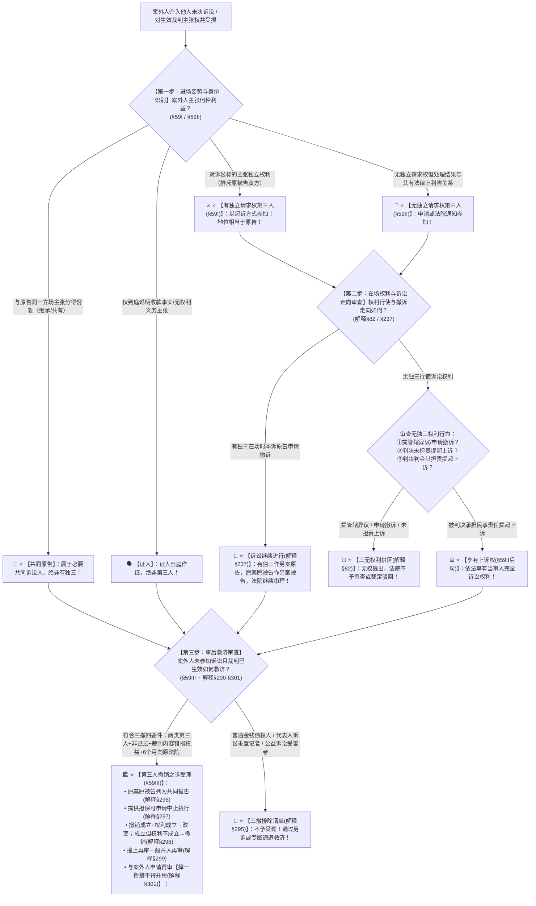

# 📐 第三人 · 全流程答题模型（有独三起诉原告 · 无独三半个当事人 · 第三人撤销之诉三步定位链 · §59/解释§81-§82/§290-§301）

> **教练开场白**
> 同学们好！我是你们的民诉法考教练。在民事诉讼中，“第三人与第三人撤销之诉”是**客观题命题人最爱挖坑、横跨当事人与审判监督程序的顶级核心考点（T0-6 顶级必考 ＋ T0-10 案外人救济三条道路，覆盖 17+ 张真题卡）**！
> 很多同学做第三人题目时经常在以下关键法理上陷入思维混乱：
> 1. **给无独三发“完整当事人权利包”**：以为无独三只要进了法庭，就可以提管辖异议、申请撤诉（《民诉解释》§82 铁律：**无独三在一审中无权提管辖异议、无权放弃变更诉请、无权申请撤诉！只有被判决承担民事责任时才有权上诉**！）；
> 2. **混淆“有独三”与“共同原告”**：看到案外人要求分一份遗产，选了有独三（**“主张标的全归我/排斥双方”＝有独三；“我也依法分一份/与原告同一立场”＝共同原告**！）；
> 3. **以为本诉原告撤诉案子就完了**：有独三参加后本诉原告撤诉，以为全案终结（《民诉解释》§237 规定：**有独三作为另案原告，原案原被告作为另案被告，诉讼继续进行**！）；
> 4. **给普通金钱债权人滥用第三人撤销之诉**：债务人打输了官司，债权人跑去提三撤（《民诉解释》§295 规定：**普通金钱债权人不享有三撤原告资格**，除非生效裁判是对特定物确权并直接损害其担保物权等物权利益！）；
> 5. **三撤起算时间与管辖法院搞错**：以为从裁判生效之日起算、向被告住所地起诉（**自知道或应当知道民事权益受到损害之日起 6 个月内（不变期间），向作出生效裁判的人民法院提起**！）；
> 6. **三撤与案外人申请再审“两条路都走”**：以为提了三撤还可以申请再审（《民诉解释》§301 明确设置**择一衔接铁律**：两条救济道路只能选一条，选定后不得再走另一条！）。
>
> 《民事诉讼法》（2023修正）与《民诉解释》（2022修正），构建了**以“有独三起诉进场当原告、无独三半个当事人担责才上诉、三撤四要件找原法院三档改撤驳”为核心的裁判闭环**。
> 今天我们用**“三步连贯流水线”**，把第三人与第三人撤销之诉的全部法定规则一次性彻底锁死：**第一步判进场姿势与身份识别（有独三排斥双方以起诉方式进场 §59Ⅰ vs 无独三法律利害关系申请通知进场 §59Ⅱ vs 共同原告） → 第二步判在场权利清单与撤诉走向（无独三三无权利禁区；担责才有上诉权 §82；原告撤诉有独三继续打 §237） → 第三步判事后救济：第三人撤销之诉（四要件：两类第三人＋非己过＋判决内容错损权益＋6个月不变期间向原审法院；排除清单；三档裁判改撤驳；择一衔接 §59Ⅲ/解释§290-§301）**！

---

## 适用场景与解决问题

本模型专门解决有独立请求权第三人与无独立请求权第三人身份识别、无独立请求权第三人诉讼权利清单与上诉权限制、本诉原告撤诉后有独三诉讼继续、诉讼中争议权利转移受让人地位、第三人撤销之诉起诉条件/管辖/期限/排除范围/当事人列置/裁判方式、三撤与再审及案外人执行异议之诉衔接的全部主客观题考点（对应 [[民诉-客观题考点全景-深度报告]] 板块A 第3章 3-8/3-9/3-10 核心考点）：重点破解：

1. **第一步 · 进场姿势与身份识别关（《民事诉讼法》§59Ⅰ/Ⅱ ＋ 《民诉解释》§81）**：
   - ⭐ **有独立请求权第三人（§59Ⅰ）**：
     - 对原被告双方争议的诉讼标的主张**独立的实体请求权（“原告不是所有权人，被告也不是，标的物是我的！”）**；
     - **以起诉方式参加诉讼，诉讼地位相当于原告**（单选-80）；
   - ⭐ **无独立请求权第三人（§59Ⅱ）**：
     - 对诉讼标的无独立请求，但**案件处理结果与其有法律上的利害关系**；
     - **申请参加诉讼，或者由人民法院通知其参加诉讼**；
   - 🚨 **三大高频身份混淆判定**：
     - **与原告同立场分一份（如法定继承人）** $\rightarrow$ **共同原告（绝非有独三 单选-81）**；
     - **实体承担赔偿责任的人（共同侵权人/连带保证人）** $\rightarrow$ **共同被告（绝非无独三）**；
     - **仅到庭说明案件事实的证人（如经手收款人）** $\rightarrow$ **证人（无当事人地位 单选-321）**。
2. **第二步 · 在场权利清单与诉讼走向关（《民诉解释》§82/§237/§249）**：
   - ⭐ **无独三“三无”权利禁区（解释§82 经典做题眼）**：
     - 🚫 **无权提出管辖权异议**；
     - 🚫 **无权放弃、变更诉讼请求**；
     - 🚫 **无权申请撤诉**；
   - ⚖️ **无独三上诉权限制（§59Ⅱ后句 ＋ 解释§82）**：
     - **人民法院判决承担民事责任的无独三，才享有当事人的诉讼权利义务，才有权提起上诉**；未被判决承担责任的无独三无权上诉；
   - 🔄 **有独三参加后原告撤诉（解释§237）**：
     - **法院不终结诉讼！有独三作为另案原告，原案原告与被告作为另案被告，诉讼继续进行（多选-77）**；
 - 有独三 VS 无独三
	 - **有独三：我主张东西归我，对抗原被告双方，只能自己起诉进来，法院不能通知追加。**
	 - **无独三：不主张标的物归自己，只是判决结果会坑到我；可以自己申请，也可以法院通知进来。
1. **第三步 · 事后救济：第三人撤销之诉审查关（《民事诉讼法》§59Ⅲ ＋ 《民诉解释》§290-§301）**：
   - ⭐ **起诉黄金四要件（缺一裁定不予受理）**：
     - ① **原告主体适格**：**仅限有独三与无独三（排除普通债权人 多选-193）**；
     - ② **未参加事由**：**因不能归责于本人的事由未参加诉讼**（解释§293）；
     - ③ **裁判存在错误**：发生法律效力的判决、裁定、调解书**内容错误且损害其民事权益**；
     - ④ **期限与管辖**：**自知道或应当知道权益受损之日起 6 个月内（不变期间 解释§127），向【作出生效裁判的人民法院】提起**；
   - 🚫 **三撤排除清单（解释§295）**：非讼案件、身份关系判决、**代表人诉讼未登记权利人**（另诉套用原判）、公益诉讼受害人（另诉）；
   - 👥 **当事人列置（解释§296）**：第三人为原告，**生效裁判的原当事人均为被告**（原案未担责的无独三仍列第三人 单选-196）；
   - ⚖️ **三档裁判方式（解释§298）**：
     - 撤销请求成立 ＋ 权利主张成立 $\rightarrow$ **判决改变原裁判**；
     - 撤销请求成立 ＋ 权利主张不成立/未提出 $\rightarrow$ **判决撤销原裁判（单选-197）**；
     - 撤销请求不成立 $\rightarrow$ **判决驳回诉讼请求**；
   - 🔄 **程序衔接与择一铁律**：
     - **撞上再审（解释§299）**：一般**并入再审**审理（恶意串通例外先审三撤 单选-199）；
     - **执行担保（解释§297）**：原告提供担保并申请，法院**可以准许中止执行（非当然中止）**；
     - 🚨 **与案外人申请再审择一衔接（解释§301）**：**提了三撤不得再走案外人再审，走了解释§234再审路径不得再提三撤，二者绝对不得并用**！

> **核心一句**：**起诉进场是有独（原告待遇），申请被通知是无独（半个当事人：管辖异议撤诉碰不得，判我担责才能上诉）；没掺和上提三撤：非因己过+裁判错误害了我+六个月不变期间+找作出裁判的原法院；原告被告列被告、旧第三人还第三人；三档改撤驳，撞再审就并入，想停执行先担保，与案外人再审两条路只能走一条！**
>
> 🔎 **核心法源（2026最新）**：《民事诉讼法》§59；《民诉解释》§81、§82、§127、§237、§249、§290-§301。

---

## 💡 【前置认知】第三人制度与撤销之诉核心规则极速对照表

| 制度模块 | 核心法律条文 | 刚性法定规则与标准 | 考场一秒判定秘诀 |
| :--- | :--- | :--- | :--- |
| **① 有独三** | 《民事诉讼法》**§59Ⅰ**<br>《民诉解释》**§237** | • 对标的主张权利，**以起诉方式参加**；<br>• 本诉原告撤诉，**有独三继续打**。 | “这东西是我的”$\rightarrow$ 当原告打双方；原告跑了照样审！ |
| **② 无独三** | 《民事诉讼法》**§59Ⅱ**<br>《民诉解释》**§82** | • 申请或法院通知参加；<br>• **无权提管辖异议/撤诉**；**被判担责才有权上诉**。 | 半个当事人：管辖撤诉碰不得，**只有被判赔钱才能上诉**！ |
| **③ 三撤要件** | 《民事诉讼法》**§59Ⅲ**<br>《民诉解释》**§290** | • 仅限两类第三人；**非因己过未参加**；<br>• **知道受损 6 个月内**向**原生效裁判法院**起诉。 | 普通债权人不能提；**6个月不变期间找原审法院**！ |
| **④ 三撤裁判** | 《民诉解释》**§298** | • 撤销成立+权利成立 $\rightarrow$ **改变原判**；<br>• 撤销成立+权利不成立 $\rightarrow$ **撤销原判**。 | 查实是我的直接**改**，不是我的只负责**撤**！ |
| **⑤ 择一衔接** | 《民诉解释》**§301** | 三撤与案外人申请再审路径**二选一，不得并用**。 | 走三撤就别想再审，走再审就不能提三撤！ |

---

## 一、 考点核心骨架与法理（三步连贯决策树）



```
【第三人与三撤全景】一句话开场：起诉进场是有独（原告待遇），申请被通知是无独（半个当事人：管辖异议撤诉碰不得，判我担责才能上诉）；没掺和上提三撤：非因己过+裁判错误害了我+六个月不变期间+找作出裁判的原法院；原告被告列被告、旧第三人还第三人；三档改撤驳，撞再审就并入，想停执行先担保，与案外人再审两条路只能走一条！
│
▼ 第一步 · 判进场姿势 ── 有独、无独与共同原告（§59Ⅰ/Ⅱ/解释§81）
├─ 有独三（§59Ⅰ）：对标的主张独立权利（排斥双方），【以起诉方式进场，地位同原告】
├─ 无独三（§59Ⅱ）：无独立请求但有法律利害关系，【申请参加或法院通知参加】
├─ 共同原告：与原告同立场分一杯羹（法定继承），【列共同原告，绝非有独三】
└─ 证人：仅到庭陈述事实，【绝非第三人】
     │
     ▼ 第二步 · 判在场权利 ── 权利禁区与撤诉走向（解释§82/§237/§249）
     ├─ 无独三“三无”禁区：❌无权提管辖异议 ❌无权放弃变更诉请 ❌无权撤诉
     ├─ 无独三上诉权：【只有被判决承担民事责任时】，才有当事人权利、才有权上诉
     ├─ 原告撤诉走向（解释§237）：【有独三作另案原告，原案原被告作另案被告，诉讼继续】
     └─ 争议权利转移（解释§249）：不影响原当事人地位，受让人可申请以无独三参加
          │
          ▼ 第三步 · 判事后三撤 ── 四要件、三档裁判与择一（§59Ⅲ/解释§290-§301）
          ├─ 四要件：两类第三人 ＋ 非因己过未参加 ＋ 内容错损权益 ＋ 【6个月向原裁判法院】
          ├─ 排除清单（解释§295）：普通金钱债权人、代表人未登记权利人、公益诉讼受害人
          ├─ 当事人列置（解释§296）：原案原告与被告【均为被告】，未担责无独三仍列第三人
          ├─ 三档裁判（解释§298）：成立+权利成立→【改变】；成立+权利不成立→【撤销】；不成立→【驳回】
          ├─ 撞上再审（解释§299）：一般【并入再审】；恶意串通先审三撤
          ├─ 中止执行（解释§297）：提供担保＋申请 ──→ 法院【可以准许】（非当然中止）
          └─ 🚨 择一衔接（解释§301）：【三撤与案外人申请再审二选一，绝对不得并用】！

  ━━━ 三步全通 ━━━
```

---

## 二、 核心考情与 2026 民诉法新规精要

- **频次研判**：第三人与第三人撤销之诉是民诉板块**★★★★★ T0-6 顶级必考大户**；客观题每年必考 2–3 题，涉及无独三权利限制、有独三撤诉继续审理、三撤主体资格排除与择一衔接。
- **2026 命题核心与法理精要**：
  1. **无独三权利清单禁区（解释§82）**：无权提管辖异议，判令担责才能上诉。
  2. **有独三撤诉不终结（解释§237）**：本诉原告撤诉，有独三作为另案原告继续审理。
  3. **第三人撤销之诉管辖与期限（§59Ⅲ）**：作出生效裁判的原法院管辖；知道受损之日起 6 个月不变期间。
  4. **三撤原告主体排除**：普通金钱债权人不能提三撤，代表人诉讼未登记权利人另诉套用原判。
  5. **三撤与案外人申请再审择一衔接（解释§301）**：两条道路择一适用，不得并用。

---

## 三、 三大核心法理与命题陷阱拆解

### 1. 第三人制度四大命题暗坑与裁判标准表

| 案件事实设定 | 争议焦点 | 裁判结论 | 命题陷阱与法理深剖 |
|---|---|---|---|
| 原告甲起诉被告乙归还借款 100 万元。法院依职权通知连带保证人丙作为无独立请求权第三人参加诉讼。一审法院判决乙偿还欠款，判令丙承担连带保证责任。丙对管辖权及判决不服欲上诉。 | 丙在诉讼中的地位是否正确？丙在一审中能否提出管辖异议？丙是否有权提起上诉？ | 🚫 **列为无独三错误（应为共同被告）！若作为无独三无权提管辖异议，但被判担责后有权上诉！** | 《民诉解释》§66 ＋ §82：连带保证人承担连带责任应当列为共同被告；若被法院列为无独三，一审中无权提管辖异议，但被判决承担保证责任后，**享有完整上诉权**（单选-73 / 单选-300）。 |
| 甲起诉乙要求交付特定名画。诉讼中，丙主张该画系自己所有并以有独三身份参加诉讼。开庭审理中，原告甲发现证据不足当庭申请撤诉，法院裁定准予甲撤诉并裁定全案终结审理。 | 法院裁定全案终结审理是否合法？有独三参加后原告撤诉应当如何处理？ | 🚫 **法院裁定全案终结违法！诉讼应当继续进行！** | 《民诉解释》§237：有独立请求权第三人参加诉讼后，原告申请撤诉的，**人民法院应当准许原告撤诉；但有独三作为另案原告，原案原告、被告作为另案被告，诉讼继续进行**（多选-77）。 |
| 甲与乙因房屋所有权发生纠纷，法院判决房屋归甲所有。判决生效后，乙的普通金钱债权人丙发现乙名下已无其他财产，丙遂向法院提起第三人撤销之诉要求撤销该确权判决。 | 债权人丙能否提起第三人撤销之诉？普通金钱债权人是否享有三撤原告资格？ | 🚫 **丙无权提起第三人撤销之诉！法院应当裁定不予受理！** | 《民事诉讼法》§59Ⅲ ＋ 《民诉解释》§295：第三人撤销之诉的原告**严格限于有独三与无独三**；普通金钱债权人对债务人与他人的确权裁判不具有法律上的利害关系，不具有三撤原告资格（多选-193）。 |
| 案外人丙因不能归责于己的事由未参加甲乙诉讼，生效判决错误损害丙的权益。丙依法向作出判决的法院提起第三人撤销之诉。诉讼中，丙又向执行法院申请案外人执行异议并申请再审。 | 丙能否同时走第三人撤销之诉与案外人申请再审两条路径？ | 🚫 **不能！三撤与案外人申请再审属于择一衔接，绝对不得并用！** | 《民诉解释》§301：案外人提起第三人撤销之诉后，不得再依据《民事诉讼法》§234 申请再审；已走案外人再审路径的，提起第三人撤销之诉法院不予受理。两条道路只能选一条（单选-201）。 |

---

## 四、 万能解题三步

---

### 第一步：判进场姿势 —— 有独、无独、共同原告还是证人？（《民事诉讼法》§59Ⅰ/Ⅱ）

> **教练提示**：
> 1. 主张标的归我（排斥双方） $\rightarrow$ **有独三（起诉进场当原告）**；
> 2. 无独立请求但有利害关系 $\rightarrow$ **无独三（申请或通知进场）**；
> 3. 与原告同立场主张分一份 $\rightarrow$ **共同原告（继承/共有）**；
> 4. 仅到庭说明收款事实 $\rightarrow$ **证人（无当事人地位）**！

---

### 第二步：判在场权利 —— 禁区碰了吗？原告撤诉怎么走？（《民诉解释》§82/§237）

> **教练提示**：
> 1. 无独三三无禁区：**无权提管辖异议、无权撤诉、无权放弃变更诉请**；
> 2. 🚨 **无独三被判令承担责任才有权上诉**；
> 3. 有独三参加后原告撤诉 $\rightarrow$ **有独三作另案原告继续打，全案不终结（解释§237）**！

---

### 第三步：判事后救济 —— 符合三撤四要件吗？排除清单吗？（《民事诉讼法》§59Ⅲ/解释§290-§301）

> **教练提示**：
> 1. 四要件：**两类第三人 ＋ 非因己过 ＋ 裁判错误损权益 ＋ 知悉6个月内向原生效法院**；
> 2. 排除清单：**普通债权人、代表人未登记权利人、公益诉讼受害人**；
> 3. 三档裁判：**成立+权利成立改；成立+权利不成立撤；不成立驳**；
> 4. 🚨 **三撤与案外人再审择一衔接，绝对不得并用（解释§301）**！

#### 💰 完整数字案例：第三人与第三人撤销之诉全景攻防实战

> **【案情（[[民诉-第三人-多选-77]]、[[民诉-第三人撤销之诉-多选-193]] 与 [[民诉-第三人撤销之诉-单选-197]] 综合演练）】**
> 甲向人民法院起诉乙，要求确认位于市中心的一套价值 **500 万元**的商铺归甲所有。
> 1. **第一幕（有独立请求权第三人与撤诉）**：诉讼审理中，丙向法院出示产权证，主张该商铺早在两年前已由原产权人全额转让给丙，商铺属于丙所有，丙以有独三身份参加诉讼。原告甲见状遂向法院申请撤诉。
> 2. **第二幕（生效裁判与案外人侵权）**：法院裁定准予甲撤诉，并由丙作为另案原告、甲乙作为另案被告继续审理，最终法院判决商铺归丙所有。判决生效 3 个月后，乙的普通金钱债权人丁（乙欠丁借款 **200 万元**无力清偿）得知该判决，丁以“该判决导致乙财产减少损害丁的债权实现”为由，向法院提起第三人撤销之诉。
> 3. **第三幕（真第三人撤销之诉裁判）**：同时，案外人戊（商铺的真实共有人，因长期出国不知晓诉讼）回国得知判决，戊在得知权益受损后 **4 个月内**向作出判决的法院提起第三人撤销之诉，请求撤销原判决。法院经合议庭审理查明：原判决确属错误（房屋登记存在造假），但戊仅享有 50% 共有份额而非全部所有权，戊在诉讼中未提出确权主张。
>
> - **裁判涵摄**：
>   1. **第一幕裁判**：依据《民诉解释》§237，丙作为有独三参加诉讼后，原告甲申请撤诉的，**法院应当准许甲撤诉，但诉讼不终结，有独三丙作为另案原告、甲乙作为另案被告继续审理（多选-77）**；
>   2. **第二幕裁判**：依据《民事诉讼法》§59Ⅲ 及《民诉解释》§295，普通金钱债权人丁不具有第三人撤销之诉的原告主体资格，**法院应当裁定不予受理丁的撤销之诉（多选-193）**；
>   3. **第三幕裁判**：依据《民事诉讼法》§59Ⅲ 及《民诉解释》§298，案外人戊符合三撤四要件（两类第三人＋出国非己过＋6个月内向原法院）。法院经审理查明撤销请求成立，但戊未提出具体权利主张，**法院应当判决撤销原判决（单选-197）**！

#### 一句话闭环记忆
> 🎯 **一眼判**：**起诉进场是有独（原告待遇），申请被通知是无独（半个当事人：管辖异议撤诉碰不得，判我担责才能上诉）；没掺和上提三撤：非因己过+裁判错误害了我+六个月不变期间+找作出裁判的原法院；原告被告列被告、旧第三人还第三人；三档改撤驳，撞再审就并入，想停执行先担保，与案外人再审两条路只能走一条！**

---

## 五、 案例演练

### 1. 有独三参加后原告撤诉的处理（[[民诉-第三人-多选-77]] 经典真题）
- **案情**：有独三参加诉讼后，原告申请撤诉，法院审查案件程序走向。
- **模型分析**：第二步——依据《民诉解释》§237，原告撤诉不影响有独三诉讼继续，有独三作为另案原告继续审理（选 AB）。

### 2. 债权人对确权裁判的救济途径（[[民诉-第三人撤销之诉-多选-193]] 经典真题）
- **案情**：债务人与他人通过虚假确权判决转移财产，普通债权人主张救济。
- **模型分析**：第三步——依据《民诉解释》§295，普通金钱债权人不能提三撤，可通过债权人撤销权或申请执行异议救济（选 CD）。

### 3. 三撤成立但未提权利主张的裁判（[[民诉-第三人撤销之诉-单选-197]] 经典真题）
- **案情**：第三人撤销之诉中，法院查明原裁判确属错误，但原告未提出实体确权主张。
- **模型分析**：第三步——依据《民诉解释》§298，撤销请求成立但未提权利主张的，法院应当判决撤销原裁判（选 B）。

---

## 关联真题

- [[民诉-第三人-多选-77 · 有独三与本诉撤诉后的诉讼继续]]
- [[民诉-第三人-单选-80 · 主张全部遗产的第三人与本诉撤诉]]
- [[民诉-当事人-单选-81 · 主张法定继承份额者是共同原告而非有独三]]
- [[民诉-第三人撤销之诉-多选-193 · 债权人对确权判决的救济途径]]
- [[民诉-第三人撤销之诉-单选-194 · 代表人诉讼未登记权利人的救济不是第三人撤销之诉]]
- [[民诉-第三人撤销之诉-单选-197 · 撤销请求成立但权利主张不成立的处理]]

## 相关页面

- 概念实体页：[[有独立请求权第三人]] · [[无独立请求权第三人]] · [[第三人撤销之诉]]
- 姊妹模型：[[民诉-当事人-当事人适格与代理模型]] · [[民诉-当事人-共同诉讼与群体诉讼模型]]
- 综合报告：[[民诉-客观题考点全景-深度报告]]（板块A 第3章 3-8~3-10 · ★★★★★ T0-6 顶级必考）
