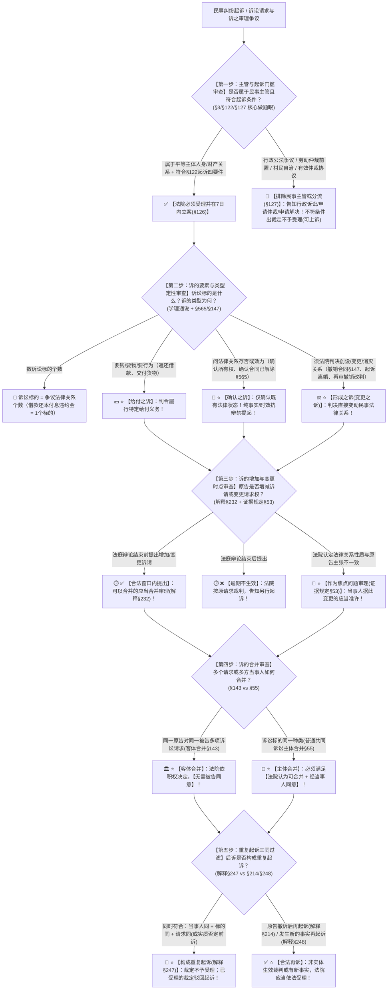

# 📐 主管与诉 · 全流程答题模型（法院主管边界 · 诉讼标的数法 · 三大诉之类型 · 诉的合并与变更 · 重复起诉三同过滤 · §3/§122/§127）

> **教练开场白**
> 同学们好！我是你们的民诉法考教练。在民事诉讼法总论板块中，“主管与诉的理论”是**贯穿整个民诉程序的最底层骨架、客观题每年必考 2–3 题、也是主观题精准撰写诉讼请求与答辩意见的基础工具**！
> 很多同学在做这部分题目时经常掉进以下几个“命题人百试不爽的经典陷阱”中：
> 1. **数不清诉讼标的**：看到原告在诉状中列了“返还本金、支付利息、赔偿违约金”三项请求，就误以为有三个诉讼标的（我国传统通说：诉讼标的＝争议的民事法律关系个数，借款合同只有一个法律关系，诉讼标的只有一个！）；
> 2. **分不清解除之诉与撤销之诉**：看到“合同解除”，以为是形成权就判定为形成之诉（《民法典》§565 通知到达即发生解除效力，法院只对解除行为进行确认，是**确认之诉**！而撤销合同非经法院/仲裁裁决不生效，是**形成之诉**！）；
> 3. **确认之诉乱套事实**：把“请求确认对方违规操作”、“请求确认诉讼时效已届满”当成确认之诉（确认之诉对象严格限于**法律关系存否或效力**，纯粹事实与抗辩事由不得独立提起确认之诉！）；
> 4. **重复起诉乱扣帽子**：把“原告撤诉后再次起诉”、“法院裁定驳回起诉后补正再诉”、“生效裁判后发生新事实再次起诉”当成重复起诉（重复起诉必须同时满足**当事人同＋标的同＋请求同或实质否定前诉**，撤诉和未决事实不在其列！）。
>
> 《民事诉讼法》（2023修正）与《民诉解释》（2022修正），构建了**以“主管审查、诉之定性、变更时点控制、主客合并规则、重复起诉三同过滤”为核心的民事诉讼入口闭环**。
> 今天我们用**“五步连贯流水线”**，把主管与诉的全部定性规则一次性彻底锁死：**第一步查法院主管与立案入口关（民事主管范围 §3 ＋ 起诉四要件 §122 ＋ 七类告知处理 §127） → 第二步查诉的要素与类型定性关（诉讼标的＝法律关系个数；给付之诉/确认之诉/形成之诉三分法） → 第三步查诉的增加与变更时点关（辩论终结前为唯一合法窗口；法律关系定性不一致列为焦点审理 证据规定§53） → 第四步查诉的合并审查关（客体合并法院依职权决定 §143 vs 普通共同诉讼合并须当事人同意 §55） → 第五步查重复起诉三同过滤关（当事人同＋标的同＋请求同或实质否定前诉 §247；区分撤诉再诉 §214 与新事实再诉 §248）**！

---

## 适用场景与解决问题

本模型专门解决民事诉讼主管范围与非讼争议分流、起诉立案条件与七类告知处理、诉讼标的个数认定、给付/确认/形成之诉定性与混淆排除、诉的增加/减少/变更时点与审理方式、诉的客体与主体合并条件、重复起诉三同认定与排除的全部主客观题考点（对应 [[民诉-客观题考点全景-深度报告]] 板块A 第1章 1-1/1-2/1-3/1-4 核心考点）：重点破解：

1. **第一步 · 法院主管与立案分流审查关（《民事诉讼法》§3/§122/§126/§127）**：
   - ⭐ **民事主管范围（§3）**：法院受理**平等主体**（公民、法人、非法人组织）之间因**财产关系和人身关系**提起的民事诉讼；
   - 🚫 **排除民事主管情形**：
     - 行政争议（告知提起行政诉讼 §127(一)）；
     - 劳动争议（必须经过劳动仲裁前置）；
     - 纯粹村民自治事项、政党及行业协会内部纪律处分、宗教教规争议；
   - 🛡️ **起诉四要件与处理程序（§122/§126）**：
     - ① 原告与本案有直接利害关系；② 明确的被告；③ 具体的诉讼请求和事实理由；④ 属于法院主管和受诉法院管辖；
     - 符合的**必须受理并在 7 日内立案**；不符合的 **7 日内裁定不予受理，原告可以上诉（§126）**；
   - 🔄 **人民调解与司法确认（§205）**：人民调解协议不履行的，起诉被告是**对方当事人**（不能告调解委员会）；申请司法确认须自调解协议生效之日起 **30 日内由双方共同向基层法院申请**。
   - 对仲裁协议（仲裁条款）效力有异议，法律给的是**专门通道**：请求仲裁机构或仲裁庭作出**决定**，或者请求人民法院作出**裁定**。法院在此作的是**裁定**、走的是**特别程序**（申请确认仲裁协议效力案件），而不是以判决作出的普通确认之诉
1. **第二步 · 诉的要素与三大诉之类型定性关（学理通说 ＋ 《民法典》§565/§147-§151）**：
   - ⭐ **诉的三要素**：当事人、**诉讼标的**、诉的理由；
   - 🧮 **诉讼标的数法铁律**：
     - **诉讼标的 ＝ 当事人争议的民事法律关系**（数标的数“法律关系个数”，绝对不数诉讼请求条数！）；
     - 例如：原告诉请“还本金 10 万、还利息 2 万、赔违约金 1 万”，虽然有 3 项诉讼请求，但均源于同一个借款合同法律关系，**诉讼标的只有 1 个**（单选-01）；
   - ⭐ **诉的三大类型三分法**：
     - **给付之诉**：请求法院判令被告履行特定给付义务（要钱、要物、要作为或不作为）；
     - **确认之诉**：请求法院确认当事人之间争议的民事法律关系是否存在或有效（如确认合同无效、确认所有权归属、**确认合同已解除**）；
     - **形成之诉（变更之诉）**：请求法院通过判决**直接创设、变更或消灭某种民事法律关系**（如**请求撤销合同**、起诉离婚、再审撤销改判生效判决）；
   - 🚨 **解除 vs 撤销 核心考场陷阱**：
     - **解除合同之诉 ＝ 确认之诉**（解除权行使靠书面通知到达即生效 §565，法院仅确认解除行为的效力 多选-06）；
     - **撤销合同之诉 ＝ 形成之诉**（可撤销民事法律行为非经法院/仲裁撤销判决不发生消灭效力 §147-§151）。
3. **第三步 · 诉的变更与审理时点控制关（《民诉解释》§232 ＋ 《证据规定》§53）**：
   - ⭐ **量变 vs 质变**：
     - 增加/减少诉讼请求数额（法律关系未变） $\rightarrow$ **诉讼标的不变（量变）**；
     - 变更请求权基础/法律关系（如由违约之诉变更为侵权之诉） $\rightarrow$ **诉的变更（质变）**；
   - ⭐ **时点闸门**：原告增加诉请、变更诉请或被告反诉，必须在**“案件受理后至法庭辩论结束前”**提出；法庭辩论终结后提出不生效，法院按原诉判决并告知另行起诉；
   - ⭐ **法律关系性质不一致处理（《证据规定》§53 权威新规）**：法院认定法律关系性质与当事人主张不一致的，**应当将其作为焦点问题进行审理**（旧法“应当告知变更”已废止）；当事人据此变更的，法院应当准许并**可以**重新指定举证期限； ->  处分原则
   - 🚨 **二审新增诉请限制（《民诉解释》§326）**：二审中新增独立诉请或反诉，二审法院**只能进行调解；调解不成的，告知另行起诉**（双方当事人同意由二审一并裁判的除外）。
4. **第四步 · 诉的客体合并与主体合并审查关（《民事诉讼法》§55/§143 ＋ 《民诉解释》§232）**：
   - ⭐ **客体合并（客观合并 §143）**：同一原告对同一被告提起多项独立诉讼请求，**由法院依职权决定合并审理，无需被告同意**；
   - ⭐ **主体合并（主观合并 §55）**：
     - **必要共同诉讼**（诉讼标的共同）：法院依职权合并审理，**无需当事人同意**；
     - **普通共同诉讼**（诉讼标的同一种类）：合并审理必须满足**“法院认为可以合并 ＋ 经当事人同意”**（双重门槛，缺一不可 多选-294）。
5. **第五步 · 重复起诉“三同”过滤与合法再诉关（《民诉解释》§247/§248/§214）**：
   - ⭐ **重复起诉“三同”构成要件（§247 必须同时满足）**：
     - ① 后诉与前诉**当事人相同**；
     - ② 后诉与前诉**诉讼标的相同**；
     - ③ 后诉与前诉**诉讼请求相同**，或者后诉的诉讼请求**实质上否定前诉裁判结果**；
     - ⚖️ **法律后果**：构成重复起诉的，**裁定不予受理；已经受理的，裁定驳回起诉**；
   - 🛡️ **合法再诉排除情形（绝对不构成重复起诉）**：
     - ① **撤诉或按撤诉处理后再诉**：原告撤诉后以同一诉请再次起诉的，法院**应当受理（§214）**（不准离婚/调解和好判决后 6 个月内无新情况再诉除外）；
     - ② **裁定不予受理或驳回起诉后补正再诉**：程序性裁定未经过实体审理，补正起诉条件后再次起诉应当受理；
     - ③ **裁判生效后发生新的事实（§248）**：发生新事实当事人再次起诉的，法院**应当依法受理**。

> **核心一句**：**一个纠纷进法院闯五关：先看主管管不管（财产人身平等主体，四条件进门七分流）；再看告的什么诉（要钱要物算给付，问效问存算确认，判决变动是形成——解除确认撤销形成）；变更要在辩论前（法律关系不一致列焦点审理）；客体合并法院定，普通共同要同意；拦重复查三同（当事人+标的+请求，撤诉不予受理新事实都不算重复）！**
>
> 🔎 **核心法源（2026最新）**：《民事诉讼法》§3、§55、§122、§126、§127、§143、§205；《民诉解释》§214、§232、§247、§248、§326；《证据规定》§53；《仲裁法》（2025修订）§13、§29、§31。

---

## 💡 【前置认知】主管、诉的种类与重复起诉极速对照表

| 制度模块            | 核心法律条文              | 刚性法定规则与标准                                                                                    | 考场一秒判定秘诀                           |
| :-------------- | :------------------ | :------------------------------------------------------------------------------------------- | :--------------------------------- |
| **① 民事主管范围**    | 《民事诉讼法》**§3/§122**  | 平等主体因**财产关系和人身关系**发生的纠纷。                                                                     | 告行政机关行政行为、村民分地自治，**民事法庭不管**！       |
| **② 诉讼标的数法**    | 学理通说 / 审判通说         | **诉讼标的 ＝ 争议的民事法律关系个数**。                                                                      | 借款列 10 条还款还息请求，**诉讼标的依然只有 1 个**！   |
| **③ 诉的三大类型**    | 学理通说 / 《民法典》§565    | • **给付之诉**：要钱、要物、要作为；<br>• **确认之诉**：问效力、问存否（**确认合同已解除**）；<br>• **形成之诉**：判决变动关系（**撤销合同、离婚**）。 | **解除靠通知＝确认之诉**；<br>**撤销靠判决＝形成之诉**！ |
| **④ 诉的客体与主体合并** | 《民事诉讼法》**§143/§55** | • 客体合并（多项请求）：**法院决定，无需被告同意**；<br>• 普通共同诉讼（同类标的）：**须经当事人同意**！                                 | 一个人告两件事法院定，**两帮人合并必须当事人同意**！       |
| **⑤ 重复起诉三同**    | 《民诉解释》**§247**      | 当事人同 ＋ 标的同 ＋ 请求同（或实质否定前诉裁判）。                                                                 | 构成三同出**裁定不予受理/驳回起诉**！              |
| **⑥ 撤诉与新事实再诉**  | 《民诉解释》**§214/§248** | • 撤诉后再起诉 $\rightarrow$ **应当受理**；<br>• 发生新事实再诉 $\rightarrow$ **应当依法受理**。                      | 撤诉没判实体、新事实不算旧账，**都不算重复起诉**！        |

---

## 一、 考点核心骨架与法理（五步连贯决策树）



```
【主管与诉全景】一句话开场：一个纠纷进法院闯五关：先看主管管不管（财产人身平等主体，四条件进门七分流）；再看告的什么诉（要钱要物算给付，问效问存算确认，判决变动是形成——解除确认撤销形成）；变更要在辩论前（法律关系不一致列焦点审理）；客体合并法院定，普通共同要同意；拦重复查三同（当事人+标的+请求，撤诉不予受理新事实都不算重复）！
│
▼ 第一步 · 查主管与起诉门槛 ── 平等主体财产人身与起诉四要件（§3/§122/§126/§127）
├─ 法院民事主管范围：公民/法人/非法人组织之间因财产关系和人身关系纠纷（§3）
├─ 起诉四要件：利害关系原告 ＋ 明确被告 ＋ 具体诉请事实理由 ＋ 主管与管辖（§122）
├─ 受理程序：符合的 7 日立案；不符合的 7 日裁定不予受理，原告可上诉（§126）
└─ 七类分流指路：行政争议→行政诉讼；有效仲裁协议→申请仲裁；非本院管辖→去有管辖权法院（§127）
     │
     ▼ 第二步 · 查诉的要素与类型 ── 标的数法与三大诉定性（学理通说/§565）
     ├─ 诉讼标的数法：诉讼标的 ＝ 争议的民事法律关系个数（借款本息违约金 ＝ 1 个标的）
     ├─ 给付之诉：判令履行特定给付义务（要钱、要物、要作为/不作为）
     ├─ 确认之诉：确认法律关系存否或效力（确认合同无效、确认所有权、确认合同已解除 §565）
     │    └─ 🚨 禁区：纯粹事实、时效抗辩事由不得独立提起确认之诉！
     └─ 形成之诉（变更之诉）：判决直接创设/变更/消灭法律关系（撤销合同 §147、起诉离婚、再审撤销原判）
          │
          ▼ 第三步 · 查诉的增加与变更 ── 时点闸门与焦点审理（解释§232/证据规定§53）
          ├─ 量变（请求数额增减） vs 质变（请求权基础/标的变更）
          ├─ 唯一合法时间窗口：案件受理后至【法庭辩论结束前】提出（辩论终结后提出不生效按原诉判）
          └─ 法律关系性质不一致：法院应当【作为焦点问题审理】（证据规定§53，旧法告知变更已废止）
               │
               ▼ 第四步 · 查诉的合并 ── 客体合并 vs 主体合并（§143/§55）
               ├─ 客体合并（一人对一人多项请求）：法院依职权决定合并，【无需被告同意】（§143）
               └─ 主体合并（普通共同诉讼同类标的）：合并审理须【法院认为可合并 ＋ 经当事人同意】（§55）
                    │
                    ▼ 第五步 · 查重复起诉三同 ── 重复过滤与合法再诉（解释§247/§214/§248）
                    ├─ 重复起诉三同：当事人相同 ＋ 诉讼标的相同 ＋ 诉讼请求相同（或实质否定前诉裁判）
                    │    └─ 法律后果：裁定不予受理；已经受理的，裁定驳回起诉！
                    └─ 合法再诉排除情形：
                         ├─ 撤诉或按撤诉处理后再起诉（解释§214） ──────────────→ ✅【应当依法受理】
                         └─ 裁判生效后发生新的事实再起诉（解释§248） ──────────→ ✅【应当依法受理】

  ━━━ 五步全通 ━━━
```

---

## 二、 核心考情与 2026 民诉法/仲裁法新规精要

- **频次研判**：主管与诉的理论是民诉总论板块**★★★★ 核心必考母题**；客观题每年必考 2–3 题，涉及诉讼标的数法、解除（确认）vs 撤销（形成）定性、普通共同诉讼当事人同意、重复起诉三同排除。
- **2026 命题核心与新法精要**：
  1. **诉讼标的数法（法律关系说）**：同一合同关系下主张本金、利息、违约金，属于**单一个诉讼标的、多项诉讼请求**（单选-01）。
  2. **解除合同（确认之诉） vs 撤销合同（形成之诉）**：解除权行使靠通知即生效（《民法典》§565），法院仅对解除效力作确认；撤销合同非经裁判不生效（《民法典》§147-§151），属于形成之诉（多选-06 / 多选-295）。
  3. **法律关系性质不一致审理规则（《证据规定》§53 核心新规）**：法院应将其作为焦点问题审理，当事人据此变更诉请的应当准许；**旧《证据规定》§35“应当告知变更”已废止**！
  4. **诉的客体合并 vs 主体合并权限**：客体合并法院说了算（无需被告同意 §143）；普通共同诉讼合并必须“当事人同意”（§55 多选-294）。
  5. **重复起诉三同过滤（《民诉解释》§247）**：撤诉后再诉（§214）、发生新事实再诉（§248）均不属于重复起诉。
  6. **新《仲裁法》（2026-03-01施行）衔接**：约定不存在的“某区仲裁委员会”，补充协议不成的仲裁协议无效，民事诉讼大门打开。

---

## 三、 三大核心法理与命题陷阱拆解

### 1. 主管与诉四大命题暗坑与裁判标准表

| 案件事实设定 | 争议焦点 | 裁判结论 | 命题陷阱与法理深剖 |
|---|---|---|---|
| 原告甲起诉被告乙，诉状中列明三项诉讼请求：① 返还借款本金 100 万元；② 支付约定利息 10 万元；③ 支付逾期违约金 5 万元。 | 本案诉讼标的的个数是多少？是否有三个诉讼标的？ | 🧮 **本案诉讼标的只有 1 个！** | **诉讼标的 ＝ 当事人争议的民事法律关系**；本金、利息、违约金均基于同一份借款合同法律关系产生，只有 1 个诉讼标的、3 项诉讼请求。严禁按请求条数数标的（单选-01）！ |
| 甲向乙发出书面解约通知，后甲向法院起诉请求确认双方买卖合同已经解除。丙因受欺诈起诉请求法院撤销买卖合同。 | 甲的起诉与丙的起诉分别属于何种类型的诉？ | 📜 **甲之诉为确认之诉！**<br>⚖️ **丙之诉为形成之诉！** | 《民法典》§565：解除权是形成权，通知到达即解除，法院只确认效力（**确认之诉**）；《民法典》§148：可撤销合同非经判决不消灭，法院判决直接消灭合同关系（**形成之诉**）（多选-06）。 |
| 原告甲以侵权为由起诉乙赔偿损失 10 万元。法庭调查中法院发现双方存在有效运输合同，甲的损失系运输违约所致。 | 法院应当如何处理？是否必须告知甲变更诉讼请求？ | 🎯 **法院应当将法律关系性质作为焦点问题审理！** | 《民事证据规定》§53：法院认定法律关系性质与当事人主张不一致的，**应当将其作为焦点问题进行审理**；当事人据此变更的应当准许。🚨 **旧法“应当告知原告变更”已彻底废止**！ |
| 甲起诉乙要求归还借款 20 万元。开庭前甲申请撤诉，法院裁定准许撤诉。一个月后，甲以相同的借据和事实理由再次起诉乙还款 20 万元。 | 甲的后诉是否构成重复起诉？法院是否应受理？ | ✅ **不构成重复起诉！法院应当依法受理！** | 《民诉解释》§214：原告撤诉或者按撤诉处理后，原告以同一诉讼请求再次起诉的，**人民法院应当依法受理**。撤诉未经过实体裁判，三同规则不予拦截（单选-330）。 |

---

## 四、 万能解题五步

---

### 第一步：查主管与立案入口关 —— 平等主体吗？是公法纠纷吗？仲裁协议有效吗？（《民事诉讼法》§3/§122/§127）

> **教练提示**：
> 1. **民事主管**：必须是平等主体财产/人身关系；村民自治分地、行政处罚争议**排除民事主管**；
> 2. **仲裁排除**：约定不存在的“某区仲裁委” $\rightarrow$ 仲裁协议无效，法院必须受理；
> 3. **调解赖账**：人民调解协议不履行，起诉被告是**对方当事人**（绝不能告调委会）；司法确认须**30日内双方共同申请**（§205）。

---

### 第二步：查诉的要素与类型定性关 —— 标的数几个？是要钱、问效力还是判撤销？（学理通说/§565）

> **教练提示**：
> 1. **数诉讼标的**：数法律关系个数，借款本金+利息+违约金 $\rightarrow$ **1个诉讼标的**；
> 2. **诉的三大类型**：
>    - 要钱要物要行为 $\rightarrow$ **给付之诉**；
>    - 问法律关系存否/效力（**确认合同已解除**） $\rightarrow$ **确认之诉**（纯事实/时效抗辩禁提起）；
>    - 判决直接创设变动关系（**撤销合同、起诉离婚、再审撤销原判**） $\rightarrow$ **形成之诉**。

---

### 第三步：查诉的增加与变更时点关 —— 辩论结束前还是结束后？法律关系对不对？（《民诉解释》§232/《证据规定》§53）

> **教练提示**：
> 1. **合法时点**：必须在**法庭辩论结束前**提出；辩论终结后提出不生效，法院按原诉裁判并告知另诉；
> 2. **法律关系性质不一致**：法院**作为焦点问题审理**（证据规定§53）；
> 3. **二审新增诉请**：只能调解，调解不成**告知另行起诉**（解释§326）。

---

### 第四步：查诉的合并审查关 —— 是一个人告多件事，还是多个人并案？（《民事诉讼法》§143/§55）

> **教练提示**：
> 1. **客体合并（原告对被告提多项请求）** $\rightarrow$ **法院依职权决定合并，无需被告同意（§143）**；
> 2. **普通共同诉讼（同类标的合并）** $\rightarrow$ 必须满足**“法院认为可合并 ＋ 经当事人同意”（§55）**。

---

### 第五步：查重复起诉三同过滤关 —— 当事人同吗？标的同吗？请求同吗？（《民诉解释》§247/§214/§248）

> **教练提示**：
> 1. **三同齐备**（当事人同＋标的同＋请求同或实质否定前诉） $\rightarrow$ **构成重复起诉，裁定不予受理/驳回起诉**；
> 2. **合法再诉排除**：
>    - **撤诉后再起诉（§214）** $\rightarrow$ **应当受理**；
>    - **裁定驳回起诉补正后（§126）** $\rightarrow$ **应当受理**；
>    - **发生新的事实再起诉（§248）** $\rightarrow$ **应当依法受理**！

#### 💰 完整数字案例：主管与诉全流程综合攻防实战

> **【案情（[[民诉-诉讼总论-单选-01]]、[[民诉-诉讼总论-多选-06]] 与 [[民诉-总论-单选-330]] 综合演练）】**
> 甲公司与乙公司于 2024年1月 签订《设备定制采购合同》，约定乙向甲供应自动化生产线一套，总价款 **100 万元**，违约金为总价款的 **10%**（10万元）。合同履行中，乙逾期交货超过 60 天构成根本违约。
> 1. 2024年4月1日，甲向乙发出书面《解约通知书》，乙于 4月3日 签收但拒绝退款；
> 2. 2024年5月10日，甲向 A 市人民法院提起诉讼，提出三项诉讼请求：① 请求确认双方之间的《设备定制采购合同》已经于 4月3日 解除；② 请求乙返还已支付的预付款 **30 万元**；③ 请求乙支付违约金 **10 万元**；
> 3. 2024年6月15日 一审法庭辩论结束前，甲向法院申请增加诉讼请求：请求乙赔偿甲因停工遭受的实际窝工损失 **5 万元**；
> 4. 法院一审判决支持了甲的全部诉讼请求，判决生效后乙全额履行了义务。2024年10月，甲认为乙当年的违约行为过于恶劣，再次向 A 市法院起诉，请求乙就同一违约事实再向甲支付“惩罚性赔偿金 **20 万元**”。
>
> - **裁判涵摄**：
>   1. **诉的要素与类型判断**：
>      - 请求①“确认合同已解除”：依据《民法典》§565，解约通知到达即生效，该诉属于**确认之诉**；
>      - 请求②“返还预付款”与请求③“支付违约金”：属于**给付之诉**；
>      - 本案虽然包含 3 项诉讼请求，但均建立在同一份《买卖合同》法律关系之上，**本案诉讼标的只有 1 个**！
>   2. **诉的增加审理**：甲在法庭辩论结束前申请增加 5 万元窝工损失赔偿，处于法定有效时间窗口内，依据《民诉解释》§232，法院**应当合并审理**；
>   3. **重复起诉判断**：2024年10月 甲就同一买卖合同违约事实再次起诉索要 20 万元赔偿，后诉与前诉当事人相同、诉讼标的相同、诉讼请求实质上属于对前诉已结案法律关系的再次主张，**构成重复起诉**！依据《民诉解释》§247，法院**应当裁定不予受理；若已立案受理的，应当裁定驳回起诉**！

#### 一句话闭环记忆
> 🎯 **一眼判**：**进门看主管（财产人身平等主体，四条件进门七分流）；定性看类型（要给付、问确认、判形成——解除确认撤销形成）；变更看关系与时点（法律关系换没换定量变质变，辩论终结前是唯一窗口）；并案看主客（客体合并法院定，普通共同要同意）；拦重复查三同（当事人+标的+请求，撤诉不予受理新事实都拦不住）！**

---

## 五、 案例演练

### 1. 诉讼标的个数认定（[[民诉-诉讼总论-单选-01]] 经典真题）
- **案情**：原告在借款纠纷中同时起诉请求偿还本金、利息和逾期罚息。
- **模型分析**：第二步——诉讼标的是争议的民事法律关系；三笔款项源于同一借款合同关系，诉讼标的仅为 1 个（选 A）。

### 2. 解除与撤销的诉之类型对照（[[民诉-诉讼总论-多选-06]] 经典真题）
- **案情**：题目对比起诉解除合同之诉与起诉撤销合同之诉的性质。
- **模型分析**：第二步——依据《民法典》§565，解除权通知到达即生效，起诉为确认之诉；撤销权非经裁判不消灭，起诉为形成之诉（选 BD）。

### 3. 重复起诉认定与撤诉排除（[[民诉-总论-单选-330]] 经典真题）
- **案情**：原告撤诉后再次以相同事实和理由起诉，被告抗辩属于重复起诉。
- **模型分析**：第五步——依据《民诉解释》§214，撤诉未经过实体裁判，原告再次起诉应当依法受理，不构成重复起诉（选 C）。

---

## 关联真题

- [[民诉-诉讼总论-单选-01 · 诉讼标的的个数认定]]
- [[民诉-诉讼总论-多选-03 · 诉的三种类型辨析]]
- [[民诉-诉讼总论-多选-04 · 应予受理的确认之诉]]
- [[民诉-诉讼总论-多选-05 · 增加诉讼请求对诉的类型的影响]]
- [[民诉-诉讼总论-多选-06 · 解除与撤销的诉的类型对照]]
- [[民诉-二审程序-多选-217 · 确认合同解除之诉的性质与二审新增返还请求]]
- [[民诉-审判监督程序-多选-225 · 再审请求撤销改判原判的诉的类型]]
- [[民诉-总论-多选-295 · 确认合同解除之诉的性质与解除时点]]
- [[民诉-总论-单选-331 · 诉的要素与诉的变更辨析]]
- [[民诉-当事人-多选-294 · 两笔担保借款的诉的合并与共同诉讼]]
- [[民诉-总论-单选-330 · 重复起诉的构成辨析]]
- [[民诉-管辖-单选-31 · 法庭辩论终结后变更诉请的处理]]

## 相关页面

- 概念实体页：[[民事诉讼主管]] · [[诉讼标的]] · [[给付之诉]] · [[确认之诉]] · [[形成之诉]] · [[重复起诉]]
- 姊妹模型：[[民诉-总论-基本原则模型]] · [[民诉-总论-四大基本制度模型]] · [[民诉-管辖-管辖确定模型]]
- 综合报告：[[民诉-客观题考点全景-深度报告]]（板块A 第1章 1-1/1-2/1-3/1-4 · ★★/★★★ 核心考区）
