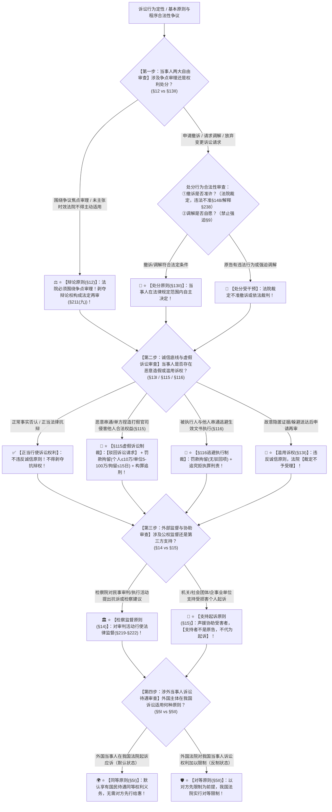

# 📐 民诉基本原则 · 全流程答题模型（两大当事人自由 · 诚信底线与虚假诉讼 · 外部监督两只手 · 涉外同等对等两面镜 · §5/§12-§15/§115）

> **教练开场白**
> 同学们好！我是你们的民诉法考教练。在民事诉讼法总论板块中，“民诉基本原则”是**高频出现在客观题多选、单选题中、以“选项归因混淆”和“原则适用边界偷换”为核心特征的常考母题**！
> 很多同学做基本原则题目时经常被命题人的花言巧语带偏：
> 1. **把证据规则胡乱归因到“平等原则”**：看到原告对转款事实承担举证责任，选项写“这体现了当事人诉讼地位平等原则”，不少同学觉得“很有道理”就选了（大错特错！举证责任分配是证据规则，平等原则只管诉讼地位与机会平等，根本不解决谁来举证！）；
> 2. **把“处分自由”绝对化**：以为当事人申请撤诉法院就必须准许（撤诉是否准许由法院裁定，有违法行为需处理的可不准撤诉！）；
> 3. **用“诚信原则”随意剥夺当事人正当抗辩权**：以为被告否认欠款就是不诚信（当事人对未发生的事实进行否认是正当防御，诚信原则禁止的是虚假陈述、单方捏造与滥用诉权！）；
> 4. **把“支持起诉”当成当事人代位起诉**：以为消协、工会支持起诉就是共同原告或代为诉讼（支持起诉者不是当事人，无独立诉讼地位！）；
> 5. **混淆“同等”与“对等”的前提**：以为外国人来华打官司一律适用对等原则（同等原则是默认的国民待遇，对等原则是对方先限制我方后的反制原则！）。
>
> 《民事诉讼法》（2023修正）与《民诉解释》（2022修正），构建了**以“辩论原则定争点、处分原则受干预、诚信底线制裁虚假诉讼、检察监督与支持起诉各司其职、涉外同等默认对等反制”为核心的裁判闭环**。
> 今天我们用**“四步连贯流水线”**，把民诉基本原则的全部定性要件与考场陷阱一次性彻底锁死：**第一步判当事人两大自由（辩论原则围绕争点审理 §12 ＋ 处分原则自由受干预 §13Ⅱ） → 第二步判自由底线与虚假诉讼（诚信原则 §13Ⅰ ＋ 恶意串通捏造虚假诉讼驳回加罚款拘留 §115/§118 ＋ 逃避执行 §116） → 第三步判外部两只手（检察监督抗诉检察建议 §14 ＋ 支持起诉主体非当事人 §15） → 第四步判涉外两面镜（同等原则默认国民待遇 §5Ⅰ vs 对等原则以对方先限制为前提 §5Ⅱ）**！

---

## 适用场景与解决问题

本模型专门解决民事诉讼基本原则识别与归因、辩论原则争点审理与时效抗辩依职权排除、处分原则撤诉裁定许可与调解自愿、诚信原则适用边界与滥用诉权再审排除、虚假诉讼（§115）与规避执行（§116）制裁幅度、检察监督与支持起诉主体资格、涉外同等与对等原则区分的全部主客观题考点（对应 [[民诉-客观题考点全景-深度报告]] 板块A 第1章 1-5/1-6/1-7/1-8 核心考点）：重点破解：

1. **第一步 · 当事人两大自由：辩论原则与处分原则审查关（《民事诉讼法》§12/§13Ⅱ）**：
   - ⭐ **辩论原则（§12 核心考点）**：
     - 法院审理民事案件必须**围绕当事人争议的焦点问题审理裁判**，不得撇开争点自说自话；
     - 🚨 **时效抗辩依职权排除**：当事人未提出诉讼时效抗辩的，**法院绝对不得依职权主动适用诉讼时效规定**（当事人的战场，谁主张谁抗辩）；
     - 违法**剥夺当事人辩论权利的，直接构成法定再审事由（§211(九)）**；
   - ⭐ **处分原则（§13Ⅱ 自由但受干预）**：
     - 当事人有权在**法律规定的范围内**处分民事与诉讼权利（起诉、请求数额、撤诉、调解）；
     - 🚨 **处分受干预的三大考点**：
       - ① **撤诉**：宣判前申请撤诉，**“是否准许由法院裁定”**（§148）；有违法行为需处理的可**不准撤诉**（解释§238）；
       - ② **调解**：应当根据**自愿和合法原则**进行（§9），严禁强迫调解；
       - ③ **二审新增诉请**：原则上不得新增变更，新增诉请只能调解，调解不成告知另行起诉（解释§326）。
2. **第二步 · 自由的底线：诚信原则与虚假诉讼制裁关（《民事诉讼法》§13Ⅰ/§115/§116/§118）**：
   - ⭐ **诚信原则（§13Ⅰ）**：
     - 民事诉讼应当遵循诚信原则；
     - 🚫 **禁反言与滥用诉权制裁**：故意隐匿证据、恶意躲避送达导致公告判决，事后又以“未收到传票/发现新证据”申请再审的，**违反诚信原则，法院不予受理（单选-226）**；
     - 🛡️ **正当抗辩保护**：诚信原则禁止虚假陈述与恶意造假，**绝不能剥夺当事人对事实进行正当否认与抗辩的权利**！
   - ⭐ **虚假诉讼制裁（§115 vs §116 经典对比）**：
     - **§115 虚假诉讼（“骗进来”）**：当事人**恶意串通**或**单方捏造**基本事实起诉，企图侵害国家/社会/他人合法权益的（含案外人 解释§190），法院应当**【驳回其诉讼请求】 ＋ 予以罚款、拘留**；构成犯罪追究虚假诉讼罪；
     - **§116 规避执行（“逃出去”）**：被执行人与他人恶意串通，通过诉讼/仲裁/调解逃避履行生效法律文书确定义务的，**予以罚款、拘留（无“驳回请求”项）**；构成犯罪追究拒不执行判决裁定罪；
   - 💰 **罚款拘留刚性幅度（§118）**：
     - **个人罚款**：**10 万元以下**；
     - **单位罚款**：**5 万元以上 100 万元以下**（对单位主要负责人/直接责任人员可同时罚款拘留 解释§191）；
     - **拘留期限**：**15 日以下**；须经院长批准。
3. **第三步 · 外部两只手：检察监督与支持起诉审查关（《民事诉讼法》§14/§15）**：
   - ⭐ **检察监督原则（§14）**：人民检察院有权对民事审判活动和执行活动实行法律监督；方式为**抗诉与检察建议（§219-§222）**；
   - ⭐ **支持起诉原则（§15）**：
     - **支持主体**：**机关、社会团体、企业事业单位（严格排除公民个人）**；
     - 🚨 **性质定位**：支持起诉是帮助、声援受损害者维权，**支持者不是原告、不能代为起诉、不享有当事人诉讼权利**！
     - ⚖️ 公益诉讼中，法定机关或社会组织提起公益诉讼的，**检察机关可以支持起诉（§58Ⅱ）**。
4. **第四步 · 涉外两面镜：同等原则 vs 对等原则审查关（《民事诉讼法》§5）**：
   - ⭐ **同等原则（§5Ⅰ 默认国民待遇）**：外国人、无国籍人、外国企业和组织在我国法院起诉应诉，与我国公民、法人**享有同等的诉讼权利义务**；**无需对方国家先行给惠，系默认状态**；
   - ⭐ **对等原则（§5Ⅱ 反制原则）**：外国法院对我国公民、法人的民事诉讼权利**加以限制的**，我国法院对该国公民、企业实行**对等原则限制**；**必须以“外国法院先限制我方”为前提**！

> **核心一句**：**辩论围着争点转（时效不提法院不能主动查）；处分自由受把关（撤诉须准、调解须愿）；诚信底线不能穿，串通捏造§115驳回加罚款拘留（个人≤10万/单位5-100万/拘留≤15天）；检察监督管裁判，支持起诉不当原告（仅限单位不含个人）；同等是默认，对等是反制！**
>
> 🔎 **核心法源（2026最新）**：《民事诉讼法》§5、§8、§9、§12、§13、§14、§15、§58Ⅱ、§115、§116、§118、§148、§211(九)、§219-§222；《民诉解释》§92Ⅱ、§190、§191、§238、§326。

---

## 💡 【前置认知】民诉基本原则与核心规制极速对照表

| 原则模块 | 核心法律条文 | 刚性法定规则与标准 | 考场一秒判定秘诀 |
| :--- | :--- | :--- | :--- |
| **① 辩论原则** | 《民事诉讼法》**§12** | 法院围绕当事人**争议焦点**审理；剥夺辩论权＝再审事由。 | 当事人没提诉讼时效，**法院绝不能主动帮提**！ |
| **② 处分原则** | 《民事诉讼法》**§13Ⅱ/§148** | 在法定范围内处分；**撤诉由法院裁定**；调解须自愿。 | 申请撤诉**不是想撤就撤**，有违法行为法院可不准！ |
| **③ 虚假诉讼制裁** | 《民事诉讼法》**§115/§118** | 恶意串通/单方捏造打假官司：**驳回请求 ＋ 罚款拘留**。 | 个人≤10万，单位5-100万，拘留≤15天，构罪判刑！ |
| **④ 支持起诉** | 《民事诉讼法》**§15** | 机关、团体、企事业单位（**无个人**）支持受害人。 | 消协、妇联声援受害者，**但绝不能当共同原告**！ |
| **⑤ 同等 vs 对等** | 《民事诉讼法》**§5** | • 同等（§5Ⅰ）：**默认国民待遇**；<br>• 对等（§5Ⅱ）：**对方先限制才反制**。 | 外企来华默认**同等**；外方先搞霸凌才触发**对等**！ |

---

## 一、 考点核心骨架与法理（四步连贯决策树）



```
【民诉基本原则全景】一句话开场：辩论围着争点转（时效不提法院不能主动查）；处分自由受把关（撤诉须准、调解须愿）；诚信底线不能穿，串通捏造§115驳回加罚款拘留（个人≤10万/单位5-100万/拘留≤15天）；检察监督管裁判，支持起诉不当原告（仅限单位不含个人）；同等是默认，对等是反制！
│
▼ 第一步 · 判两大自由 ── 辩论定争点，处分受干预（§12/§13Ⅱ/§148）
├─ 辩论原则（§12）：围绕当事人争议焦点审理；剥夺辩论权＝再审事由（§211(九)）
│    └─ 🚨 时效抗辩：当事人未主张，法院绝对不得依职权主动适用！
└─ 处分原则（§13Ⅱ）：自由在法定范围内行使
     ├─ 撤诉审查：是否准许由法院裁定（§148）；有违法行为可不准（解释§238）
     ├─ 调解自愿：调解必须自愿合法（§9），严禁强迫调解
     └─ 二审限制：二审新增诉请只能调解，不成告知另诉（解释§326）
          │
          ▼ 第二步 · 判诚信底线 ── 虚假诉讼双制裁与滥诉拦截（§13Ⅰ/§115/§116/§118）
          ├─ 正当抗辩：对未发生事实进行否认，属于合法诉讼权利，不违诚信
          ├─ §115 虚假诉讼（“骗进来”）：恶意串通/单方捏造起诉 ──→【驳回请求 ＋ 罚款拘留 ＋ 构罪追刑】
          ├─ §116 规避执行（“逃出去”）：被执行人串通逃避执行 ──→【罚款拘留 ＋ 追究拒执刑责】
          ├─ 罚拘刚性幅度（§118）：个人≤10万元、单位5万–100万元、拘留≤15日
          └─ 滥用诉权（藏证据躲送达再申请再审）：违反诚信原则 ──→【法院裁定不予受理】
               │
               ▼ 第三步 · 判外部两手 ── 检察监督与支持起诉（§14/§15）
               ├─ 检察监督（§14）：检察院对法院审判执行活动法律监督（抗诉/检察建议 §219-§222）
               └─ 支持起诉（§15）：机关/社会团体/企事业单位支持受害人，【不是当事人、不代为起诉】
                    │
                    ▼ 第四步 · 判涉外两镜 ── 同等默认与对等反制（§5）
                    ├─ 同等原则（§5Ⅰ）：外国人在华诉讼【默认享有国民待遇】，无需先行给惠
                    └─ 对等原则（§5Ⅱ）：【以外国法院先限制我国当事人为前提】的反制措施

  ━━━ 四步全通 ━━━
```

---

## 二、 核心考情与 2026 民诉法新规精要

- **频次研判**：民诉基本原则是总论板块**★★★ 基础必考考点**；客观题每年必考 1–2 题，常以“案例事实归因”和“原则边界混淆”方式在选项中设陷阱。
- **2026 命题核心与法理精要**：
  1. **辩论原则 vs 处分原则界限**：审什么看辩论（围绕焦点），诉讼权利行不行使看处分（撤诉/调解/上诉）。
  2. **时效抗辩依职权排除**：法院主动替被告适用诉讼时效，属于违反辩论原则与处分原则的违法裁判行为。
  3. **虚假诉讼制裁三件套（§115）**：驳回请求 ＋ 罚款拘留（个人≤10万，单位5-100万） ＋ 虚假诉讼罪刑责。
  4. **支持起诉主体资格（§15）**：仅限机关、社会团体、企事业单位，**严格排除公民个人**；支持者不是原告。
  5. **同等原则（默认） vs 对等原则（反制）**：涉外主体无前提享受同等待遇；对方搞限制才触发对等限制。

---

## 三、 三大核心法理与命题陷阱拆解

### 1. 基本原则四大命题暗坑与裁判标准表

| 案件事实设定 | 争议焦点 | 裁判结论 | 命题陷阱与法理深剖 |
|---|---|---|---|
| 原告甲起诉被告乙归还借款 50 万元。乙在答辩状及庭审中均未主张诉讼时效抗辩。法院审查发现借款已超过 3 年时效，遂直接判决驳回甲的诉讼请求。 | 法院主动适用诉讼时效抗辩裁判，是否合法？体现了何种原则？ | 🚫 **法院行为违法！严重违反辩论原则与处分原则！** | 《民法典》§193 ＋ 《民事诉讼法》§12：诉讼时效属于当事人的实体抗辩权，**当事人未主张的法院绝对不得主动适用**。法院主动适用属于剥夺当事人辩论权、干预当事人处分权（单选-121）。 |
| 原告甲起诉要求与乙离婚。审理过程中甲申请撤诉。法院查明甲涉嫌对乙实施严重家庭暴力并有虐待行为，需依法追究法律责任。 | 法院是否应当准许甲的撤诉申请？处分原则是否意味着原告撤诉法院必须准许？ | 🚫 **法院可以裁定不准许撤诉！** | 《民事诉讼法》§148 ＋ 《民诉解释》§238：撤诉“是否准许由法院裁定”；当事人有违反法律的行为需要依法处理的，**人民法院可以不准许撤诉**。处分自由受到国家司法权监督干预（单选-135）。 |
| 原告甲与被告乙恶意串通，虚构 500 万元借款协议并起诉至法院，企图通过法院出具民事调解书转移乙的房产，逃避乙的真实债权人丙的执行。 | 法院查明真相后应当如何处理？适用何种制裁措施？ | 🚨 **应当驳回甲的诉请，并对甲乙进行罚款、拘留，追究刑事责任！** | 《民事诉讼法》§115：恶意串通打假官司的，法院应当**驳回其诉讼请求**；依据 §118 对个人处 10 万元以下、单位处 5 万至 100 万元罚款，15 日以下拘留；构成犯罪追究虚假诉讼罪。 |
| 市消费者协会发现某商家销售假冒伪劣商品损害众多消费者权益，遂公开发表声明声援受害者，并协助消费者李某起诉维权。 | 市消协在诉讼中的地位是什么？能否作为共同原告或代为起诉？ | 🤝 **消协属于支持起诉主体，绝不是原告，不能代为起诉！** | 《民事诉讼法》§15：支持起诉主体是声援和协助受害者，**支持者不享有原告的诉讼权利，不得代为起诉**（除非是消协依据 §58 提起的公益诉讼）。 |

---

## 四、 万能解题四步

---

### 第一步：判两大自由 —— 辩论定争点，处分受干预（《民事诉讼法》§12/§13Ⅱ）

> **教练提示**：
> 1. **辩论原则（§12）**：法院围绕争点审理；当事人未提时效抗辩，**法院绝对不得主动适用**；剥夺辩论权 $\rightarrow$ **法定再审事由（§211(九)）**；
> 2. **处分原则（§13Ⅱ）**：撤诉**须法院裁定准许（§148）**，有违法行为可不准；调解**必须自愿（§9）**。

---

### 第二步：判诚信底线 —— 正常防御保护，串通造假驳回加罚（《民事诉讼法》§13Ⅰ/§115/§118）

> **教练提示**：
> 1. **正常防御**：否认未发生的事实 $\rightarrow$ **合法行使诉讼权利，绝不违反诚信**；
> 2. **打假官司（§115）** $\rightarrow$ **驳回诉讼请求 ＋ 罚款拘留（个人≤10万/单位5-100万/拘留≤15天） ＋ 虚假诉讼罪**；
> 3. **规避执行（§116）** $\rightarrow$ **罚款拘留 ＋ 拒执罪**；
> 4. **滥用诉权**（藏证据躲送达再申请再审） $\rightarrow$ **裁定不予受理（单选-226）**！

---

### 第三步：判外部两手 —— 检察监督管裁判，支持起诉不当原告（《民事诉讼法》§14/§15）

> **教练提示**：
> 1. **检察监督（§14）**：抗诉与检察建议；
> 2. **支持起诉（§15）**：主体仅限机关/团体/企事业单位（**不含个人**）；**支持者不是原告，不能代为起诉**！

---

### 第四步：判涉外两镜 —— 同等是默认，对等是反制（《民事诉讼法》§5）

> **教练提示**：
> 1. **同等原则（§5Ⅰ）**：外国人/外企来华打官司 $\rightarrow$ **默认国民待遇（无需对方先行给惠）**；
> 2. **对等原则（§5Ⅱ）**：外方先限制我国当事人 $\rightarrow$ **采取对等限制反制**！

#### 💰 完整数字案例：基本原则综合攻防实战

> **【案情（[[民诉-证据-单选-121]]、[[民诉-保全-单选-135]] 与 [[民诉-审判监督程序-单选-226]] 综合演练）】**
> 甲公司向人民法院起诉乙公司，请求乙公司支付拖欠货款 **50 万元**。
> 1. **第一幕（辩论原则与争点审理）**：庭审中，乙公司抗辩称“甲交付的货物严重不合格”，但乙公司财务人员遗漏了诉讼时效抗辩（该货款实际已逾期 4 年）。法官在审判中发现时效已过，遂主动在判决书中以“已过诉讼时效”为由判决驳回甲公司的诉讼请求。
> 2. **第二幕（处分原则与撤诉审查）**：甲公司上诉后，二审法院查明一审判决违法并裁定发回重审。重审期间，甲公司与乙公司私下达成协议，甲公司向法院申请撤诉。但法院经审查发现，甲乙两公司实际涉嫌**恶意串通虚构 50 万元债务**，企图通过诉讼转移乙公司资产以逃避真实债权人丙公司的 **200 万元**生效执行款。
> 3. **第三幕（虚假诉讼制裁与刑责）**：法院查实上述恶意串通虚假诉讼事实。
>
> - **裁判涵摄**：
>   1. **第一幕裁判**：一审法官主动适用诉讼时效驳回起诉，**严重违反了辩论原则与处分原则**！诉讼时效属于当事人自主处分的抗辩权，法院不得依职权主动适用（单选-121）；
>   2. **第二幕裁判**：甲公司申请撤诉，依据《民事诉讼法》§148 及《民诉解释》§238，因当事人存在恶意串通转移财产的违法行为，法院**有权裁定不准许撤诉**；
>   3. **第三幕裁判**：依据《民事诉讼法》§115、§118 及《民诉解释》§190-§191，法院应当：
>      - **判决驳回甲公司的诉讼请求**；
>      - 对甲公司、乙公司分别处以 **5 万元以上 100 万元以下罚款**；
>      - 对两家公司的法定代表人处以 **10 万元以下罚款及 15 日以下拘留**；
>      - 涉嫌构成虚假诉讼罪的，依法移送公安机关追究刑事责任！

#### 一句话闭环记忆
> 🎯 **一眼判**：**辩论定争点、处分受干预（撤诉须准、调解须愿）；诚信是底线，串通捏造§115驳回加罚，逃避执行§116只罚不驳；检察监督管裁判、支持起诉不当原告；同等是默认、对等是反制！**

---

## 五、 案例演练

### 1. 辩论原则与法院争点审理（[[民诉-证据-单选-121]] 经典真题）
- **案情**：原告起诉归还借款，借条虽真实但未实际转款，被告抗辩未收到钱款，法院围绕转款事实作为焦点进行审理。
- **模型分析**：第一步——依据《民事诉讼法》§12，法院围绕当事人争执的焦点问题进行调查与审理，体现了辩论原则（选 A）。

### 2. 处分原则与撤诉准许限制（[[民诉-保全-单选-135]] 经典真题）
- **案情**：先予执行后原告申请撤诉，法院审查是否准许及已执行款项的处理。
- **模型分析**：第一步——依据《民事诉讼法》§148，撤诉是否准许由法院裁定，体现了处分原则受国家司法权干预的特征（选 C）。

### 3. 诚信原则与滥用诉权再审排除（[[民诉-审判监督程序-单选-226]] 经典真题）
- **案情**：当事人故意隐匿证据并躲避送达导致公告判决，判决生效后又以“未合法送达及发现新证据”申请再审。
- **模型分析**：第二步——违反《民事诉讼法》§13Ⅰ诚信原则，构成滥用诉权，法院裁定不予受理（选 D）。

---

## 关联真题

- [[民诉-证据-单选-121 · 借条真实但未转款与辩论原则]]
- [[民诉-保全-单选-135 · 先予执行后和解撤诉的处理]]
- [[民诉-审判监督程序-单选-226 · 隐匿证据后以公告送达及新证据申请再审违反诚信]]

## 相关页面

- 概念实体页：[[辩论原则]] · [[处分原则]] · [[诚信原则]] · [[虚假诉讼]] · [[检察监督]] · [[支持起诉]] · [[同等原则]] · [[对等原则]]
- 姊妹模型：[[民诉-总论-主管与诉模型]] · [[民诉-总论-四大基本制度模型]] · [[民诉-管辖-管辖确定模型]]
- 综合报告：[[民诉-客观题考点全景-深度报告]]（板块A 第1章 1-5/1-6/1-7/1-8 · ★★/★★★ 核心考区）
