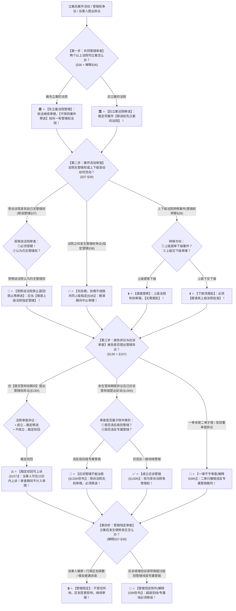

# 📐 管辖变动与异议 · 全流程答题模型（先立案优先 · 移送一次性 · 指定转移 · 异议应诉 · 管辖恒定 · §36-§39/§130）

> **教练开场白**
> 同学们好！我是你们的民诉法考教练。如果说《管辖确定模型》解决了“案件静态归谁管”的问题，那么本模型——“管辖变动与异议”，解决的就是**案件立案后“动起来”该如何处理的动态程序法理（T0-5 顶级必考母题）**！
> 很多同学做管辖变动与异议题目时经常被以下几个“连环考点陷阱”坑得体无完肤：
> 1. **受移送法院“退回”或“再移送”**：以为受移送法院发现自己没有管辖权，就可以直接退回给原法院或者移送给第三家法院（《民事诉讼法》§37 规定：**受移送法院必须受理，不得再自行移送，唯一出路是报请上级法院指定管辖**！）；
> 2. **以为应诉答辩与管辖恒定能包治百病**：以为只要被告应诉答辩了、或者案件受理后，管辖权就铁板一块（《民事诉讼法》§130Ⅱ 与《民诉解释》§39Ⅰ 均明确设置除外但书：**违反级别管辖和专属管辖的，应诉答辩与管辖恒定绝对不能治愈**！）；
> 3. **管辖异议搞错时间窗口**：以为二审、发回重审、按一审程序再审时还可以提出管辖异议（**一审提交答辩状期间是提出管辖权异议的唯一合法窗口**，二审或发回重审提出法院一律不予审查！）；
> 4. **搞反管辖权转移的报批方向**：以为上级提审下级案件需要上级批准（**上级提审下级一审案件属于职权直接调卷无需报批，上级把自己的案件下放交下级审理才必须报请其上级法院批准**！）；
> 5. **先立案法院搞“谦让”移送**：以为两家法院都有管辖权，先立案的法院可以好心移送给另一家法院（《民诉解释》§36 明确禁止：**先立案的法院不得将案件移送给另一有管辖权的法院**！）。
>
> 《民事诉讼法》（2023修正）与《民诉解释》（2022修正），构建了**以“先立案优先、移送只此一次、争议协商指定、转移上提免批下放报批、异议答辩期提出、应诉排除级别专属、管辖恒定”为核心的裁判闭环**。
> 今天我们用**“四步连贯流水线”**，把管辖变动与异议的全部考点一次性彻底锁死：**第一步查多头抢滩（共同管辖先立案优先；先立案禁移送 §36/解释§36） → 第二步查纠错流动（移送管辖一次性禁退回 §37；指定管辖协商不成报共同上级 §38；管辖权转移上提免批下放报批 §39） → 第三步查被告异议与沉默代价（提交答辩状期间为唯一窗口；裁定驳回可上诉；应诉管辖与二审四分法 §130/解释§39/§329） → 第四步查管辖恒定防线（搬家、划界、反诉增加诉请动不了管辖，但超级别线专属线除外 解释§37-§39）**！

---

## 适用场景与解决问题

本模型专门解决两个以上法院共同管辖冲突解决、移送管辖操作规范与受移送法院处理、指定管辖报请路线、管辖权转移上提下放报批规则、管辖权异议提出主体/期限与救济、应诉管辖适用边界与级别专属排除、二审管辖纠错处理、管辖恒定适用的全部主客观题考点（对应 [[民诉-客观题考点全景-深度报告]] 板块A 第2章 2-6/2-7/2-8/2-9 核心考点）：重点破解：

1. **第一步 · 共同管辖与先立案优先审查关（《民事诉讼法》§36 ＋ 《民诉解释》§36）**：
   - ⭐ **先立案优先原则（§36）**：两个以上法院都有管辖权的，原告向两个以上有管辖权的法院起诉的，**由最先立案的人民法院管辖**；
   - 🚨 **先立案法院禁止移送（解释§36）**：先立案的法院**不得将案件移送给另一个有管辖权的法院**；立案前发现他院已立案的不得重复立案；立案后发现他院已先立案的，**裁定移送先立案的法院**。
2. **第二步 · 移送管辖、指定管辖与管辖权转移审查关（《民事诉讼法》§37-§39）**：
   - ⭐ **移送管辖“一次性”铁律（§37 核心做题眼）**：
     - 受移送法院**必须受理**；
     - 🚨 **受移送法院认为自己仍无管辖权的，应当报请上级人民法院指定管辖，绝对不得再自行移送，更不得直接退回（单选-46 / 单选-301）**；
   - ⭐ **指定管辖（§38）**：
     - ① 有管辖权法院因特殊原因不能行使管辖权 $\rightarrow$ 由上级法院指定；
     - ② 法院之间管辖权争议 $\rightarrow$ **先协商；协商不成报请共同上级法院指定管辖（解释§40）**；
   - ⭐ **管辖权转移方向性规则（§39 经典对比）**：
     - **上级提审下级一审案件** $\rightarrow$ **上级法院有权直接提审，无需报批**；
     - **上级把本院一审案件交下级审理** $\rightarrow$ **必须报请其上级法院批准（下放须报批 解释§42）**；
     - 下级认为需要由上级审理的 $\rightarrow$ 可以报请上级法院审理。
3. **第三步 · 管辖权异议与应诉管辖审查关（《民事诉讼法》§130 ＋ 《民诉解释》§39/§329）**：
   - ⭐ **管辖权异议法定要件（§130Ⅰ）**：
     - **提出主体**：当事人（本诉被告为典型；🚨 **无独立请求权第三人无权提出管辖异议 解释§82**）；
     - **提出期限**：**提交答辩状期间（唯一时间窗口）**；
     - **审查结果**：异议成立**裁定移送**；异议不成立**裁定驳回**；
     - 🛡️ **可上诉三裁定之一（§157）**：对管辖异议裁定不服，**可以在 10 日内提起上诉**（小额诉讼异议裁定除外 解释§276）；
   - ⭐ **应诉管辖（§130Ⅱ 沉默的代价）**：
     - 当事人未提出管辖异议，并**应诉答辩或者提出反诉**的，视为受诉法院有管辖权；
     - 🚨 **级别管辖与专属管辖不可治愈（§130Ⅱ但书 压轴暗坑）**：**违反级别管辖和专属管辖规定的除外**！受诉法院即便被告应诉了，也必须裁定移送（多选-30）；
   - 🔄 **二审阶段管辖处理四分法**：
     - ① 一审已应诉答辩或未在答辩期提异议、二审才提 $\rightarrow$ **二审法院不予审查（单选-49 / 单选-302）**；
     - ② 发回重审或按一审程序再审案件提管辖异议 $\rightarrow$ **人民法院不予审查（解释§39Ⅱ 单选-48）**；
     - ③ 二审查明一审**违反专属管辖** $\rightarrow$ **裁定撤销原判并移送有管辖权法院（解释§329）**；
     - ④ 二审查明一审**仅违反协议管辖**等非专属规则 $\rightarrow$ **不撤销原判，继续审理依法裁判（单选-52）**。
4. **第四步 · 管辖恒定原则审查关（《民诉解释》§37/§38/§39Ⅰ）**：
   - ⭐ **管辖恒定三大体现**：
     - ① 受理后当事人住所地、经常居住地变更 $\rightarrow$ **不影响管辖权（解释§37）**；
     - ② 受理后行政区域发生变更 $\rightarrow$ **不得以此为由移送案件（解释§38Ⅰ）**；
     - ③ 受理后原告增加、变更诉请或被告反诉 $\rightarrow$ **不影响管辖权（解释§39Ⅰ）**；
   - 🚨 **恒定原则的例外但书**：增加诉请或反诉导致**违反级别管辖（标的额暴增越级）或专属管辖**的，**不受管辖恒定保护，必须移送管辖（解释§39Ⅰ但书 多选-47）**！

> **核心一句**：**管辖流动四步走：多头有权先立案，先立案的不许让（§36）；立错只移送一次，再错报请指定不退回（§37）；转移上提免批、下放报批（§39）；异议只在答辩期，裁定可上诉；沉默应诉即认账，级别专属治不了（§130）；二审一律不审新异议，只纠专属不纠协议；管辖恒定搬家划界动不了，超级别线必须移！**
>
> 🔎 **核心法源（2026最新）**：《民事诉讼法》§36、§37、§38、§39、§130、§157；《民诉解释》§35、§36、§37、§38、§39、§40、§41、§42、§82、§223、§243、§276、§329、§331。

---

## 💡 【前置认知】管辖变动与异议核心规则极速对照表

| 制度模块 | 核心法律条文 | 刚性法定规则与标准 | 考场一秒判定秘诀 |
| :--- | :--- | :--- | :--- |
| **① 共同管辖** | 《民事诉讼法》**§36**<br>《民诉解释》**§36** | 两个以上法院都有权，由**最先立案的法院**管辖。 | 先立案的**绝不能谦让移送**，后立案的裁定移送！ |
| **② 移送管辖** | 《民事诉讼法》**§37** | 受移送法院应当受理；认为仍无管辖权，**报请上级指定**。 | 受移送法院**严禁退回、严禁再移送**，只能找上级！ |
| **③ 管辖权转移** | 《民事诉讼法》**§39** | • **上级提审下级** $\rightarrow$ **直接提审无需报批**；<br>• **上级交下级审理** $\rightarrow$ **必须报请其上级批准**。 | 向上拿案子直接拿，**向下放案子必须报批**！ |
| **④ 管辖权异议** | 《民事诉讼法》**§130Ⅰ** | 当事人在**提交答辩状期间**提出；裁定驳回可上诉。 | 异议窗口仅在答辩期，**裁定可上诉（可上诉三裁定）**！ |
| **⑤ 应诉管辖** | 《民事诉讼法》**§130Ⅱ** | 未提异议并应诉答辩或反诉视为有管辖权。 | 记住**级别管辖和专属管辖除外**，应诉也治不好！ |
| **⑥ 二审纠错** | 《民诉解释》**§329/§39** | • 查明违反**专属管辖** $\rightarrow$ **撤销原判并移送**；<br>• 查明违反**协议管辖** $\rightarrow$ **不撤销原判继续审**。 | 二审**只撤专属管辖，不撤协议管辖**！ |

---

## 一、 考点核心骨架与法理（四步连贯决策树）



```
【管辖变动与异议全景】一句话开场：管辖流动四步走：多头有权先立案，先立案的不许让（§36）；立错只移送一次，再错报请指定不退回（§37）；转移上提免批、下放报批（§39）；异议只在答辩期，裁定可上诉；沉默应诉即认账，级别专属治不了（§130）；二审一律不审新异议，只纠专属不纠协议；管辖恒定搬家划界动不了，超级别线必须移！
│
▼ 第一步 · 查共同管辖 ── 先立案优先与禁移送（§36/解释§36）
├─ 两个以上法院都有权 ──→ 原告任选其一（选择管辖）
├─ 两家以上都立案 ──────→ 由【最先立案的法院】管辖（后立案的裁定移送）
└─ 🚨 先立案法院 ────────→ 【不得将案件移送】给另一有管辖权法院！
     │
     ▼ 第二步 · 查案件流动 ── 移送、指定与转移（§37-§39）
     ├─ 移送管辖（§37）：受移送法院必须受理；【禁止退回，禁止再自行移送】（只能报请上级指定）
     ├─ 指定管辖（§38）：管辖权争议先协商，协商不成【报请共同上级法院指定】（报请期间中止审理）
     └─ 管辖权转移（§39）：【上级提审免批】；【上级交下级审理必须报请其上级批准】
          │
          ▼ 第三步 · 查被告异议与应诉 ── 答辩期与沉默代价（§130/解释§39/§329）
          ├─ 管辖异议（§130Ⅰ）：当事人必须在【提交答辩状期间】提出；裁定驳回可上诉（§157）
          ├─ 应诉管辖（§130Ⅱ）：未提异议并应诉答辩/反诉视为有管辖权；🚨【级别与专属管辖除外】！
          └─ 二审四分法：
               ├─ 二审才提 / 发回重审提 ──→ 【不予审查】
               ├─ 二审查明一审违反【专属管辖】 ──→ 【裁定撤销原裁判并移送】（解释§329）
               └─ 二审查明一审仅违反【协议管辖】 ──→ 【不撤销，继续审理】
                    │
                    ▼ 第四步 · 查管辖恒定 ── 恒定与除外（解释§37-§39）
                    ├─ 住所地变更、行政区划调整、反诉增加普通诉请 ──→ 🔒【管辖权保持不变】
                    └─ 增加诉请导致【突破级别管辖线】或【涉及专属管辖】 ──→ 🚨【必须移送，不得恒定】

  ━━━ 四步全通 ━━━
```

---

## 二、 核心考情与 2026 民诉法新规精要

- **频次研判**：管辖变动与异议是民诉总论板块**★★★★★ T0-5 顶级必考大户**；客观题每年必考 2–3 题，涉及受移送法院禁止退回、管辖异议答辩期失权、应诉管辖不能治愈级别专属、二审纠错二分法。
- **2026 命题核心与法理精要**：
  1. **受移送法院禁止自行移送与退回（§37）**：只能报请共同上级指定，严禁踢皮球。
  2. **管辖权转移方向规则（§39）**：上级提审下级一审案无需报批；上级交下级审理必须报请其上级批准。
  3. **应诉管辖边界（§130Ⅱ）**：应诉答辩与反诉视为接受管辖，但违反级别管辖和专属管辖的绝对不能治愈。
  4. **二审管辖纠错二分法**：二审发现一审违反专属管辖必须裁定撤销原判；二审发现一审违反协议管辖的不撤销原判继续审理。
  5. **管辖恒定与级别突围（解释§39Ⅰ但书）**：反诉或增加诉请导致标的额超过基层管辖标准跨入中院的，管辖恒定失效，必须移送中院。

---

## 三、 三大核心法理与命题陷阱拆解

### 1. 管辖变动四大命题暗坑与裁判标准表

| 案件事实设定 | 争议焦点 | 裁判结论 | 命题陷阱与法理深剖 |
|---|---|---|---|
| A 区法院受理甲诉乙买卖合同纠纷后，发现双方在合同中有效约定由 B 区法院管辖，遂裁定将案件移送 B 区法院。B 区法院审查后认为原告甲住所地在 C 区，且合同履行地也在 C 区，B 区法院无管辖权。 | B 区法院能否裁定将案件移送给 C 区法院，或者裁定退回 A 区法院？ | 🚫 **绝对不能！B 区法院必须报请共同上级法院指定管辖！** | 《民事诉讼法》§37：移送管辖实行“一次性”铁律；受移送法院认为受移送案件不属于本院管辖的，**应当报请上级法院指定管辖，不得再自行移送，更不能退回**（单选-46 / 单选-301）。 |
| 甲在基层人民法院起诉乙归还借款 200 万元。乙在答辩期内未提出管辖权异议，并到庭进行了实体答辩和质证。后乙发现本省高级法院规定标的额 100 万元以上的一审民商事案件由中级人民法院管辖。乙主张基层法院无管辖权。 | 基层法院能否以乙已经应诉答辩为由，认定受诉法院取得应诉管辖权？ | 🚫 **不能！基层法院必须将案件裁定移送中级人民法院！** | 《民事诉讼法》§130Ⅱ：应诉管辖明确规定**“违反级别管辖和专属管辖规定的除外”**；基层法院审理属于中院管辖的案件属于违反级别管辖，被告的应诉答辩不能治愈级别管辖瑕疵（多选-30）。 |
| 原告甲在基层法院起诉乙归还借款 80 万元（属于基层法院管辖）。案件审理过程中，甲申请增加诉讼请求 50 万元（总标的额达 130 万元，超过了本省基层法院管辖上限）。基层法院以“管辖恒定原则”为由继续审理。 | 基层法院继续审理是否合法？增加诉讼请求导致超级别标准能否适用管辖恒定？ | 🚫 **基层法院做法违法！必须将案件移送中级人民法院！** | 《民诉解释》§39Ⅰ但书：管辖恒定在增加诉请或反诉时，**“违反级别管辖、专属管辖规定的除外”**；增加诉请导致案件标的额跃升至中院级别管辖范围的，不受管辖恒定保护，必须移送中院（多选-47）。 |
| 甲起诉乙侵权赔偿，一审法院判决乙败诉。乙上诉至二审法院，并在上诉状中首次提出：“一审法院没有管辖权，本案应当由乙住所地法院管辖”。二审查明一审法院确无地域管辖权。 | 二审法院是否应当审查乙的管辖异议？是否应当撤销一审判决并移送管辖？ | 🚫 **二审法院对管辖异议不予审查！不得因此撤销一审判决！** | 《民事诉讼法》§130 ＋ 《民诉解释》§329：管辖权异议必须在一审提交答辩状期间提出，二审才提出的**法院不予审查**；二审仅在查明一审违反**专属管辖**时才撤销原判移送，违反一般地域管辖的二审不撤销原判（单选-49 / 单选-52）。 |

---

## 四、 万能解题四步

---

### 第一步：查共同管辖 —— 抢滩多头谁先立案？（《民事诉讼法》§36/解释§36）

> **教练提示**：
> 1. 两家以上法院都有权 $\rightarrow$ **最先立案的法院管辖**；
> 2. 先立案的法院**绝对不能移送给另一家（禁止谦让）**，后立案的裁定移送！

---

### 第二步：查案件流动 —— 移送、指定还是转移？（《民事诉讼法》§37-§39）

> **教练提示**：
> 1. **移送管辖（§37）** $\rightarrow$ 受移送法院**严禁退回、严禁再移送**，认为没管辖权**必须报请上级指定**；
> 2. **指定管辖（§38）** $\rightarrow$ 争议先协商，协商不成**报共同上级法院指定**；
> 3. **管辖权转移（§39）** $\rightarrow$ **上级提审下级无需批准，上级交下级审理必须报批**！

---

### 第三步：查被告异议与应诉 —— 在答辩期提了吗？应诉了能治愈吗？（《民事诉讼法》§130/解释§39/§329）

> **教练提示**：
> 1. **管辖异议**：必须在**提交答辩状期间提出**；裁定驳回**可以上诉（10日）**；
> 2. **应诉管辖**：未提异议并答辩/反诉视为有管辖权，但**级别管辖和专属管辖治不了**；
> 3. **二审纠错**：二审才提异议**不予审查**；二审**只撤销违反专属管辖的原判，不撤销违反协议管辖的原判**！

---

### 第四步：查管辖恒定防线 —— 搬家、划界还是超级别线？（《民诉解释》§37-§39）

> **教练提示**：
> 1. 当事人搬家、行政区划变更、反诉增加普通诉请 $\rightarrow$ **管辖权保持不变（管辖恒定）**；
> 2. 增加诉请导致**标的额暴增越过级别管辖线**或**涉及专属管辖** $\rightarrow$ **管辖恒定失效，必须移送管辖**！

#### 💰 完整数字案例：管辖变动与异议全景攻防实战

> **【案情（[[民诉-管辖-单选-46]]、[[民诉-管辖-多选-30]] 与 [[民诉-管辖-单选-49]] 综合演练）】**
> A 市甲公司起诉 B 市乙公司支付货款 **80 万元**。
> 1. **第一幕（移送管辖操作）**：甲公司向合同签订地 C 市金水区基层法院起诉。金水区法院立案后发现合同约定了 B 市中原区法院管辖，遂裁定将案件移送至 B 市中原区基层法院。中原区法院审查后认为原告住所地在 A 市且交货在 A 市，中原区无实际联系，遂裁定将案件“退回金水区法院”。
> 2. **第二幕（级别管辖与应诉管辖）**：经 A 市与 B 市共同上级省高院指定管辖，确定由 B 市中原区基层法院审理。审理中，甲公司申请增加诉讼请求：要求乙公司支付违约金及赔偿金 **150 万元**（诉讼总标的额达 **230 万元**）。依据该省高级法院标准，一审标的额 200 万元以上的民商事案件由中级人民法院管辖。乙公司未提管辖异议，并到庭进行了全面实体质证与法庭辩论。
> 3. **第三幕（二审管辖异议与判决）**：中原区基层法院一审判决乙公司全额败诉。乙公司上诉至 B 市中级人民法院，在上诉状中主张：“中原区法院一审标的额超过 200 万元违反级别管辖，且中原区法院无地域管辖权，请求撤销一审判决”。
>
> - **裁判涵摄**：
>   1. **第一幕裁判**：中原区法院将案件“退回金水区法院”的做法**严重违法**！依据《民事诉讼法》§37，受移送法院必须受理；认为不属于本院管辖的，**应当报请上级法院指定管辖，不得再自行移送，更不能退回**（单选-46）；
>   2. **第二幕裁判**：甲公司增加诉请导致总标的额达到 230 万元，已跨入中级法院级别管辖范围。依据《民诉解释》§39Ⅰ但书，**管辖恒定在违反级别管辖时失效**；且依据《民事诉讼法》§130Ⅱ但书，**违反级别管辖不能通过应诉答辩治愈**！中原区基层法院继续审理并判决属于违法越权裁判；
>   3. **第三幕裁判**：二审法院审查发现一审违反级别管辖，依据《民事诉讼法》§130Ⅱ 及《民诉解释》§329，二审法院**应当裁定撤销中原区基层法院的一审判决，并将案件移送有管辖权的 B 市中级人民法院作为一审案件审理**（多选-30）！

#### 一句话闭环记忆
> 🎯 **一眼判**：**多头有权先立案，先立案的不许让（§36）；立错只移送一次，再错报请指定不退回（§37）；转移上提免批、下放报批（§39）；异议只在答辩期，裁定可上诉；沉默应诉即认账，级别专属治不了（§130）；二审一律不审新异议，只纠专属不纠协议；管辖恒定搬家划界动不了，超级别线必须移！**

---

## 五、 案例演练

### 1. 移送管辖受移送法院禁止退回（[[民诉-管辖-单选-46]] 经典真题）
- **案情**：受移送法院审查后认为案件不属于本院管辖，裁定退回原移送法院。
- **模型分析**：第二步——依据《民事诉讼法》§37，受移送法院不得自行移送或退回，应当报请上级法院指定管辖（选 D）。

### 2. 违反级别管辖不可应诉治愈（[[民诉-管辖-多选-30]] 经典真题）
- **案情**：基层法院审理属于中级法院级别管辖的案件，被告应诉答辩且案件适用管辖恒定。
- **模型分析**：第三步与第四步——依据《民事诉讼法》§130Ⅱ但书与《民诉解释》§39Ⅰ但书，违反级别管辖不能因应诉答辩或管辖恒定而治愈，必须移送中院（选 ABD）。

### 3. 二审才提管辖异议不予审查（[[民诉-管辖-单选-49]] 经典真题）
- **案情**：被告一审应诉答辩未提异议，一审败诉后二审上诉提出管辖异议。
- **模型分析**：第三步——答辩期是提异议的唯一合法窗口，二审才提法院不予审查（选 B）。

---

## 关联真题

- [[民诉-管辖-多选-32 · 离婚案件管辖与移送后不得再移送]]
- [[民诉-管辖-单选-46 · 移送后受移送法院不得再自行移送]]
- [[民诉-管辖-单选-301 · 受移送法院不得再自行移送]]
- [[民诉-管辖-多选-30 · 违反级别管辖不因应诉或恒定而治愈]]
- [[民诉-管辖-单选-48 · 发回重审后当事人提管辖异议不予审查]]
- [[民诉-管辖-单选-49 · 应诉答辩后二审再提管辖异议不予审查]]
- [[民诉-管辖-单选-52 · 二审查明违反协议管辖的处理]]
- [[民诉-管辖-多选-47 · 管辖恒定级别管辖与下落不明的综合判断]]

## 相关页面

- 概念实体页：[[共同管辖]] · [[移送管辖]] · [[指定管辖]] · [[管辖权转移]] · [[管辖权异议]] · [[应诉管辖]] · [[管辖恒定]]
- 姊妹模型：[[民诉-管辖-管辖确定模型]] · [[民诉-总论-主管与诉模型]]
- 综合报告：[[民诉-客观题考点全景-深度报告]]（板块A 第2章 2-6~2-9 · ★★★★★ T0-5 顶级必考）
