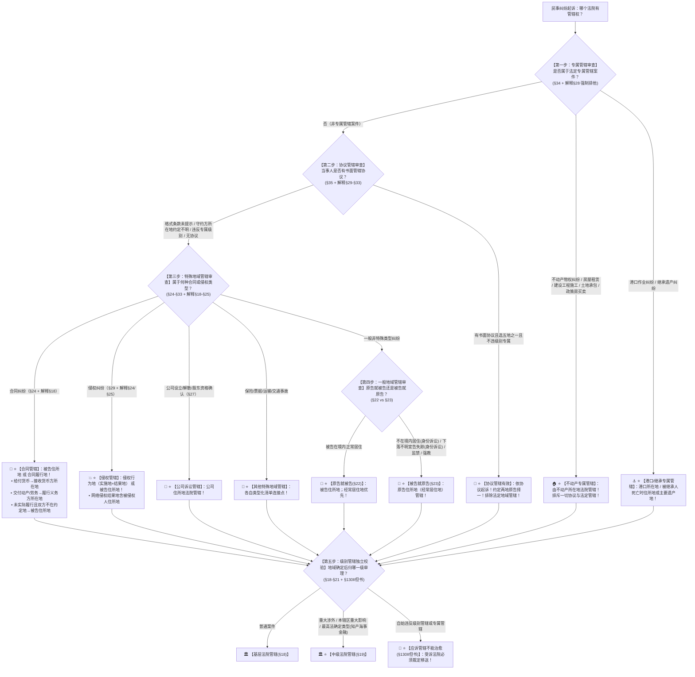

# 📐 管辖确定 · 全流程答题模型（专属排他 · 协议优先 · 特殊类型 · 一般兜底 · 级别校验五步定位链 · §18-§35）

> **教练开场白**
> 同学们好！我是你们的民诉法考教练。在民事诉讼法中，“管辖确定”是**客观题第一大命题密集区（T0-4 顶级必考）、每年必考 3–4 题的绝对大户**！
> 很多同学做管辖题时经常在草稿纸上画了一大堆“原告地、被告地、签约地、履行地”，最后却选错答案。原因在于没有掌握**“五步严格顺位定位链”**：
> 1. **把专属管辖当普通合同**：看到“房屋租赁合同”、“建设工程施工合同”，以为可以约定管辖或走合同履行地（《民诉解释》§28 明确规定：房屋租赁、建设工程施工、农村土地承包、政策性买卖**一律按不动产纠纷专属管辖**！）；
> 2. **把“约定履行地”当成万能铁律**：以为合同写了履行地就必须去那里打官司（《民诉解释》§18Ⅲ 规定：如果合同**没有实际履行**，且双方住所地又**都不在**约定履行地的，必须回归**被告住所地**管辖！）；
> 3. **把“守约方所在地管辖”当有效约定**：以为约定守约方所在地很合理（起诉时谁是守约方无法确定，属于约定不明，协议无效，回归法定管辖！）；
> 4. **把“被告就原告”无限制扩大**：以为被告下落不明就一律在原告地起诉（《民事诉讼法》§23 前两项**严格限于身份关系诉讼**，普通财产欠款诉讼被告下落不明依然原告就被告！）；
> 5. **以为应诉答辩能治愈一切管辖瑕疵**：以为只要被告应诉了法官就能审（《民事诉讼法》§130Ⅱ 明文除外：**违反级别管辖和专属管辖的，应诉答辩绝对不能治愈**！）。
>
> 今天我们用**“五步连贯定位流水线”**，把管辖确定的全部法定规则一次性彻底锁死：**第一步查专属管辖（最强排他：不动产含租赁工程/港口/继承 §34/解释§28） → 第二步查协议管辖（书面五地不违级别与专属 §35；排除格式未提示与守约方不明） → 第三步查特殊地域管辖（合同履行地三分法 §24/解释§18；侵权双地 §29/解释§25；公司/保险/票据/运输清单） → 第四步查一般地域管辖兜底（原告就被告；经常居住地优先；四类被告就原告严格限身份 §22/§23） → 第五步查级别管辖独立校验（中院一审清单；专门法院；违反级别管辖不可治愈 §18-§21）**！

---

## 适用场景与解决问题

本模型专门解决各类民事案件一审管辖法院确定、专属管辖与协议管辖冲突、合同履行地三分规则计算、侵权行为实施地与结果地认定、公司诉讼与涉外管辖、主从担保合同管辖竞合的全部主客观题考点（对应 [[民诉-客观题考点全景-深度报告]] 板块A 第2章 2-1/2-2/2-3/2-4/2-5 核心考点）：重点破解：

1. **第一步 · 专属管辖排他审查关（《民事诉讼法》§34 ＋ 《民诉解释》§28）**：
   - ⭐ **专属管辖三大法定类型（§34）**：
     - ① **不动产纠纷** $\rightarrow$ **不动产所在地法院管辖**；
     - ② **港口作业纠纷** $\rightarrow$ **港口所在地法院管辖**；
     - ③ **继承遗产纠纷** $\rightarrow$ **被继承人死亡时住所地或主要遗产所在地法院管辖**；
   - 🚨 **不动产纠纷范围大扩张（《民诉解释》§28Ⅱ 必考暗坑）**：
     - 不仅包括不动产权属确认、分割、相邻关系等物权纠纷；
     - **农村土地承包经营合同、房屋租赁合同、建设工程施工合同、政策性房屋买卖合同，一律按照不动产纠纷专属管辖**（排斥协议管辖与一般合同管辖 单选-326戴鹏）！
2. **第二步 · 协议管辖审查关（《民事诉讼法》§35 ＋ 《民诉解释》§29-§33）**：
   - ⭐ **有效要件“四合一”（§35）**：
     - ① **案件范围**：合同纠纷或者其他财产权益纠纷（身份关系不得协议管辖）；
     - ② **形式要件**：必须采用**书面协议**（合同中条款或诉前书面协议）；
     - ③ **地点限制**：必须选择与争议有实际联系的地点（**被告住所地、合同履行地、合同签订地、原告住所地、标的物所在地**等）；
     - ④ **底线限制**：**不得违反级别管辖和专属管辖**；
   - 🛡️ **三大协议失效与特殊场景**：
     - **约定两个以上地点**：管辖协议**有效**，原告可择一起诉（解释§30Ⅱ）；
     - **格式条款管辖协议**：经营者未合理提请消费者注意的，**协议无效（解释§31）**；
     - **约定“守约方所在地”**：起诉时守约方无法确定，**约定不明导致协议无法适用，回归法定管辖（多选-319）**；
     - **债权债务转让**：管辖协议对受让人有效；但受让人不知道或另有约定的除外（解释§33）。
3. **第三步 · 特殊地域管辖审查关（《民事诉讼法》§24-§33 ＋ 《民诉解释》§18-§25）**：
   - ⭐ **合同纠纷管辖（§24）**：**被告住所地 或者 合同履行地**；
     - 🧮 **合同履行地确定三分规则（《民诉解释》§18 核心计算考点）**：
       - ① 有约定从约定；
       - ② 无约定或约定不明：
         - 争议标的为**给付货币**的 $\rightarrow$ **接收货币一方所在地（原告要钱原告所在地）**；
         - 争议标的为**交付不动产**的 $\rightarrow$ **不动产所在地**；
         - **其他标的（交付动产、提供劳务）** $\rightarrow$ **履行义务一方所在地（供货方/劳务提供方所在地）**；
       - ③ **即时结清合同** $\rightarrow$ **交易行为地**；
       - 🚨 **未实际履行暗门（解释§18Ⅲ）**：合同**没有实际履行**，且双方住所地又**都不在**约定履行地的，**只能由被告住所地法院管辖**！
     - 💻 **信息网络买卖合同（解释§20）**：线上交付 $\rightarrow$ **买受人住所地**；快递交付 $\rightarrow$ **收货地**；
   - ⭐ **侵权纠纷管辖（§29 ＋ 解释§24/§25）**：**侵权行为地（实施地 ＋ 结果发生地） 或者 被告住所地**；
     - 信息网络侵权：实施地包括设备所在地；结果地包括**被侵权人住所地**；
   - ⭐ **其他类型化清单**：
     - **公司诉讼（设立/股东资格/分配/解散 §27）** $\rightarrow$ **公司住所地**（单选-304）；
     - **保险合同（§25）** $\rightarrow$ **被告住所地或标的物所在地**；代位求偿按侵权基础关系定管辖（单选-303）；
     - **海难救助（§32）与共同海损（§33）** $\rightarrow$ 🚨 **清单中没有“被告住所地”**！
   - ⭐ **主从担保纠纷（《民法典担保解释》§21）**：一并起诉债务人保证人的**按主合同定管辖**；仅起诉保证人的按担保合同定管辖（单选-317/318）。
4. **第四步 · 一般地域管辖兜底审查关（《民事诉讼法》§22/§23 ＋ 《民诉解释》§4）**：
   - ⭐ **原告就被告原则（§22）**：公民由被告住所地（户籍地）管辖；住所地与经常居住地不一致的，**由经常居住地管辖（离开住所地连续居住 1 年以上，住院除外）**；
   - 🛡️ **“被告就原告”四类法定例外（§23 严格限制）**：
     - ① 对**不在我国领域内居住**的人提起的**身份关系诉讼**；
     - ② 对**下落不明或者宣告失踪**的人提起的**身份关系诉讼**（🚨 普通财产欠款诉讼不适用！多选-47）；
     - ③ 对被采取强制性教育措施的人提起的诉讼；
     - ④ 对被监禁的人提起的诉讼。
5. **第五步 · 级别管辖独立校验关（《民事诉讼法》§18-§21 ＋ §130Ⅱ但书）**：
   - ⭐ **四级法院分工**：基层管一审为原则；中院管重大涉外、本辖区重大影响、最高法确定；
   - 🚨 **不可治愈铁律（§130Ⅱ但书）**：违反级别管辖和专属管辖的，**应诉答辩与管辖恒定绝对不能治愈**，受诉法院必须移送！

> **核心一句**：**管辖确定五步走：一问专属硬不硬（不动产港口继承，租赁工程算专属）；二问协议灵不灵（书面五地实际联系，不违级别与专属）；三问类型对不对（合同两腿看履行地，给付货币收钱方；侵权实施与结果；公司纠纷公司地）；四问被告在哪里（经常居住地优先，四类例外就原告）；五问该归哪一级（基层原则中院清单，级别专属治不了）！**
>
> 🔎 **核心法源（2026最新）**：《民事诉讼法》§18-§35、§130；《民诉解释》§4、§18-§33；《民法典担保解释》§21。

---

## 💡 【前置认知】管辖确定核心类型与规则极速对照表

| 管辖模块 | 核心法律条文 | 刚性法定规则与标准 | 考场一秒判定秘诀 |
| :--- | :--- | :--- | :--- |
| **① 专属管辖** | 《民事诉讼法》**§34**<br>《民诉解释》**§28** | • 不动产所在地；港口所在地；遗产所在地；<br>• **房屋租赁/建工施工/土地承包/政策买卖**专属管辖。 | 租房、建楼打官司，**不管怎么约定，全去房子所在地**！ |
| **② 协议管辖** | 《民事诉讼法》**§35**<br>《民诉解释》**§30/§31** | • 书面 ＋ 5 个实际联系地；<br>• 不得违反级别与专属；<br>• 格式条款未提请注意无效；守约方所在地约定不明。 | 选两个地点**有效原告挑**；写“守约方所在地”**无效**！ |
| **③ 合同履行地** | 《民诉解释》**§18** | • 给付货币 $\rightarrow$ **接收货币方所在地（原告要钱原告地）**；<br>• 其他标的 $\rightarrow$ **履行义务方所在地**；<br>• 未履行且双方不在约定地 $\rightarrow$ **被告住所地**。 | 买方要货去**卖方地**，卖方要钱在**卖方地**！未履行找被告！ |
| **④ 侵权管辖** | 《民事诉讼法》**§29**<br>《民诉解释》**§24/§25** | • 侵权行为地（**实施地 ＋ 结果地**）或 被告住所地；<br>• 信息网络侵权：结果地含**被侵权人住所地**。 | 网络侵权被骂，**在自己家门口（被侵权人地）就能告**！ |
| **⑤ 被告就原告** | 《民事诉讼法》**§23** | ①不在境内；②下落不明；③强制教育；④监禁。 | 记住前两项**仅限身份关系（离婚）**，欠钱不算！ |

---

## 一、 考点核心骨架与法理（五步连贯定位决策树）



```
【管辖确定全景】一句话开场：管辖确定五步走：一问专属硬不硬（不动产港口继承，租赁工程算专属）；二问协议灵不灵（书面五地实际联系，不违级别与专属）；三问类型对不对（合同两腿看履行地，给付货币收钱方；侵权实施与结果；公司纠纷公司地）；四问被告在哪里（经常居住地优先，四类例外就原告）；五问该归哪一级（基层原则中院清单，级别专属治不了）！
│
▼ 第一步 · 查专属管辖 ── 最强排他铁律（§34/解释§28）
├─ 不动产物权 ＋ 房屋租赁 ＋ 建设工程施工 ＋ 农村土地承包 ＋ 政策房买卖 ──→ 🏠【不动产所在地】（排斥协议）
├─ 港口作业纠纷 ──────────────────────────────────────────────→ ⚓【港口所在地】
└─ 继承遗产纠纷 ──────────────────────────────────────────────→ 📜【被继承人死亡时住所地 / 主要遗产地】
     │
     ▼ 第二步 · 查协议管辖 ── 约定优先四要件（§35/解释§29-§33）
     ├─ 合法要件：合同财产 ＋ 书面 ＋ 5地实际联系 ＋ 不违级别专属
     ├─ 约定两地有效原告挑；格式条款未提示无效；转让受让人不知不生效
     └─ 🚨 约定“守约方所在地”：起诉时无法确定 ──→ 约定不明无效，回归法定！
          │
          ▼ 第三步 · 查特殊地域管辖 ── 类型化清单（§24-§33/解释§18-§25）
          ├─ 合同纠纷（§24）：【被告住所地】 或 【合同履行地】
          │    ├─ 履行地：给付货币→接收货币方所在地；其他标的→履行义务方所在地
          │    └─ 🚨 未实际履行且双方不在约定地 ──→ 只能找【被告住所地】！
          ├─ 侵权纠纷（§29）：【侵权行为地（实施地＋结果地）】 或 【被告住所地】
          │    └─ 网络侵权：结果地含【被侵权人住所地】
          ├─ 公司诉讼（§27）：设立/决议/分配/解散 ──→ 【公司住所地】
          └─ 担保诉讼（担保解释§21）：一并告按主合同，单独告保证人按担保合同
               │
               ▼ 第四步 · 查一般地域管辖 ── 原告就被告与四例外（§22/§23）
               ├─ 原则：【被告住所地】；经常居住地优先于住所地（连续住满1年）
               └─ 四类例外（被告就原告）：不在境内身份诉讼/下落不明身份诉讼/监禁/强教
                    │
                    ▼ 第五步 · 校验级别管辖 ── 哪一级审理（§18-§21/§130Ⅱ但书）
                    ├─ 基层一审为原则；中院管重大涉外/重大影响/最高法确定
                    └─ 🚨 违反级别与专属管辖：【应诉答辩与管辖恒定绝对无法治愈】！

  ━━━ 五步全通 ━━━
```

---

## 二、 核心考情与 2026 民诉法新规精要

- **频次研判**：管辖确定是民诉总论板块**★★★★★ T0-4 顶级必考大户**；客观题每年必考 3–4 题，覆盖合同履行地计算、房屋租赁/建工专属管辖、网络侵权管辖、管辖协议有效性审查。
- **2026 命题核心与法理精要**：
  1. **不动产专属管辖大扩张（解释§28）**：房屋租赁、建设工程施工、政策房买卖全部按不动产专属管辖，排斥协议管辖。
  2. **合同履行地三分规则（解释§18）**：给付货币争议＝接收货币方所在地（卖方告买方要钱在卖方地，买方告卖方退款在买方地）；未实际履行回归被告住所地。
  3. **守约方所在地协议管辖无效**：起诉时守约方待定，约定不明无效（多选-319）。
  4. **信息网络侵权（解释§25）**：原告在自家电脑前被网络侵权，可以在原告住所地起诉。
  5. **担保纠纷管辖（担保解释§21）**：债权人一并起诉债务人和保证人的，按照主合同确定管辖。

---

## 三、 三大核心法理与命题陷阱拆解

### 1. 管辖确定四大命题暗坑与裁判标准表

| 案件事实设定 | 争议焦点 | 裁判结论 | 命题陷阱与法理深剖 |
|---|---|---|---|
| A 区甲公司与 B 区乙公司签订《房屋租赁合同》，租赁乙公司位于 C 区的商铺。双方在合同中约定：“发生争议由合同签订地 D 区人民法院管辖”。后双方发生租金纠纷，甲起诉至 D 区法院。 | 双方关于 D 区法院管辖的约定是否有效？哪个法院有管辖权？ | 🏠 **管辖协议无效！只能由 C 区法院（不动产所在地）管辖！** | 《民诉解释》§28Ⅱ：房屋租赁合同纠纷**按照不动产纠纷确定专属管辖**；《民事诉讼法》§35：协议管辖**不得违反专属管辖**。约定的 D 区协议管辖因违反专属管辖而绝对无效（单选-326戴鹏）。 |
| 甲（住所地 A 区）与乙（住所地 B 区）签订买卖合同，约定在 C 区交付货物。合同签订后，双方均未实际履行任何内容。甲欲起诉乙解除合同并赔偿损失。 | 甲能否向合同约定的履行地 C 区人民法院提起诉讼？ | 🚫 **不能！只能由被告乙住所地 B 区人民法院管辖！** | 《民诉解释》§18Ⅲ：合同**没有实际履行**，当事人双方住所地又**都不在约定履行地（C区）的，由被告住所地（B区）法院管辖**。约定履行地因未实际履行而失效。 |
| 甲公司与乙公司签订采购合同，约定：“若发生纠纷，由守约方住所地人民法院管辖”。后甲主张乙违约并向甲住所地法院起诉。 | “守约方住所地管辖”的协议条款是否有效？ | 🚫 **约定不明导致协议无法适用！回归法定管辖！** | 《民事诉讼法》§35 ＋ 《民诉解释》§30：管辖协议必须明确具体；在起诉立案阶段**无法预先确定谁是守约方**，该条款属于约定不明，不能据此确定管辖，应当回归法定管辖（多选-319）。 |
| 甲向法院起诉下落不明的乙，要求乙偿还借款本金 50 万元。甲主张依据“被告就原告”原则，由原告甲住所地法院管辖。 | 甲的主张是否成立？下落不明的被告是否一律在原告所在地起诉？ | 🚫 **主张不成立！只能由被告乙原住所地法院管辖！** | 《民事诉讼法》§23第(二)项：“对下落不明或者宣告失踪的人提起的诉讼”，**严格限于身份关系诉讼（如离婚）**！对下落不明的人提起的普通财产欠款诉讼，依然遵循“原告就被告”（多选-47）。 |

---

## 四、 万能解题五步

---

### 第一步：查专属管辖 —— 不动产物权、租房、建楼、港口或继承吗？（《民事诉讼法》§34/解释§28）

> **教练提示**：
> 1. 牢记不动产五大类：**物权 ＋ 房屋租赁 ＋ 建设工程施工 ＋ 农村土地承包 ＋ 政策房买卖** $\rightarrow$ **不动产所在地专属管辖**；
> 2. 专属管辖具有**绝对排他效力**，排斥协议管辖与特殊地域管辖！

---

### 第二步：查协议管辖 —— 有书面协议吗？选的是五地吗？有约定守约方吗？（《民事诉讼法》§35/解释§29-§33）

> **教练提示**：
> 1. 有效要件：**书面 ＋ 5地（原告/被告/履行/签订/标的物） ＋ 不违级别专属**；
> 2. 约定两个地点 $\rightarrow$ **有效，原告挑**；写“守约方所在地” $\rightarrow$ **约定不明无效**！

---

### 第三步：查特殊地域管辖 —— 合同、侵权、公司还是担保？（《民事诉讼法》§24-§33/解释§18）

> **教练提示**：
> 1. **合同履行地三分法（解释§18）**：
>    - 争钱（原告要钱） $\rightarrow$ **接收货币方所在地（原告地）**；
>    - 争货/争劳务 $\rightarrow$ **履行义务方所在地（被告地/供货地）**；
>    - **未实际履行且都不在约定地** $\rightarrow$ **被告住所地**；
> 2. **侵权纠纷** $\rightarrow$ **侵权行为地（实施地＋结果地）或 被告住所地**；
> 3. **公司诉讼** $\rightarrow$ **公司住所地**；
> 4. **担保诉讼** $\rightarrow$ 一并告按主合同，单独告保证人按担保合同。

---

### 第四步：查一般地域管辖 —— 被告在哪里？是四类例外吗？（《民事诉讼法》§22/§23）

> **教练提示**：
> 1. 原则：**被告住所地**；住所与经常居住不一致 $\rightarrow$ **经常居住地优先（满1年）**；
> 2. 四类例外（被告就原告）：不在境内/下落不明**（仅限身份诉讼）**、监禁、强教 $\rightarrow$ **原告住所地**。

---

### 第五步：校验级别管辖 —— 归基层还是中院？应诉能治愈吗？（《民事诉讼法》§18-§21/§130Ⅱ）

> **教练提示**：
> 1. 基层一审为原则；中院管重大涉外/重大影响/最高法确定；
> 2. 🚨 **违反级别与专属管辖，应诉答辩绝对不能治愈**！

#### 💰 完整数字案例：管辖确定全景攻防实战

> **【案情（[[民诉-管辖-单选-33]]、[[民诉-仲裁-单选-326戴鹏]] 与 [[民诉-管辖-多选-319]] 综合演练）】**
> A 区甲公司与 B 区乙公司于 C 区签订一份《大型工业厂房租赁与设备维护合同》，约定：
> 1. 乙公司将位于 **D 区**的一处工业厂房出租给甲公司使用，年租金 **200 万元**；
> 2. 甲公司向乙公司采购配套机电设备一批，价款 **100 万元**；
> 3. 合同争议解决条款约定：“因本合同发生的一切争议，由**合同签订地 C 区人民法院**管辖，或者由**守约方所在地人民法院**管辖”。
> 合同签订后，甲公司依约支付了第一期租金 100 万元及设备预付款 50 万元。后因乙公司迟延交付厂房，甲公司拟向法院起诉：① 请求解除厂房租赁合同并返还已付租金 100 万元；② 请求乙公司交付配套机电设备。
>
> - **裁判涵摄**：
>   1. **厂房租赁纠纷管辖判断**：依据《民事诉讼法》§34 及《民诉解释》§28Ⅱ，房屋租赁合同纠纷**按照不动产纠纷确定专属管辖**。专属管辖具有绝对排他性，合同中约定的 C 区法院管辖及守约方管辖条款**因违反专属管辖而全部无效**！故解除租赁合同纠纷**只能由厂房所在地 D 区人民法院专属管辖**；
>   2. **设备交付纠纷管辖判断**：机电设备买卖属于普通财产合同纠纷：
>      - 约定管辖条款中，“守约方所在地”因起诉时无法确定谁是守约方而属于**约定不明无法适用**；但约定的“合同签订地 C 区法院”符合《民事诉讼法》§35 规定的五地点之一且不违反级别与专属管辖，**该部分约定管辖合法有效**！
>      - 故设备交付买卖纠纷**应当由合同签订地 C 区人民法院管辖**（排除法定地域管辖）！

#### 一句话闭环记忆
> 🎯 **一眼判**：**一问专属硬不硬（不动产港口继承，租赁工程算专属）；二问协议灵不灵（书面五地实际联系，不违级别与专属）；三问类型对不对（合同两腿看履行地，给付货币收钱方；侵权实施与结果；公司纠纷公司地）；四问被告在哪里（经常居住地优先，四类例外就原告）；五问该归哪一级（基层原则中院清单，级别专属治不了）！**

---

## 五、 案例演练

### 1. 合同履行地确定与给付货币（[[民诉-管辖-单选-33]] 经典真题）
- **案情**：委托合同纠纷中，委托人起诉受托人返还委托事务取得的财产（要求给付货币），争议标的为货币。
- **模型分析**：第三步——依据《民诉解释》§18Ⅱ，争议标的为给付货币的，接收货币一方所在地为合同履行地，原告作为收钱方其所在地为履行地（选 A）。

### 2. 房屋租赁专属管辖排除协议管辖（[[民诉-仲裁-单选-326戴鹏]] 经典真题）
- **案情**：房屋租赁合同中约定了管辖法院或仲裁条款，仲裁裁决被撤销后起诉。
- **模型分析**：第一步——依据《民诉解释》§28Ⅱ，房屋租赁合同按不动产专属管辖，必须由房屋所在地法院管辖（选 D）。

### 3. 守约方所在地管辖约定不明（[[民诉-管辖-多选-319]] 经典真题）
- **案情**：当事人在合同中约定“由守约方所在地法院管辖”，后发生争议起诉。
- **模型分析**：第二步——起诉时守约方无法确定，属于约定不明，协议无效，回归法定管辖（选 BC）。

---

## 关联真题

- [[民诉-管辖-多选-30 · 违反级别管辖不因应诉或恒定而治愈]]
- [[民诉-管辖-单选-33 · 委托事务所得返还之诉的管辖]]
- [[民诉-管辖-单选-34 · 离婚后财产纠纷的管辖]]
- [[民诉-管辖-多选-47 · 管辖恒定级别管辖与下落不明的综合判断]]
- [[民诉-管辖-单选-304 · 公司解散之诉由公司住所地管辖]]
- [[民诉-管辖-多选-319 · 守约方所在地管辖约定的效力]]
- [[民诉-仲裁-单选-326戴鹏 · 仲裁裁决被撤销后原仲裁协议失效只能就租赁合同向房屋所在地起诉]]

## 相关页面

- 概念实体页：[[级别管辖]] · [[地域管辖]] · [[特殊地域管辖]] · [[专属管辖]] · [[协议管辖]] · [[合同履行地]]
- 姊妹模型：[[民诉-管辖-管辖变动与异议模型]] · [[民诉-总论-主管与诉模型]]
- 综合报告：[[民诉-客观题考点全景-深度报告]]（板块A 第2章 2-1~2-5 · ★★★★★ T0-4 顶级必考）
