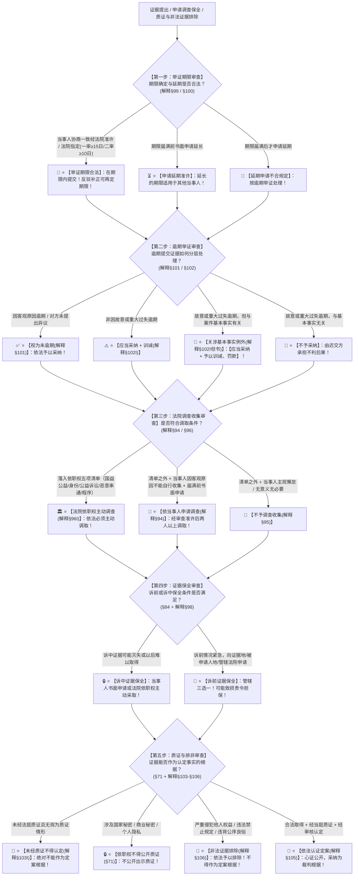

# 📐 举证质证与证据程序 · 全流程答题模型（举证期限 · 逾期分层 · 法院调取 · 证据保全 · 质证排非五步流水线 · §67-§84/解释§94-§106）

> **教练开场白**
> 同学们好！我是你们的民诉法考教练。在民事诉讼法中，“举证质证与证据程序”是**客观题命题人考查程序精细规则、时间节点与司法制裁的常考母题（T1-8 / 4-11~4-14 核心板块，覆盖 15+ 张真题卡）**！
> 很多同学做证据程序题目时经常在以下几个“关键分水岭”上失分：
> 1. **逾期举证以为“一律不予采纳”**：看到被告在开庭后才交出一份关键还款收条，选项写“因逾期举证法院应当不予采纳”（《民诉解释》§102 明确分层：**即便存在故意或重大过失，只要该证据与案件基本事实有关，法院【应当采纳】并予以训诫、罚款**！）；
> 2. **把“依职权调查”和“依申请调取”混淆**：以为法官看案子复杂就可以随便依职权调取证据（《民诉解释》§96 严格限制**五项刚性清单：国家利益/身份关系/公益诉讼/恶意串通/程序事项**；清单之外**一律必须依当事人申请**，且门槛必须是“客观原因不能自行收集”！）；
> 3. **把诉前证据保全管辖同诉前财产保全混记**：以为只能去财产所在地申请（《民事诉讼法》§84 规定：诉前证据保全由**证据所在地、被申请人住所地或者对案件有管辖权的人民法院**管辖，三选一！）；
> 4. **把“涉密证据不得公开质证”同“不公开审理”搞混**：以为商业秘密证据需要当事人申请才能不公开质证（《民事诉讼法》§71 规定：涉及国家秘密、商业秘密和个人隐私的证据，**法院依职权直接决定不得在公开开庭时出示质证**，无需当事人申请！）；
> 5. **以为未经同意的私自录音“一律是非法证据”**：只要看到偷录录音就选排除（《民诉解释》§106 规定：只有**严重侵害他人合法权益、违反法律禁止性规定、严重违背公序良俗**的才属于非法证据；普通的民商事私下谈话录音合法有效！）。
>
> 《民事诉讼法》（2023修正）、《民诉解释》（2022修正）与《民事诉讼证据规定》（2019），构建了**以“限期协商指定、逾期三层分流、调取职权申请两分、保全诉前诉中兼顾、当庭质证排非认证”为核心的证据程序闭环**。
> 今天我们用**“五步连贯流水线”**，把举证质证与证据程序的全部法定规则一次性彻底锁死：**第一步定举证期限（协商经准许；指定一审≥15日/二审≥10日；延期须届满前书面申请 解释§99/§100） → 第二步判逾期举证分层后果（客观原因未逾；无过失采纳＋训诫；重大过失原则不采但关涉基本事实【应当采纳＋训诫罚款】 解释§101/§102） → 第三步查法院调查收集（依职权五项清单 vs 依申请客观原因 解释§94-§97） → 第四步查证据保全（诉中可能灭失 vs 诉前情况紧急三选一管辖；致损责令担保 §84/解释§98） → 第五步查质证排非与认证（未经质证不得认定；涉密依职权不得公开质证；排非三标准 解释§103-§106）**！

---

## 适用场景与解决问题

本模型专门解决举证期限确定/协商/延长、逾期举证分层法律后果（训诫/罚款/采纳与否）、法院依职权五项调查收集证据清单与依申请客观原因范围、证据保全诉前诉中管辖与担保要求、法庭质证对象/涉密证据出示、非法证据排除民诉三标准、认证心证公开的全部主客观题考点（对应 [[民诉-客观题考点全景-深度报告]] 板块B 第4章 4-11/4-12/4-13/4-14 核心考点）：重点破解：

1. **第一步 · 举证期限确定与延长审查（《民诉解释》§99/§100 ＋ 《证据规定》§51）**：
   - ⭐ **期限确定两轨制（解释§99）**：
     - **当事人协商一致** $\rightarrow$ 经人民法院准许即可（天数不受法定下限约束）；
     - **人民法院指定** $\rightarrow$ **一审普通程序不得少于 15 日**；**二审案件当事人提供新证据的不得少于 10 日**；简易程序不得超过 15 日；小额诉讼一般不超过 7 日；
     - 🔄 **反驳与补正**：期限届满后申请提供反驳证据或补正瑕疵的，**法院可酌情再定期限，不受前述天数限制**；
   - 🚨 **申请延长举证期限铁律（解释§100）**：必须在**举证期限届满前提出书面申请**；准许延长的期限适用于其他当事人。
2. **第二步 · 逾期举证分层法律后果审查（《民事诉讼法》§68 ＋ 《民诉解释》§101/§102 核心考点）**：
   - ⭐ **前置程序**：当事人逾期提供证据的，**人民法院应当责令其说明理由**；
   - ⚖️ **精细分层三大裁判出口（解释§102 必考做题眼）**：
     - ① **因客观原因逾期，或者对方当事人未提出异议的** $\rightarrow$ **【视为未逾期】**；
     - ② **非因故意或者重大过失逾期提供证据的** $\rightarrow$ **【人民法院应当采纳，并予以训诫】**；
     - ③ **因故意或者重大过失逾期提供证据的** $\rightarrow$ **【人民法院不予采纳】**；
       - 🚨 **关涉基本事实但书例外（单选-120 经典真题）**：**但该证据与案件基本事实有关的，人民法院【应当采纳，并予以训诫、罚款】**；
   - 💰 **经济补偿**：对方当事人因逾期提供证据增加的差旅、误工等必要费用，可请求赔偿。
3. **第三步 · 法院调查收集证据审查（《民事诉讼法》§67Ⅱ ＋ 《民诉解释》§94-§97）**：
   - ⭐ **法院依职权主动调查五项刚性清单（解释§96Ⅰ 必背）**：
     - ① 涉及可能损害**国家利益、社会公共利益**的事实；
     - ② 涉及**身份关系**的事实；
     - ③ 涉及《民事诉讼法》§58 **公益诉讼**的事实；
     - ④ 当事人有**恶意串通损害他人合法权益可能**的事实；
     - ⑤ 涉及依职权追加当事人、中止诉讼、终结诉讼、回避等**程序性事项**；
   - ⭐ **依申请调查收集（解释§94）**：
     - 清单之外一律**依当事人申请**；
     - 🚨 **申请门槛**：因**客观原因不能自行收集**（由国家有关部门保存无权调取 / 涉及国秘商秘隐私 / 其他客观原因），且须在举证期限届满前书面申请（多选-390）；调查须两人以上进行。<- 当事人因**客观原因无法自行收集**的三类证据，可**书面申请法院调取** , 除了 96 条五项依职权清单外，所有法院取证，全部只能依当事人申请！

 1. **第四步 · 证据保全诉前诉中两轨审查（《民事诉讼法》§84 ＋ 《民诉解释》§98）**：
   - ⭐ **诉中证据保全**：在证据可能灭失或以后难以取得的情况下，**当事人可在举证期限届满前书面申请，法院也可以主动保全**；
   - ⭐ **诉前证据保全**：因情况紧急，利害关系人可在起诉前申请；
     - 📍 **管辖法院三选一**：**【证据所在地、被申请人住所地或者对案件有管辖权的人民法院】**；
   - 🛡️ **担保要求**：可能对他人造成损失的，**人民法院应当责令提供担保（非一律担保 证据规定§26）**；保全错误致损应承担赔偿责任。
5. **第五步 · 质证排非与认证规则审查（《民事诉讼法》§71 ＋ 《民诉解释》§103-§106）**：
   - ⭐ **质证铁律（解释§103Ⅰ）**：**未经质证的证据不得作为认定案件事实的根据**；
     - 🔄 **“视为质证过”两项例外**：审理前准备阶段认可并在庭审说明；准备阶段或法院调查询问中发表过质证意见（证据规定§60）；
   - 🚫 **涉密证据出示（§71）**：涉及国家秘密、商业秘密和个人隐私的证据，**人民法院依职权直接决定不得在公开开庭时出示质证（无需申请 多选-388）**；
   - 🚨 **民诉非法证据排除三标准（解释§106 压轴考点）**：
     - 只有以：**①严重侵害他人合法权益；②违反法律禁止性规定；③严重违背公序良俗**的方法获取的证据，才予以排除！
     - 🎧 **私自录音效力**：未经对方同意在公共或谈话现场进行的私自录音，**不属于严重侵害他人权益，具有证据能力，合法有效（单选-123）**！

> **核心一句**：**期限可商量、指定有下限（一审15二审10）；延期届满前、逾期分三层（客观视为未逾、无过采纳训诫、故意重过原则不采但涉基本事实必须采＋训诫罚款）；调取先看五清单、清单外靠申请、门槛是客观拿不到；保全诉中怕灭失、诉前加紧急、管辖三选一、致损才担保；质证是铁律、未质不认定、涉密不公开、排非看三线、认证讲心证公开！**
>
> 🔎 **核心法源（2026最新）**：《民事诉讼法》§67Ⅱ、§68、§71、§84；《民诉解释》§94、§95、§96、§97、§98、§99、§100、§101、§102、§103、§104、§105、§106；《民事诉讼证据规定》§25-§29、§51、§59、§60。

---

## 💡 【前置认知】证据程序与质证排非核心规则极速对照表

| 制度模块 | 核心法律条文 | 刚性法定规则与标准 | 考场一秒判定秘诀 |
| :--- | :--- | :--- | :--- |
| **① 逾期举证后果** | 《民诉解释》**§102** | • 非故意/重大过失 $\rightarrow$ **应当采纳+训诫**；<br>• 故意/重过但**涉基本事实** $\rightarrow$ **应当采纳+训诫罚款**。 | 只要关系到基本事实，**哪怕故意迟交法官也要采纳**！ |
| **② 依职权调查** | 《民诉解释》**§96Ⅰ** | 限于五项清单：**国家公益/身份关系/公益诉讼/恶意串通/程序事项**。 | 离婚案、打假官司、涉及国家利益，**法官才能主动查**！ |
| **③ 诉前证据保全** | 《民事诉讼法》**§84** | 情况紧急；向**证据地/被申请人地/管辖法院**申请。 | 三地管辖任选一，**可能造成损失才责令担保**！ |
| **④ 涉密证据质证** | 《民事诉讼法》**§71** | 涉及国秘、商秘、隐私的证据，**不得公开出示质证**。 | 法官**依职权直接不公开出示**，不需要当事人申请！ |
| **⑤ 非法证据排除** | 《民诉解释》**§106** | 严重侵犯他人权益/违反法律禁止/违背公序良俗。 | 偷录私聊**合法有效**；装窃听器入室偷拍才排除！ |

---

## 一、 考点核心骨架与法理（五步连贯决策树）



```
【证据程序与质证全景】一句话开场：期限可商量、指定有下限（一审15二审10）；延期届满前、逾期分三层（客观视为未逾、无过采纳训诫、故意重过原则不采但涉基本事实必须采＋训诫罚款）；调取先看五清单、清单外靠申请、门槛是客观拿不到；保全诉中怕灭失、诉前加紧急、管辖三选一、致损才担保；质证是铁律、未质不认定、涉密不公开、排非看三线、认证讲心证公开！
│
▼ 第一步 · 定举证期限 ── 协商指定与延期（解释§99/§100）
├─ 协商一致经法院准许 ──→ 可以（不受下限限制）
├─ 法院指定 ──→ 一审普通≥15日；二审新证据≥10日（简易≤15日/小额≤7日）
└─ 延期申请 ──→ 【举证期限届满前书面申请】，延长期限适用于其他当事人
     │
     ▼ 第二步 · 判逾期分层 ── 三层精细分流（民诉法§68/解释§102）
     ├─ 客观原因 / 对方无异议 ──→ 【视为未逾期】
     ├─ 非因故意重大过失 ──────→ 【应当采纳 ＋ 训诫】
     └─ 故意重大过失 ────────→ 原则【不予采纳】
          └─ 🚨 但涉案件基本事实 ──→ 【应当采纳 ＋ 训诫、罚款】！
               │
               ▼ 第三步 · 查法院调取 ── 职权五项与申请客观（解释§94-§97）
               ├─ 依职权五清单：①国家公共利益 ②身份关系 ③公益诉讼 ④恶意串通 ⑤程序事项
               └─ 依申请调取：清单外一律依申请；门槛为【客观原因不能自行收集】
                    │
                    ▼ 第四步 · 查证据保全 ── 诉中怕灭失与诉前三选一（§84/解释§98）
                    ├─ 诉中保全：可能灭失或以后难以取得，当事人申请或法院主动
                    ├─ 诉前保全：情况紧急，向【证据地 / 被申请人地 / 管辖法院】申请
                    └─ 担保规则：可能造成他人损失的【应当责令提供担保】
                         │
                         ▼ 第五步 · 查质证排非 ── 未质不采与排非三线（§71/解释§103-§106）
                         ├─ 质证铁律：【未经质证的证据不得作为认定事实根据】
                         ├─ 涉密出示：涉国秘/商秘/隐私，法院【依职权不得公开质证】
                         ├─ 非法证据排除：严重侵害他人合法权益/违反法律禁止/违背公序良俗
                         └─ 私录录音：普通私聊录音【不属于非法证据】，具有证据能力

  ━━━ 五步全通 ━━━
```

---

## 二、 核心考情与 2026 民诉法新规精要

- **频次研判**：举证质证与证据程序是民诉板块**★★ 常考细节考点**；客观题每年必考 1–2 题，涉及逾期举证关涉基本事实采纳、依职权调查五项清单识别、涉密证据不公开质证、非法证据排除界限。
- **2026 命题核心与法理精要**：
  1. **逾期提交收条关涉基本事实（解释§102）**：即使故意迟交，只要关系到还款基本事实，法院必须采纳并罚款训诫（单选-120）。
  2. **法院依职权调查五项清单（解释§96）**：普通侵权、借款不能依职权调查，必须由当事人申请（多选-390）。
  3. **诉前证据保全管辖**：证据所在地、被申请人住所地、管辖法院三选一。
  4. **涉密证据不公开质证（§71）**：法院依职权直接不公开出示，无需申请。
  5. **私自录音合法性（解释§106）**：未触犯三条红线的私下录音合法有效（单选-123）。

---

## 三、 三大核心法理与命题陷阱拆解

### 1. 证据程序四大命题暗坑与裁判标准表

| 案件事实设定 | 争议焦点 | 裁判结论 | 命题陷阱与法理深剖 |
|---|---|---|---|
| 原告甲起诉被告乙偿还借款 50 万元。法官指定举证期限 20 日。举证期限届满后开庭审理时，乙当庭掏出一张由甲亲笔签名的 50 万元“还款收条原件”。甲以逾期举证为由请求法官不予采纳。 | 乙在举证期限届满后提交关键收条，法院应当如何处理？能否直接不予采纳？ | 🚨 **法院应当采纳该收条，但应当对乙予以训诫、罚款！** | 《民诉解释》§102Ⅰ但书：逾期提供的证据**与案件基本事实有关的，人民法院应当采纳，并予以训诫、罚款**。还款收条直接决定借贷债务是否消灭，属于基本事实，不能因逾期而不予采纳（单选-120）。 |
| 甲起诉乙借款纠纷。甲主张乙名下有大额银行存款但甲无权调取，甲遂向法院申请调取乙的银行流水。法院审查认为借款纠纷不属于身份关系或公益案件，遂以“法院只对五项法定情形调查”为由驳回申请。 | 法院驳回甲申请调取银行流水的理由是否正确？ | 🚫 **法院理由错误！银行流水属于当事人因客观原因不能自行收集的证据，应当依申请调取！** | 《民事诉讼法》§67Ⅱ ＋ 《民诉解释》§94：国家机关或金融机构保存无权查阅的证据，属于**当事人因客观原因不能自行收集的证据，法院应当依申请调查收集**。五项清单是“依职权调查”，不能用来拒绝当事人的正当申请（多选-390）。 |
| 甲公司起诉乙公司侵害商业秘密。原告甲提交了一份记载核心配方的核心技术图纸作为证据。甲未向法院申请不公开审理，开庭审理时，法官在公开法庭上向旁听人员展示了该涉密图纸进行质证。 | 法官在公开开庭时展示涉密商业秘密证据是否合法？ | 🚫 **法官行为违法！涉密证据依职权不得在公开开庭时出示质证！** | 《民事诉讼法》§71：涉及国家秘密、商业秘密和个人隐私的证据，**需要在法庭出示的，不得在公开开庭时出示**。这是法官的法定刚性义务，与当事人是否申请不公开审理无关（多选-388）。 |
| 原告甲为了证明与被告乙存在买卖合同关系，在双方一次业务洽谈中，未经乙同意使用手机私下录制了双方关于货物价格与交货时间的完整对话。乙主张该录音未经其同意属于非法证据应予排除。 | 甲私下录制的录音是否属于非法证据？能否作为证据使用？ | ✅ **不属于非法证据！具有证据能力，可以作为证据使用！** | 《民诉解释》§106：民诉非法证据排除仅限于**严重侵害他人合法权益、违反法律禁止性规定、严重违背公序良俗**三种情形；普通私下谈话录音未侵害乙的合法隐私，不属于非法证据（单选-123）。 |

---

## 四、 万能解题五步

---

### 第一步：定举证期限 —— 协商还是指定？延期在届满前提了吗？（《民诉解释》§99/§100）

> **教练提示**：
> 1. 法院指定：一审普通 $\ge 15$ 日，二审新证据 $\ge 10$ 日；
> 2. 延期申请：**必须在举证期限届满前书面提出**！

---

### 第二步：判逾期分层 —— 是客观原因吗？关涉基本事实了吗？（《民诉解释》§101/§102）

> **教练提示**：
> 1. 客观原因/无异议 $\rightarrow$ **视为未逾期**；
> 2. 无过失 $\rightarrow$ **应当采纳 ＋ 训诫**；
> 3. 🚨 **故意/重过但涉基本事实（如还款收条） $\rightarrow$ 应当采纳 ＋ 训诫、罚款**！

---

### 第三步：查法院调取 —— 是五项职权清单还是客观原因申请？（《民诉解释》§94/§96）

> **教练提示**：
> 1. 依职权五项：**国家公益、身份关系、公益诉讼、恶意串通、程序事项**；
> 2. 清单外一律依申请：**客观原因（银行/行政部门保存无权查阅）**！

---

### 第四步：查证据保全 —— 诉中怕灭失还是诉前情况紧急？（《民事诉讼法》§84）

> **教练提示**：
> 1. 诉中：证据可能灭失或以后难以取得；
> 2. 诉前：情况紧急；**证据地、被申请人地、管辖法院三选一**；
> 3. 可能致损**应当责令提供担保**！

---

### 第五步：查质证排非 —— 质证了吗？涉密公开了吗？私录过线了吗？（《民诉解释》§103-§106）

> **教练提示**：
> 1. **未经质证不得作为认定事实根据**；
> 2. 涉密证据**依职权不得公开质证**；
> 3. 排非看三线：**未经同意私录不等于非法证据**！

#### 💰 完整数字案例：证据程序与质证排非全景攻防实战

> **【案情（[[民诉-证据-单选-120]]、[[民诉-证据-单选-123]] 与 [[民诉-再审-多选-388]] 综合演练）】**
> 原告甲起诉被告乙支付拖欠货款 **80 万元**。
> 1. **第一幕（证据调取与私录录音合法性）**：甲为了证明交货事实，在未征得乙同意的情况下，在商务洽谈室录制了一段双方确认收货 80 万元货物的现场对话录音；同时，甲向法院申请调取乙公司在工商部门备案的财务年报档案（甲无权调取）。
> 2. **第二幕（涉密质证与开庭出示）**：乙公司提交了一份涉及其独家工艺商业秘密的技术说明书以证明甲交付的货物严重不合格。法庭公开审理中，甲主张乙未申请不公开审理，要求法官公开出示质证。
> 3. **第三幕（逾期举证与基本事实采纳）**：法院指定的举证期限为 20 日。在开庭辩论终结前，被告乙因重大过失突然提交了一张由原告甲签署的已收款 **40 万元**的银行收条原件。原告甲以乙逾期举证且属于重大过失为由要求法院一律不予采纳。
>
> - **裁判涵摄**：
>   1. **第一幕裁判**：
>      - 依据《民诉解释》§106，甲在洽谈室录制的谈话录音未严重侵犯乙的合法权益，**不属于非法证据，具有证据能力（单选-123）**；
>      - 依据《民诉解释》§94，工商备案档案属于当事人因客观原因不能自行收集的证据，**法院应当依甲的申请进行调查收集（多选-390）**；
>   2. **第二幕裁判**：依据《民事诉讼法》§71 及《民诉解释》§103，涉及商业秘密的证据需要在法庭出示的，**人民法院依职权应当决定不得在公开开庭时出示质证，无需当事人申请（多选-388）**；
>   3. **第三幕裁判**：依据《民诉解释》§102Ⅰ但书，乙提交的 40 万元收条直接关涉本案欠款数额的基本事实，**即便乙存在重大过失，法院亦【应当采纳该收条】，并对乙予以训诫、罚款（单选-120）**！

#### 一句话闭环记忆
> 🎯 **一眼判**：**期限可商量、指定有下限（一审15二审10）；延期届满前、逾期分三层（客观视为未逾、无过采纳训诫、故意重过原则不采但涉基本事实必须采＋训诫罚款）；调取先看五清单、清单外靠申请、门槛是客观拿不到；保全诉中怕灭失、诉前加紧急、管辖三选一、致损才担保；质证是铁律、未质不认定、涉密不公开、排非看三线、认证讲心证公开！**

---

## 五、 案例演练

### 1. 逾期提交收条与基本事实采纳（[[民诉-证据-单选-120]] 经典真题）
- **案情**：被告在举证期限届满后才提交借款还款收条，原告主张不予采纳。
- **模型分析**：第二步——依据《民诉解释》§102，收条关涉案件基本事实，法院应当采纳并予以训诫、罚款（选 C）。

### 2. 私自录音的证据能力（[[民诉-证据-单选-123]] 经典真题）
- **案情**：当事人未经对方同意私下录制谈话录音，对方主张构成非法证据。
- **模型分析**：第五步——依据《民诉解释》§106，私录录音未触犯三条红线，不属于非法证据，具有证据能力（选 B）。

### 3. 法院依职权与依申请调查收集（[[民诉-证据-多选-390]] 经典真题）
- **案情**：审查哪些情形属于法院依职权调查，哪些属于当事人客观原因依申请调取。
- **模型分析**：第三步——依据《民诉解释》§94与§96，涉及身份关系、恶意串通依职权调查，银行流水凭证属于依申请调查（选 BC）。

---

## 关联真题

- [[民诉-证据-单选-120 · 逾期提交收条与关乎基本事实的采纳]]
- [[民诉-证据-单选-123 · 私自录音的证据能力]]
- [[民诉-证据-多选-390 · 法院依职权与依申请调查收集证据]]
- [[民诉-再审-多选-388 · 再审中的质证对象与不公开出示]]
- [[民诉-证据-单选-376 · 举证时限的确定与延长]]
- [[民诉-证据-单选-378 · 二审逾期提交证据的处理]]

## 相关页面

- 概念实体页：[[举证期限]] · [[逾期举证]] · [[法院调查收集证据]] · [[证据保全]] · [[质证]] · [[非法证据排除]]
- 姊妹模型：[[民诉-证据-证据种类与形式模型]] · [[民诉-证据-证明责任与免证自认模型]]
- 综合报告：[[民诉-客观题考点全景-深度报告]]（板块B 第4章 4-11~4-14 · ★★ 证据程序核心区）
