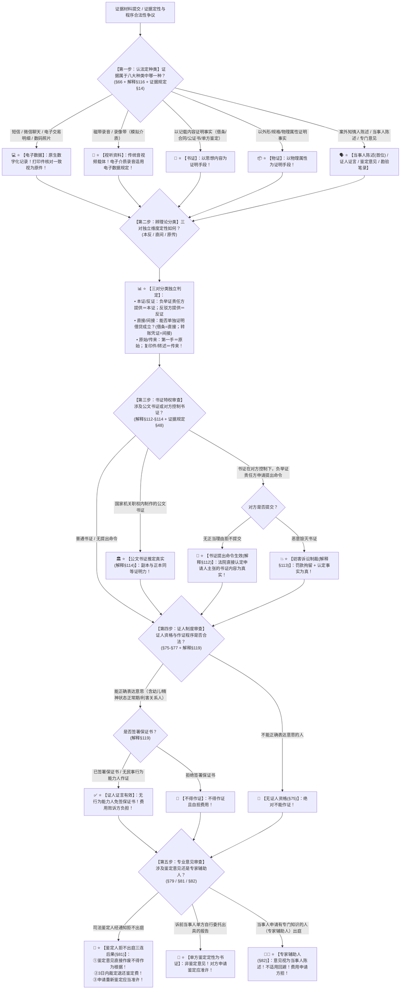

# 📐 证据种类与形式 · 全流程答题模型（八大种类 · 三对分类 · 书证提出命令 · 证人出庭 · 鉴定与专家辅助人五步定位链 · §66-§82）

> **教练开场白**
> 同学们好！我是你们的民诉法考教练。在民事诉讼法证据编中，“证据种类与形式”是**客观题考查证据定性、分类与程序规范的核心必考板块（T1-8 / T1-9 高频考点，覆盖 40+ 张真题卡）**！
> 很多同学做证据种类与分类题目时经常在以下几个“命题经典暗坑”上踩雷：
> 1. **混淆电子数据与视听资料**：看到微信聊天记录、转账记录、数码相机拍摄的照片，选项写“视听资料”（大错特错！原生数字信息一律归为**电子数据**！传统的磁带录音、录像带才属于狭义视听资料，电子介质存储的录音录像适用电子数据规定！）；
> 2. **混淆理论分类的三对独立维度**：以为“复印件不能当直接证据”，或者“间接证据就是反证”（三对分类完全独立：本证/反证看负不负举证责任，直接/间接看能否单独证明待证事实，原始/传来看是不是第一手来源；借条复印件是**传来证据＋直接证据**，转账凭证是**书证＋原始证据＋间接证据**！）；
> 3. **书证提出命令后果记错**：控制书证的对方当事人无正当理由拒不提交，以为法院只能拘留罚款（《民诉解释》§112 刚性后果：**人民法院可以直接认定申请人所主张的书证内容为真实**！）；
> 4. **把证人资格与年龄、行为能力挂钩**：以为 8 岁的小孩、精神病人不能作证（《民事诉讼法》§75 规定：**唯一消极条件是不能正确表达意思**；能表达意思的未成年人可以作证，且无民事行为能力人作证**免签保证书**！）；
> 5. **鉴定人拒不出庭后果降级**：以为鉴定人不来开庭法官也可以酌情采纳（《民事诉讼法》§81 与《证据规定》§81 铁律：**鉴定人经通知拒不出庭的，鉴定意见直接作废不得作为认定事实根据 ＋ 3日内责令退还鉴定费 ＋ 重新鉴定应当准许**！）；
> 6. **把专家辅助人意见当成独立证据种类**：以为专家辅助人意见属于鉴定意见（《民事诉讼法》§82 明确：**专家辅助人发表的意见视为当事人的陈述**，不是独立证据种类，不适用回避！）。
>
> 《民事诉讼法》（2023修正）、《民诉解释》（2022修正）与《民事诉讼证据规定》（2019），构建了**以“八类法定形式进门、三维理论定性定型、书证提出命令倒逼交证、证人出庭免签规则、专业意见刚性出庭与陈述归位”为核心的证据规则闭环**。
> 今天我们用**“五步连贯流水线”**，把证据种类与形式的全部法定规则一次性彻底锁死：**第一步认法定种类（八大种类清单：陈书物视电证鉴勘 §66；电子数据 vs 视听资料 解释§116/证据规定§14） → 第二步辨理论分类（本证反证看责任、直接间接看单独、原始传来溯源头） → 第三步查书证特权与提出命令（原件规则、公文书证推定真 解释§114、拒不提交认内容为真 解释§112） → 第四步查证人制度（能表达即可作证；拒签保证书不得作证但无行为能力人免签；出庭四项例外；费用败诉方承担 §75-§77） → 第五步查专业意见（鉴定人拒不出庭意见作废退费重新鉴定 §81；诉前单方委托定性书证；专家辅助人意见视为当事人陈述 §82）**！

---

## 适用场景与解决问题

本模型专门解决各类诉讼证据的法定种类识别、电子数据与视听资料界分、书证与物证区分、证据三大理论分类判定、书证原件规则与书证提出命令、证人资格与保证书出庭特则、司法鉴定启动/出庭/退费、专家辅助人诉讼地位的全部主客观题考点（对应 [[民诉-客观题考点全景-深度报告]] 板块B 第4章 4-1/4-2/4-3/4-4/4-5 核心考点）：重点破解：

1. **第一步 · 认法定种类：八大种类与数字化界分（《民事诉讼法》§66 ＋ 《民诉解释》§116 ＋ 《证据规定》§14）**：
   - ⭐ **八大种类法定排序（§66）**：
     - ① **当事人的陈述（排在首位）**；② 书证；③ 物证；④ 视听资料；⑤ 电子数据；⑥ 证人证言；⑦ 鉴定意见；⑧ 勘验笔录；
   - ⭐ **电子数据 vs 视听资料界分标准**：
     - **电子数据（《证据规定》§14 清单）**：手机短信、电子邮件、微信/QQ聊天记录、电子签名、电子交易记录、**数码相机拍摄的照片（单选-368）**、存储于网络与电子介质的文档等原生数字信息；
     - **视听资料（解释§116）**：传统的**模拟介质录音带、录像带**；
     - 🚨 **准用条款**：存储在电子介质中的录音、影像资料，**适用电子数据的规定**（多选-386）；
   - ⭐ **书证 vs 物证定性标准**：
     - **书证**：以文字、符号、图画等**记载的思想内容**证明案件事实（借条、合同、公证书、转账凭证）；
     - **物证**：以物品的**外形、性状、规格、物理属性**证明案件事实（凶器、残次品形状、撞击凹痕）。
1. **第二步 · 辨理论分类：三对独立维度定性（学理通说）**：
   - **谁想要这个法律效果，谁就要对产生该效果的要件事实承担举证证明责任**。
	   - 我想要 “借款债权”，我就要证明借款发生（权利发生）
	   - 被告想要 “债务已经消灭” 的效果，被告就要证明还钱（权利消灭）。
   - ⭐ **第一对：本证 vs 反证（看谁承担举证证明责任）**：
     - **本证**：对该待证事实**负有举证责任的一方**提出的证据（目的是证明事实存在达高度可能性）；
     - **反证**：对该待证事实**不负举证责任的一方**提出的证据（目的是动摇本证，使事实真伪不明即胜诉）；
   - ⭐ **第二对：直接证据 vs 间接证据（看能否单独直接证明主要待证事实）**：
     - **直接证据**：能够**单独直接证明**案件主要事实（如：借条直接证明借款合意，收条直接证明还款事实 单选-124）；
     - **间接证据**：不能单独证明，必须与其他证据结合形成证据链（如：**转账凭证仅能证明资金转移，不能单独证明借贷合意，属于间接证据 单选-99 / 单选-391**）；
   - ⭐ **第三对：原始证据 vs 传来证据（看是否第一手来源）**：
     - **原始证据**：直接来源于案件事实的第一手材料（借条原件、现场录音原件）；
     - **传来证据**：经过派生、复制、转述的第二手材料（**借条复印件、公证书、证人转述听到的话**）；
     - 🚨 **独立性铁律**：**借条复印件 ＝ 传来证据 ＋ 直接证据**；**转账凭证原件 ＝ 原始证据 ＋ 间接证据**！
3. **第三步 · 查书证特权与提出命令（《民诉解释》§112-§114 ＋ 《证据规定》§45-§48）**：
   - ⭐ **公文书证推定真实（解释§114 / 证据规定§91）**：国家机关等职权范围内制作的文书**推定为真实**；公文书证**副本与正本具有相同证明力**；
   - ⭐ **书证提出命令制度（解释§112 / 证据规定§47-§48 核心做题眼）**：
     - 书证在对方当事人控制之下（如财务账簿、记账原始凭证），负举证责任方可在举证期限届满前**书面申请法院责令提交**；
     - 🚨 **对方无正当理由拒不提交的刚性后果**：**人民法院可以认定申请人所主张的书证内容为真实（多选-104 / 多选-384）**；
     - 毁灭书证妨碍使用的，可处**罚款、拘留（解释§113）**且可认定该事实为真。
4. **第四步 · 查证人制度与出庭特则（《民事诉讼法》§75-§77 ＋ 《民诉解释》§119-§120）**：
   - ⭐ **证人资格消极条件（§75 ＋ 证据规定§67）**：
     - 凡知道案件情况的单位和个人均有作证义务；
     - 🚨 **唯一消极条件：不能正确表达意思的人不能作证**；证人资格与年龄、民事行为能力、利害关系统统无关！
   - ⭐ **出庭与保证书特则**：
     - **出庭为原则**：四项例外（健康/路途/不可抗力/其他正当理由）经许可可通过**书面证言、视频传输作证（§76）**；
     - **证人保证书（解释§119）**：作证前须签署保证书；**拒绝签署的不得作证**；🚨 **无/限制民事行为能力人作证免签保证书（多选-111 / 多选-385）**；
     - 证人作证费用由**败诉一方当事人负担（§77）**；证人不适用回避制度。
5. **第五步 · 查专业意见：鉴定 vs 专家辅助人（《民事诉讼法》§79-§82 ＋ 《证据规定》§81）**：
   - ⭐ **鉴定启动与刚性出庭（§79 / §81 核心考点）**：
     - 鉴定**依当事人申请为主**（双方协商确定鉴定人，协商不成法院指定）；
     - 🚨 **鉴定人经通知拒不出庭的“三连后果”（§81 ＋ 证据规定§81）**：
       - ① **鉴定意见直接作废，不得作为认定事实的根据**；
       - ② **3 日内裁定责令鉴定人退还鉴定费用**；
       - ③ **当事人申请重新鉴定的，人民法院应当准许**！
     - 📑 **诉前单方委托鉴定报告**：不属于法定鉴定意见，**定性为书证**；
   - ⭐ **专家辅助人（有专门知识的人 §82 ＋ 解释§122-§123）**：
     - 当事人可申请 **1 至 2 名**专家辅助人出庭对鉴定意见或专业问题发表意见；
     - 🚨 **性质定性**：专家辅助人的意见**【视为当事人的陈述】（落入八种证据的第一种，不是第九种证据！）**；
     - 专家辅助人不适用回避、可与对方专家辅助人对质、费用由申请方负担、**不得参与专业问题之外的法庭审理活动（多选-118 / 多选-382）**。

> **核心一句**：**八类证据排好队（陈书物视电证鉴勘）；数字归电（微信短信数码照）、模拟归视、内容归书、外形归物；本反看责任、直间看单独（转账凭证是间接）、原传看源头（复印件是传来直接）；公文推定真，控制不交认内容，毁灭书证罚拘留；能表达就能作证（无行为能力免签保证书），费用败诉埋单；鉴定人不出庭意见作废还退费，专家辅助人开口算当事人陈述！**
>
> 🔎 **核心法源（2026最新）**：《民事诉讼法》§66、§71、§73、§75、§76、§77、§79、§81、§82；《民诉解释》§112、§113、§114、§116、§119、§120、§122、§123；《民事诉讼证据规定》§14、§15、§45-§48、§67、§81、§91。

---

## 💡 【前置认知】证据种类与形式核心类型极速对照表

| 制度模块 | 核心法律条文 | 刚性法定规则与标准 | 考场一秒判定秘诀 |
| :--- | :--- | :--- | :--- |
| **① 电子数据** | 《证据规定》**§14**<br>《民诉解释》**§116** | 微信、短信、电子交易记录、**数码照片**为电子数据。 | 原生数字代码存电脑手机里的，**全叫电子数据**！ |
| **② 三对理论分类** | 学理通说 | • 本反：看**谁负举证责任**；<br>• 直间：看**能否单独证明**；<br>• 原传：看**是否第一手**。 | 转账凭证是**间接证据**；借条复印件是**传来直接证据**！ |
| **③ 书证提出命令** | 《民诉解释》**§112**<br>《证据规定》**§48** | 对方控制书证**无正当理由拒不提交**：<br>$\rightarrow$ **法院认定申请人主张的书证内容为真实**。 | 账本藏着不交，法官直接**认定对方说的全是真的**！ |
| **④ 证人保证书** | 《民诉解释》**§119**<br>《证据规定》**§71** | 拒绝签署保证书不得作证；<br>• **无/限制行为能力人作证免签保证书**。 | 8岁小孩能说话就能作证，**而且不用签保证书**！ |
| **⑤ 鉴定人拒不出庭** | 《民事诉讼法》**§81**<br>《证据规定》**§81** | • 鉴定意见**直接作废**；<br>• **3日内责令退还鉴定费**；<br>• **重新鉴定应当准许**。 | 鉴定人不来法庭，**报告作废+退钱+重新做**！ |
| **⑥ 专家辅助人** | 《民事诉讼法》**§82**<br>《民诉解释》**§122** | 意见**视为当事人的陈述**；不适用回避；可对质。 | 专家出庭说话**算当事人陈述**，不是鉴定意见！ |

---

## 一、 考点核心骨架与法理（五步连贯决策树）



```
【证据种类与形式全景】一句话开场：八类证据排好队（陈书物视电证鉴勘）；数字归电（微信短信数码照）、模拟归视、内容归书、外形归物；本反看责任、直间看单独（转账凭证是间接）、原传看源头（复印件是传来直接）；公文推定真，控制不交认内容，毁灭书证罚拘留；能表达就能作证（无行为能力免签保证书），费用败诉埋单；鉴定人不出庭意见作废还退费，专家辅助人开口算当事人陈述！
│
▼ 第一步 · 认法定种类 ── 八大种类与数字化界分（§66/解释§116/证据规定§14）
├─ 当事人陈述（排在首位）
├─ 书证（文字内容） vs 物证（物理外形属性）
├─ 电子数据（短信/微信/交易明细/数码照片 证据规定§14）
└─ 视听资料（模拟录音带录像带 解释§116；电子介质音视频适用电子数据规定）
     │
     ▼ 第二步 · 辨理论分类 ── 三维独立判定法
     ├─ 本证（负证明责任方提供） vs 反证（不负证明责任方提供，旨在使事实真伪不明）
     ├─ 直接证据（单独直接证明主要事实） vs 间接证据（转账凭证、视听资料等证据链）
     └─ 原始证据（第一手原件） vs 传来证据（借条复印件 传来+直接）
          │
          ▼ 第三步 · 查书证特权与提出命令 ── 推定真与拒不提交（解释§112-§114）
          ├─ 公文书证：职权文书【推定真实】；副本＝正本证明力（证据规定§91）
          └─ 书证提出命令（解释§112）：对方无正当理由拒不提交 ──→ 【直接认定申请人主张的书证内容为真实】！
               │
               ▼ 第四步 · 查证人制度 ── 资格、保证书与费用（§75-§77/解释§119）
               ├─ 证人资格：唯一消极条件为【不能正确表达意思】（年龄/行为能力/利害关系不设卡）
               ├─ 保证书：作证须签保证书（拒绝不得作证）；【无/限制民事行为能力人免签保证书】
               ├─ 出庭四例外（健康/路途/不可抗力/正当理由） ──→ 许可后书面/视频作证
               └─ 费用承担：证人作证合理费用由【败诉一方当事人负担】（§77）
                    │
                    ▼ 第五步 · 查专业意见 ── 鉴定与专家辅助人（§79/§81/§82）
                    ├─ 鉴定人拒不出庭（§81）：【意见作废不得采信 ＋ 3日内退还鉴定费 ＋ 重新鉴定应准许】
                    ├─ 单方委托报告：不是鉴定意见，【定性为书证】
                    └─ 专家辅助人（§82）：【意见视为当事人陈述】，不适用回避，费用申请方负担

  ━━━ 五步全通 ━━━
```

---

## 二、 核心考情与 2026 民诉法新规精要

- **频次研判**：证据种类与形式是民诉证据板块**★★★★ T1-8/T1-9 核心高频考点**；客观题每年必考 2–3 题，涉及微信数码照片定性、借条复印件分类、书证提出命令认定、证人保证书免签、鉴定人拒不出庭三连制裁。
- **2026 命题核心与法理精要**：
  1. **数码相机照片定性（证据规定§14）**：以数字化代码形式存储，定性为电子数据（单选-368）。
  2. **转账凭证与借条复印件理论分类**：转账凭证为间接证据；借条复印件为直接证据＋传来证据。
  3. **书证提出命令刚性制裁（解释§112）**：无正当理由拒不提交，直接认定申请人主张的内容真实。
  4. **证人保证书免签特则（解释§119）**：无民事行为能力人和限制行为能力人作证免签保证书。
  5. **鉴定人拒不出庭（§81）**：意见作废 ＋ 退还鉴定费 ＋ 重新鉴定应当准许。

---

## 三、 三大核心法理与命题陷阱拆解

### 1. 证据种类与形式四大命题暗坑与裁判标准表

| 案件事实设定 | 争议焦点 | 裁判结论 | 命题陷阱与法理深剖 |
|---|---|---|---|
| 原告甲起诉乙要求归还借款 10 万元，向法院提交了用手机拍摄的借条数码照片，并提交了银行网银转账电子回单。 | 借条数码照片与网银转账电子回单在民诉法定证据中属于何种种类？ | 💻 **两份证据均属于电子数据！** | 《证据规定》§14：通过计算机、手机等数字化介质形成、存储的文档、图片、电子交易记录等，**一律定性为电子数据**。不能因照片显示了文字就认定为书证（单选-368 / 多选-386）。 |
| 原告甲起诉乙归还欠款 50 万元，甲提供了借条复印件一份（原件遗失），同时提供了银行转账凭证原件一份。 | 借条复印件与转账凭证原件分别属于何种理论分类？ | 📊 **借条复印件＝直接证据＋传来证据；转账凭证＝间接证据＋原始证据！** | 理论分类三维度独立：借条复印件直接证明借款事实（直接），系复制品（传来）；转账凭证系第一手材料（原始），但仅能证明款项流转、不能单独证明借贷合意（间接）（单选-99 / 单选-124）。 |
| 甲公司起诉乙公司支付工程款。甲申请法院责令乙提交由乙控制的施工现场记账原始凭证。法院发出书证提出命令后，乙无正当理由拒不提交。 | 法院应当如何处理？能否直接认定甲公司主张的记账数额真实？ | 🚨 **法院可以直接认定甲公司所主张的记账内容真实！** | 《民诉解释》§112 ＋ 《证据规定》§48：控制书证的当事人无正当理由拒不提交的，**人民法院可以认定申请人所主张的书证内容为真实**。书证提出命令具有倒逼举证的法定实体拟制效果（多选-104）。 |
| 案件事实发生时 7 岁的小明目睹了车祸全过程。小明在开庭时出庭作证，但因年幼未签署《证人保证书》。被告主张小明无证人资格且未签保证书证言无效。 | 小明是否具有证人资格？未签保证书是否导致其证言无效？ | ✅ **小明具有证人资格！证言合法有效！** | 《民事诉讼法》§75 ＋ 《民诉解释》§119：证人资格唯一消极条件是“不能正确表达意思”；小明能正确表达具有证人资格；且司法解释明文规定**无/限制行为能力人作证无须签署保证书**（多选-111 / 多选-385）。 |

---

## 四、 万能解题五步

---

### 第一步：认法定种类 —— 八大种类属于哪一种？（《民事诉讼法》§66/证据规定§14）

> **教练提示**：
> 1. 微信/短信/转账记录/数码照片 $\rightarrow$ **电子数据**；
> 2. 磁带/录像带 $\rightarrow$ **视听资料**；
> 3. 思想内容 $\rightarrow$ **书证**；物理外形 $\rightarrow$ **物证**；
> 4. 当事人陈述**排在八类首位**！

---

### 第二步：辨理论分类 —— 三对独立维度怎么定？（学理通说）

> **教练提示**：
> 1. **本反看责任**：负举证责任＝本证；反驳方＝反证；
> 2. **直间看单独**：借条/收条＝直接证据；**转账凭证＝间接证据**；
> 3. **原传看源头**：原件＝原始证据；**复印件＝传来证据**（借条复印件是传来直接）！

---

### 第三步：查书证特权与提出命令 —— 对方控制不交怎么办？（《民诉解释》§112-§114）

> **教练提示**：
> 1. 公文书证 $\rightarrow$ **推定真实，副本与正本同等效力**；
> 2. 书证提出命令 $\rightarrow$ 对方无正当理由拒不提交，**直接认定申请人主张的内容真实**！

---

### 第四步：查证人制度 —— 能正确表达吗？免签保证书吗？（《民事诉讼法》§75-§77）

> **教练提示**：
> 1. 资格：**能表达意思即可（幼儿/利害关系人均可作证）**；
> 2. 保证书：拒绝签署不得作证，但**无/限制行为能力人免签保证书**；
> 3. 费用由**败诉方承担**；证人不回避！

---

### 第五步：查专业意见 —— 鉴定人来了吗？专家辅助人算什么？（《民事诉讼法》§79-§82）

> **教练提示**：
> 1. 鉴定人经通知拒不出庭 $\rightarrow$ **意见作废 ＋ 退钱 ＋ 重新鉴定应当准许**；
> 2. 诉前单方委托报告 $\rightarrow$ **定性为书证**；
> 3. 专家辅助人意见 $\rightarrow$ **视为当事人陈述（不是鉴定意见，不回避）**！

#### 💰 完整数字案例：证据种类与形式全景攻防实战

> **【案情（[[民诉-证据-多选-98]]、[[民诉-证据-多选-104]] 与 [[民诉-证据-多选-118]] 综合演练）】**
> 甲公司起诉乙公司要求支付拖欠设备款 **100 万元**。
> 1. **第一幕（证据法定种类与分类）**：甲公司提交了双方业务员的微信聊天记录截图打印件、手机拍摄的收货单数码照片各一份，以及银行转账网银凭证一份。
> 2. **第二幕（书证提出命令）**：甲公司主张乙公司财务账簿上记载了已确认欠款 100 万元的事实，因该账簿由乙公司控制，甲在举证期限内书面申请法院责令乙公司提交。法院发出书证提出命令后，乙公司无正当理由拒不提交该账簿。
> 3. **第三幕（鉴定与专家辅助人）**：乙公司主张收货单上的公章系伪造并申请印章鉴定。司法鉴定人出具鉴定意见认为公章真实。开庭审理时，乙公司对鉴定意见提出异议，法院通知鉴定人出庭，鉴定人无正当理由拒不出庭。甲公司聘请了印章专家孙教授作为专家辅助人出庭发表专业意见。
>
> - **裁判涵摄**：
>   1. **第一幕裁判**：依据《民事诉讼法》§66 及《证据规定》§14，微信聊天记录打印件与收货单数码照片均属于**电子数据**；银行转账凭证属于**书证 ＋ 原始证据 ＋ 间接证据**（多选-98 / 单选-368）；
>   2. **第二幕裁判**：依据《民诉解释》§112 及《证据规定》§48，乙公司控制账簿且无正当理由拒不提交，**法院可以直接认定甲公司所主张的“账簿记载欠款 100 万元”的事实成立**（多选-104）；
>   3. **第三幕裁判**：
>      - 依据《民事诉讼法》§81 及《证据规定》§81，鉴定人经通知拒不出庭，**该鉴定意见不得作为认定事实的根据，法院应当裁定责令退还鉴定费，乙公司申请重新鉴定的应当准许**；
>      - 依据《民事诉讼法》§82，孙教授作为专家辅助人出庭发表的意见**【视为甲公司的当事人陈述】**，孙教授不适用回避，其费用由甲公司自担（多选-118）！

#### 一句话闭环记忆
> 🎯 **一眼判**：**八类证据排好队（陈书物视电证鉴勘）；数字归电（微信短信数码照）、模拟归视、内容归书、外形归物；本反看责任、直间看单独（转账凭证是间接）、原传看源头（复印件是传来直接）；公文推定真，控制不交认内容，毁灭书证罚拘留；能表达就能作证（无行为能力免签保证书），费用败诉埋单；鉴定人不出庭意见作废还退费，专家辅助人开口算当事人陈述！**

---

## 五、 案例演练

### 1. 数码照片的法定证据定性（[[民诉-证据-单选-368]] 经典真题）
- **案情**：当事人提交数码相机拍摄的照片，审查其证据法定种类。
- **模型分析**：第一步——依据《证据规定》§14，数码照片属于以数字化形式存储的信息，定性为电子数据（选 D）。

### 2. 收条复印件的直接证据属性（[[民诉-证据-单选-124]] 经典真题）
- **案情**：被告提交收条复印件证明已还款事实，审查其理论分类。
- **模型分析**：第二步——收条能单独直接证明还款事实，属于直接证据；复印件属于传来证据，故属于直接证据＋传来证据（选 B）。

### 3. 书证提出命令拒不提交的后果（[[民诉-证据-多选-104]] 经典真题）
- **案情**：负举证责任方申请书证提出命令，控制方无正当理由拒不提交账簿。
- **模型分析**：第三步——依据《民诉解释》§112，法院可以直接认定申请人主张的书证内容为真实（选 AB）。

---

## 关联真题

- [[民诉-证据-多选-98 · 买卖合同与电子转账凭证的证据定性]]
- [[民诉-证据-单选-99 · 借款证据的种类与直接间接分类]]
- [[民诉-证据-单选-124 · 收条复印件的直接证据定性]]
- [[民诉-证据-多选-104 · 书证提出命令与拒不提交的后果]]
- [[民诉-证据-多选-111 · 证人保证书与作证资格]]
- [[民诉-证据-多选-118 · 单方委托鉴定人出庭与专家辅助人]]
- [[民诉-证据-单选-368 · 数码相机照片的证据定性]]

## 相关页面

- 概念实体页：[[法定证据种类]] · [[电子数据]] · [[视听资料]] · [[书证提出命令]] · [[证人制度]] · [[鉴定意见]] · [[专家辅助人]]
- 姊妹模型：[[民诉-证据-证明责任与免证自认模型]] · [[民诉-证据-举证质证与证据程序模型]]
- 综合报告：[[民诉-客观题考点全景-深度报告]]（板块B 第4章 4-1~4-5 · ★★★★ 高频命题区）
