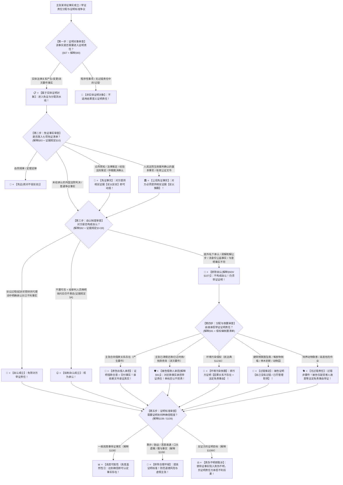

# 📐 证明责任与免证·自认 · 全流程答题模型（证明对象 · 免证事实 · 自认制度 · 举证责任分配与倒置 · 证明标准五步流水线 · §67/解释§90-§109）

> **教练开场白**
> 同学们好！我是你们的民诉法考教练。在民事诉讼法中，“证明责任与免证·自认”是**民诉全卷考查频次最高、分值最大、被称为‘证据编半壁江山’的绝对核心（T0-7 顶级必考 ＋ T1-10 高频考点，覆盖 30+ 张真题卡）**！
> 很多同学做证明责任题目时经常掉入以下几大“逻辑陷阱”：
> 1. **把庭外私下承认/调解让步当成自认**：看到微信聊天里被告说“我确实欠你钱”，或者调解时为了息事宁人同意赔 5 万，以为构成了自认（大错特错！自认**仅限于诉讼过程中及诉讼书面材料中**；庭外认账只是普通证据材料，调解和解中的让步承诺**调解不成绝对不能作为不利证据认定自认**！）；
> 2. **把免证事实的反驳门槛混为一谈**：以为所有免证事实都需要“足以推翻”（《证据规定》§10 明确分层：众所周知、法律推定、经验法则、仲裁裁决**“足以反驳”即可动摇**；只有法院生效裁判确认的基本事实和公证文书才需要**“足以推翻”**！）；
> 3. **把“否认对方主张”当成自己要举证**：原告拿出一张借条，被告否认签名是自己的，以为被告要证明“签名是假的”（《民诉解释》§91 铁律：**谁依赖文书主张权利，谁对文书签名的真实性承担证明责任**！被告单纯否认不承担举证责任！）；
> 4. **把特殊侵权倒置的对象搞混**：以为特殊侵权把原告的全部举证责任都倒置了（环境污染倒置的是**因果关系与免责事由**，污染事实、损害仍由原告证；建筑物/堆放物/林木倒置的是**过错**；饲养动物、高度危险属于**无过错责任**，过错根本不是证明对象！）；
> 5. **混淆一般证明标准与提高标准**：以为合同违约、借贷纠纷需要排除合理怀疑（民事诉讼一般证明标准是**高度可能性**；只有对**欺诈、胁迫、恶意串通**，以及**口头遗嘱、赠与**事实的证明，才提高到**排除合理怀疑**！）。
>
> 《民事诉讼法》（2023修正）、《民诉解释》（2022修正）与《民事诉讼证据规定》（2019），构建了**以“证明对象框定、免证清单过滤、自认免除证明、法律要件与侵权倒置分配、标准层级定案”为核心的证明流水线闭环**。
> 今天我们用**“五步连贯流水线”**，把证明责任与免证自认的全部法定规则一次性彻底锁死：**第一步判证明对象（实体要件事实进入证明责任；无过错责任不过错） → 第二步判免证事实（自然规律免证不可反驳；推定/仲裁足以反驳即动摇；生效裁判/公证须足以推翻 解释§93/证据规定§10） → 第三步判自认制度（诉讼内明确承认；拟制自认经释明；排除庭外私下与调解让步；身份公益不适用 解释§92/证据规定§3-§9） → 第四步判举证责任分配与倒置（法律要件分类说：主张存在证产生、抗辩消灭证消灭；特殊侵权各倒其项 §1222/§1230/§1253-§1257） → 第五步判证明标准（一般高度可能性；五类提高至排除合理怀疑 解释§108/§109；反证使事实真伪不明即胜诉）**！

---

## 适用场景与解决问题

本模型专门解决各类民事案件事实证明对象确定、免证事实清单与反驳门槛认定、自认构成要件/拟制自认/共同诉讼自认/自认排除与撤销、法律要件分类说举证责任分配（合同/借贷/担保/代理权）、特殊侵权举证责任倒置与过错推定要件甄别、证明标准高度可能性与排除合理怀疑适用的全部主客观题考点（对应 [[民诉-客观题考点全景-深度报告]] 板块B 第4章 4-6/4-7/4-8/4-9/4-10 核心考点）：重点破解：

1. **第一步 · 判证明对象：实体要件与免除（《民事诉讼法》§67 ＋ 《民诉解释》§90）**：
   - ⭐ **证明对象范围**：产生、变更、消灭实体民事法律关系的基本事实；
   - 🚫 **非证明对象排除**：程序性事项不适用结果证明责任；无过错责任侵权中的“过错”根本不是要件，无需证明。
2. **第二步 · 判免证事实：七项清单与反驳门槛分层（《民诉解释》§93 ＋ 《证据规定》§10 核心考点）**：
   - ⭐ **免证事实七项清单**：
     - ① 自然规律及定理定律 $\rightarrow$ **免证（不可反驳）**；
     - ② 众所周知的事实；
     - ③ 根据法律规定推定的事实；
     - ④ 根据已知事实和经验法则推定的事实；
     - ⑤ **仲裁机构生效裁决所确认的事实**；
     - ⑥ **人民法院发生法律效力的裁判所确认的基本事实（单选-88）**；
     - ⑦ **有效公证文书所证明的事实**；
   - 🚨 **反驳门槛两档刚性分层（《证据规定》§10 必考做题眼）**：
     - **第二项至第五项（含仲裁裁决）** $\rightarrow$ **当事人有相反证据【足以反驳】即可动摇（无需推翻）**；
     - **第六项（生效裁判）与第七项（有效公证）** $\rightarrow$ **当事人有相反证据【足以推翻】除外**；
     - 🚫 **未经我国承认的外国法院判决**：不属于免证事实（单选-103）。
3. **第三步 · 判自认制度：构成、拟制、限制与撤销（《民诉解释》§92 ＋ 《证据规定》§3-§9）**：
   - ⭐ **自认成立要件（证据规定§3）**：
     - 在**法庭审理中**，或者在**起诉状、答辩状、代理词等书面材料中**，对于己不利的事实明确表示承认；
     - 🚨 **三大非自认排除**：
       - ① **庭外私下承认 / 微信聊天承认** $\rightarrow$ 不是自认，属于普通证据材料；
       - ② **调解、和解中为妥协认可的事实（解释§107）** $\rightarrow$ **调解不成绝对不得作为不利证据，不构成自认（单选-85）**；
       - ③ **附条件/附期限承认** $\rightarrow$ 由法院综合判断是否成立；
   - ⭐ **拟制自认（证据规定§4）** $\rightarrow$ 当事人既不承认也不否认，**经审判人员说明并询问后仍不明确表态的，视为承认**；
   - ⭐ **共同诉讼自认（证据规定§6）**：普通共同诉讼一人自认仅对自认者有效；必要共同诉讼一人自认他人否认不生效，他人经释明仍沉默视为全体自认（多选-87）；
   - 🚫 **自认限制四情形（解释§92Ⅱ/Ⅲ）**：涉及**身份关系、国家利益、社会公共利益**等依职权调查事实不适用自认；自认事实**与查明事实不符的人民法院不予确认（单选-84）**；
   - 🔄 **自认撤销（证据规定§9）**：须在**法庭辩论终结前**提出 ＋ **经对方同意或证明系受胁迫/重大误解作出** ＋ 法院裁定准许。
4. **第四步 · 判举证责任分配与特殊侵权倒置（《民诉解释》§91 ＋ 《民法典》侵权编）**：
   - ⭐ **法律要件分类说一般分配铁律（解释§91）**：
     - **主张法律关系存在者** $\rightarrow$ 承担**产生该法律关系基本事实**的举证责任（借贷合意＋款项交付由出借人原告证）；
     - **主张法律关系变更、消灭或权利受妨害者** $\rightarrow$ 承担**变更、消灭、受妨害基本事实**的举证责任（**已还款抗辩由借款人被告证 多选-100**；赌债抗辩由借款人证 多选-110）；
     - 🚨 **签名与文书真伪举证原则**：**谁依赖文书主张权利，谁对文书签名的真实性承担举证责任并申请鉴定**！被告单纯否认签名不承担举证责任（多选-107 / 多选-108 / 多选-114）；
   - ⭐ **特殊侵权倒置类型化清单（记清倒置的是什么要件！）**：
     - ① **环境污染与生态破坏（§1230）** $\rightarrow$ 倒置**【因果关系不存在 ＋ 法定免责/减责事由】**（排污行为与损害由原告证）；
     - ② **医疗损害三情形（§1222）** $\rightarrow$ **【推定医疗机构有过错】**（违反诊疗规范/隐匿病历/伪造篡改病历）；
     - ③ **建筑物脱落坠落（§1253）、堆放物倒塌（§1255）、林木折断（§1257）、动物园动物致害（§1248）** $\rightarrow$ **【过错推定，被告证明自己无过错】**（单选-92 / 单选-380）；
     - ④ **饲养动物（§1245）、高度危险作业（§1236-§1239）** $\rightarrow$ **【无过错责任】**，过错不是要件，被告仅就**法定免责事由（受害人故意/重大过失）举证**。
5. **第五步 · 判证明标准与反证目标（《民诉解释》§108/§109）**：
   - ⭐ **一般证明标准（解释§108）** $\rightarrow$ 达到**【高度可能性（高度盖然性）】**；
   - 🚨 **排除合理怀疑五大提高情形（解释§109 必考陷阱）**：
     - ① **欺诈事实**；② **胁迫事实**；③ **恶意串通事实**；④ **口头遗嘱事实**；⑤ **赠与事实**；
   - 🛡️ **反证方的胜诉目标**：反证无需证明到高度可能性，**只需提供证据使待证事实陷入【真伪不明】状态，法院即依法认定该事实不存在，负举证责任方败诉（解释§108Ⅱ）**！

> **核心一句**：**先框证明对象，免证七项分两档（推定反驳、文书推翻）；自认限于诉讼内，私下调解都不算，身份公益挡自认；分配看要件（存在证产生、抗辩证消灭、依赖文书证真实），倒置记要件（污染倒因果、推定倒过错、无过错只剩免责事由）；标准高度可能性，欺诈胁迫恶意串通加口头遗嘱赠与才升排除合理怀疑，反证只求真伪不明！**
>
> 🔎 **核心法源（2026最新）**：《民事诉讼法》§67；《民诉解释》§90、§91、§92、§93、§107、§108、§109；《民事诉讼证据规定》§3-§10；《民法典》§1222、§1230、§1236-§1239、§1245、§1248、§1253、§1255、§1257。

---

## 💡 【前置认知】证明责任与免证自认核心规则极速对照表

| 制度模块 | 核心法律条文 | 刚性法定规则与标准 | 考场一秒判定秘诀 |
| :--- | :--- | :--- | :--- |
| **① 免证事实** | 《证据规定》**§10**<br>《民诉解释》**§93** | • 众所周知/法律推定/经验法则/仲裁裁决 $\rightarrow$ **足以反驳**；<br>• 生效裁判确认基本事实/公证文书 $\rightarrow$ **足以推翻**。 | 前面四项**反驳就动摇**；判决书和公证书必须**推翻**！ |
| **② 自认制度** | 《证据规定》**§3/§8**<br>《民诉解释》**§92** | • 诉讼中/书面材料承认对己不利事实有效；<br>• 庭外私聊、调解让步、**身份公益事实不适用自认**。 | 微信私聊不算自认；调解认输不成**不能当呈堂证供**！ |
| **③ 举证责任分配** | 《民诉解释》**§91** | • 存在证产生；变更消灭证消灭（**已还款由被告证**）；<br>• 谁拿借条谁证签名真实；**单纯否认不用举证**。 | 拿借条要钱证明借条真；被告说还了钱拿收条证明！ |
| **④ 侵权责任倒置** | 《民法典》侵权编 | • 环境污染：倒**因果关系+免责**；<br>• 建筑物/堆放物/林木：倒**过错**；<br>• 动物/高度危险：**无过错责任，仅证免责事由**。 | 污染倒因果；掉东西倒过错；狗咬人无过错只证故意！ |
| **⑤ 证明标准** | 《民诉解释》**§108/§109** | • 一般事实 $\rightarrow$ **高度可能性**；<br>• **欺诈/胁迫/恶意串通/口头遗嘱/赠与** $\rightarrow$ **排除合理怀疑**。 | 骗人胁迫串通假遗嘱送东西，**要达到刑事级严格标准**！ |

---

## 一、 考点核心骨架与法理（五步连贯决策树）



```
【证明责任与免证自认全景】一句话开场：先框证明对象，免证七项分两档（推定反驳、文书推翻）；自认限于诉讼内，私下调解都不算，身份公益挡自认；分配看要件（存在证产生、抗辩证消灭、依赖文书证真实），倒置记要件（污染倒因果、推定倒过错、无过错只剩免责事由）；标准高度可能性，欺诈胁迫恶意串通加口头遗嘱赠与才升排除合理怀疑，反证只求真伪不明！
│
▼ 第一步 · 框证明对象 ── 实体要件事实与排除（§67/解释§90）
├─ 实体要件事实（合同成立/已清偿/侵权行为/损害） ──→ 证明对象
└─ 无过错责任中的“过错” ──→ 根本不是要件，不是证明对象
     │
     ▼ 第二步 · 滤免证清单 ── 七项免证与反驳门槛（解释§93/证据规定§10）
     ├─ 自然规律定理定律 ──→ 免证（不可反驳）
     ├─ 众所周知 / 法律推定 / 经验法则推定 / 仲裁裁决 ──→ 【足以反驳】即可动摇
     ├─ 生效裁判确认基本事实 / 有效公证书 ──→ 必须【足以推翻】
     └─ ❌ 未经我国承认外国判决 ──→ 非免证事实
          │
          ▼ 第三步 · 查自认制度 ── 成立、拟制与排除（解释§92/证据规定§3-§9）
          ├─ 诉讼中/书面材料承认对己不利事实 ──→ 自认成立，免除对方举证
          ├─ 不置可否 ＋ 释明询问仍不表态 ──→ 拟制自认视为承认
          ├─ ❌ 排除：庭外私聊、调解和解让步（解释§107）、身份公益、与查明事实不符
          └─ 撤销自认：辩论终结前 ＋ 对方同意或证明受胁迫/重大误解 ＋ 法院裁定
               │
               ▼ 第四步 · 判举证分配与倒置 ── 法律要件说与侵权倒置（解释§91/侵权编）
               ├─ 存在证产生（出借人证借贷成立）；消灭证消灭（借款人证已还款）
               ├─ 谁拿文书谁证真实；被告单纯否认不担责
               ├─ 特殊侵权倒置清单：
               │    ├─ 环境污染（§1230）：倒【因果关系不存在 ＋ 免责事由】
               │    ├─ 建筑物/堆放物/林木/医疗三情形：倒【过错】（过错推定）
               │    └─ 饲养动物/高度危险：【无过错责任】，仅证免责事由
               │
               ▼ 第五步 · 定证明标准 ── 一般与提高（解释§108/§109）
               ├─ 一般民商事事实 ──→ 【高度可能性】
               ├─ 欺诈/胁迫/恶意串通/口头遗嘱/赠与 ──→ 【排除合理怀疑】
               └─ 反证方目标 ──→ 【使事实真伪不明即胜诉】（解释§108Ⅱ）

  ━━━ 五步全通 ━━━
```

---

## 二、 核心考情与 2026 民诉法新规精要

- **频次研判**：证明责任与免证自认是民诉板块**★★★★★ T0-7 顶级必考大户**；客观题每年必考 4–5 题，涉及还款抗辩举证责任、借条签名真伪鉴定责任、自认成立与调解让步排除、免证事实足以反驳与足以推翻两档门槛、排除合理怀疑适用范围。
- **2026 命题核心与法理精要**：
  1. **已还款抗辩举证责任（解释§91）**：主张债务消灭的借款人承担举证责任（多选-100）。
  2. **签名真伪与鉴定申请**：原告拿借条主张债权，被告否认签名真实，原告承担证明借条真实举证责任并申请鉴定（多选-114）。
  3. **调解让步承诺不得作为自认（解释§107）**：调解不成的让步承诺绝对不能用于不利裁判（单选-85）。
  4. **免证事实反驳门槛分层（证据规定§10）**：仲裁裁决为足以反驳；生效裁判基本事实与公证文书为足以推翻。
  5. **排除合理怀疑适用五类事实（解释§109）**：欺诈、胁迫、恶意串通、口头遗嘱、赠与。

---

## 三、 三大核心法理与命题陷阱拆解

### 1. 证明责任与免证自认四大命题暗坑与裁判标准表

| 案件事实设定 | 争议焦点 | 裁判结论 | 命题陷阱与法理深剖 |
|---|---|---|---|
| 原告甲持有借条起诉被告乙归还借款 20 万元。乙答辩认可借款 20 万元事实，但抗辩称“已于三个月前通过现金全额还清欠款”，甲否认收到还款。 | 关于“借款事实”与“还款事实”，分别由谁承担举证证明责任？ | ⚖️ **借款事实因乙自认而免证；还款事实属于权利消灭要件，由被告乙承担举证责任！** | 《民诉解释》§91 ＋ §92：乙对借款事实的承认为自认，甲无需举证；乙主张借款已清偿属于主张法律关系消灭，**由主张消灭的被告乙承担举证证明责任**。乙不能证明的承担不利后果（单选-95 / 多选-100）。 |
| 原告甲持借条起诉乙归还欠款 50 万元。被告乙抗辩称借条上的签名不是乙本人所签，系甲伪造。甲主张乙应当申请笔迹鉴定证明签名系伪造。 | 借条签名的真实性由谁承担举证责任？应当由谁申请笔迹鉴定？ | 📜 **由原告甲承担借条真实性的举证责任，并由甲申请笔迹鉴定！** | 《民诉解释》§91：主张债权存在的甲依赖借条主张权利，**由甲对产生债权的基本事实（借条签名真实）承担举证责任**；乙单纯否认不承担举证责任。借条真伪陷入真伪不明的，由原告甲承担败诉后果（多选-107 / 多选-114）。 |
| 甲与乙在法官主持调解过程中，乙为达成和解当场承认：“我确实拿了甲的电脑，我同意赔偿甲 3000 元”。后因数额分歧调解未达成。开庭审理中，甲主张乙在调解中的陈述构成自认。 | 乙在调解过程中的让步陈述能否构成自认？法院能否据此认定事实？ | 🚫 **不构成自认！法院绝对不得将调解中的让步作为认定不利事实的根据！** | 《民诉解释》§107：当事人在调解、和解过程中为了达成协议而对案件事实的认可，不得在后继诉讼中作为对其不利的根据。自认仅限于正式诉讼审理过程（单选-85）。 |
| 原告甲起诉主张乙与丙恶意串通签订房屋买卖合同损害甲的债权，请求确认合同无效。法院对“恶意串通”事实应当适用何种证明标准？ | 证明当事人存在“恶意串通”事实，应当适用高度可能性还是排除合理怀疑标准？ | 🚨 **必须达到“排除合理怀疑”的提高证明标准！** | 《民诉解释》§109：对**欺诈、胁迫、恶意串通**事实的证明，以及对**口头遗嘱或者赠与**事实的证明，人民法院确信该待证事实存在的标准为**排除合理怀疑**。恶意串通属于提高标准法定五情形之一（多选-109）。 |

---

## 四、 万能解题五步

---

### 第一步：判证明对象 —— 要件事实进流水线吗？（《民事诉讼法》§67/解释§90）

> **教练提示**：
> 1. 实体权利产生、变更、消灭基本事实 $\rightarrow$ **进入证明流水线**；
> 2. 无过错责任中的“过错”不是要件，无需证明！

---

### 第二步：判免证事实 —— 七项属于哪一档？反驳还是推翻？（《证据规定》§10/解释§93）

> **教练提示**：
> 1. 众所周知/法律推定/经验法则/仲裁裁决 $\rightarrow$ **相反证据【足以反驳】即动摇**；
> 2. 生效裁判基本事实/有效公证书 $\rightarrow$ **相反证据【足以推翻】除外**；
> 3. 外国未承认判决不免证！

---

### 第三步：判自认制度 —— 诉讼内承认吗？调解让步算吗？（《民诉解释》§92/§107）

> **教练提示**：
> 1. 诉讼中/书面材料承认对己不利事实 $\rightarrow$ **自认有效，对方免证**；
> 2. 拟制自认：不置可否 ＋ **审判人员释明询问后仍不表态**；
> 3. 🚨 **庭外私聊、调解和解让步不是自认**；身份公益事实不适用自认！

---

### 第四步：判举证分配与倒置 —— 谁产生？谁消灭？倒置什么？（《民诉解释》§91/侵权编）

> **教练提示**：
> 1. 原告证借贷成立；**被告证已还款、已过时效（消灭要件）**；
> 2. 谁拿借条谁证签名真实；**单纯否认不担责**；
> 3. 侵权倒置：**环境污染倒因果；建筑物堆放物林木倒过错；动物高度危险无过错**！

---

### 第五步：定证明标准 —— 高度可能性还是排除合理怀疑？（《民诉解释》§108/§109）

> **教练提示**：
> 1. 一般事实 $\rightarrow$ **高度可能性**；
> 2. 🚨 **欺诈、胁迫、恶意串通、口头遗嘱、赠与 $\rightarrow$ 排除合理怀疑**；
> 3. 反证方：**使事实真伪不明即胜诉**！

#### 💰 完整数字案例：证明责任与免证自认全景攻防实战

> **【案情（[[民诉-证据-单选-88]]、[[民诉-证据-多选-100]] 与 [[民诉-证据-多选-109]] 综合演练）】**
> 原告张某起诉被告李某，请求判令李某偿还借款本金 **50 万元**及利息。
> 1. **第一幕（自认与还款抗辩举证责任）**：张某提交借条一张（载明借款 50 万元）。李某在答辩状中承认借款事实，但抗辩称已通过现金向张某还款 **30 万元**，并主张剩余 **20 万元**系张某通过欺诈手段让其出具借条。张某否认收到 30 万元现金，亦否认存在欺诈。
> 2. **第二幕（预决免证事实与反驳）**：张某向法院提交了一份生效民事判决书，该判决书查明张某与李某之间存在真实的借贷合意及转账记录，确认借款 50 万元成立。李某提供银行流水进行反驳。
> 3. **第三幕（证明标准与真伪不明判决）**：审理中，李某对其主张的“欺诈事实”仅提供了一份未经对方确认的微信聊天录音；对其主张的“还款 30 万元事实”，李某无法提供收条及转账凭证，还款事实陷入真伪不明状态。
>
> - **裁判涵摄**：
>   1. **第一幕裁判**：李某答辩承认借款 50 万元构成**诉讼中的自认**，张某对借贷成立免除举证责任；李某抗辩已还款 30 万元属于主张权利消灭，依据《民诉解释》§91，**由被告李某对还款事实承担举证证明责任（多选-100）**；
>   2. **第二幕裁判**：依据《民诉解释》§93 及《证据规定》§10，生效裁判确认的基本事实属于**免证事实**，李某必须提供相反证据**达到【足以推翻】的证明程度**方能排除该事实（单选-88）；
>   3. **第三幕裁判**：
>      - 依据《民诉解释》§109，主张“欺诈事实”必须达到**【排除合理怀疑】的提高证明标准**，李某提供的单一录音远未达到排除合理怀疑，法院不予认定欺诈；
>      - 依据《民诉解释》§108Ⅱ 及 §90，还款 30 万元事实陷入真伪不明，**由负有举证证明责任的被告李某承担不利后果，法院应当依法判决李某全额偿还借款本金 50 万元及利息（多选-109）**！

#### 一句话闭环记忆
> 🎯 **一眼判**：**先框证明对象，免证七项分两档（推定反驳、文书推翻）；自认限于诉讼内，私下调解都不算，身份公益挡自认；分配看要件（存在证产生、抗辩证消灭、依赖文书证真实），倒置记要件（污染倒因果、推定倒过错、无过错只剩免责事由）；标准高度可能性，欺诈胁迫恶意串通加口头遗嘱赠与才升排除合理怀疑，反证只求真伪不明！**

---

## 五、 案例演练

### 1. 借条已还款抗辩的举证责任（[[民诉-证据-多选-100]] 经典真题）
- **案情**：原告持借条起诉，被告抗辩已通过现金还款。
- **模型分析**：第四步——依据《民诉解释》§91，已还款属于主张法律关系消灭的抗辩事由，由主张消灭的被告承担举证证明责任（选 AD）。

### 2. 调解让步陈述不构成自认（[[民诉-证据-单选-85]] 经典真题）
- **案情**：当事人在诉讼调解中为了达成协议认可了欠款事实，调解不成后对方主张自认。
- **模型分析**：第三步——依据《民诉解释》§107，调解中的让步认可不得作为不利证据，不构成自认（选 D）。

### 3. 生效裁判确认事实的免证效力（[[民诉-证据-单选-88]] 经典真题）
- **案情**：原告依据生效裁判确认的基本事实主张权利，审查其证明效力与反驳门槛。
- **模型分析**：第二步——依据《证据规定》§10，生效裁判确认的基本事实属于免证事实，对方须提供相反证据足以推翻方可排除（选 A）。

---

## 关联真题

- [[民诉-证据-单选-84 · 自认的成立与四种排除情形]]
- [[民诉-证据-单选-85 · 拟制自认与私下承认的区分]]
- [[民诉-证据-单选-88 · 预决事实与因果关系证明责任的转移]]
- [[民诉-证据-单选-92 · 堆放物倒塌致害的过错推定（干净版）]]
- [[民诉-证据-多选-100 · 借条已还款抗辩的举证责任]]
- [[民诉-证据-多选-107 · 电子签名真伪与共同借款的举证责任]]
- [[民诉-证据-多选-109 · 理财纠纷的证明标准与举证责任转移]]

## 相关页面

- 概念实体页：[[证明责任]] · [[结果证明责任]] · [[免证事实]] · [[自认制度]] · [[举证责任倒置]] · [[证明标准]]
- 姊妹模型：[[民诉-证据-证据种类与形式模型]] · [[民诉-证据-举证质证与证据程序模型]]
- 综合报告：[[民诉-客观题考点全景-深度报告]]（板块B 第4章 4-6~4-10 · ★★★★★ T0-7 顶级必考）
