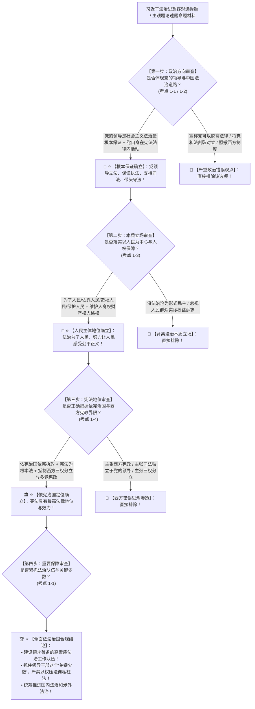

# 📐 习近平法治思想核心要义 · 全流程答题模型（政治方向 · 根本保证 · 人民中心 · 依宪治国四步定位链 · 考点 1-1~1-4）

> **教练开场白**
> 同学们好！我是你们的理论法法考教练。在法考卷一与主观题全卷中，“习近平法治思想核心要义”是**全考场政治站位第一线、主客观题双料超级压轴的第一母题（T0-1 顶级必考，客观题每年稳定输出 3~5 题，主观题第 1 题论述题核心理论基座）**！
> 很多同学做这部分题目时以为“全是政治大话随便选选”，经常在以下几个“命题经典暗坑”上丢分：
> 1. **把“党的领导”与“社会主义法治”割裂甚至对立**：选项出现“党大还是法大”的伪命题陷阱，或者宣称“党组织和党员可以不受宪法法律约束”（大错特错！党的领导是中国特色社会主义法治之魂，是社会主义法治最根本的保证；党领导立法、保证执法、支持司法、带头守法，党自身必须在宪法和法律范围内活动！）；
> 2. **混淆依宪治国与西方所谓“宪政”**：选项写“我国依宪治国就是要吸收西方的宪政理念”（大错特错！我国坚持依宪治国、依宪执政，与西方所谓的“宪政”（三权分立、多党轮流执政、司法独立于执政党）有着本质区别，必须坚决抵制西方错误法治思潮！）；
> 3. **将“十一个坚持”的逻辑层次与战略定位搞混**：把“重点任务”当成“政治方向”，或者把“根本保证”与“本质要求”张冠李戴（政治方向是前 3 个坚持；依宪治国是重要地位；法治体系等是重点任务；涉外法治是重大关系；队伍与关键少数是重要保障！）；
> 4. **对以人民为中心的实质内涵理解狭隘**：以为人民当家作主仅仅体现在投票选举上（习近平法治思想强调法治为了人民、依靠人民、造福人民、保护人民，积极回应人民对民主、法治、公平、正义、安全、环境等新期待，全面保护人民的人身权、财产权、人格权！）。
>
> 今天我们用**“四步连贯流水线”**，把习近平法治思想核心要义的全部考点一次性彻底锁死：**第一步判政治方向（党的领导是根本保证、中国特色社会主义法治道路是唯一正确道路 考点1-1/1-2） → 第二步判本质立场（以人民为中心、人民当家作主、法治为了人民 考点1-3） → 第三步判根本依托（依宪治国与依宪执政、宪法最高地位、与西方宪政本质区别 考点1-4） → 第四步判重要保障与关键少数（法治队伍德才兼备、抓住领导干部这个关键少数 考点1-1）**！

---

## 适用场景与解决问题

本模型专门解决全面依法治国指导思想识别、“十一个坚持”逻辑体系与战略定位、党的领导与社会主义法治关系、依宪治国/依宪执政与西方“宪政”本质界分、以人民为中心法治内涵、抓住领导干部“关键少数”的全部主客观题考点（对应 [[理论法-客观题考点全景-深度报告]] 板块A 第1章 1-1/1-2/1-3/1-4 核心考点）：重点破解：

1. **第一步 · 判政治方向：根本保证与必由之路（考点 1-1 ＋ 考点 1-2）**：
   - ⭐ **党的领导是根本保证（核心做题眼）**：
     - 党的领导是中国特色社会主义最本质的特征，是社会主义法治最根本的保证；
     - **“四项具体要求”**：党领导立法、保证执法、支持司法、带头守法；
     - **“党管政法原则”**：把党总揽全局、协调各方同各级政权组织依法履行职责统一起来；
     - 🚨 **党与法的关系**：党和法的关系是法治建设的核心问题；党领导人民制定宪法法律，党领导人民实施宪法法律，党自身必须在宪法法律范围内活动（**党在法上是伪命题，党在法下是错误思潮，党和法是高度统一的**）；
   - ⭐ **中国特色社会主义法治道路是唯一正确道路**：
     - 坚持党的领导、人民当家作主、依法治国有机统一；
     - 立足中国国情和实际，不照搬照抄西方制度模式。
2. **第二步 · 判本质立场：以人民为中心与人权保障（考点 1-3）**：
   - ⭐ **以人民为中心的法治内核**：
     - 全面依法治国最广泛、最深厚的基础是人民；
     - 法治建设必须坚持**“为了人民、依靠人民、造福人民、保护人民”**；
   - ⭐ **新时代人权法治保障**：
     - 把体现人民利益、反映人民愿望、维护人民权益、增进人民福祉落实到依法治国全过程；
     - 积极回应人民群众对**人身权、财产权、人格权**的新要求新期待，努力让人民群众在每一个司法案件中感受到公平正义。
3. **第三步 · 判根本依托：依宪治国、依宪执政与宪法地位（考点 1-4）**：
   - ⭐ **依宪治国是全面依法治国的首要任务**：
     - 宪法是党和人民意志的集中体现，是通过科学民主程序形成的具有最高法律地位、法律权威、法律效力的国家根本法；
     - 坚持依法治国首先要坚持**依宪治国**，坚持依法执政首先要坚持**依宪执政**；
   - 🚨 **与西方“宪政”的本质区别（高频陷阱）**：
     - 我国的依宪治国、依宪执政，坚持**中国共产党领导、人民民主专政、人民代表大会制度**；
     - 坚决抵制和反对西方所谓“宪政”、“三权分立”、“多党轮流执政”、“司法独立”等错误思潮。
4. **第四步 · 判重要保障：队伍建设与抓住“关键少数”（考点 1-1）**：
   - ⭐ **高素质法治工作队伍**：
     - 坚持建设**德才兼备**的高素质法治工作队伍（立法、执法、司法、法律服务队伍）；
     - 加强法治人才培养，坚持立德树人、德法兼修；
   - ⭐ **抓住领导干部这个“关键少数”**：
     - 领导干部是全面依法治国的关键；领导干部要带头尊崇法治、敬畏法律，了解法律、掌握法律；
     - 坚决克服“以言代法、以权压法、逐利违法、徇私枉法”；把法治素养和依法履职情况纳入考核评价体系。

> **核心一句**：**十一个坚持定航向（党是灵魂国情是路）；党的领导根本保证（立法执法司法守法四领导，党内法内不相悖）；以人民为中心（为了依靠造福保护，公平正义落在个案）；依宪治国第一要务（根本大法最高效力，坚决划清西方宪政）；队伍德才兼备，抓住领导干部关键少数！**
>
> 🔎 **核心理论法源（2026权威）**：《中华人民共和国宪法》序言与总纲；《习近平法治思想概论》；党的二十大报告关于全面依法治国战略部署。

---

## 💡 【前置认知】习近平法治思想核心理论极速对照表

| 维度板块 | 核心命题判断与理论标准 | 考场一秒判定秘诀 |
| :--- | :--- | :--- |
| **① 根本保证** | **党的领导**是社会主义法治最根本的保证；党领导立法、保证执法、支持司法、带头守法。 | 选项若将党与法割裂对立，**直接判错**！ |
| **② 政治道路** | **中国特色社会主义法治道路**是全面依法治国的唯一正确道路。 | 走中国路，**绝不照搬西方三权分立模式**！ |
| **③ 本质立场** | **坚持以人民为中心**，法治为了人民、依靠人民、造福人民、保护人民。 | 一切法治落脚点都是**保障人民根本利益**！ |
| **④ 根本依托** | **坚持依宪治国、依宪执政**，坚决抵制西方所谓“宪政”错误思潮。 | 依宪治国绝不等于西方多党轮流宪政！ |
| **⑤ 关键抓手** | 坚持抓住领导干部这个**“关键少数”**，坚决杜绝以权压法、徇私枉法。 | 领导干部带头守法是**全面依法治国的关键**！ |

---

## 一、 考点核心骨架与逻辑体系（四步连贯决策树）



```
【习近平法治思想全景架构】一句话开场：十一个坚持定航向（党是灵魂国情是路）；党的领导根本保证（立法执法司法守法四领导，党内法内不相悖）；以人民为中心（为了依靠造福保护，公平正义落在个案）；依宪治国第一要务（根本大法最高效力，坚决划清西方宪政）；队伍德才兼备，抓住领导干部关键少数！
│
▼ 第一步 · 判政治方向 ── 党的领导与中国法治道路（考点1-1/1-2）
├─ 根本保证：党的领导是社会主义法治最根本的保证（四领导：立法/执法/司法/守法）
├─ 政治原则：党管政法，党总揽全局与政权机关依法履职统一
└─ 道路自信：中国特色社会主义法治道路是建设法治国家的【唯一正确道路】
     │
     ▼ 第二步 · 判本质立场 ── 以人民为中心（考点1-3）
     ├─ 四个为了：为了人民、依靠人民、造福人民、保护人民
     └─ 权益保障：全面保护人身权、财产权、人格权，回应人民群众公平正义新期待
          │
          ▼ 第三步 · 判根本依托 ── 依宪治国与宪法权威（考点1-4）
          ├─ 首要任务：坚持依法治国首先要坚持【依宪治国】，坚持依法执政首先要坚持【依宪执政】
          ├─ 宪法地位：党和人民意志集中体现，国家根本法，具有最高法律地位和效力
          └─ 严正界限：🚨【坚决抵制西方所谓“宪政”、“三权分立”、“多党轮流执政”错误思潮】
               │
               ▼ 第四步 · 判重要保障 ── 队伍建设与关键少数（考点1-1）
               ├─ 队伍建设：建设德才兼备的高素质法治工作队伍，立德树人、德法兼修
               └─ 关键少数：领导干部带头尊法学法守法用法，严禁以权压法、徇私枉法

  ━━━ 四步全通 ━━━
```

---

## 二、 核心考情与 2026 最新命题精要

- **频次研判**：习近平法治思想是法考全卷**★★★★★ T0-1 顶级必考母题**；客观题卷一每年必考 3~5 题，主观题第 1 题论述题（38分）必以习近平法治思想为核心理论依据展开论述。
- **2026 命题核心与考查重点**：
  1. **“十一个坚持”的精准文字表述与分类归属**：政治方向、重要地位、重点任务、重大关系、重要保障。
  2. **党的领导与依法治国的辩证统一**：党和法不是对立关系，党必须在宪法法律范围内活动。
  3. **依宪治国与西方“宪政”的本质界分**：坚决划清马克思主义法治观与西方资产阶级法学观的界限。
  4. **统筹推进国内法治和涉外法治**：运用法治方式应对外部风险挑战、反干涉、反制裁。

---

## 三、 三大核心法理与命题陷阱拆解

### 1. 习近平法治思想四大命题暗坑与判断标准表

| 命题选项设计 | 争议焦点 | 正确法理判定 | 命题陷阱与深度剖析 |
|---|---|---|---|
| “社会主义法治必须坚持法律至上，因此执政党的一切决策必须严格依附于现行法律条文，党不能对立法和司法工作进行领导。” | 党的领导与社会主义法治是否对立？党能否领导立法和司法？ | 🚫 **该表述严重错误！** | 党的领导是社会主义法治最根本的保证。党领导立法、保证执法、支持司法、带头守法。坚持党的领导绝不等于否定法治，必须把党的领导贯彻到依法治国全过程。 |
| “我国坚持依宪治国、依宪执政，意味着应当逐步吸收借鉴西方宪政制度中的‘三权分立’与‘司法独立’原则。” | 依宪治国是否等同于吸收西方宪政模式？ | 🚫 **该表述严重错误！** | 我国的依宪治国、依宪执政坚持中国共产党的领导和人民代表大会制度，与西方资产阶级所谓“三权分立”、“多党轮流执政”、“司法独立”有着**本质区别**，必须坚决抵制西方错误思潮。 |
| “全面依法治国最广泛、最深厚的基础是人民，因此人民群众可以直接参与行使国家的具体审判权，无需遵循法定诉讼程序。” | 以人民为中心是否意味着可以脱离法定程序进行群众审判？ | 🚫 **该表述错误！** | 坚持以人民为中心，必须坚持**法治为了人民、依靠人民、造福人民、保护人民**，同时必须坚持严格依法办事、维护程序公正。绝不能将人民主体地位曲解为无视法定程序。 |
| “全面依法治国必须抓住领导干部这个‘关键少数’，领导干部既要带头守法，也要在法治轨道上行使公共权力，严禁以言代法、以权压法。” | 抓住领导干部这个“关键少数”的内涵与要求为何？ | ✅ **该表述完全正确！** | 领导干部是全面依法治国的关键。必须抓好“关键少数”，提高领导干部运用法治思维和法治方式深化改革、推动发展、化解矛盾、维护稳定的能力。 |

---

## 四、 万能解题四步

---

### 第一步：判政治方向 —— 坚持党的领导了吗？走中国道路了吗？（考点 1-1/1-2）

> **教练提示**：
> 1. 党的领导是社会主义法治最根本的保证；
> 2. 四领导：**党领导立法、保证执法、支持司法、带头守法**；
> 3. 任何将党与法割裂、对立的选项**直接排除**！

---

### 第二步：判本质立场 —— 是以人民为中心吗？保障人权了吗？（考点 1-3）

> **教练提示**：
> 1. 四个为了：**为了人民、依靠人民、造福人民、保护人民**；
> 2. 保护人民的人身权、财产权、人格权；
> 3. 让人民群众在每一个司法案件中感受到公平正义！

---

### 第三步：判根本依托 —— 是依宪治国吗？同西方宪政划清界限了吗？（考点 1-4）

> **教练提示**：
> 1. 依法治国首先是**依宪治国**，依法执政首先是**依宪执政**；
> 2. 宪法是国家根本法，具有最高法律地位和效力；
> 3. 🚨 **坚决抵制三权分立、多党轮流执政等西方所谓“宪政”错误思潮**！

---

### 第四步：判重要保障 —— 抓住关键少数了吗？队伍德才兼备吗？（考点 1-1）

> **教练提示**：
> 1. 建设**德才兼备**的高素质法治工作队伍；
> 2. 抓住领导干部这个**“关键少数”**；
> 3. 严禁以言代法、以权压法、逐利违法、徇私枉法！

#### 💰 完整理论案例：全面依法治国论述题攻防实战

> **【主客观综合论述演练题】**
> 某地在法治建设中推行“行政首长出庭应诉”制度，同时建立领导干部干预司法“全程留痕、如实记录、通报追责”台账。某政法干部提出：“法治建设应当逐步向西方三权分立看齐，取消党对政法机关的政治领导，实现完全独立的司法裁判”。
>
> - **法理涵摄与论述破题**：
>   1. **第一层面（政治方向与根本保证）**：该干部的观点在政治方向上是完全错误的。习近平法治思想明确指出，**党的领导是中国特色社会主义最本质的特征，是社会主义法治最根本的保证**。党领导立法、保证执法、支持司法、带头守法。取消党的领导将使法治建设偏离正确政治方向；
>   2. **第二层面（依宪治国与本质界分）**：我国坚持**依宪治国、依宪执政**，宪法明确规定了中国共产党的领导地位和人民代表大会制度。我国法治同西方所谓的“三权分立”、“多党轮流执政”、“司法独立”有着本质区别，必须旗帜鲜明坚决抵制西方错误思潮；
>   3. **第三层面（制度评价与关键少数）**：推行行政首长出庭应诉、落实干预司法“三个规定”记录通报机制，正是贯彻**以人民为中心**、健全严密法治监督体系、抓住领导干部这个**“关键少数”**的生动法治实践，有利于规范公权力运行，保障人民群众合法权益！

#### 一句话闭环记忆
> 🎯 **一眼判**：**十一个坚持定航向（党是灵魂国情是路）；党的领导根本保证（立法执法司法守法四领导，党内法内不相悖）；以人民为中心（为了依靠造福保护，公平正义落在个案）；依宪治国第一要务（根本大法最高效力，坚决划清西方宪政）；队伍德才兼备，抓住领导干部关键少数！**

---

## 五、 案例演练

### 1. “十一个坚持”的科学内涵辨析（经典真题演练）
- **题干**：关于习近平法治思想的科学内涵，下列哪一说法是正确的？
  - A. 坚持依宪治国、依宪执政意味着我国全面吸收西方宪政模式
  - B. 党的领导是社会主义法治最根本的保证
  - C. 坚持以人民为中心要求司法审判应完全顺从网络舆论
  - D. 法治国家建设是全面依法治国的主体工程
- **模型分析**：第一步与第二步——党的领导是社会主义法治最根本的保证（B正确）；依宪治国与西方宪政本质不同（A错）；司法审判应依法独立公正，不能盲从舆论（C错）；法治政府才是主体工程和建设重点，法治国家是目标（D错）。**（选 B）**

### 2. 党的领导与依法治国的统一性（经典真题演练）
- **题干**：关于党对全面依法治国的领导，下列哪一选项体现了辩证统一关系？
  - A. 党领导人民制定宪法法律，党自身可以不受法律约束
  - B. 党既领导人民制定法律，又领导人民实施法律，党必须在宪法法律范围内活动
  - C. 司法独立意味着法官办案不得受党纪政纪监督
  - D. 依法执政要求党政机关合并，以行政决定代替法律法规
- **模型分析**：第一步——党和法是高度统一的，党领导立法并带头守法，党章和宪法均规定党必须在宪法和法律范围内活动（选 B）。

---

## 关联真题

- [[理论法-治国-单选-01 · 习近平法治思想十一个坚持的逻辑体系]]
- [[理论法-治国-单选-02 · 党的领导与依法治国的统一性]]
- [[理论法-治国-单选-03 · 依宪治国与西方宪政的本质区别]]
- [[理论法-治国-多选-04 · 坚持以人民为中心与法治保障]]

## 相关页面

- 概念实体页：[[习近平法治思想]] · [[全面依法治国]] · [[十一个坚持]] · [[依宪治国]] · [[依宪执政]] · [[中国特色社会主义法治体系]]
- 姊妹模型：[[理论法-治国-依法治国与法治体系模型]] · [[理论法-宪法-宪法修改与基本制度模型]]
- 综合报告：[[理论法-客观题考点全景-深度报告]]（板块A 第1章 1-1~1-4 · ★★★★★ T0-1 顶级必考母题）
