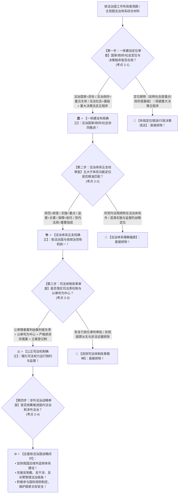

# 📐 依法治国与法治体系 · 全流程答题模型（一体建设 · 五大体系 · 司法改革 · 涉外法治四步定位链 · 考点 2-1~2-4）

> **教练开场白**
> 同学们好！我是你们的理论法法考教练。在全面依法治国战略布局中，“依法治国工作布局与法治体系建设”是**法考客观题每年必考、主观题论述题结构化破题的黄金核心骨架（T1-1 / T1-2 高频考点，客观题每年稳定输出 2~4 题）**！
> 很多同学做这部分工作布局题目时，经常在以下几个“经典命题暗坑”上踩雷：
> 1. **混淆法治国家、法治政府、法治社会的战略定位**：选项写“法治社会是建设重点，法治政府是目标”（大错特错！**法治国家是目标，法治政府是建设重点和主体工程，法治社会是基础**！地位颠倒直接丢分！）；
> 2. **将法治体系五大子体系的作用定位张冠李戴**：把“高效的法治实施体系”说成是前提，把“完备的法律规范体系”说成是关键（**法律规范体系是前提/基础，法治实施体系是重点，法治监督体系是关键，法治保障体系是依托，党内法规体系是重要组成部分**！）；
> 3. **将党内法规体系排除在社会主义法治体系之外**：以为法治体系只包含国家法律（大错特错！中国特色社会主义法治体系**正式将完善的党内法规体系纳入五大支柱之一**，坚持依法治国与依规治党有机统一！）；
> 4. **把重大行政决策五大程序漏项或当成可选项**：以为重大决策只需开个会就行（《重大行政决策程序暂行条例》刚性五大程序：**公众参与、专家论证、风险评估、合法性审查、集体讨论决定**，缺一不可！）；
> 5. **对涉外法治核心举措理解模糊**：以为涉外法治只是办理涉外民商事案子（涉外法治是国家安全战略，核心是**加快我国法域外适用法律体系建设、完善反制裁/反干涉/反长臂管辖法律法规**！）。
>
> 今天我们用**“四步连贯流水线”**，把全面依法治国工作布局与法治体系的全部考点一次性彻底锁死：**第一步判一体建设布局（法治国家是目标、法治政府是重点、法治社会是基础，重大决策五程序 考点2-1） → 第二步判五大子体系定位（规范是前提、实施是重点、监督是关键、保障是依托、党规是组成 考点2-2） → 第三步判司法体制改革（司法责任制让审理者裁判、以审判为中心、防冤假错案 考点2-3） → 第四步判涉外法治战略（域外适用体系、反制裁反干涉反长臂管辖 考点2-4）**！

---

## 适用场景与解决问题

本模型专门解决全面依法治国总目标（建设法治体系/法治国家）、“法治国家/政府/社会一体建设”定位与重大行政决策法定程序、中国特色社会主义法治体系五大子体系辨析、司法责任制与司法体制改革（以审判为中心/立案登记制）、统筹推进国内法治和涉外法治的全部主客观题考点（对应 [[理论法-客观题考点全景-深度报告]] 板块A 第2章 2-1/2-2/2-3/2-4 核心考点）：重点破解：

1. **第一步 · 判一体建设布局：国家、政府与社会定位（考点 2-1）**：
   - ⭐ **“三个共同推进”与“三个一体建设”战略关系**：
     - **共同推进**：坚持依法治国、依法执政、依法行政共同推进；
     - **一体建设**：坚持法治国家、法治政府、法治社会一体建设；
   - ⭐ **三者战略定位精准匹配（必考做题眼）**：
     - **法治国家** $\rightarrow$ 是全面依法治国的**【总目标】**；
     - **法治政府** $\rightarrow$ 是全面依法治国的**【建设重点和主体工程】**；
     - **法治社会** $\rightarrow$ 是全面依法治国的**【基础工程】**；
   - 🚨 **重大行政决策五大刚性法定程序（缺一不可）**：
     - ① **公众参与**；② **专家论证**；③ **风险评估**；④ **合法性审查**；⑤ **集体讨论决定**；
   - ⭐ **严格规范公正文明执法**：深化综合行政执法改革，全面推行行政执法公示、执法全过程记录、重大执法决定法制审核“三项制度”。
2. **第二步 · 判法治体系五大子体系：功能与战略定位（考点 2-2）**：
   - ⭐ **全面依法治国总目标**：**建设中国特色社会主义法治体系、建设社会主义法治国家**；
   - 🏛️ **五大子体系及其精准功能定位（选项混搭高发区）**：
     - ① **完备的法律规范体系** $\rightarrow$ 是全面依法治国的**【前提和基础】**（良法是善治的前提）；
     - ② **高效的法治实施体系** $\rightarrow$ 是全面依法治国的**【重点】**（天下之事，不难于立法，而难于法之必行）；
     - ③ **严密的法治监督体系** $\rightarrow$ 是全面依法治国的**【关键】**（党内监督为主导，形成权力监督闭环）；
     - ④ **有力的法治保障体系** $\rightarrow$ 是全面依法治国的**【重要依托】**（政治、制度、人才、科技、运行机制保障）；
     - ⑤ **完善的党内法规体系** $\rightarrow$ 是中国特色社会主义法治体系的**【重要组成部分】**（依规治党，党章为根本）。
3. **第三步 · 判深化司法体制改革：公正司法与权责机制（考点 2-3）**：
   - ⭐ **公正司法是维护社会公平正义的最后一道防线**；
   - ⭐ **全面落实司法责任制（核心做题眼）**：
     - 坚持**“让审理者裁判、由裁判者负责”**；
     - 院庭长对其职务范围内的审判监督管理承担责任，不得违规干预案件审理；
   - ⭐ **推进以审判为中心的诉讼制度改革**：
     - 严格落实**罪刑法定、疑罪从无、非法证据排除**等法律原则；
     - 确保案件事实证据经得起法律检验，从制度上严密防范冤假错案；
   - ⭐ **完善司法为民与阳光司法机制**：
     - 变立案审查制为**立案登记制**；深化审判流程、庭审、裁判文书、执行信息四大公开平台建设。
4. **第四步 · 判统筹推进涉外法治：国家安全与国际法治（考点 2-4）**：
   - ⭐ **涉外法治战略布局**：
     - 统筹国内国际两个大局，统筹推进国内法治和涉外法治；
   - ⭐ **三大核心工作任务**：
     - ① **加强涉外领域立法**，构建完备的涉外法律法规体系；
     - ② **加快我国法域外适用法律体系建设**，完善反制裁、反干涉、反“长臂管辖”法律法规机制；
     - ③ **提升涉外执法司法效能**，加强涉外法治人才培养，积极参与国际规则制定与全球治理变革。

> **核心一句**：**法治国家是目标，法治政府是重点，法治社会是基础；重大决策走五步（公众专家风险法审集体定）；法治体系五支柱（规范前提、实施重点、监督关键、保障依托、党规必不可少）；司法责任制审理裁判相统一，审判中心防冤案；涉外法治布大局，域外适用反制裁！**
>
> 🔎 **核心理论法源（2026权威）**：《法治中国建设规划（2020-2025年）》；《法治政府建设实施纲要（2021-2025年）》；《重大行政决策程序暂行条例》；《中华人民共和国反外国制裁法》。

---

## 💡 【前置认知】依法治国工作布局核心理论极速对照表

| 制度模块 | 核心命题判断与法定标准 | 考场一秒判定秘诀 |
| :--- | :--- | :--- |
| **① 一体建设定位** | • 法治国家 $\rightarrow$ **目标**；<br>• 法治政府 $\rightarrow$ **重点和主体工程**；<br>• 法治社会 $\rightarrow$ **基础**。 | 政府是主体和重点，**社会是根基，国家是总目标**！ |
| **② 重大决策五程序** | **公众参与、专家论证、风险评估、合法性审查、集体讨论决定**。 | 必须走完五步，**缺合法性审查或集体讨论直接违法**！ |
| **③ 五大子体系** | • 规范体系 $\rightarrow$ **前提基础**；<br>• 实施体系 $\rightarrow$ **重点**；<br>• 监督体系 $\rightarrow$ **关键**；<br>• 保障体系 $\rightarrow$ **依托**；<br>• 党内法规体系 $\rightarrow$ **重要组成**。 | 党规也是法治体系的一部分；**实施是重点、监督是关键**！ |
| **④ 司法责任制** | **让审理者裁判、由裁判者负责**；以审判为中心防范冤假错案。 | 办案质量终身负责，**庭长不能随意插手改判**！ |
| **⑤ 涉外法治** | 加快我国法**域外适用体系建设**；完善**反制裁、反干涉、反长臂管辖**。 | 涉外法治不仅是民商事，**更是国家安全反制武器**！ |

---

## 一、 考点核心骨架与逻辑体系（四步连贯决策树）



```
【全面依法治国工作布局全景】一句话开场：法治国家是目标，法治政府是重点，法治社会是基础；重大决策走五步（公众专家风险法审集体定）；法治体系五支柱（规范前提、实施重点、监督关键、保障依托、党规必不可少）；司法责任制审理裁判相统一，审判中心防冤案；涉外法治布大局，域外适用反制裁！
│
▼ 第一步 · 判一体建设 ── 国家/政府/社会定位与行政决策（考点2-1）
├─ 战略定位：法治国家是【目标】，法治政府是【重点和主体工程】，法治社会是【基础】
├─ 重大决策五程序：①公众参与 ②专家论证 ③风险评估 ④合法性审查 ⑤集体讨论决定
└─ 严格执法：行政执法公示、全过程记录、重大执法决定法制审核“三项制度”
     │
     ▼ 第二步 · 判五大体系 ── 法治体系功能五支柱（考点2-2）
     ├─ 完备的法律规范体系 ──→ 全面依法治国的【前提和基础】
     ├─ 高效的法治实施体系 ──→ 全面依法治国的【重点】
     ├─ 严密的法治监督体系 ──→ 全面依法治国的【关键】
     ├─ 有力的法治保障体系 ──→ 全面依法治国的【重要依托】
     └─ 完善的党内法规体系 ──→ 法治体系的【重要组成部分】（依规治党）
          │
          ▼ 第三步 · 判司法改革 ── 责任制与以审判为中心（考点2-3）
          ├─ 司法责任制：【让审理者裁判、由裁判者负责】（办案质量终身负责）
          ├─ 以审判为中心：罪刑法定、疑罪从无、非法证据排除，防范冤假错案
          └─ 司法为民公开：立案登记制，四大公开平台（审判流程/庭审/文书/执行）
               │
               ▼ 第四步 · 判涉外法治 ── 统筹国内国际法治（考点2-4）
               ├─ 体系建设：加快我国法域外适用法律体系建设
               └─ 防御反制：健全反制裁、反干涉、反“长臂管辖”法律机制

  ━━━ 四步全通 ━━━
```

---

## 二、 核心考情与 2026 最新命题精要

- **频次研判**：依法治国工作布局与法治体系是法考卷一**★★★★ T1-1/T1-2 核心高频考点**；客观题每年必考 2~3 题，主观题第 1 题论述题常以“法治政府建设”、“司法责任制改革”或“涉外法治建设”为主题背景命题。
- **2026 命题核心与考查重点**：
  1. **法治国家、法治政府、法治社会一体建设三者定位精确匹配**（目标 vs 重点 vs 基础）。
  2. **重大行政决策五大必经程序**（公众参与、专家论证、风险评估、合法性审查、集体讨论决定）。
  3. **中国特色社会主义法治体系五大子体系的功能定性**（前提、重点、关键、依托、重要组成）。
  4. **司法责任制“让审理者裁判、由裁判者负责”的权责运行界限**。
  5. **反制裁、反长臂管辖等涉外法治工具箱的法治内涵**。

---

## 三、 三大核心法理与命题陷阱拆解

### 1. 依法治国工作布局四大命题暗坑与判断标准表

| 命题选项设计 | 争议焦点 | 正确法理判定 | 命题陷阱与深度剖析 |
|---|---|---|---|
| “在全面依法治国布局中，法治社会建设是主体工程和建设重点，法治国家建设是基础工程。” | 法治国家、法治政府、法治社会的定位关系是否准确？ | 🚫 **该表述错误！** | 战略定位严格对应：**法治国家是目标，法治政府是建设重点和主体工程，法治社会是基础工程**。选项颠倒了三者的战略定位。 |
| “全面推进依法治国必须建设中国特色社会主义法治体系，党内法规体系纯属党内纪律，不属于社会主义法治体系的组成部分。” | 党内法规体系是否属于中国特色社会主义法治体系？ | 🚫 **该表述严重错误！** | 中国特色社会主义法治体系包括**法律规范体系、法治实施体系、法治监督体系、法治保障体系和党内法规体系**。党内法规体系正式纳入国家法治体系整体布局，坚持依法治国与依规治党有机统一。 |
| “某市人民政府拟调整市区公共交通票价，鉴于该事项属于政府内部行政管理权，无需进行合法性审查和集体讨论决定，由主管副市长直接签署公布。” | 重大行政决策是否可以省略合法性审查或集体讨论决定？ | 🚫 **该决策程序违法！** | 依据《重大行政决策程序暂行条例》，重大公共政策调整属于重大行政决策，必须严格履行**公众参与、专家论证、风险评估、合法性审查、集体讨论决定**五大法定程序。合法性审查和集体讨论决定是必经程序。 |
| “全面落实司法责任制，要求实现‘让审理者裁判、由裁判者负责’，但这并不免除院庭长在其法定职务范围内的审判监督管理职责。” | 司法责任制下院庭长是否仍负有审判监督管理职责？ | ✅ **该表述完全正确！** | 司法责任制落实独任法官、合议庭办案主体地位的同时，健全院庭长审判监督管理权力和责任清单，院庭长依法依规履行监督职责不属于违规干预案件事实裁判。 |

---

## 四、 万能解题四步

---

### 第一步：判一体建设 —— 国家目标、政府重点、社会基础对了吗？重大决策走完五步了吗？（考点 2-1）

> **教练提示**：
> 1. 三位一体：**法治国家（目标）、法治政府（重点和主体工程）、法治社会（基础）**；
> 2. 重大行政决策五步法：**公众参与 $\rightarrow$ 专家论证 $\rightarrow$ 风险评估 $\rightarrow$ 合法性审查 $\rightarrow$ 集体讨论决定**（缺一不可）！

---

### 第二步：判五大体系 —— 规范前提、实施重点、监督关键、保障依托、党规在内吗？（考点 2-2）

> **教练提示**：
> 1. 规范是**前提和基础**；实施是**重点**；
> 2. 监督是**关键**；保障是**依托**；
> 3. 🚨 **党内法规体系正式属于法治体系五大子体系之一**！

---

### 第三步：判司法改革 —— 审理裁判统一了吗？以审判为中心防冤案了吗？（考点 2-3）

> **教练提示**：
> 1. 司法责任制：**“让审理者裁判、由裁判者负责”**；
> 2. 以审判为中心：严格落实**罪刑法定、疑罪从无、非法证据排除**；
> 3. 立案登记制、四大公开平台保障司法为民！

---

### 第四步：判涉外法治 —— 健全域外适用体系了吗？开展反制裁反干涉了吗？（考点 2-4）

> **教练提示**：
> 1. 加快我国法**域外适用法律体系建设**；
> 2. 运用法治武器进行**反制裁、反干涉、反长臂管辖**；
> 3. 积极参与全球治理规则制定！

#### 💰 完整理论案例：法治政府与司法改革综合论述攻防实战

> **【主客观综合论述演练题】**
> 某省为加快重大项目落地，出台文件规定：“涉及重点招商引资产业项目的行政决策，为提高效率，一律取消合法性审查和风险评估程序”。同时，某基层法院为化解积案，规定“所有民商事裁判文书一律由主管副院长最终审批签发，承办法官对裁判结论不承担责任”。
>
> - **法理涵摄与论述破题**：
>   1. **第一层面（法治政府建设与决策程序）**：该省关于取消合法性审查和风险评估的规定是严重违法的。法治政府是全面依法治国的**重点和主体工程**，推进依法行政必须严格遵循重大行政决策法定程序。合法性审查和风险评估是防范决策风险、确保行政合法的刚性防线，绝不能以“效率”为由随意架空；
>   2. **第二层面（司法责任制与审判规律）**：该基层法院恢复行政化审批裁判文书的做法完全违背了深化司法体制改革的核心精神。司法改革的核心是全面落实**司法责任制**，必须坚持**“让审理者裁判、由裁判者负责”**，由承办法官和合议庭依法独立负责裁判，建立办案质量终身负责制；
>   3. **第三层面（综合治理与法治国家建设）**：必须坚持**法治国家、法治政府、法治社会一体建设**，健全完备的法律实施与监督体系，在法治轨道上推进国家治理体系和治理能力现代化！

#### 一句话闭环记忆
> 🎯 **一眼判**：**法治国家是目标，法治政府是重点，法治社会是基础；重大决策走五步（公众专家风险法审集体定）；法治体系五支柱（规范前提、实施重点、监督关键、保障依托、党规必不可少）；司法责任制审理裁判相统一，审判中心防冤案；涉外法治布大局，域外适用反制裁！**

---

## 五、 案例演练

### 1. 中国特色社会主义法治体系五大子体系识别（经典真题演练）
- **题干**：关于建设中国特色社会主义法治体系的总体要求与子体系，下列哪一表述是正确的？
  - A. 完备的法律规范体系是全面依法治国的关键
  - B. 严密的法治监督体系是全面依法治国的重点
  - C. 党内法规体系不属于中国特色社会主义法治体系
  - D. 高效的法治实施体系是全面推进依法治国的重点
- **模型分析**：第二步——规范体系是前提，监督体系是关键，实施体系是重点（D正确，AB错误）；党内法规体系是法治体系的重要组成部分（C错误）。**（选 D）**

### 2. 重大行政决策法定程序辨析（经典真题演练）
- **题干**：关于法治政府建设和重大行政决策程序，下列哪一说法符合法律规定？
  - A. 重大行政决策可以根据行政首长意愿决定是否经过专家论证
  - B. 合法性审查是重大行政决策的必经程序，未经合法性审查不得提交集体讨论
  - C. 涉及重大公共利益的决策，政府可自行省略公众参与环节
  - D. 风险评估结果仅供参考，评估为高风险的决策仍可直接通过
- **模型分析**：第一步——重大行政决策必须严格履行五大程序，合法性审查属于法定必经审查环节，未经合法性审查或经审查不合法的，不得提交集体讨论决定（选 B）。

---

## 关联真题

- [[理论法-治国-单选-05 · 法治体系五大子体系的定位与内涵]]
- [[理论法-治国-单选-06 · 法治政府建设与重大行政决策法定程序]]
- [[理论法-治国-单选-07 · 司法责任制与以审判为中心的诉讼制度改革]]
- [[理论法-治国-多选-08 · 统筹推进国内法治和涉外法治机制]]

## 相关页面

- 概念实体页：[[全面依法治国]] · [[法治政府建设]] · [[中国特色社会主义法治体系]] · [[司法责任制]] · [[以审判为中心的诉讼制度改革]] · [[涉外法治]]
- 姊妹模型：[[理论法-治国-习近平法治思想模型]] · [[理论法-法理-立法体制与权限模型]]
- 综合报告：[[理论法-客观题考点全景-深度报告]]（板块A 第2章 2-1~2-4 · ★★★★ T1-1/T1-2 高频工作布局）
