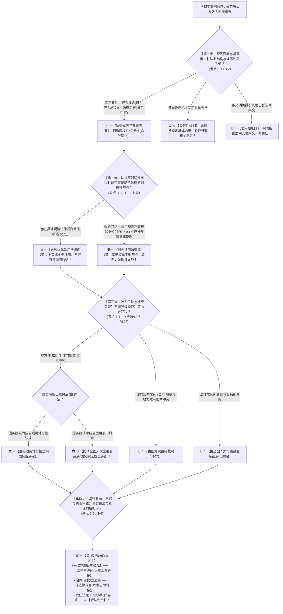

# 📐 法律规则与渊源效力 · 全流程答题模型（要素结构 · 原则门槛 · 效力位阶冲突裁决 · 关系事实责任四步定位链 · 考点 3-1~3-6）

> **教练开场白**
> 同学们好！我是你们的理论法法考教练。在法理学板块中，“法律规则、原则适用与规范冲突裁决”是**法理学客观题考查频率最高、理论最严密、命题人最爱设伏的绝对核心考区（T0-3 顶级必考，每年稳定考查 2~4 题，覆盖 6+ 张真题卡）**！
> 很多同学做这部分法理题目时经常在以下几大“经典理论暗坑”上失分：
> 1. **混淆委任性规则与准用性规则**：把“本法未作规定的，适用民法典相关规定”说成是委任性规则（大错特错！指出援引**其他具体明确条文**的是**准用性规则**；委托**某行政机关另行制定具体办法**的才是**委任性规则**！）；
> 2. **跳过规则直接动用原则**：选项写“法官为了实现个案公平，可以自由选择适用法律原则而不适用明确的法律规则”（大错特错！**“有规则先用规则”是法治铁律**！动用原则必须满足三大苛刻门槛：**穷尽规则 ＋ 实现个案正义/重大利益 ＋ 承担更强论证义务**！）；
> 3. **记错地方性法规与部门规章的冲突裁决路径**：选项写“地规与部门规章冲突一律由全国人大常委会裁决”或“一律由国务院裁决”（大错特错！《立法法》§106 核心做题眼：**由国务院先提意见——国务院认为适用地规的直接适用；认为应当适用规章的，必须提请全国人大常委会裁决**！规章与规章冲突才是国务院直接裁决！）；
> 4. **将法律事件误判为法律行为**：看到“张某自然死亡”、“地震导致厂房倒塌”、“诉讼时效 3 年届满”，选项写“属于当事人的民事法律行为”（大错特错！**不以当事人意志为转移的客观现象统统属于【法律事件】**！只有以意思表示或行为意图为核心的才叫法律行为！）；
> 5. **将免责事由等同于无违法性**：以为免除法律责任就是没有违法（免责的前提是**违法行为或责任已经成立**，但因时效经过、双方和解或自首立功等法定事由依法免予追究！）。
>
> 今天我们用**“四步连贯流水线”**，把法理学本体论的全部考点一次性彻底锁死：**第一步判规则要素与类型（假定条件、行为模式、法律后果；授权vs义务，确定vs委任vs准用 考点3-1/3-2） → 第二步判原则适用三大门槛（穷尽规则、个案正义、强化论证，原则权衡不否定规则效力 考点3-3） → 第三步判效力冲突与裁决归属（地规vs规章：国务院认为用地规直接用，用规章找全国人大常委会；规章之间找国务院 考点3-4） → 第四步判法律关系事实与责任（事件不随意志转移、行为以意志为转移；责任法定与免责事由 考点3-5/3-6）**！

---

## 适用场景与解决问题

本模型专门解决法律规则三要素识别与分类（授权/义务、确定/委任/准用）、法律原则与规则区别及原则适用三条件、法律渊源效力位阶与规范冲突裁决归属（地规与规章冲突/新旧特别冲突）、法律关系三要素与法律事实定性（事件 vs 行为）、法律责任归责与免责事由的全部主客观题考点（对应 [[理论法-客观题考点全景-深度报告]] 板块B 第3章 3-1~3-6 核心考点）：重点破解：

1. **第一步 · 判法律规则要素与分类（考点 3-1 ＋ 考点 3-2）**：
   - ⭐ **法律规则微观三要素（核心做题眼）**：
     - ① **假定条件**：法律规则适用的时间、空间、主体资格及事实状态前提；
     - ② **行为模式**：核心指导——**可以这样行为（授权性/可为）**、**应当这样行为（命令性义务/应为）**、**禁止这样行为（禁止性义务/勿为）**；
     - ③ **法律后果**：行为后的评价——**肯定式后果（合法有效/保护奖励）** vs **否定式后果（违法无效/制裁惩罚）**；
   - 🚨 **三大规则分类精准识别（选项辨析高发）**：
     - **确定性规则**：内容完整明确，无需援引其他规定；
     - **委任性规则**：条文没有直接规定，**委托特定行政机关或主体另行制定具体规定**（如“具体办法由国务院制定”）；
     - **准用性规则**：条文没有直接规定，但**明确指出参照或援引其他既有条文**（如“适用本法第十条之规定”）。
1. **第二步 · 判法律原则与规则区别及适用三条件（考点 3-3 · T0-3 顶级必考）**：[[法律规则要素与分类（2026法考客观题版）]]
   - ⭐ **原则与规则的三大核心差异**：
     - 适用范围：规则针对具体微观事实（微观明确），原则提供宏观宏旨（宏观抽象）；
     - 适用方式：规则是**“全有或全无”（all-or-nothing）**，有效即适用；原则是**“权重平衡”（weighing/balancing）**，冲突时不否定另一原则的效力；
	     - 大白话类比
		     - 规则好比医院现成标准化特效药；原则好比备用综合调理药方。
				- 有特效药（规则），优先吃特效药，不能上来直接吃调理药方（原则）。
				- 只有两种情况才用调理药方：①没有特效药；②特效药吃下去会造成极其严重伤害，并且医生要写充分病历说明为什么不用特效药。
   - 🚨 **法律原则适用三大刚性门槛条件（缺一不可）**： -> 泸州遗赠案
     - ① **穷尽法律规则**：在有明确具体的法律规则存在时，必须优先适用规则，**严禁无故架空规则而直接适用原则**；
     - ② **实现个案正义/维护更重大利益**：若机械适用既有规则将导致极端不公正的荒谬结果，或危及更高阶的宪法价值；
     - ③ **承担更强的论证说理义务**：裁判者必须充分展开**外部证成**，进行价值衡量与充分说理。
1. **第三步 · 判法律渊源效力位阶与冲突裁决机制（考点 3-4 · 2023《立法法》新规）**：[[法律渊源效力位阶与冲突裁决机制（2026法考客观题版，依据2023修订《立法法》）]]
   - ⭐ **法律渊源效力金字塔**：
     - **宪法 ＞ 法律 ＞ 行政法规 ＞ 地方性法规 ＞ 地方政府规章**；
     - 宪法具有最高法律效力；自治条例和单行条例可依法变通，变通规定优先适用（但不得变通宪法法律基本原则）；
   - 🚨 **规范冲突裁决权限归属全景图（考场必背秒杀秘诀）**：
     - ① **新普通 vs 旧特别（法律之间）** $\rightarrow$ 由**全国人大常委会裁决**；
     - ② **新普通 vs 旧特别（行政法规之间）** $\rightarrow$ 由**国务院裁决**；
     - ③ **地方性法规 与 部门规章 发生冲突（压轴必考）**：
       - **第一步**：提请**国务院提出意见**；
       - **第二步分流**：
         - 🏛️ 国务院认为应当适用**地方性法规**的 $\rightarrow$ **【直接适用地方性法规】**；
         - 🏛️ 国务院认为应当适用**部门规章**的 $\rightarrow$ **【必须提请全国人大常委会裁决】**！
     - ④ **部门规章之间、部门规章与地方政府规章之间冲突** $\rightarrow$ 由**【国务院裁决】**！
1. **第四步 · 判法律关系三要素、事实定性与法律责任（考点 3-5 ＋ 考点 3-6）**：[[法律关系三要素、事实定性与法律责任（2026法考客观题版）]]
   - ⭐ **法律事实两分法（客观题必考秒杀）**：
     - 🌊 **法律事件（不以当事人意志为转移）**：
       - 自然事件：人的出生、**自然死亡**、**地震海啸**、**时间经过（诉讼时效届满）**；
       - 社会事件：**战争**、重大社会动乱；
     - 🚶 **法律行为（以当事人意志为转移）**：订立合同、立遗嘱、侵权行为、行政处罚；
   - ⭐ **法律责任归责与免责事由**：
     - 归责原则：责任法定（最核心）、公正原则、效益原则；
     - 免责事由：**时效免责、协议免责（双方和解撤诉）、自首立功免责、受害人放弃免责**（免责不等于行为合法，而是免除责任追究）。

> **核心一句**：**规则三要素看假定、模式与后果，授权委任准用分清楚；原则适用三道门（穷尽规则、个案正义、强化论证）；效力金字塔宪法大，冲突裁决有讲究：地规规章国务院先看，用地规国务院定，用规章全国人大常委会定；规章打架找国务院；事件不随意志转（生老病死天灾时效都是事件），行为随心动；免责不等于合法，时效和解可免责！**
>
> 🔎 **核心法理法源（2026权威）**：《中华人民共和国立法法》（2023修正）§96-§111；《中华人民共和国民法典》第一编总则。

---

## 💡 【前置认知】法律规则与渊源效力核心规则极速对照表

| 制度模块 | 核心法律条文与理论标准 | 考场一秒判定秘诀 |
| :--- | :--- | :--- |
| **① 规则结构分类** | • 假定条件 + 行为模式 + 法律后果；<br>• 委任 $\rightarrow$ 委托制定；准用 $\rightarrow$ 援引明确条文。 | 委托制定＝**委任性**；直接指明看某条＝**准用性**！ |
| **② 原则适用三门槛** | **穷尽法律规则 ＋ 实现个案正义 ＋ 强化论证说理**。 | 有规则必先用规则，**不可随意跳过规则直奔原则**！ |
| **③ 地规 vs 部门规章** | 《立法法》**§106**：<br>• 国务院认同地规 $\rightarrow$ **直接用**；<br>• 国务院认同规章 $\rightarrow$ **报全国人大常委会裁决**。 | 国务院偏向地规自己定，**偏向部门规章必须找人大常委会**！ |
| **④ 规章之间冲突** | 《立法法》**§107**：部门规章之间、规章与地规章 $\rightarrow$ **国务院裁决**。 | 规章内部打架，**国务院一锤定音**！ |
| **⑤ 法律事实辨析** | • **事件** $\rightarrow$ 不以意志为转移（死亡/地震/时效届满）；<br>• **行为** $\rightarrow$ 以意志为转移（合同/侵权）。 | 人的生老病死、天灾人祸、时间流逝**全是事件不是行为**！ |

---

## 一、 考点核心骨架与逻辑体系（四步连贯决策树）



```
【法理学本体论全景】一句话开场：规则三要素看假定、模式与后果，授权委任准用分清楚；原则适用三道门（穷尽规则、个案正义、强化论证）；效力金字塔宪法大，冲突裁决有讲究：地规规章国务院先看，用地规国务院定，用规章全国人大常委会定；规章打架找国务院；事件不随意志转（生老病死天灾时效都是事件），行为随心动；免责不等于合法，时效和解可免责！
│
▼ 第一步 · 判规则要素 ── 结构三要素与规则分类（考点3-1/3-2）
├─ 三要素：假定条件（前提）、行为模式（可为/应为/勿为）、法律后果（肯定/否定）
├─ 行为模式：授权性（可为） vs 义务性（命令性应为 + 禁止性勿为）
└─ 确定程度：确定性 vs 委任性（委托行政机关） vs 准用性（指出援引其他条文）
     │
     ▼ 第二步 · 判原则适用 ── 区别与三大适用门槛（考点3-3）
     ├─ 核心区别：规则微观明确、全有或全无；原则宏观指导、权重分量衡量
     └─ 🚨 原则适用三门槛：①【穷尽法律规则】 ②【个案正义/重大利益】 ③【更强论证说理义务】
          │
          ▼ 第三步 · 判效力冲突 ── 位阶金字塔与裁决归属（考点3-4）
          ├─ 位阶：宪法 ＞ 法律 ＞ 行政法规 ＞ 地方性法规 ＞ 地方政府规章
          ├─ 部门规章 vs 地方性法规：国务院认同地规【直接适用】；认同规章【提请全国人大常委会裁决】
          ├─ 部门规章之间 / 规章与地规章：由【国务院裁决】
          └─ 法律新普通 vs 旧特别：由【全国人大常委会裁决】
               │
               ▼ 第四步 · 判关系事实责任 ── 事件行为与免责（考点3-5/3-6）
               ├─ 法律事件：不以当事人意志为转移（自然死亡、地震天灾、时间经过/时效届满）
               ├─ 法律行为：以当事人意志为转移（订立合同、侵权、行政处罚）
               └─ 法律责任与免责：责任法定原则；免责事由（时效免责、协议免责、自首立功免责）

  ━━━ 四步全通 ━━━
```

---

## 二、 核心考情与 2026 最新命题精要

- **频次研判**：法理学本体论是法考卷一**★★★★★ T0-3 顶级必考大户**；客观题每年必考 3~4 题，覆盖委任性与准用性规则定性、法律原则适用三大苛刻门槛、地规与部门规章冲突裁决权限归属、法律事件与行为辨析、免责事由。
- **2026 命题核心与考查重点**：
  1. **法律原则适用的三门槛限制**：有规则优先用规则，不能直接以原则代替规则。
  2. **《立法法》2023 规范冲突裁决权精确分工**（国务院意见分流机制是压轴必考题）。
  3. **法律事实的“事件 vs 行为”定性题**（人的死亡、时效经过、不可抗力属事件）。
  4. **法律规则微观三要素的拆解分析**（假定条件、行为模式、法律后果）。

---

## 三、 三大核心法理与命题陷阱拆解

### 1. 法律规则与渊源效力四大命题暗坑与判断标准表

| 命题选项设计 | 争议焦点 | 正确法理判定 | 命题陷阱与深度剖析 |
|---|---|---|---|
| “法条规定：‘本法未作规定的，参照适用民法典合同编的相关规定。’该规定属于典型的委任性规则。” | 援引其他既有明确条文的规则属于委任性规则还是准用性规则？ | 🚫 **该表述错误！此为准用性规则！** | 准用性规则是指条文没有直接规定具体内容，而是明确指出**参照或援引其他既有条文**；委任性规则是指**委托特定行政机关另行制定具体细则**。二者截然不同。 |
| “法官在审理案件时，发现适用某具体法律规则将导致原告利益受损，为追求实质正义，法官可以无需说明理由直接适用诚实信用原则作出判决。” | 适用法律原则是否可以随意架空规则？是否无需承担额外论证义务？ | 🚫 **该做法严重违法！** | 法律原则适用必须满足三大门槛：**①穷尽法律规则；②实现个案正义（适用既有规则将产生极端不公正后果）；③承担更强的论证说理义务**。法官不能随意跳过有效规则动用原则。 |
| “某市中级法院在审理行政案件中，发现某部委制定的部门规章与该省人大常委会制定的地方性法规规定不一致。经请示国务院，国务院认为应当适用部门规章，遂直接下达决定要求法院适用部门规章。” | 国务院认为应当适用部门规章时能否自行作出决定？ | 🚫 **国务院无权直接决定！必须提请全国人大常委会裁决！** | 依据《立法法》§106：地方性法规与部门规章冲突，由国务院提出意见。**国务院认为应当适用地方性法规的，直接适用；国务院认为应当适用部门规章的，应当提请【全国人民代表大会常务委员会裁决】**！ |
| “张某因突发脑溢血死亡，导致其与李某之间的委托代理合同终止。张某死亡这一事实属于民事法律行为。” | 人的自然死亡属于法律行为还是法律事件？ | 🚫 **定性错误！张某死亡属于法律事件！** | 法律事实分为事件与行为。**法律事件是不以当事人意志为转移的客观现象**，包括人的出生、自然死亡、自然灾害、时间经过等。死亡不属于法律行为。 |

---

## 四、 万能解题四步

---

### 第一步：判规则要素与类型 —— 假定、模式、后果全吗？是委任还是准用？（考点 3-1/3-2）

> **教练提示**：
> 1. 三要素：**假定条件（前提）、行为模式（可为/应为/勿为）、法律后果（肯定/否定）**；
> 2. 委托机关另行制定 $\rightarrow$ **委任性规则**；
> 3. 明确指明看某条某法 $\rightarrow$ **准用性规则**！

---

### 第二步：判原则适用门槛 —— 规则穷尽了吗？有个案极端不公吗？强化论证了吗？（考点 3-3）

> **教练提示**：
> 1. 规则全有或全无，原则权重平衡；
> 2. 原则适用三大刚性门槛：**①穷尽规则 ＋ ②个案正义/重大利益 ＋ ③强化论证说理义务**；
> 3. 任何“自由选择原则架空规则”的选项**直接判错**！

---

### 第三步：判效力冲突与裁决 —— 是地规对规章还是规章打架？谁说了算？（考点 3-4）

> **教练提示**：
> 1. 部门规章 vs 地方性法规（《立法法》§106）：
>    - 国务院支持**地方性法规** $\rightarrow$ **【直接适用地方性法规】**；
>    - 国务院支持**部门规章** $\rightarrow$ **【必须报全国人大常委会裁决】**！
> 2. 部门规章之间、规章与地规章打架 $\rightarrow$ **【国务院裁决】**；
> 3. 法律新普通 vs 旧特别 $\rightarrow$ **【全国人大常委会裁决】**！

---

### 第四步：判关系、事实与责任 —— 随意志转移了吗？是免责还是合法？（考点 3-5/3-6）

> **教练提示**：
> 1. 不以当事人意志为转移（生老病死、地震天灾、时效届满） $\rightarrow$ **【法律事件】**；
> 2. 以当事人意思表示为核心（订合同、立遗嘱、侵权） $\rightarrow$ **【法律行为】**；
> 3. 免责事由（时效、和解、自首）**不等于行为本身合法**！

#### 💰 完整法理案例：规范冲突与原则适用攻防实战

> **【综合案例演练题】**
> 某省 A 市中级法院审理一起排污环保案。
> 1. **第一幕（规范冲突）**：法官发现生态环境部发布的《排污许可管理办法》（部门规章）与该省人大制定的《环境保护条例》（地方性法规）对排污罚款上限规定不一致。法院层报国务院，国务院研究后认为应当适用该部委制定的部门规章。
> 2. **第二幕（原则适用）**：在审理另一起“遗赠抚养协议”纠纷中，原告依据继承法规定主张继承遗产，但原告存在严重违背公序良俗隐匿被继承人真实遗嘱的情形。法官未说明理由直接以“民法公序良俗原则”判决驳回原告诉请。
> 3. **第三幕（事实定性）**：审理期间，被告因山洪暴发导致厂房冲毁、诉讼时效届满且被告法定代表人突发心脏病死亡。
>
> - **法理涵摄与裁判拆解**：
>   1. **第一幕裁判**：依据《立法法》§106，地方性法规与部门规章冲突，国务院认为应当适用部门规章的，**国务院无权直接决定，必须提请【全国人民代表大会常务委员会裁决】**！
>   2. **第二幕裁判**：法官直接以原则判案违法。适用法律原则必须满足**①穷尽法律规则；②个案正义；③承担更强论证说理义务**。法官未经充分外部证成说明排除既有规则的理由，违反了原则适用规则；
>   3. **第三幕事实定性**：山洪暴发（自然灾害）、诉讼时效届满（时间经过）、法定代表人自然死亡均不以当事人意志为转移，在性质上统统属于**【法律事件】**，而非法律行为！

#### 一句话闭环记忆
> 🎯 **一眼判**：**规则三要素看假定、模式与后果，授权委任准用分清楚；原则适用三道门（穷尽规则、个案正义、强化论证）；效力金字塔宪法大，冲突裁决有讲究：地规规章国务院先看，用地规国务院定，用规章全国人大常委会定；规章打架找国务院；事件不随意志转（生老病死天灾时效都是事件），行为随心动；免责不等于合法，时效和解可免责！**

---

## 五、 案例演练

### 1. 地方性法规与部门规章冲突裁决权限（经典真题演练）
- **题干**：某地法院在审理案件时，发现某地方性法规与某部门规章关于同一事项的规定不一致，关于该冲突的裁决程序，下列哪一说法是正确的？
  - A. 由该省高级法院报请最高人民法院裁决
  - B. 由国务院直接裁决适用地方性法规或部门规章
  - C. 国务院认为应当适用地方性法规的，应当决定在该地方适用地方性法规
  - D. 国务院认为应当适用部门规章的，应当决定直接适用部门规章
- **模型分析**：第三步——依据《立法法》§106，地方性法规与部门规章冲突，由国务院提出意见：国务院认为应当适用地方性法规的，应当决定在该地方适用地方性法规（C正确）；国务院认为应当适用部门规章的，应当提请全国人大常委会裁决，国务院无权自行决定适用部门规章（BD错误）。**（选 C）**

### 2. 法律原则适用的条件（经典真题演练）
- **题干**：关于法律原则在司法裁判中的适用，下列哪一选项是正确的？
  - A. 法律原则与法律规则具有同等确定性，法官可自由选择适用
  - B. 只有在穷尽法律规则且为了实现个案正义时，法官才可适用法律原则，并需承担更强的论证义务
  - C. 当法律原则与法律规则冲突时，法律原则一律无条件优先适用
  - D. 法律原则在个案中被优先适用，意味着被排斥的法律规则永久丧失法律效力
- **模型分析**：第二步——法律原则适用必须满足三大苛刻门槛（穷尽规则、个案正义、强化论证）（选 B）。

---

## 关联真题

- [[理论法-法理-单选-09 · 法律规则逻辑结构与分类辨析]]
- [[理论法-法理-单选-10 · 法律原则适用的门槛与论证义务]]
- [[理论法-法理-单选-11 · 地方性法规与部门规章效力冲突裁决]]
- [[理论法-法理-多选-12 · 法律事实中事件与行为的定性]]

## 相关页面

- 概念实体页：[[法律规则]] · [[法律原则]] · [[委任性规则]] · [[准用性规则]] · [[法律渊源]] · [[法律事实]] · [[法律责任]]
- 姊妹模型：[[理论法-法理-法律解释与法律推理模型]] · [[理论法-法理-立法体制与权限模型]] · [[理论法-治国-习近平法治思想模型]]
- 综合报告：[[理论法-客观题考点全景-深度报告]]（板块B 第3章 3-1~3-6 · ★★★★★ T0-3 顶级必考本体论）
